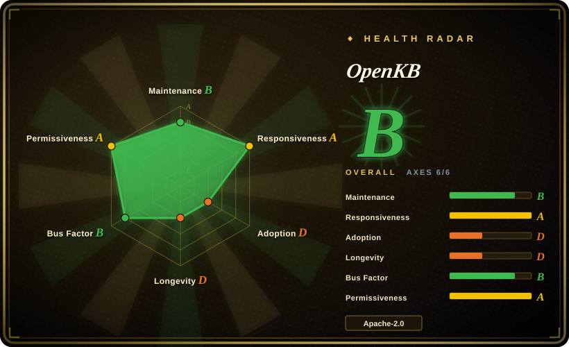
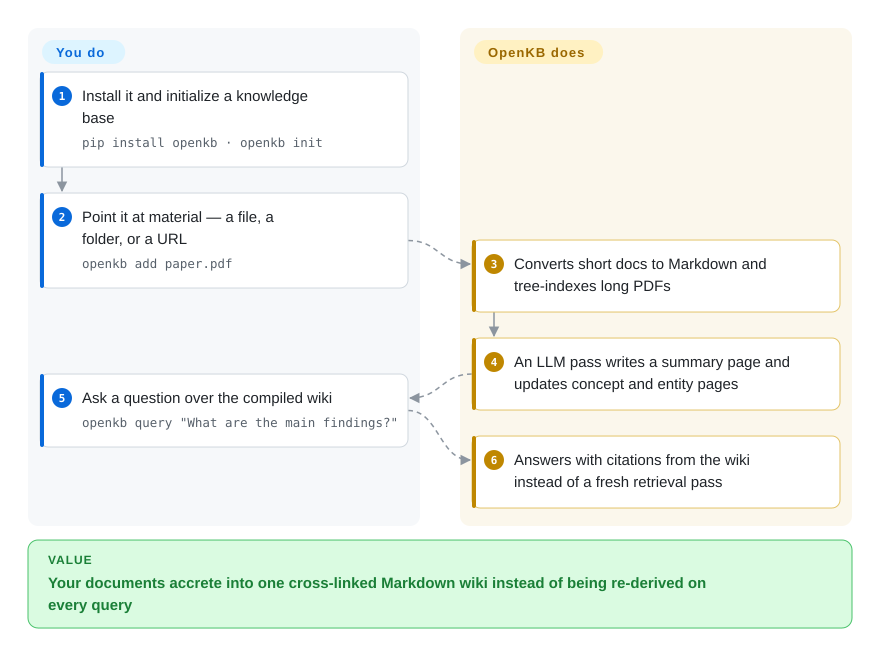

# OpenKB

Read your documents once, and let an LLM compile them into a persistent, cross-linked Markdown wiki you then query — instead of re-deriving answers from vector search on every question.

## When to use

You have a corpus of long, structured documents — papers, standards, internal specs, book-length PDFs — and you keep asking the same questions of it. Chunk-based RAG hands you a fresh, dislocated answer each time: nothing accumulates, cross-document contradictions stay invisible, and quality is whatever a similarity search happened to surface. OpenKB makes the opposite bet. It pays the LLM cost once per document, compiling each source into a wiki of summary, concept and entity pages stitched together with `[[wikilinks]]`, and then answers *from that artifact*.

Reach for it when the thing you want is **accumulation**: a base that gets denser and better cross-referenced as you feed it, that is plain Markdown on disk (so it diffs, greps and opens in Obsidian), and that a second agent can read through a bundled skill file with no MCP server to stand up. The choice against its closest peer is mostly surface. Against [LLM Wiki](../knowledge-base/llm-wiki.md) — the same compile-once idea — pick OpenKB when you want a headless Python CLI plus an optional HTTP/workbench layer you can run on a server, and LLM Wiki when you want a Tauri desktop app to author and browse in. Against [Khoj](../knowledge-base/khoj.md), pick OpenKB when the *compiled wiki* is the deliverable (it can further distil it into an installable agent skill, an HTML deck, or a graph), and Khoj when you want broad chat surfaces — browser, desktop, Obsidian, WhatsApp — over your files.

## How it works

`pip install openkb` plus `openkb init` creates a KB directory: a `raw/` intake area, `.openkb/config.yaml` (model, wiki language, the long-PDF page threshold), and a `wiki/` output tree. **You** point it at material with `openkb add` — one file, a directory, or a URL — and **OpenKB** does the compiling: markitdown converts short documents to Markdown, PageIndex turns long PDFs into a hierarchical tree index rather than stuffing their text into context, and an LLM pass writes a summary page and then creates or updates concept and entity pages, cross-linking them into everything already ingested (the README's own figure is 10–15 wiki pages touched per source). The wiki's conventions live in `wiki/AGENTS.md`, which OpenKB re-reads from disk at run time, so the schema is yours to edit rather than baked into code. Because the output is ordinary Markdown with YAML frontmatter and `[[wikilinks]]`, **you** read it in Obsidian or git and **OpenKB** answers from it via `openkb query` / `openkb chat` — grounded, cited answers from the compiled pages instead of a fresh retrieval pass.

<!-- flow-steps:begin (generated from flows/openkb.json by tools/flow_card.py — do not edit) -->

Text version of the flow

1. **You**: Install it and initialize a knowledge base — `pip install openkb · openkb init`
2. **You**: Point it at material — a file, a folder, or a URL — `openkb add paper.pdf`
3. **OpenKB**: Converts short docs to Markdown and tree-indexes long PDFs
4. **OpenKB**: An LLM pass writes a summary page and updates concept and entity pages
5. **You**: Ask a question over the compiled wiki — `openkb query "What are the main findings?"`
6. **OpenKB**: Answers with citations from the wiki instead of a fresh retrieval pass

**Value**: Your documents accrete into one cross-linked Markdown wiki instead of being re-derived on every query

<!-- flow-steps:end -->

## When NOT to use

- **Your corpus is fuzzy and huge, not long and structured.** OpenKB's retrieval is index-driven navigation over a compiled wiki, and the shipped release has **no full-text search tool at all** — recall is bounded by what the compile pass wrote into `wiki/index.md` and each page's `brief:`. If you need semantic search across a large, heterogeneous pile, use [FAISS](../rag-retrieval/faiss.md) / [Milvus](../rag-retrieval/milvus.md) underneath a RAG app, or [Khoj](../knowledge-base/khoj.md), and skip the compile step entirely.
- **You only need one-shot Q&A over one document.** OpenKB's per-document LLM compile pass buys accumulation you will never collect — the wiki cost is paid for a single read. Use [PageIndex](../rag-retrieval/pageindex.md) directly (it is the same underlying retriever, MIT, and lighter to adopt), or [docling](../document-parsing/docling.md) / [marker](../document-parsing/marker.md) if the hard part is only converting the file.
- **You need OCR on scanned PDFs without a hosted service.** Scanned-document OCR is listed as a PageIndex Cloud capability, i.e. the paid hosted tier; the local path assumes extractable text. If your corpus is scans and you must stay local, use [olmocr](../document-parsing/olmocr.md) or [MinerU](../document-parsing/mineru-skill.md) for the parsing stage.
- **You want a GUI you author notes in.** OpenKB's wiki is generated, not a writing surface — the process is batch compile, not prose authoring. For human-first editing with graph view and plugins, use [SiYuan](../knowledge-base/siyuan.md), [Logseq](../knowledge-base/logseq.md) or [LLM Wiki](../knowledge-base/llm-wiki.md).
- **You need multi-user access control.** It is a single-user local tool writing a directory of files; the bundled web UI is explicitly auth-off by default unless you set `OPENKB_API_TOKEN`. For a shared, permissioned team space use a hosted wiki product (Notion, Confluence — no repository to index).
- **You need a stable contract to build on.** It is a 5.5-month-old v0.x alpha with an exact-pinned dependency set (`pageindex==0.3.0.dev3`, `litellm==1.87.2`) and a public merge cadence that paused in 2026-07 — building a product on its internals means tracking a moving alpha. If you want a stable document-conversion layer, take [markitdown](../document-parsing/markitdown.md) and own the pipeline yourself.

## Comparison

| Alternative | In index | Our verdict | Tradeoff |
| --- | --- | --- | --- |
| [LLM Wiki](../knowledge-base/llm-wiki.md) | ✅ | Both compile sources into a maintained wiki; choose OpenKB when the KB must be headless/programmatic (CLI, REST API, agent skill) and LLM Wiki when a desktop app with in-app editing and graph view is the point. | OpenKB buys server-side automation and generator surfaces (skill, deck, graph) but gives up the polish and note-authoring UX of a packaged desktop app. |
| [Khoj](../knowledge-base/khoj.md) | ✅ | Choose OpenKB for a compiled, inspectable Markdown knowledge base; choose Khoj when the goal is asking questions from many surfaces (web, desktop, Obsidian, chat apps) over files and the web. | OpenKB's knowledge is durable and reviewable in git; Khoj's is reassembled per query but reaches far more places and needs no compile wait. |
| [PageIndex](../rag-retrieval/pageindex.md) | ✅ | If you only need vectorless retrieval over long PDFs, take PageIndex and skip the wiki; OpenKB is the layer above it that adds compilation, cross-linking and persistence. | PageIndex is a smaller MIT library with no LLM bookkeeping; OpenKB adds accumulation at the cost of a heavier, opinionated pipeline. |
| [Reor](../knowledge-base/reor.md) | ✅ | Not a live substitute — archived (2025-05); use it only as a pattern reference for local-first AI notes. | Reor shows the local-embeddings design space but receives no dependency or security fixes, so production selection should not land there. |
| [markitdown](../document-parsing/markitdown.md) + your own prompt loop | ✅ | If you only need conversion plus Q&A, wiring markitdown to your own prompts is the lower-commitment route; choose OpenKB when you want the accumulated wiki, not just parsed text. | DIY keeps you off OpenKB's young API and its LLM bookkeeping, but you then own the prompting, cross-linking, index upkeep and staleness handling that OpenKB does for you. |
| NotebookLM / Google OKF | 未收录 | Reference points only: NotebookLM is a hosted SaaS that already does source-grounded synthesis, and OKF is a specification, not a repository. | Hosted synthesis is zero-ops but not inspectable, diffable or local; OKF compliance only means the page format is portable, not that the knowledge is yours to operate. |

## Tech stack

- **Language/runtime:** Python ≥ 3.10; Click for the CLI (`openkb`), FastAPI + Uvicorn for the optional HTTP/workbench surface (`openkb-web`)
- **Agent layer:** OpenAI Agents SDK, with every model call routed through LiteLLM (`provider/model`, e.g. `anthropic/claude-sonnet-4-6`)
- **Retrieval/indexing:** at compile time PageIndex builds a hierarchical tree whose nodes carry LLM-written summaries (`IndexConfig(if_add_node_summary=True)`), rendered into the summary page with page ranges; at query time retrieval is index-driven — the agent reads `wiki/index.md` plus each page's `brief:` frontmatter, then slices `wiki/sources/<doc>.json` by page range via `get_page_content`. No embeddings, no vector database — and no full-text/BM25 search tool in the current release (tiered BM25 is an unmerged PR)
- **Conversion:** markitdown for documents (docx/pptx/xlsx/html/…), trafilatura for URL main-content extraction, PyMuPDF for images
- **Wiki output:** plain Markdown + YAML frontmatter (the project says it follows Google's Open Knowledge Format), `[[wikilinks]]`, Obsidian-compatible
- **Supporting:** watchdog (`openkb watch`), portalocker + an atomic-write module for crash-safe wiki mutations, Rich for terminal output, python-dotenv for `.env`
- **Frontend:** React/TypeScript bundled web UI ("Knowledge Workbench"), built with Vite and shipped inside the wheel via the `web` extra

## Dependencies

- **An LLM is mandatory** — a provider API key in `.env` (`LLM_API_KEY`), or an OAuth-subscription provider (`chatgpt/*`, `github_copilot/*`) which needs no key. Local runtimes (Ollama/LM Studio) work through LiteLLM, with timeout tuning documented for slow backends
- **`pip install openkb`** (or `pip install "openkb[web]"` for the API + workbench); Python 3.10+
- **Optional:** `PAGEINDEX_API_KEY` for PageIndex Cloud — OCR for scanned PDFs, faster structure generation, large-document scale
- **Exact-pinned Python deps**, by policy: `pageindex==0.3.0.dev3` (a *dev* prerelease), `markitdown==0.1.5`, `litellm==1.87.2`, `openai-agents==0.17.3`, `openai==2.44.0`, `trafilatura`, `click`, `watchdog`, `rich`, `portalocker`, `json-repair`
- **No database or vector store to run** — state is local files, plus PageIndex's own index DB under `.openkb/`

## Ops difficulty

**Low to medium.** Installation is one `pip install`, there is no service, database or vector store to operate, and all state sits in one directory — backup is copying a folder, and versioning works with git. The recurring burden is not infrastructure but **LLM spend and latency**: every `openkb add` is a compile pass that rewrites many wiki pages, so cost scales with documents × pages touched, long PDFs are processed serially (concurrency is configurable), and a failed compile is retried rather than resumed mid-flight. The optional web UI is unauthenticated unless you set a token, so do not expose it as-is. Windows users hit occasional path-length and file-lock edges, and recent open PRs are still fixing them.

## Health & viability

- **Maintenance (2026-09-21).** A short, intense burst: 175 commits and 75 merged PRs between 2026-04 and 2026-07-22, then **zero commits on `main` for the following 61 days** (verified via the commits API). Releases ran v0.4.0 → v0.4.5 (2026-06-16 → 2026-07-20) with a `v0.5.0-rc1` tag already pushed. `[推断]` A v0.5 line looks to be in flight rather than abandoned — but the public merge cadence is a watch item, not a settled "active".
- **Responsiveness vs merge cadence (2026-09-21).** The stalled queue is not silence: the maintainers' median time to first response on issues is 12.9 hours over 21 qualifying issues (health radar axis A), and the newest open issues are being filed and answered in 2026-09. `[推断]` So the read is "vendor is between public releases", not "gone".
- **Governance / bus factor.** **Thin despite being an org.** The repo belongs to VectifyAI (an organization, the vendor behind PageIndex), so it is not a lone hobbyist's repo — but essentially all code came from two people (rejojer 79 and KylinMountain 71 of 175 commits; 14 contributors total). The roadmap is the vendor's, not the community's. `[推断]`
- **Adoption.** Modest and early: 8582 PyPI downloads in the last month and 0 dependent GitHub repositories (health radar axis D), against 4.5k stars — the classic pattern of heavy interest, little downstream dependency yet. The wiki is also files on disk, so "installed but not in a dependency graph" understates real use. `[推断]`
- **Backlog signal.** 37 open PRs (oldest from 2026-04-11) and 44 open issues against a 5.5-month-old repo, several of the newest PRs dated 2026-09 and still unmerged — a queue building faster than it drains. `[推断]`
- **Age & Lindy.** **Negative signal.** Created 2026-04-04: ~5.5 months old with 4.5k stars and 476 forks is exactly the hyped-young profile this index treats as a risk flag rather than proof. There is not yet an age × still-active record to lean on. Popularity here ran ahead of track record.
- **Backing & ecosystem.** Backed by a commercial vendor with a real adjacent OSS family (PageIndex 35.7k stars, MIT, still pushing 2026-09-20; plus ChatIndex, ConDB, pageindex-mcp) and a paid PageIndex Cloud. That cuts both ways: sustained engineering is plausible, and the best long-document path (OCR, hosted scale) is the commercial one — a mild open-core pull. `[推断]`
- **Risk flags.** (1) Dependencies are **exactly pinned by policy** after a LiteLLM package-poisoning incident, so fixes upstream land only when the maintainer bumps — an open issue already asks to move off `litellm==1.87.2`; (2) `pageindex` is pinned to a **dev prerelease**; (3) the bundled web UI is auth-off by default; (4) Apache-2.0 confirmed by reading `LICENSE`, with no relicense history.

## Caveats (unverified)

- **Feature inventory** — Skill Factory (`openkb skill new`), `openkb visualize` graph, the HTML deck generator, `openkb watch`, `openkb lint --fix` and the chat slash commands are taken from the README and `examples/`, not exercised or code-verified. `[未验证]`
- **OKF compliance** — the README says wiki pages follow Google's Open Knowledge Format; the linked Google Cloud blog URL resolves (checked 2026-09-21), but the emitted frontmatter was not compared against the specification. `[未验证]`
- **"10–15 wiki pages per source"** is the README's own figure; the only concrete sample in-repo is a single paper (1 summary + 3 concepts + 9 entities). `[未验证]`
- **Local-model practicality** — LiteLLM makes Ollama/LM Studio reachable and timeout tuning is documented, but whether a fully offline run produces usable wikis (and handles the long-PDF path) is not established. `[未验证]`
- **Figure/table support depth** — the multimodal path is verified at tool level (`get_image` hands the extracted image to the model as a data URL, `openkb/agent/tools.py`), so the agent can look at figures; how reliably it reads dense tables and charts is untested here. `[未验证]`
- **Performance figures** — the README's throughput framing and the commit note that lazy-importing markitdown cut startup ~24% are commit-message sourced, not measured here. `[未验证]`
- **Star/fork growth quality** — 4.5k stars in ~5 months is unusually fast; no independent adoption or production-use evidence was found, so treat popularity as a risk flag. `[未验证]`
