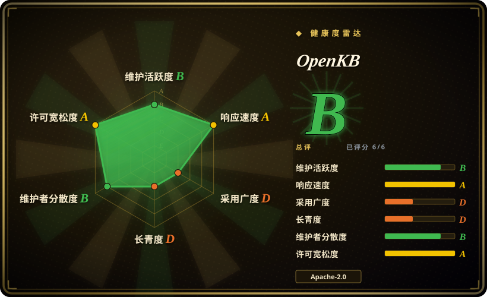
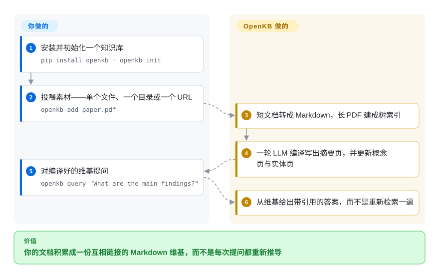

# OpenKB

把你的文档读一遍，让 LLM 把它们编译成一份可持久保存、互相链接的 Markdown 维基，之后你只查这份维基——而不是每问一个问题就用向量检索重新推导一遍。

## 何时使用

你手里有一批**长而有结构**的文档——论文、标准、内部规格、书级别的 PDF——而且你会反复对它们问同类问题。基于切块的 RAG 每次只给你一个新鲜但彼此割裂的答案：知识不积累，跨文档的矛盾看不见，答案质量取决于相似度检索恰好命中了哪几块。OpenKB 押的是相反的一注：它按文档**一次性**付掉 LLM 编译成本，把每份来源编译成由摘要页、概念页、实体页构成、用 `[[wikilinks]]` 串起来的维基，之后从**这份产物**里回答。

当你真正想要的是**积累**时选它：知识库随着你不断投喂而更密、互链更多；产物是磁盘上的普通 Markdown，可以 diff、可以 grep、可以直接用 Obsidian 打开；另一个智能体也能通过随仓库附带的 skill 文件直接读它，不需要你搭 MCP 服务。它与最近邻之间的差别主要在形态：同样是「编译一次」的思路，对上 [LLM Wiki](../knowledge-base/llm-wiki.zh.md) 时，选 OpenKB 是因为你要一个可无头运行的 Python CLI 加一层可选 HTTP／工作台，选 LLM Wiki 是因为你要一个 Tauri 桌面应用来写作和浏览。对上 [Khoj](../knowledge-base/khoj.zh.md) 时，选 OpenKB 是因为**编译出的维基本身**就是交付物（它还能进一步蒸馏成可安装的 agent skill、HTML 幻灯片或知识图谱），选 Khoj 是因为你要的是覆盖浏览器／桌面／Obsidian／WhatsApp 的多端问答。

## 怎么用起来

`pip install openkb` 加 `openkb init` 会建出一个知识库目录：一个 `raw/` 投喂区、一份 `.openkb/config.yaml`（模型、维基输出语言、长 PDF 的页数阈值），以及一个 `wiki/` 输出树。**你**用 `openkb add` 指向素材——单个文件、一个目录或一个 URL——**OpenKB** 负责编译：markitdown 把短文档转成 Markdown，PageIndex 把长 PDF 建成层级树索引而不是把全文硬塞进上下文，随后一轮 LLM 编译写出摘要页，再新建或更新概念页与实体页，把它们和已经收录的内容彼此互链（README 自己的说法是每份来源会牵动 10–15 个维基页）。维基的约定写在 `wiki/AGENTS.md` 里，OpenKB 每次运行都从磁盘重新读取，所以 schema 归你改，而不是焊死在代码里。因为产物就是带 YAML frontmatter 和 `[[wikilinks]]` 的普通 Markdown，**你**可以在 Obsidian 或 git 里读它，**OpenKB** 则通过 `openkb query` / `openkb chat` 从里面回答——基于已编译页面、带引用的答案，而不是一次新的检索。

<!-- flow-steps:begin (generated from flows/openkb.json by tools/flow_card.py — do not edit) -->

流程文字版

1. **你**：安装并初始化一个知识库 — `pip install openkb · openkb init`
2. **你**：投喂素材——单个文件、一个目录或一个 URL — `openkb add paper.pdf`
3. **OpenKB**：短文档转成 Markdown，长 PDF 建成树索引
4. **OpenKB**：一轮 LLM 编译写出摘要页，并更新概念页与实体页
5. **你**：对编译好的维基提问 — `openkb query "What are the main findings?"`
6. **OpenKB**：从维基给出带引用的答案，而不是重新检索一遍

**价值**：你的文档积累成一份互相链接的 Markdown 维基，而不是每次提问都重新推导

<!-- flow-steps:end -->

## 何时不用

- **你的语料又大又杂，而不是又长又有结构。** OpenKB 的检索是「对编译后维基做目录驱动导航」，且当前发布版**没有任何全文搜索工具**——召回上界取决于编译阶段往 `wiki/index.md` 和各页 `brief:` 里写了什么。如果你要的是在一个庞大异构堆里做语义搜索，应该在 RAG 应用下面用 [FAISS](../rag-retrieval/faiss.zh.md) / [Milvus](../rag-retrieval/milvus.zh.md)，或者用 [Khoj](../knowledge-base/khoj.zh.md)，完全跳过编译这一步。
- **你只需要对单份文档做一次问答。** OpenKB 按文档付出的 LLM 编译成本，买的是你根本收不到的「积累」——只读一次却付了建维基的钱。直接用 [PageIndex](../rag-retrieval/pageindex.zh.md)（同一个底层检索器，MIT，引入更轻）；如果难点只在文件转换，用 [docling](../document-parsing/docling.zh.md) 或 [marker](../document-parsing/marker.zh.md)。
- **你需要在不上托管服务的前提下对扫描版 PDF 做 OCR。** 扫描件 OCR 被列为 PageIndex Cloud 的能力，也就是付费托管层；本地路径假定文本可直接提取。如果你的语料是扫描件且必须留在本地，解析阶段改用 [olmocr](../document-parsing/olmocr.zh.md) 或 [MinerU](../document-parsing/mineru-skill.zh.md)。
- **你想要一个由你自己撰写笔记的图形界面。** OpenKB 的维基是生成出来的，不是写作面——流程是批量编译，不是写文章。要人主导编辑、带图谱视图和插件生态，用 [SiYuan](../knowledge-base/siyuan.zh.md)、[Logseq](../knowledge-base/logseq.zh.md) 或 [LLM Wiki](../knowledge-base/llm-wiki.zh.md)。
- **你需要多用户与权限控制。** 它是一个单用户本地工具，写的是一个文件目录；自带的 Web UI 默认明确关闭鉴权，除非你设 `OPENKB_API_TOKEN`。要共享且有权限的团队空间，用托管维基产品（Notion、Confluence——没有可收录的仓库）。
- **你需要一份稳定的契约来做二次开发。** 它是一个 5.5 个月大的 v0.x alpha，依赖是精确钉死的（`pageindex==0.3.0.dev3`、`litellm==1.87.2`），而公开合并节奏在 2026-07 停了。在它的内部结构上做产品，等于跟着一个会动的 alpha 跑。如果你要的是稳定的文档转换层，用 [markitdown](../document-parsing/markitdown.zh.md)，自己做管道。

## 横向对比

| 替代品 | 是否收录 | 我们的评价 | 取舍 |
| --- | --- | --- | --- |
| [LLM Wiki](../knowledge-base/llm-wiki.zh.md) | ✅ | 两者都把来源编译成持续维护的维基；当知识库需要无头／可编程（CLI、REST API、agent skill）时选 OpenKB，当核心诉求是桌面应用内的编辑与图谱浏览时选 LLM Wiki。 | OpenKB 换来服务端自动化和更多产出面（skill、幻灯片、图谱），代价是放弃打包桌面应用的打磨度和笔记写作体验。 |
| [Khoj](../knowledge-base/khoj.zh.md) | ✅ | 要一份可编译、可审阅的 Markdown 知识库选 OpenKB；要的是从多端（网页、桌面、Obsidian、聊天应用）对文件和网络提问，选 Khoj。 | OpenKB 的知识是持久的、能在 git 里审阅的；Khoj 的知识按查询临时重组，但触面广得多且不用等编译。 |
| [PageIndex](../rag-retrieval/pageindex.zh.md) | ✅ | 只需要对长 PDF 做无向量检索，就用 PageIndex 并跳过维基；OpenKB 是它上面加了编译、互链与持久化的一层。 | PageIndex 是更小的 MIT 库、不背 LLM 记账负担；OpenKB 换来积累，代价是更重、更主观的管道。 |
| [Reor](../knowledge-base/reor.zh.md) | ✅ | 不是可用的现役替代品——已归档（2025-05）；只把它当作「本地优先 AI 笔记」的模式参考。 | Reor 展示了本地 embedding 的设计空间，但不再收到依赖与安全修复，生产选型不应落在它身上。 |
| [markitdown](../document-parsing/markitdown.zh.md) + 你自己的提示词循环 | ✅ | 只需要转换加问答时，把 markitdown 接到自己的提示词上投入更低；当你想要的是积累起来的维基、而不只是解析出的文本，才选 OpenKB。 | 自己拼管道让你不必绑在 OpenKB 年轻的 API 和它的 LLM 记账上，但提示词、互链、索引维护与时效处理都要你自己扛。 |
| NotebookLM / Google OKF | 未收录 | 只作参照系：NotebookLM 是已经能做「来源落地综述」的托管 SaaS，OKF 是一份规范而不是仓库。 | 托管综述零运维，但不可审阅、不可 diff、不在本地；OKF 合规只说明页面格式可移植，并不等于这份知识归你运营。 |

## 技术栈

- **语言／运行时：** Python ≥ 3.10；CLI 用 Click（`openkb`），可选的 HTTP／工作台层用 FastAPI + Uvicorn（`openkb-web`）
- **智能体层：** OpenAI Agents SDK，所有模型调用经 LiteLLM 路由（`provider/model`，例如 `anthropic/claude-sonnet-4-6`）
- **检索／索引：** 编译期由 PageIndex 建层级树、每个节点带 LLM 写的摘要（`IndexConfig(if_add_node_summary=True)`），并把树连同页码区间渲染进摘要页；查询期走「目录驱动」——agent 读 `wiki/index.md` 与各页 `brief:` frontmatter，再用 `get_page_content` 从 `wiki/sources/<doc>.json` 按页区间切片。不需要 embedding，也不需要向量数据库；当前版本也没有全文／BM25 搜索工具（分层 BM25 仍是未合并的 PR）
- **转换：** markitdown 处理文档（docx／pptx／xlsx／html 等），trafilatura 抽取 URL 正文，PyMuPDF 处理图片
- **维基产物：** 普通 Markdown + YAML frontmatter（项目自称遵循 Google 的 Open Knowledge Format），`[[wikilinks]]`，兼容 Obsidian
- **支撑件：** watchdog（`openkb watch`）、portalocker 与原子写模块（崩溃安全的维基变更）、Rich 终端输出、python-dotenv 读取 `.env`
- **前端：** React／TypeScript 打包的 Web UI（“Knowledge Workbench”），用 Vite 构建，通过 `web` extra 随 wheel 一起发布

## 依赖

- **必须有一个 LLM**——在 `.env` 里配供应商 API key（`LLM_API_KEY`），或使用走 OAuth 的订阅型供应商（`chatgpt/*`、`github_copilot/*`，无需 key）。本地运行时（Ollama／LM Studio）可经 LiteLLM 接入，慢后端的超时调优有文档
- **`pip install openkb`**（需要 API 与工作台时用 `pip install "openkb[web]"`）；Python 3.10+
- **可选：** `PAGEINDEX_API_KEY` 启用 PageIndex Cloud——扫描件 OCR、更快地生成结构、大文档规模
- **按策略精确钉死的 Python 依赖：** `pageindex==0.3.0.dev3`（一个 *dev* 预发布版）、`markitdown==0.1.5`、`litellm==1.87.2`、`openai-agents==0.17.3`、`openai==2.44.0`、`trafilatura`、`click`、`watchdog`、`rich`、`portalocker`、`json-repair`
- **不需要运行数据库或向量库**——状态都在本地文件，外加 PageIndex 自己的索引库（在 `.openkb/` 下）

## 运维难度

**低到中。** 安装就是一条 `pip install`，没有服务、数据库或向量库要运维，所有状态都在一个目录里——备份就是拷贝文件夹，版本管理用 git 就行。持续负担不在基础设施，而在 **LLM 花销与延迟**：每一次 `openkb add` 都是一轮会改写很多维基页的编译，成本随「文档数 × 牵动页数」增长；长 PDF 串行处理（并发可配置）；编译失败是重试而不是断点续跑。可选的 Web UI 在不设 token 时没有鉴权，不要原样暴露。Windows 用户会偶发遇到路径长度与文件锁的边角问题，近期仍有未合并的 PR 在修。

## 健康度与可持续性

- **维护状态（2026-09-21）。** 一段短而密集的爆发：2026-04 到 2026-07-22 之间有 175 次提交、75 个已合并 PR，随后 **`main` 上连续 61 天零提交**（经 commits API 核实）。发布线从 v0.4.0 走到 v0.4.5（2026-06-16 → 2026-07-20），并且已经打了 `v0.5.0-rc1` 标签。`[推断]` 看起来 v0.5 分支在推进而不是项目被放弃——但公开合并节奏属于观察项，还不能算稳定的「活跃」。
- **响应速度与合并节奏（2026-09-21）。** 积压的队列不等于沉默：21 个合格 issue 上维护者的首次响应中位数是 12.9 小时（健康度雷达该项为 A），且最新的 issue 在 2026-09 仍在被提交并得到回复。`[推断]` 所以更合理的解读是「厂商处于两次公开发布之间」，而不是「人已经不在」。
- **治理／巴士系数。** **虽是组织，仍偏薄。** 仓库属于 VectifyAI（一个组织，也是 PageIndex 背后的厂商），所以不是个人业余项目——但代码基本出自两个人（175 次提交里 rejojer 79 次、KylinMountain 71 次；贡献者共 14 人）。路线图是厂商的，不是社区的。`[推断]`
- **采用度。** 尚属早期且规模有限：上个月 PyPI 下载 8582 次，GitHub 上依赖它的仓库为 0 个（健康度雷达该项为 D），对照 4.5k star——正是「关注很多、下游依赖尚无」的典型形态。另外它的产物只是磁盘上的文件，因此「已被安装但不在依赖图里」会低估真实使用。`[推断]`
- **积压信号。** 一个 5.5 个月大的仓库已经有 37 个未合并 PR（最早 2026-04-11）和 44 个未关闭 issue，其中不少新 PR 日期在 2026-09 且仍未合并——队列的堆积快于消化。`[推断]`
- **年龄与 Lindy。** **负面信号。** 创建于 2026-04-04：约 5.5 个月、4.5k star、476 fork，正是本索引视为风险信号而非佐证的「年轻且被热捧」画像。它还来不及积累「年龄 × 持续活跃」的记录。这里的热度跑在了履历前面。
- **背书与生态。** 背后是有真实邻近开源家族的商业厂商（PageIndex 35.7k star、MIT、2026-09-20 仍在推送；另有 ChatIndex、ConDB、pageindex-mcp），同时卖付费的 PageIndex Cloud。这是双刃的：持续投入是可信的，但最好的长文档路径（OCR、托管规模）正是商业那条——存在温和的 open-core 拉力。`[推断]`
- **风险标记。**（1）依赖是**按策略精确钉死**的，起因是一次 LiteLLM 投毒事件，所以上游修复要等维护者手动抬版本——已有未关闭的 issue 要求离开 `litellm==1.87.2`；（2）`pageindex` 钉在一个 **dev 预发布版**；（3）自带 Web UI 默认关闭鉴权；（4）Apache-2.0 已通过阅读 `LICENSE` 确认，无改协议历史。

## 存疑（未验证）

- **功能清单**——Skill Factory（`openkb skill new`）、`openkb visualize` 图谱、HTML 幻灯片生成、`openkb watch`、`openkb lint --fix` 以及聊天斜杠命令，均取自 README 与 `examples/`，未实际运行或对照源码核实。`[未验证]`
- **OKF 合规性**——README 称维基页遵循 Google 的 Open Knowledge Format；所引 Google Cloud 博客链接可访问（2026-09-21 核实），但输出的 frontmatter 未与规范逐条比对。`[未验证]`
- **「每份来源牵动 10–15 个维基页」** 是 README 自己的数字；仓库内唯一具体样例是一篇论文（1 个摘要 + 3 个概念 + 9 个实体）。`[未验证]`
- **本地模型的可用性**——LiteLLM 使 Ollama／LM Studio 可达、超时调优也有文档，但完全离线运行能否产出可用维基（以及长 PDF 路径是否走得通）并未被证实。`[未验证]`
- **图表支持的深度**——多模态路径已在工具层核实（`get_image` 把抽出的图片以 data URL 交给模型，见 `openkb/agent/tools.py`），所以 agent 确实「看得见」图；但它读密集表格与图表的可靠性本文未实测。`[未验证]`
- **性能数字**——README 的吞吐表述，以及提交信息里「惰性导入 markitdown 让启动快约 24%」的说法，来源是提交信息而非本文实测。`[未验证]`
- **star／fork 增长质量**——约 5 个月涨到 4.5k star 异常快；未找到独立的采用或生产使用证据，因此把热度当作风险信号看待。`[未验证]`
