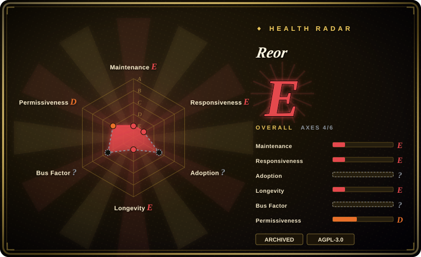

# Reor

A private, local-first AI note-taking desktop app that chunks and embeds every note, auto-links related notes by vector similarity, and runs RAG Q&A over your corpus with local models — **archived since 2025-05**, so treat it as a pattern source, not a dependency.

## When to use

You're a developer designing a local-first AI notes app — offline by default, Ollama for LLMs, Transformers.js for embeddings, LanceDB for vectors, an Obsidian-style markdown editor — and you want a compact, readable reference implementation of the whole loop (chunk → embed → auto-link → RAG Q&A) rather than stitching it together from library docs. Reor's README frames it exactly that way: "a RAG app with two generators: the LLM and the human."

Alternatively you're a user who wants a fully offline personal knowledge app and already runs Reor, understands it is unmaintained, and is prepared to fork and vendor it yourself. Choose it over [LLM Wiki](llm-wiki.md) only when you specifically want a *thin, local, note-first* architecture to study or fork; for a maintained app with the same local-first promise, use [SiYuan](siyuan.md) or [Logseq](logseq.md) instead.

## When NOT to use

- **Do not adopt it for production or long-lived personal use.** The repository is **archived** (GitHub API) with no commits since 2025-05-13 — there will be **no security, dependency, or compatibility fixes**. For a maintained local-first app use [Logseq](logseq.md), [SiYuan](siyuan.md), or [LLM Wiki](llm-wiki.md).
- **Not for anything sensitive or internet-exposed.** An unmaintained Electron app with a large dependency tree is a standing risk; its bundled libraries (Electron, vector DB, model runtimes) will drift from security updates. `[推断]`
- **Not if you need mobile, web or multi-device sync.** It is a single-directory desktop app; use [Khoj](khoj.md) or [SiYuan](siyuan.md) for multi-client access.
- **Not if you need the LLM to maintain the knowledge for you.** Reor does note-local RAG and auto-linking; it does not compile sources into a maintained, cross-referenced wiki the way [LLM Wiki](llm-wiki.md) does.
- **Not for structured block-level notes or databases.** It is a markdown notes app; for block references and WYSIWYG use [SiYuan](siyuan.md), and for outliner + Datalog queries use [Logseq](logseq.md).
- **Not as a drop-in import target.** Importing requires populating its directory with markdown manually, and the README warns frontmatter may not parse — so an existing Obsidian/Logseq vault may not survive the move intact. `[未验证]`
- **Check AGPL-3.0 compatibility** if you plan to redistribute a forked build. `[推断]`

## Comparison

| Alternative | In index | Our verdict | Tradeoff |
|---|---|---|---|
| [LLM Wiki](llm-wiki.md) | ✅ | Choose Reor only to study a thin local-first AI-note architecture; choose LLM Wiki for a maintained app whose LLM compiles sources into a persistent wiki. | Reor is a compact reference (local embeddings, Ollama, LanceDB) with no cloud dependency but archived; LLM Wiki is maintained and compiles knowledge but is young, desktop-only and single-maintainer. |
| [Logseq](logseq.md) | ✅ | Choose Logseq for a maintained, community-scale local-first knowledge app; choose Reor only as a pattern reference. | Logseq has a big plugin ecosystem and years of releases but no built-in AI; Reor had AI built in but stopped in 2025-05. |
| [SiYuan](siyuan.md) | ✅ | Choose SiYuan for a maintained self-hostable workspace with mobile and Docker; choose Reor only as a reference. | SiYuan is open-core with paid tiers and a vendor roadmap, but it is maintained and reachable from many devices; Reor is fully local and simpler but abandoned. |
| [Khoj](khoj.md) | ✅ | Choose Khoj for a maintained, multi-client AI second brain; choose Reor only if you need an offline desktop reference with no server. | Khoj is heavier (Python/Postgres) and re-retrieves per query but is still developed; Reor is lighter and fully local but unmaintained. |
| Obsidian | 未收录 | Choose Obsidian for a maintained local vault with the largest plugin ecosystem; choose Reor only as an architecture reference, never as a long-term app. | Obsidian is closed-source freeware with massive ecosystem support and ongoing updates; Reor is open (AGPL) and AI-native but archived. |

## Tech stack

- **Shell:** Electron + React + TypeScript (Vite build)
- **Editor:** Tiptap/ProseMirror-based markdown editing (Obsidian-like)
- **Vectors:** LanceDB (`vectordb`) — embeddings stored in an internal vector database
- **Local models:** Ollama for LLMs; `@xenova/transformers` (Transformers.js) for embeddings
- **LLM providers:** `ai` SDK with OpenAI/Anthropic providers plus OpenAI-compatible endpoints (Oobabooga, Ollama)
- **Other:** LangChain utilities, Yjs, Tauri is *not* used (Electron), Sentry, PostHog telemetry

## Dependencies

- **Ollama** (or an OpenAI-compatible endpoint) for LLM Q&A; local model files consume disk/RAM
- **A local model for embeddings** via Transformers.js/Hugging Face, downloaded on first use
- **One directory of markdown files** chosen on first run — that directory is the corpus
- **Desktop OS** (macOS/Linux/Windows); no server required
- **No maintained dependency-update path anymore** — the repository is archived, so transitive dependencies age without fixes.

## Ops difficulty

**Low while it works, high in risk over time.** Running it is simple — a desktop app over a folder with local models. But because the project is archived there is no upgrade or security path: your Electron shell, vector store, and model runtimes will all drift, and you must own any patching by forking. That makes the effective operational burden "fork maintainer," not "user."

## Health & viability

- **Maintenance.** **Dead.** GitHub reports `archived: true`; last push 2025-05-13; last release v-0.2.32 (2025-04). No further fixes. `[推断]`
- **Governance / bus factor.** A small team with one dominant author (~1.4k commits; next contributors ~175) inside an organization; the archive ends the roadmap entirely. `[推断]`
- **Age & Lindy.** Created 2023-11, active only ~1.5 years, then abandoned ⇒ **fails the Lindy test**: age without ongoing activity is not a safe bet (the index's age × still-active rule). `[推断]`
- **Adoption & ecosystem.** ~8.6k stars and ~528 forks — enough that the fork community could continue it, but no maintained successor is identified here. `[未验证]`
- **Risk flags.** **Archived/unmaintained** is the dominant flag; AGPL-3.0; an Electron app with telemetry (Sentry/PostHog) and a broad dependency tree that no longer receives updates. `[推断]`

## Caveats (unverified)

- **Archive vs active fork** — whether a community fork has taken over maintenance was not established; only the canonical repo's archived state was verified. `[未验证]`
- **Frontmatter/import fidelity** — the README warns frontmatter "may not parse correctly"; the actual failure modes were not tested. `[未验证]`
- **Telemetry behavior** — Sentry/PostHog appear in `package.json`; what is sent and whether it can be disabled was not verified. `[未验证]`
- **Feature scope** — auto-linking, semantic search, RAG Q&A and local-first guarantees are README claims, not reviewed in source. `[未验证]`
- **Star/fork counts** are a dated API snapshot and do not indicate current use. `[未验证]`
