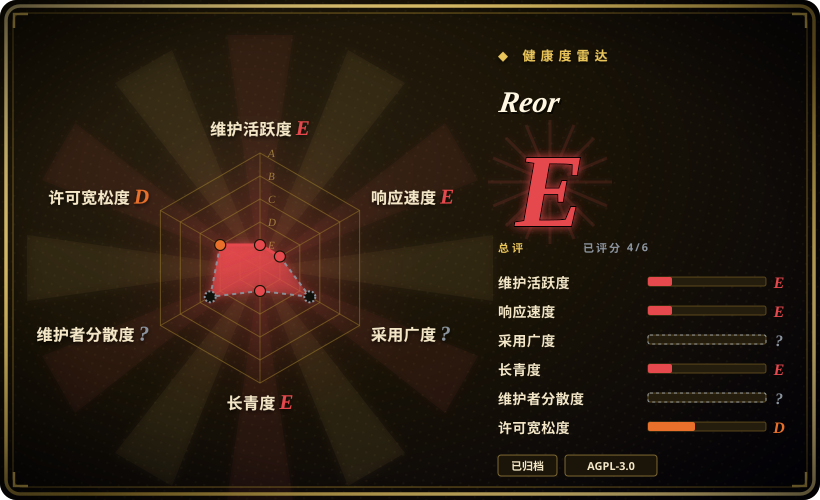

# Reor

一款隐私、本地优先的 AI 笔记桌面应用：把每条笔记切块并嵌入，按向量相似度自动关联相关笔记，并用本地模型在你的语料上做 RAG 问答——**自 2025-05 起已归档**，只能当作模式参考，不可作为依赖。

## 何时使用

你是一名开发者，正在设计一款本地优先的 AI 笔记应用——默认离线、LLM 用 Ollama、embedding 用 Transformers.js、向量存储用 LanceDB、编辑器是 Obsidian 风格的 markdown——你想看到把整条链路（切块 → 嵌入 → 自动关联 → RAG 问答）串起来的紧凑、可读的参考实现，而不是从库文档里自行拼装。Reor 的 README 正是这样自我定位的：「一个 RAG 应用，有两个生成器：LLM 和人。」

另一种情形：你是一名用户，想要完全离线的个人知识应用，且**已经在用** Reor，清楚它无人维护，并准备自己 fork、自己 vendor。只有当你明确想要一套**轻薄、本地、以笔记为先**的架构去研究或分叉时，才选它而不是 [LLM Wiki](llm-wiki.zh.md)；要一个同样本地优先但仍在维护的应用，请用 [SiYuan](siyuan.zh.md) 或 [Logseq](logseq.zh.md)。

## 何时不用

- **不要把生产或长期个人使用押在它上面。** 仓库已被**归档**（GitHub API），自 2025-05-13 起无提交——**不会有安全、依赖或兼容性修复**。要维护中的本地优先应用，请用 [Logseq](logseq.zh.md)、[SiYuan](siyuan.zh.md) 或 [LLM Wiki](llm-wiki.zh.md)。
- **不要用于涉密或暴露于公网的环境。** 一个无人维护、依赖树庞大的 Electron 应用是长期风险；其捆绑库（Electron、向量库、模型运行时）会与安全更新脱节。[推断]
- **需要移动端、网页或多设备同步时不要用。** 它是单目录桌面应用；多客户端访问请用 [Khoj](khoj.zh.md) 或 [SiYuan](siyuan.zh.md)。
- **需要 LLM 替你维护知识时不要用。** Reor 做的是笔记内的 RAG 与自动关联，不会像 [LLM Wiki](llm-wiki.zh.md) 那样把资料编译成一份持续维护、互相引用的维基。
- **不要用于结构化块级笔记或数据库。** 它是 markdown 笔记应用；要块引用与所见即所得用 [SiYuan](siyuan.zh.md)，要大纲 + Datalog 查询用 [Logseq](logseq.zh.md)。
- **不要当作可直接导入的目标。** 导入需要手动把 markdown 填进它的目录，且 README 警告 frontmatter 可能无法正确解析——因此既有的 Obsidian／Logseq vault 未必能完整迁移过来。[未验证]
- **计划再分发 fork 出来的构建前，先确认 AGPL-3.0 兼容性。** [推断]

## 横向对比

| 替代品 | 是否收录 | 我们的评价 | 取舍 |
|---|---|---|---|
| [LLM Wiki](llm-wiki.zh.md) | ✅ | 只想研究一套轻薄的本地优先 AI 笔记架构时才选 Reor；想要一个由 LLM 把资料编译成持久维基、仍在维护的应用，选 LLM Wiki。 | Reor 是紧凑的参考实现（本地 embedding、Ollama、LanceDB）且不依赖云端，但已归档；LLM Wiki 在维护中并能编译知识，但年轻、仅桌面端、单人维护。 |
| [Logseq](logseq.zh.md) | ✅ | 想要维护中、有社区规模的本地优先知识应用，选 Logseq；Reor 只能当模式参考。 | Logseq 插件生态大、发布多年，但没有内置 AI；Reor 曾内置 AI，但 2025-05 停更。 |
| [SiYuan](siyuan.zh.md) | ✅ | 想要维护中、可自托管、带移动端与 Docker 的工作空间，选 SiYuan；Reor 只能当参考。 | SiYuan 是 open-core、有付费层级与厂商路线图，但在维护中且多设备可达；Reor 完全本地、更简单，但已被放弃。 |
| [Khoj](khoj.zh.md) | ✅ | 想要维护中、多客户端的 AI 第二大脑，选 Khoj；只有在你需要一套无服务端、离线的桌面参考实现时才选 Reor。 | Khoj 更重（Python/Postgres）、每次查询重新检索，但仍在开发；Reor 更轻、完全本地，但无人维护。 |
| Obsidian | 未收录 | 想要维护中的本地 vault 与最大的插件生态，选 Obsidian；Reor 只当架构参考，绝不作为长期应用。 | Obsidian 是闭源免费软件，生态支持庞大且持续更新；Reor 开源（AGPL）且 AI 原生，但已归档。 |

## 技术栈

- **外壳：** Electron + React + TypeScript（Vite 构建）
- **编辑器：** 基于 Tiptap／ProseMirror 的 markdown 编辑（Obsidian 风格）
- **向量：** LanceDB（`vectordb`）——embedding 存在内部向量数据库中
- **本地模型：** LLM 用 Ollama；embedding 用 `@xenova/transformers`（Transformers.js）
- **LLM provider：** `ai` SDK 带 OpenAI／Anthropic provider，另支持 OpenAI 兼容端点（Oobabooga、Ollama）
- **其他：** LangChain 工具、Yjs、**不使用 Tauri**（用 Electron）、Sentry、PostHog 遥测

## 依赖

- **Ollama**（或 OpenAI 兼容端点）做 LLM 问答；本地模型文件占用磁盘／内存
- **一个本地 embedding 模型**（经 Transformers.js／Hugging Face），首次使用时下载
- **一个 markdown 目录**，首次运行时选择——该目录就是语料库
- **桌面操作系统**（macOS／Linux／Windows）；无需服务端
- **已无维护中的依赖更新路径**——仓库已归档，传递依赖会带着未修复的问题变旧。

## 运维难度

**能跑时低，随时间推移风险高。** 运行很简单——一个桌面应用 + 一个文件夹 + 本地模型。但因为项目已归档，没有升级或安全路径：你的 Electron 外壳、向量库与模型运行时都会逐渐脱节，任何修补都得靠 fork 自担。于是实际运维负担是「fork 维护者」，而不是「用户」。

## 健康度与可持续性

- **维护。** **已死。** GitHub 报告 `archived: true`；最后 push 2025-05-13；最后发布 v-0.2.32（2025-04）。不会再有修复。[推断]
- **治理 / bus factor。** 一个小团队、单一主导作者（约 1400 次提交，其次约 175）挂在组织下；归档让路线图彻底终止。[推断]
- **年龄与 Lindy。** 2023-11 创建，仅活跃约 1.5 年便停更 ⇒ **Lindy 检验不通过**：只有年龄、没有持续活跃并不安全（本索引的「年龄 × 持续活跃」规则）。[推断]
- **采用度与生态。** 约 8.6k star、约 528 fork——足以让 fork 社区接手，但本页未识别出维护中的后继。[未验证]
- **风险标记。** **归档／无人维护**是首要标记；AGPL-3.0；一个带遥测（Sentry／PostHog）、依赖树庞大且不再收到更新的 Electron 应用。[推断]

## 存疑（未验证）

- **归档 vs 活跃 fork**——是否已有社区 fork 接手维护未确认；只核实了主仓库的归档状态。[未验证]
- **frontmatter／导入保真度**——README 警告 frontmatter「可能无法正确解析」；具体失败形态未测试。[未验证]
- **遥测行为**——`package.json` 中出现 Sentry／PostHog；发送什么、能否关闭未核实。[未验证]
- **功能范围**——自动关联、语义检索、RAG 问答与本地优先保证均为 README 声明，未在源码中审查。[未验证]
- **star／fork 数**是有日期的 API 快照，不代表当前使用情况。[未验证]
