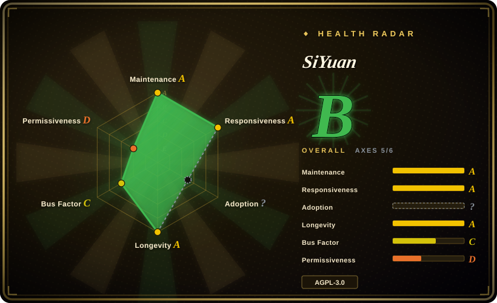

# SiYuan

A privacy-first, self-hostable knowledge workspace with block-level references and Markdown WYSIWYG: a Go kernel serves a local/remote workspace that desktop, mobile and Docker clients use, with AI as an in-app assistant.

## When to use

You're a knowledge worker who wants block-level references (every paragraph/heading is an addressable `((block-id))` you can transclude), Markdown you can export cleanly, and — crucially — the option to run the same workspace on a home server and reach it from a laptop and a phone. You've used Obsidian/Logseq and liked the local-first model, but you want a WYSIWYG block editor, a Docker deployment for remote access, and an AI assistant available *inside* the editor rather than as a separate chat app.

So you install the desktop app (or `docker run b3log/siyuan`) on a machine you control and open the same workspace from desktop, Android/iOS/HarmonyOS and a browser. Blocks can be referenced and transcluded, SQL queries can be embedded in documents, and an OpenAI-compatible endpoint powers writing assistance and Q/A over your own notes. Pick it over [Logseq](logseq.md) when block references, WYSIWYG and server/mobile deployment decide it; pick it over [LLM Wiki](llm-wiki.md) when the workspace must stay human-owned and the AI is an assistant rather than the author of the knowledge layer.

## When NOT to use

- **Don't pick it expecting everything free.** SiYuan is **open-core**: the README states most features are free even for commercial use, but **some features require a paid membership**. If a fully free build is a hard requirement, use [Logseq](logseq.md) instead.
- **Don't use it if a vendor-controlled roadmap is a problem.** Development is concentrated in one organization and one vendor (b3log), around two dominant contributors. If you want foundation/community governance, that's not this.
- **Don't use it when an agent should compile and maintain the knowledge.** SiYuan's AI writes and answers inside a human-authored workspace; it does not ingest sources into a persistent, self-maintained wiki the way [LLM Wiki](llm-wiki.md) does.
- **Don't use it for a broad AI second brain across the web and messaging.** If you need answers from web search plus docs delivered in the browser, a phone app, Obsidian and WhatsApp, use [Khoj](khoj.md).
- **Don't use it if you need a large third-party plugin ecosystem.** Its marketplace is smaller than Obsidian's or Logseq's; check that the specific integration you need exists before committing.
- **Don't expose a Docker instance to the open internet naively.** A self-hosted, remotely reachable workspace with an API is an attack surface you must secure yourself; if you only need local notes, keep it desktop-only.
- **Check AGPL-3.0 compatibility** before redistributing a modified build or embedding its API in a closed product. `[推断]`
- **Chinese-first project.** Documentation and community are strongest in Chinese; English docs exist but are thinner, which can slow troubleshooting. `[推断]`

## Comparison

| Alternative | In index | Our verdict | Tradeoff |
|---|---|---|---|
| [LLM Wiki](llm-wiki.md) | ✅ | Choose SiYuan when the workspace must be human-owned, mature and reachable from mobile or a server; choose LLM Wiki when an agent should own the wiki layer and you want a compiled, Obsidian-compatible artifact. | SiYuan is more mature, self-hostable and operable but open-core with paid tiers and no autonomous ingest; LLM Wiki is fully open and agent-first but desktop-only, young and single-maintainer. |
| [Logseq](logseq.md) | ✅ | Choose SiYuan for block-level references, WYSIWYG, Docker/mobile deployment and in-app AI; choose Logseq for a plain-file outliner with a bigger plugin ecosystem and no paid tiers. | Both are local-first and AGPL, but Logseq is fully free and has the larger community, while SiYuan is open-core and wins on block references, server deployment and mobile clients. |
| [Khoj](khoj.md) | ✅ | Choose SiYuan when you want a structured workspace you author; choose Khoj when you want retrieval-first AI answers across many clients. | Khoj spans browser/phone/Obsidian/WhatsApp and searches the web, but is a Python/Postgres service that re-retrieves per query; SiYuan is an editor with embedded block structure and optional AI inside it. |
| [Reor](reor.md) | ✅ | Choose SiYuan for a maintained workspace with server and mobile reach; treat Reor as a reference only because it is archived. | Reor was the tighter local-AI note app (Ollama + LanceDB, no cloud) but stopped in 2025-05; SiYuan is larger and ongoing but open-core. |
| Obsidian | 未收录 | Choose Obsidian for the biggest plugin ecosystem and polished proprietary editing; choose SiYuan when you want open-source (AGPL), block references and a self-hosted server option. | Obsidian is closed-source freeware with a huge ecosystem but no first-party server/mobile-self-host story; SiYuan is open and self-hostable but has a smaller ecosystem and paid tiers. |
| Notion | 未收录 | Choose Notion for hosted, collaborative, database-style workspaces; choose SiYuan when privacy, local files and self-hosting are required. | Notion is a hosted SaaS with strong collaboration but no local ownership; SiYuan is local-first with Docker deployment, at the cost of polish and ecosystem size. |

## Tech stack

- **Kernel:** Go (module requires Go 1.26.5) serving the workspace over an HTTP API
- **Frontend/shell:** TypeScript + Electron (`app/package.json` is an Electron app); mobile apps for Android/iOS/HarmonyOS
- **Storage:** embedded SQLite database plus a file-based data directory (markdown export supported)
- **Features:** block references/transclusion, SQL query embed, PDF annotation, web clipping, flashcards, Tesseract OCR, table view, custom JS/CSS snippets
- **AI:** OpenAI-compatible API for writing assistance and Q/A (BYO key)
- **Deployment:** desktop installers, Docker image (`b3log/siyuan`), plus Kubernetes/Unraid/TrueNAS recipes

## Dependencies

- **Desktop/mobile use:** the app plus a local data folder — no external database or service
- **Self-hosted use:** Docker (or a binary) on a host you control; storage and backups are your responsibility
- **AI features:** an OpenAI-compatible endpoint and API key (optional; the app works without it)
- **Paid tier:** membership for some features (scope is defined by the vendor's pricing page, not the README)
- **No external Postgres/Redis required** — the kernel embeds its own store

## Ops difficulty

**Low on desktop, medium when self-hosted.** A desktop install is trivial. Running the Docker kernel gives remote/multi-device access but makes you the operator of a network-reachable service: patch it, put it behind TLS/auth, and back up the workspace. Upgrades are frequent alpha releases, so pin a stable tag for anything you depend on. AI features add an API key and its cost to manage.

## Health & viability

- **Maintenance (2026-09).** Active: 46.4k stars, last push 2026-09-19, 3.8.x alphas shipping continuously and a substantial codebase. Not archived. [推断]
- **Governance / bus factor.** Effectively a **two-person core** (top contributors ~14.7k and ~12.5k commits) inside a single organization/vendor (b3log); the roadmap is vendor-controlled rather than community/foundation-governed. Better than a solo project, but concentration is high. [推断]
- **Age & Lindy.** Created 2020-08, ~6 years of active development ⇒ a **strong Lindy** signal for a local-first knowledge tool. [推断]
- **Adoption & ecosystem.** ~46k stars, Docker Hub distribution, mobile app stores and a community marketplace — meaningful adoption in the Chinese-language PKM scene. [未验证]
- **Risk flags.** **Open-core**: the README explicitly says some features are paid, so feature access can shift with licensing decisions. AGPL-3.0. A Docker-reachable workspace is a self-managed attack surface. `[推断]`

## Caveats (unverified)

- **Paid-tier boundary** — exactly which features sit behind membership is defined only by the vendor's pricing page and was not verified here. `[未验证]`
- **The 8-open-issue count** on GitHub is misleading: user reports appear to be handled on the project's forum, not GitHub Issues, so it is not a responsiveness signal. `[推断]`
- **Cloud sync data handling** — the paid sync/cloud service's encryption and data-access model is not established from the sources read. `[未验证]`
- **AI feature scope** — README lists "AI writing and Q/A chat via OpenAI API"; the depth of retrieval over the workspace was not verified. `[未验证]`
- **OCR/parsing quality** — Tesseract-based OCR and PDF annotation are listed features; their accuracy was not tested. `[未验证]`
- **Star/fork counts** are a dated API snapshot, not independent proof of production use. `[未验证]`
