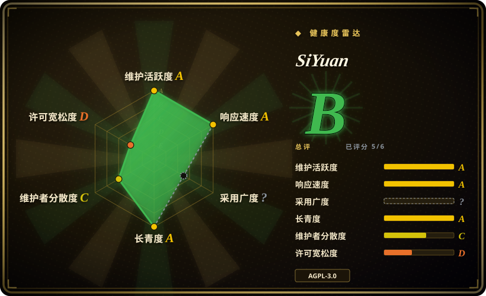

# SiYuan

一款隐私优先、可自托管的知识工作空间，具备块级引用与 Markdown 所见即所得：Go 内核提供本地／远程工作空间，供桌面、移动与 Docker 客户端使用，AI 作为应用内助手。

## 何时使用

你是一名知识工作者，想要块级引用（每个段落／标题都是可寻址的 `((block-id))`，可以嵌入引用）、能干净导出的 Markdown，以及——关键的一点——把同一份工作空间跑在家庭服务器上、从笔记本和手机都能访问。你用过 Obsidian／Logseq，喜欢本地优先的模型，但想要所见即所得的块编辑器、用于远程访问的 Docker 部署，以及**编辑器内部**的 AI 助手，而不是另一个独立聊天应用。

于是你在自己掌控的机器上安装桌面应用（或 `docker run b3log/siyuan`），再从桌面、Android／iOS／HarmonyOS 和浏览器打开同一份工作空间。块可被引用与嵌入，文档里可以内嵌 SQL 查询，兼容 OpenAI 的端点则驱动写作辅助与对你笔记的问答。当块引用、所见即所得与服务端／移动端部署起决定作用时，选它而不是 [Logseq](logseq.zh.md)；当工作空间必须由人拥有、AI 只是助手而非知识层的作者时，选它而不是 [LLM Wiki](llm-wiki.zh.md)。

## 何时不用

- **别指望一切都免费。** SiYuan 是 **open-core**：README 说明多数功能免费、商业使用也免费，但**部分功能需要付费会员**。如果「完全免费的构建」是硬要求，请用 [Logseq](logseq.zh.md)。
- **路线图由厂商掌控这件事无法接受时不要用。** 开发集中在一个组织与单一厂商（b3log），围绕两位主导贡献者。如果你要的是基金会／社区治理，它不是。
- **应当由 agent 编译并维护知识时不要用。** SiYuan 的 AI 在人撰写的工作空间里写作与问答，不会像 [LLM Wiki](llm-wiki.zh.md) 那样把资料摄入成一份自我维护的持久维基。
- **想要横跨网页与即时通讯的第二大脑时不要用。** 如果你需要「网络搜索 + 文档」的答案能出现在浏览器、手机应用、Obsidian 和 WhatsApp 里，请用 [Khoj](khoj.zh.md)。
- **需要庞大第三方插件生态时不要用。** 它的市场比 Obsidian 或 Logseq 小；承诺之前先确认你要的那个集成是否存在。
- **不要把 Docker 实例裸奔在公网上。** 一个可远程访问、带 API 的自托管工作空间就是你得自己加固的攻击面；如果只需要本地笔记，就只跑桌面端。
- **重新分发修改版、或把其 API 嵌入闭源产品前，先确认 AGPL-3.0 兼容性。** [推断]
- **中文优先的项目。** 文档与社区以中文最强，英文文档存在但更薄，排障可能更慢。[推断]

## 横向对比

| 替代品 | 是否收录 | 我们的评价 | 取舍 |
|---|---|---|---|
| [LLM Wiki](llm-wiki.zh.md) | ✅ | 当工作空间必须由人拥有、成熟、并能从移动端或服务器访问时，选 SiYuan；当应由 agent 拥有维基层、你要一份已编译且 Obsidian 兼容的产物时，选 LLM Wiki。 | SiYuan 更成熟、可自托管、更易运维，但 open-core、有付费层级且无自动摄入；LLM Wiki 完全开源、agent 优先，但仅桌面端、年轻且单人维护。 |
| [Logseq](logseq.zh.md) | ✅ | 想要块级引用、所见即所得、Docker／移动端部署与应用内 AI，选 SiYuan；想要纯文件大纲工具、更大的插件生态且没有付费层级，选 Logseq。 | 两者都本地优先、都用 AGPL，但 Logseq 完全免费、社区更大，而 SiYuan 是 open-core，在块引用、服务端部署与移动客户端上更强。 |
| [Khoj](khoj.zh.md) | ✅ | 想要一个由你撰写、结构化的知识工作空间，选 SiYuan；想要跨多客户端、以检索为先的 AI 答案，选 Khoj。 | Khoj 覆盖浏览器／手机／Obsidian／WhatsApp 并能搜网，但它是 Python/Postgres 服务、每次查询重新检索；SiYuan 是内嵌块结构的编辑器，AI 只是其内的一部分。 |
| [Reor](reor.zh.md) | ✅ | 需要一个仍在维护、可达服务端与移动端的工作空间时选 SiYuan；Reor 只能当参考，因为它已归档。 | Reor 曾是更纯粹的本地 AI 笔记应用（Ollama + LanceDB、无云端），但 2025-05 停更；SiYuan 体量更大、仍在推进，但是 open-core。 |
| Obsidian | 未收录 | 想要最大的插件生态与打磨精致的专有编辑器，选 Obsidian；想要开源（AGPL）、块引用与自托管服务端选项，选 SiYuan。 | Obsidian 是闭源免费软件、生态巨大，但没有第一方服务端／移动端自托管方案；SiYuan 开源可自托管，但生态更小且有付费层级。 |
| Notion | 未收录 | 想要托管、协作、数据库式工作空间，选 Notion；当隐私、本地文件与自托管是硬要求时，选 SiYuan。 | Notion 是托管 SaaS，协作强但没有本地所有权；SiYuan 本地优先并支持 Docker 部署，代价是打磨度与生态规模。 |

## 技术栈

- **内核：** Go（module 要求 Go 1.26.5），通过 HTTP API 提供工作空间
- **前端／外壳：** TypeScript + Electron（`app/package.json` 为 Electron 应用）；移动端支持 Android／iOS／HarmonyOS
- **存储：** 内嵌 SQLite 数据库加一个文件型数据目录（支持导出 markdown）
- **功能：** 块引用／嵌入、SQL 查询嵌入、PDF 标注、网页剪藏、闪卡、Tesseract OCR、表格视图、自定义 JS／CSS 片段
- **AI：** 兼容 OpenAI 的 API 驱动写作辅助与问答（自带 key）
- **部署：** 桌面安装包、Docker 镜像（`b3log/siyuan`），另有 Kubernetes／Unraid／TrueNAS 配方

## 依赖

- **桌面／移动使用：** 应用本身加一个本地数据目录——不需要外部数据库或服务
- **自托管使用：** 在你掌控的主机上跑 Docker（或二进制）；存储与备份由你负责
- **AI 功能：** 一个兼容 OpenAI 的端点与 API key（可选；没有它应用照常工作）
- **付费层级：** 部分功能需要会员（范围由厂商定价页定义，README 未列明）
- **不需要外部 Postgres／Redis**——内核自带存储

## 运维难度

**桌面端低，自托管中等。** 桌面安装很简单。跑 Docker 内核可以获得远程／多设备访问，但你就成了一项可被网络访问的服务的运维方：打补丁、放到 TLS／认证之后、备份工作空间。升级是频繁的 alpha 发布，任何依赖它的场景都应锁定稳定 tag。AI 功能还多一个 API key 与其成本要管。

## 健康度与可持续性

- **维护（2026-09）。** 活跃：46.4k star，最后 push 2026-09-19，3.8.x alpha 持续发布，代码库体量可观。未归档。[推断]
- **治理 / bus factor。** 实际是**双人核心**（头两位贡献者约 1.47 万与 1.25 万次提交），隶属单一组织／厂商（b3log）；路线图由厂商而非社区／基金会治理。好于单人项目，但集中度很高。[推断]
- **年龄与 Lindy。** 2020-08 创建、约 6 年活跃开发 ⇒ 对本地优先知识工具是**强 Lindy** 信号。[推断]
- **采用度与生态。** 约 46k star，Docker Hub 分发、移动应用商店与社区市场——在中文 PKM 圈有实际采用。[未验证]
- **风险标记。** **open-core**：README 明确说部分功能付费，因此功能可得性会随授权决策变化。AGPL-3.0。可被 Docker 访问的工作空间是自管攻击面。[推断]

## 存疑（未验证）

- **付费边界**——究竟哪些功能在会员之后，仅由厂商定价页定义，本次未核实。[未验证]
- **GitHub 上 8 个 open issue** 具有误导性：用户反馈似乎走项目论坛而非 GitHub Issues，因此它不是响应速度信号。[推断]
- **云同步的数据处理**——付费同步／云服务的加密与数据访问模型未从所读来源中确认。[未验证]
- **AI 功能范围**——README 列有「经 OpenAI API 的 AI 写作与问答」；对工作空间做检索的深度未核实。[未验证]
- **OCR／解析质量**——基于 Tesseract 的 OCR 与 PDF 标注是列出的功能，准确度未测试。[未验证]
- **star／fork 数**是有日期的 API 快照，不是生产使用的独立证明。[未验证]
