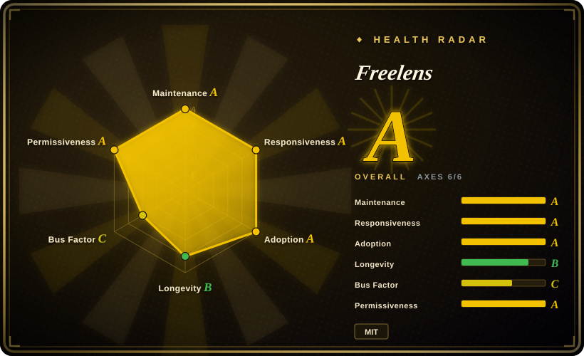
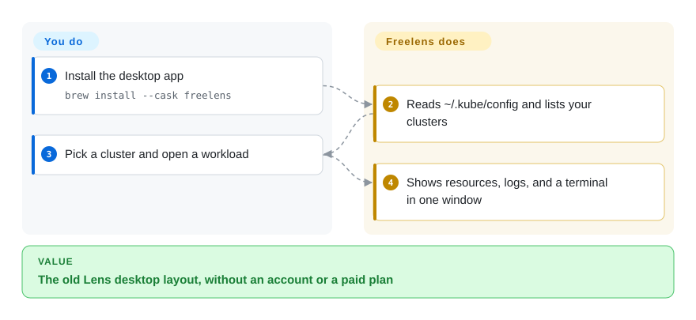

# Freelens

You liked the old Lens window — kubeconfig on the left, workloads on the right — but you will not create a Mirantis account or pay because your company crossed a revenue line. Freelens is the MIT desktop fork that keeps that layout.

## When to use

You used Open Lens / Lens Desktop before the core went closed, and the replacement you actually want is **that window**, not a new information architecture. You `brew install --cask freelens` (or WinGet/Flatpak/deb), it reads `~/.kube/config`, and you are in a multi-cluster Electron IDE with logs, a terminal, Helm, and a community extension list. You pick it over [Lens](lens.md) when the hard constraint is MIT + no account. You pick it over [Headlamp](headlamp.md) when engineers already think in a laptop IDE and you do not want to Helm a shared console. You pick it over [Radar](radar.md) when Lens muscle memory beats topology/MCP. You pick it over [k9s](k9s.md) when the audience will not live in a TUI. The deciding tradeoff is **preserving the Lens desktop versus picking a different model**.

## How it works

Freelens is a TypeScript/Electron app, explicitly a fork of Open Lens (the old `lensapp/lens` core). You install a desktop package; it uses your kubeconfig (Flatpak defaults to `~/.kube/config` and bundles kubectl/helm). What you do is install and click clusters. What Freelens does is the IDE chrome — resource trees, logs, terminal, extensions. There is no in-cluster Helm chart as the primary path. Kubernetes 1.22+ is documented; older clusters fall back to bundled kubectl.

<!-- flow-steps:begin (generated from flows/freelens.json by tools/flow_card.py — do not edit) -->

Text version of the flow

1. **You**: Install the desktop app — `brew install --cask freelens`
2. **Freelens**: Reads ~/.kube/config and lists your clusters
3. **You**: Pick a cluster and open a workload
4. **Freelens**: Shows resources, logs, and a terminal in one window

**Value**: The old Lens desktop layout, without an account or a paid plan

<!-- flow-steps:end -->

## When NOT to use

- **You need a shared in-cluster web UI with SIG governance.** Use [Headlamp](headlamp.md). Freelens is per-laptop.
- **You need topology, Flux+Argo diagnosis, cluster audit, and MCP in one OSS binary.** Use [Radar](radar.md).
- **You work only over SSH.** Use [k9s](k9s.md).
- **You need Mirantis commercial support, Teamwork, or paid Ask AI.** Use [Lens](lens.md) — Freelens is community-funded (donations, bounties) and will not give you that SKU.
- **You need a two-year-old project's Lindy to match k9s.** Freelens was created 2024-06. It is active, but short-lived compared with k9s/Headlamp; do not treat 5.6k stars as a 7-year prior.

## Comparison

| Alternative | In index | Our verdict | Tradeoff |
|---|---|---|---|
| [Lens](lens.md) | ✅ | Choose Freelens when the Lens window must stay open source and free; choose Lens when you already pay for support or gated features. | Freelens is MIT and account-free; Lens is closed, with a $10M revenue gate on Personal. |
| [Radar](radar.md) | ✅ | Choose Freelens to keep Electron/Lens habits; choose Radar when the job is diagnosis + MCP rather than an IDE clone. | Radar is a Go server you can also run in-cluster; Freelens is a desktop fork. |
| [Headlamp](headlamp.md) | ✅ | Choose Freelens for a laptop IDE; choose Headlamp for a team ingress console under kubernetes-sigs. | Headlamp's plugin SDK and in-cluster Helm are the platform-team path; Freelens is the personal desktop path. |
| [k9s](k9s.md) | ✅ | Choose Freelens when you want a GUI; choose k9s when a Go TUI on a jump host is enough. | k9s is smaller and older; Freelens is a full desktop with an extension ecosystem. |

## Tech stack

- **TypeScript** + **Electron** (Open Lens lineage).
- Bundled **kubectl** and **helm** in several packages (documented for Flatpak; other packages similarly ship helpers).
- npm package `@freelensapp/core`.
- Community extensions converted from Open Lens (catalog in GitHub Discussions).

## Dependencies

- Desktop OS: macOS 12+, Windows 10+, or Linux with glibc 2.34+ (README lists distro floors).
- Kubernetes 1.22+.
- A kubeconfig. Flatpak is sandboxed and wraps some cloud CLIs from the host.
- No cluster-side install required.

## Ops difficulty

**Low.** It is a desktop app: install, update, manage kubeconfig. Flatpak sandboxing and AppImage flags are the Linux sharp edges. You do not operate a server; you do operate "every engineer has a current build". Extensions are community-reviewed, not a vendor SLA.

## Health & viability

- **Maintenance (2026-09):** Active — `v1.10.3` on 2026-07-07, pushed 2026-09-27. Named core team (founder + maintainers) and a release-engineering group in the README.
- **Governance:** Organization `freelensapp`, MIT, independent of Mirantis. Funding via donations/bounties, not a foundation. Bus factor is a small named team, better than a solo User, weaker than kubernetes-sigs. [推断]
- **Age & Lindy:** Created 2024-06 — **young**. Still-active, but the prior is weaker than k9s (2019) or Headlamp (2019).
- **Adoption:** ~5.6k stars; packaged in Homebrew, WinGet, Scoop, Flathub, Snap, AUR.
- **Risk flags:** Fork of a retired product — keep an eye on Electron/Kubernetes client drift. MIT is permissive. No account gate.

## Caveats (unverified)

- [未验证] GitHub API 2026-09-27: 5622 stars, 335 forks, 218 open issues.
- [未验证] Extension compatibility with every old Open Lens plugin was not tested; the README says many have been converted.
- [推断] Small-team funding (donations/bounties) can stall; named maintainers reduce but do not eliminate that risk.
- [未验证] Bundled kubectl version versus cluster 1.22+ skew was not measured beyond the README warning.
