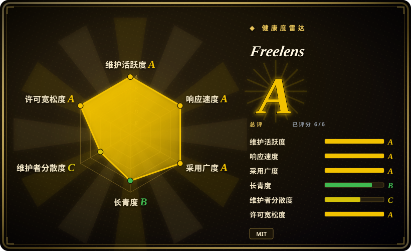
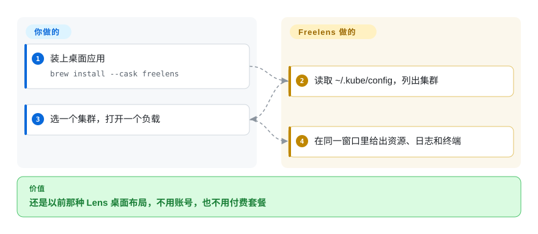

# Freelens

你喜欢旧版 Lens 那扇窗——左边 kubeconfig，右边负载——但你不会去注册 Mirantis 账号，也不会因为公司跨过收入线就付钱。Freelens 是保住那种布局的 MIT 桌面分支。

## 何时使用

你在核心闭源之前用过 Open Lens／Lens Desktop，你真正要的替换是**那扇窗**，不是一套新的信息架构。你 `brew install --cask freelens`（或 WinGet／Flatpak／deb），它读 `~/.kube/config`，你就进了带日志、终端、Helm 和社区扩展清单的多集群 Electron IDE。你选它而不是 [Lens](lens.zh.md)，是因为硬约束是 MIT 加不要账号。你选它而不是 [Headlamp](headlamp.zh.md)，是因为工程师已经按笔记本 IDE 想问题，你不想 Helm 一个共享控制台。你选它而不是 [Radar](radar.zh.md)，是因为 Lens 肌肉记忆压过拓扑／MCP。你选它而不是 [k9s](k9s.zh.md)，是因为观众不住在 TUI 里。决定性的取舍是**保住 Lens 桌面，对上换一种模型**。

## 怎么用起来

Freelens 是 TypeScript／Electron 应用，明确是 Open Lens（旧 `lensapp/lens` 核心）的分支。你装一个桌面包；它用你的 kubeconfig（Flatpak 默认 `~/.kube/config`，并捆绑 kubectl／helm）。你要做的是安装、点集群。Freelens 做的是 IDE 外壳——资源树、日志、终端、扩展。主路径不是集群内 Helm chart。文档要求 Kubernetes 1.22+；更旧的集群回退到捆绑的 kubectl。

<!-- flow-steps:begin (generated from flows/freelens.json by tools/flow_card.py — do not edit) -->

流程文字版

1. **你**：装上桌面应用 — `brew install --cask freelens`
2. **Freelens**：读取 ~/.kube/config，列出集群
3. **你**：选一个集群，打开一个负载
4. **Freelens**：在同一窗口里给出资源、日志和终端

**价值**：还是以前那种 Lens 桌面布局，不用账号，也不用付费套餐

<!-- flow-steps:end -->

## 何时不用

- **你需要带 SIG 治理的共享集群内网页界面。** 用 [Headlamp](headlamp.zh.md)。Freelens 是每人一台笔记本。
- **你需要拓扑、Flux+Argo 诊断、集群审计和 MCP 都在一个 OSS 二进制里。** 用 [Radar](radar.zh.md)。
- **你只在 SSH 上干活。** 用 [k9s](k9s.zh.md)。
- **你需要 Mirantis 商业支持、Teamwork 或付费 Ask AI。** 用 [Lens](lens.zh.md)——Freelens 靠捐赠／赏金，不会给你那个 SKU。
- **你需要一个有两年历史的项目，Lindy 能跟 k9s 比。** Freelens 创建于 2024-06。它仍活跃，但比 k9s／Headlamp 短命；别把 5600 star 当成七年先验。

## 横向对比

| 替代品 | 是否收录 | 我们的评价 | 取舍 |
|---|---|---|---|
| [Lens](lens.zh.md) | 已收录 | Lens 窗口必须保持开源且免费时选 Freelens；已经在为支持或上锁功能付钱时选 Lens。 | Freelens 是 MIT、不要账号；Lens 闭源，Personal 还有 1000 万美元收入门槛。 |
| [Radar](radar.zh.md) | 已收录 | 要保住 Electron／Lens 习惯时选 Freelens；工作是诊断 + MCP 而不是 IDE 克隆时选 Radar。 | Radar 是也可以跑进集群的 Go 服务；Freelens 是桌面分支。 |
| [Headlamp](headlamp.zh.md) | 已收录 | 笔记本 IDE 选 Freelens；kubernetes-sigs 下的团队入口控制台选 Headlamp。 | Headlamp 的插件 SDK 和集群内 Helm 是平台组的路；Freelens 是个人桌面的路。 |
| [k9s](k9s.zh.md) | 已收录 | 要 GUI 时选 Freelens；跳板机上一个 Go TUI 就够时选 k9s。 | k9s 更小更老；Freelens 是带扩展生态的完整桌面。 |

## 技术栈

- **TypeScript** + **Electron**（Open Lens 谱系）。
- 若干包装里捆绑 **kubectl** 和 **helm**（Flatpak 有文档；其他包同样带辅助工具）。
- npm 包 `@freelensapp/core`。
- 从 Open Lens 转过来的社区扩展（目录在 GitHub Discussions）。

## 依赖

- 桌面系统：macOS 12+、Windows 10+，或 glibc 2.34+ 的 Linux（README 列了发行版下限）。
- Kubernetes 1.22+。
- 一份 kubeconfig。Flatpak 有沙箱，并把部分云 CLI 包到宿主机命令。
- 不要求往集群里装东西。

## 运维难度

**低。** 桌面应用：安装、更新、管 kubeconfig。Linux 上的尖角是 Flatpak 沙箱和 AppImage 参数。你不运维服务器；你运维的是“每个工程师都有一份新构建”。扩展是社区审的，不是厂商 SLA。

## 健康度与可持续性

- **维护（2026-09）：** 活跃——`v1.10.3` 在 2026-07-07，推送 2026-09-27。README 点名核心团队（创始人 + 维护者）和发布工程组。
- **治理：** 组织 `freelensapp`，MIT，独立于 Mirantis。资金靠捐赠／赏金，不是基金会。公交车因子是具名小团队，好于个人 User，弱于 kubernetes-sigs。[推断]
- **年龄与 Lindy：** 创建于 2024-06——**年轻**。仍活跃，但先验弱于 k9s（2019）或 Headlamp（2019）。
- **采用：** 约 5600 star；Homebrew、WinGet、Scoop、Flathub、Snap、AUR 都有包装。
- **风险旗标：** 退休产品的分支——盯着 Electron／Kubernetes 客户端漂移。MIT 宽松。没有账号门槛。

## 存疑（未验证）

- [未验证] 2026-09-27 GitHub API：5622 star、335 fork、218 个未关 issue。
- [未验证] 与每一个旧 Open Lens 插件的兼容性未测；README 说许多已经转过来。
- [推断] 小团队靠捐赠／赏金可能停摆；具名维护者降低但不消除这个风险。
- [未验证] 捆绑 kubectl 相对集群 1.22+ 的版本偏差，除 README 警告外没有测量。
