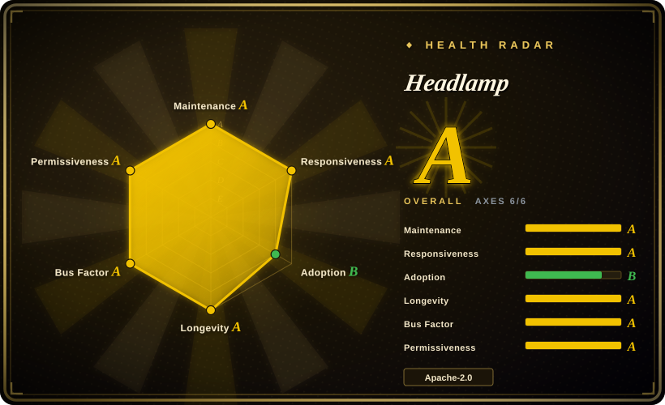
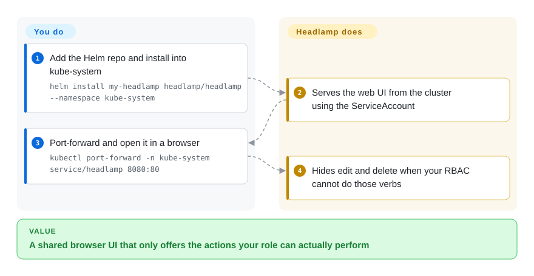

# Headlamp

Your platform team needs a browser they can share so people who do not live in kubectl can still list, edit, and debug workloads — and the buttons should disappear when RBAC says no. Headlamp is that web UI, in-cluster or on the desktop, under kubernetes-sigs.

## When to use

You are standing up a cluster console for more than yourself: some users have a token that can only list pods in two namespaces, and you do not want a UI that still shows Delete. You Helm Headlamp into `kube-system` (or install the desktop app on a kubeconfig), put an ingress or port-forward in front, and the UI hides actions the current identity cannot perform. You pick it over [k9s](k9s.md) when the audience is a browser, not a TUI. You pick it over [Radar](radar.md) when **kubernetes-sigs / CNCF Sandbox stewardship** or an open plugin SDK is the constraint that wins, even if Radar ships more GitOps/audit/MCP in core. You pick it over [Freelens](freelens.md) when the console must run in-cluster for the team, not as an Electron app on each laptop. The deciding tradeoff is **vendor-neutral plugin host versus integrated diagnosis**.

## How it works

Headlamp is a TypeScript frontend plus a Go backend that talks to the Kubernetes API using the viewer's credentials — a kubeconfig on the desktop, or a ServiceAccount / OIDC token in-cluster. It does not store cluster secrets in its own backend (FAQ: tokens may sit in browser localStorage). Plugins add views; Artifact Hub publishes Headlamp plugins. What you do is deploy or install, then authenticate. What Headlamp does is list/watch like any dashboard and **omit controls your Role cannot use**. Multi-cluster is a switcher, not Radar Cloud's fleet product.

<!-- flow-steps:begin (generated from flows/headlamp.json by tools/flow_card.py — do not edit) -->

Text version of the flow

1. **You**: Add the Helm repo and install into kube-system — `helm install my-headlamp headlamp/headlamp --namespace kube-system`
2. **Headlamp**: Serves the web UI from the cluster using the ServiceAccount
3. **You**: Port-forward and open it in a browser — `kubectl port-forward -n kube-system service/headlamp 8080:80`
4. **Headlamp**: Hides edit and delete when your RBAC cannot do those verbs

**Value**: A shared browser UI that only offers the actions your role can actually perform

<!-- flow-steps:end -->

## When NOT to use

- **You need a keyboard-only loop on a jump host.** Use [k9s](k9s.md). Headlamp is a web/desktop GUI.
- **You need topology, Flux+Argo diagnosis, upgrade-impact, and MCP in one binary with no plugins.** Use [Radar](radar.md). Headlamp can grow those via plugins; they are not the core product.
- **You want the Lens desktop IDE and its extension ecosystem, no cluster install.** Use [Freelens](freelens.md). Headlamp's desktop app exists, but the in-cluster Helm path is the team-shaped one.
- **You already pay for Lens Teamwork / commercial support.** Stay on [Lens](lens.md) until that is not the constraint.
- **The identity cannot list namespaces cluster-wide and you have not set accessible namespaces in cluster settings.** The FAQ documents an Access Denied loop in that case — fix the namespace allow-list, or pick a tool that probes namespace scope for you.

## Comparison

| Alternative | In index | Our verdict | Tradeoff |
|---|---|---|---|
| [Radar](radar.md) | ✅ | Choose Headlamp when SIG governance or custom plugins decide; choose Radar when you want GitOps/traffic/audit/MCP without assembling plugins. | Radar is younger and vendor-backed; Headlamp is the CNCF-sandbox bet with a shallower built-in diagnosis surface. |
| [k9s](k9s.md) | ✅ | Choose Headlamp for a shared browser console; choose k9s for personal terminal speed. | k9s has no in-cluster URL and no plugin UI SDK; Headlamp is heavier to expose safely. |
| [Freelens](freelens.md) | ✅ | Choose Headlamp when the UI must live in the cluster; choose Freelens when every engineer already has a laptop IDE. | Freelens is MIT Electron; Headlamp is Apache-2.0 and can be the team's ingress. |
| [Lens](lens.md) | ✅ | Choose Headlamp when the console must stay open source and account-free; choose Lens only with an existing commercial workflow. | Lens is closed-source with plan gates; Headlamp is Apache-2.0 under kubernetes-sigs. |

## Tech stack

- **TypeScript** frontend (React).
- **Go** backend for API proxying, plugins, and in-cluster serving.
- Helm chart under `charts/headlamp`; desktop builds for Linux/macOS/Windows.
- Plugin packages on Artifact Hub (kind Headlamp).

## Dependencies

- Kubernetes API access via kubeconfig (desktop) or in-cluster ServiceAccount / OIDC.
- In-cluster: Helm (or the sample YAML), then ingress or `kubectl port-forward`. OIDC/Dex/Keycloak tutorials exist; a ServiceAccount token is the minimal access path.
- Optional metrics-server for the metrics views.
- Desktop builds may be unsigned (docs warn about macOS/Windows gatekeeper).

## Ops difficulty

**Low** for the desktop app. **Medium** in-cluster: Helm is easy, then you own TLS, ingress, OIDC or token distribution, and plugin sidecars if you use the plugin manager. Headlamp is a privileged cluster console — treat exposure like any dashboard.

## Health & viability

- **Maintenance (2026-09):** Active — `v0.45.0` on 2026-08-20, pushed 2026-09-25. FAQ: aims for a feature release about monthly.
- **Governance:** `kubernetes-sigs/headlamp`, CNCF Sandbox, LF Projects. `OWNERS_ALIASES` lists multiple maintainers (joaquimrocha, illume, sniok, and others). This is the strongest governance story in the category.
- **Age & Lindy:** Created 2019-11, still active — **old and active**.
- **Adoption:** ~7.3k stars; used as a vendor-neutral dashboard on several platforms (project maintains a tested-platforms list).
- **Risk flags:** 1494 open issues is a large queue, not by itself abandonment. No relicense. Desktop unsigned-app warnings are operational, not license.

## Caveats (unverified)

- [未验证] GitHub API 2026-09-27: 7340 stars, 1122 forks, 1494 open issues.
- [未验证] Desktop feature parity with in-cluster (plugins, OIDC) was not checked in this pass.
- [推断] Plugin quality varies by Artifact Hub package; a missing plugin is not a Headlamp core defect.
- [未验证] Exact CNCF Sandbox graduation timeline is not claimed here.
