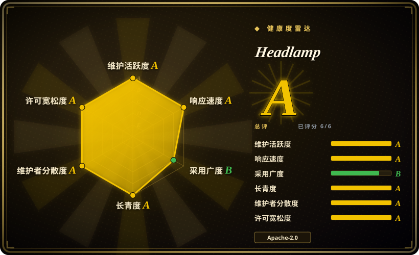
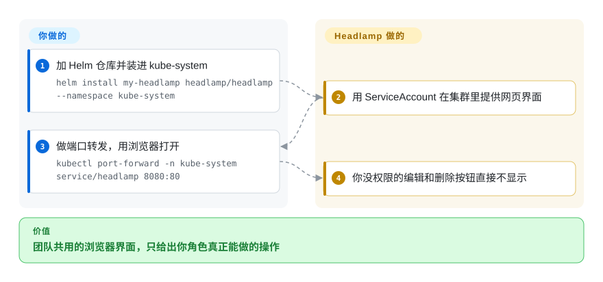

# Headlamp

平台组需要一个能分享的浏览器，让不住在 kubectl 里的人也能列出、编辑、排查负载——而且 RBAC 说不行时按钮就该消失。Headlamp 就是这个网页界面，能装进集群也能当桌面应用，挂在 kubernetes-sigs 下面。

## 何时使用

你在给不止你一个人的集群立控制台：有人手里的 token 只能 list 两个命名空间里的 Pod，你不想要一个仍然显示“删除”的界面。你把 Headlamp Helm 进 `kube-system`（或在已有 kubeconfig 的机器上装桌面应用），前面放入口或端口转发，界面会藏起当前身份做不了的动作。你选它而不是 [k9s](k9s.zh.md)，是因为观众是浏览器，不是 TUI。你选它而不是 [Radar](radar.zh.md)，是因为**kubernetes-sigs／CNCF Sandbox 托管**或开放插件 SDK 才是赢的那条约束，哪怕 Radar 在核心里带了更多 GitOps／审计／MCP。你选它而不是 [Freelens](freelens.zh.md)，是因为控制台必须跑在集群里给团队用，而不是每人一台 Electron。决定性的取舍是**厂商中立的插件宿主，对上一揽子诊断**。

## 怎么用起来

Headlamp 是 TypeScript 前端加 Go 后端，用观看者的凭据打 Kubernetes API——桌面上是 kubeconfig，集群里是 ServiceAccount 或 OIDC token。它不把集群密钥存进自己的后端（FAQ：token 可能在浏览器 localStorage）。插件加视图；Artifact Hub 上有 Headlamp 插件。你要做的是部署或安装，然后鉴权。Headlamp 做的是像任何控制台一样 list／watch，并**拿掉你的 Role 不能用的控件**。多集群是切换器，不是 Radar Cloud 那种舰队产品。

<!-- flow-steps:begin (generated from flows/headlamp.json by tools/flow_card.py — do not edit) -->

流程文字版

1. **你**：加 Helm 仓库并装进 kube-system — `helm install my-headlamp headlamp/headlamp --namespace kube-system`
2. **Headlamp**：用 ServiceAccount 在集群里提供网页界面
3. **你**：做端口转发，用浏览器打开 — `kubectl port-forward -n kube-system service/headlamp 8080:80`
4. **Headlamp**：你没权限的编辑和删除按钮直接不显示

**价值**：团队共用的浏览器界面，只给出你角色真正能做的操作

<!-- flow-steps:end -->

## 何时不用

- **你需要跳板机上只靠键盘的循环。** 用 [k9s](k9s.zh.md)。Headlamp 是网页／桌面 GUI。
- **你需要拓扑、Flux+Argo 诊断、升级影响和 MCP 都在一个二进制里，不要插件。** 用 [Radar](radar.zh.md)。Headlamp 可以靠插件长出这些，但那不是核心产品。
- **你要 Lens 桌面 IDE 和它的扩展生态，不往集群里装东西。** 用 [Freelens](freelens.zh.md)。Headlamp 也有桌面应用，但给团队定形的是集群内 Helm 这条路。
- **你已经在为 Lens Teamwork／商业支持付钱。** 在那条约束消失之前留在 [Lens](lens.zh.md)。
- **身份不能集群范围 list 命名空间，你又没在集群设置里填可访问命名空间。** FAQ 记录了这种情况下的 Access Denied 死循环——先改命名空间允许名单，或换会探测命名空间范围的工具。

## 横向对比

| 替代品 | 是否收录 | 我们的评价 | 取舍 |
|---|---|---|---|
| [Radar](radar.zh.md) | 已收录 | SIG 治理或自定义插件说了算时选 Headlamp；想要 GitOps／流量／审计／MCP 又不愿拼插件时选 Radar。 | Radar 更年轻、厂商托底；Headlamp 是 CNCF Sandbox 赌注，内置诊断面更浅。 |
| [k9s](k9s.zh.md) | 已收录 | 共享浏览器控制台选 Headlamp；个人终端速度选 k9s。 | k9s 没有集群内 URL，也没有插件 UI SDK；Headlamp 安全暴露起来更重。 |
| [Freelens](freelens.zh.md) | 已收录 | 界面必须住在集群里时选 Headlamp；每个工程师已经有笔记本 IDE 时选 Freelens。 | Freelens 是 MIT 的 Electron；Headlamp 是 Apache-2.0，可以当团队入口。 |
| [Lens](lens.zh.md) | 已收录 | 控制台必须保持开源、不要账号时选 Headlamp；只有已有商业工作流时才选 Lens。 | Lens 闭源且按套餐上锁；Headlamp 是 kubernetes-sigs 下的 Apache-2.0。 |

## 技术栈

- **TypeScript** 前端（React）。
- **Go** 后端，做 API 代理、插件和集群内服务。
- Helm chart 在 `charts/headlamp`；桌面构建覆盖 Linux／macOS／Windows。
- Artifact Hub 上的插件包（Headlamp 类型）。

## 依赖

- 经 kubeconfig（桌面）或集群内 ServiceAccount／OIDC 访问 Kubernetes API。
- 集群内：Helm（或示例 YAML），然后入口或 `kubectl port-forward`。有 OIDC／Dex／Keycloak 教程；ServiceAccount token 是最简访问路径。
- 可选 metrics-server，给指标视图用。
- 桌面构建可能未签名（文档警告 macOS／Windows 门禁）。

## 运维难度

桌面应用**低**。集群内**中**：Helm 容易，然后你要管 TLS、入口、OIDC 或 token 分发，用插件管理器时还有 sidecar。Headlamp 是有特权的集群控制台——暴露面按任何控制台来对待。

## 健康度与可持续性

- **维护（2026-09）：** 活跃——`v0.45.0` 在 2026-08-20，推送 2026-09-25。FAQ：大约每月一个功能版本。
- **治理：** `kubernetes-sigs/headlamp`，CNCF Sandbox，LF Projects。`OWNERS_ALIASES` 列出多名维护者（joaquimrocha、illume、sniok 等）。本分类里治理故事最强。
- **年龄与 Lindy：** 2019-11 创建，仍活跃——**又老又活**。
- **采用：** 约 7300 star；当作厂商中立控制台用在若干平台上（项目维护一份测过的平台清单）。
- **风险旗标：** 1494 个未关 issue 是大队列，本身不等于停更。无改许可。桌面未签名是运维问题，不是许可问题。

## 存疑（未验证）

- [未验证] 2026-09-27 GitHub API：7340 star、1122 fork、1494 个未关 issue。
- [未验证] 桌面与集群内（插件、OIDC）功能是否对齐，本轮未查。
- [推断] 插件质量随 Artifact Hub 包而变；缺某个插件不是 Headlamp 核心缺陷。
- [未验证] CNCF Sandbox 何时毕业，这里不做时间表。
