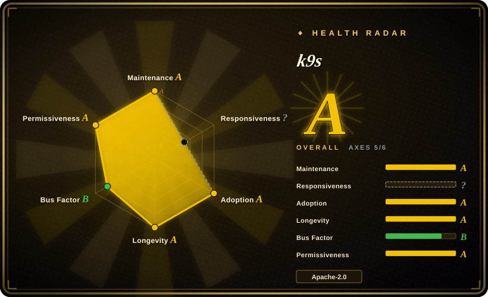
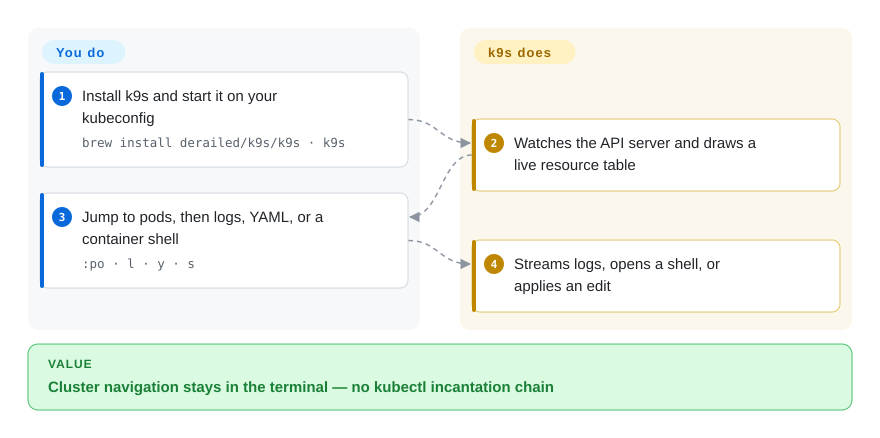

# k9s

You are in a terminal looking at CrashLoopBackOff and the next `kubectl get` / `describe` / `logs` incantation is already in your clipboard. k9s is a full-screen keyboard UI that watches the cluster and lets you inspect, log, and exec without leaving the session.

## When to use

You operate Kubernetes from a terminal — a laptop, a jump host, an SSH session — and the pain is the round trip: `kubectl get pods -n foo`, then `describe`, then `logs -f`, then `exec`, each with a namespace you have to retype. You install k9s, point it at the kubeconfig you already use, and get a live table that refreshes as the API changes. `:po` jumps to pods, `l` tails logs, `s` opens a shell, `y` shows YAML, `ctrl-d` deletes after a confirm. You pick it over [Radar](radar.md) or [Headlamp](headlamp.md) when a browser is the wrong surface (SSH, air-gapped jump box, you already live in tmux). You pick it over [Freelens](freelens.md) when you do not want an Electron desktop. The deciding tradeoff is **speed in a terminal versus a graphical workspace**: k9s has no topology graph, no shared team URL, and no MCP server.

## How it works

k9s is a Go TUI in front of the Kubernetes API. You run one binary with your kubeconfig; it lists and watches resources the same way `kubectl` does, then draws them with tview/tcell. What you do is navigate with aliases and keys, optionally drop a `plugins.yaml` that shells out to `kubectl` or anything else. What k9s does is keep the view live, apply your column customizations from `views.yaml`, and honor `--readonly` so delete/edit never appear. It is closer to a continuously refreshed `kubectl` than to a dashboard: there is no in-cluster service to deploy, and no account.

<!-- flow-steps:begin (generated from flows/k9s.json by tools/flow_card.py — do not edit) -->

Text version of the flow

1. **You**: Install k9s and start it on your kubeconfig — `brew install derailed/k9s/k9s · k9s`
2. **k9s**: Watches the API server and draws a live resource table
3. **You**: Jump to pods, then logs, YAML, or a container shell — `:po · l · y · s`
4. **k9s**: Streams logs, opens a shell, or applies an edit

**Value**: Cluster navigation stays in the terminal — no kubectl incantation chain

<!-- flow-steps:end -->

## When NOT to use

- **The people who need the cluster do not live in a terminal.** Use [Headlamp](headlamp.md) in-cluster or [Radar](radar.md) locally so they get a browser. k9s is a TUI; there is no shared URL.
- **You need a topology, GitOps diagnosis, or an MCP endpoint for an AI agent.** Use [Radar](radar.md). k9s watches resources and can run Popeye as a sanitizer view; it does not ship correlated graphs or a Model Context Protocol server.
- **You want the old Lens desktop window with extensions.** Use [Freelens](freelens.md). k9s is keyboard-first and has no Electron plugin host.
- **Your org already bought Lens seats and extensions.** Stay on [Lens](lens.md) until that investment is written off; k9s will not load Lens extensions.
- **The cluster is so large that a full watch of high-cardinality kinds falls over, and you cannot scope namespaces.** Radar documents pagination and namespace-scope flags for that failure; k9s will most likely blow up on older Kubernetes or starved RBAC — the README says so. Try `--readonly` and a namespace flag first, but do not expect a fleet dashboard.

## Comparison

| Alternative | In index | Our verdict | Tradeoff |
|---|---|---|---|
| [Radar](radar.md) | ✅ | Choose k9s when the loop is terminal-only and SSH-friendly; choose Radar when you need topology, Helm/GitOps, audit, or MCP from a local binary. | k9s is faster in a shell and has seven years of Lindy; Radar is a 2026 project that trades age for an integrated diagnosis UI. |
| [Headlamp](headlamp.md) | ✅ | Choose k9s for a personal kubectl accelerator; choose Headlamp when a team needs a browser UI with RBAC-aware buttons and kubernetes-sigs governance. | Headlamp can run in-cluster and grow via plugins; k9s never becomes a shared dashboard. |
| [Freelens](freelens.md) | ✅ | Choose k9s if you refuse a desktop app; choose Freelens if you want the Lens-style window without a Mirantis account. | Freelens is an Electron IDE; k9s is a few-MB Go binary you can drop on a jump host. |
| [Lens](lens.md) | ✅ | Choose k9s when you need Apache-2.0 with no account; choose Lens only if you already pay for its IDE, Teamwork, or support. | Lens is a commercial product whose GitHub OSS tree is retired; k9s remains a real open-source CLI. |

## Tech stack

- **Go** TUI (`github.com/derailed/tview`, `tcell`) talking to `k8s.io/client-go` v0.37.
- **Helm v3** client libraries for release views.
- Optional **grype / syft** (Anchore) for image scans when that feature is enabled.
- **Hey** for HTTP benchmarks against port-forwards.
- Config via XDG (`~/.config/k9s`), skins, aliases, hotkeys, plugins as YAML.

## Dependencies

- A kubeconfig the same as `kubectl`; Kubernetes 1.28+ preferred (README: works best on later versions; compatibility matrix ships with each release).
- A 256-color terminal (`TERM=xterm-256color` on Unix).
- `$EDITOR` / `$KUBE_EDITOR` for the edit command.
- No cluster-side install, CRD, or agent. Node-shell is an opt-in feature gate that launches a helper pod.

## Ops difficulty

**Low.** One binary, no daemon, no database. Config is local YAML; `--readonly` is the main safety switch for shared jump hosts. Operational cost is RBAC (it needs list/watch on the kinds you browse) and keeping the binary current. Difficulty rises only if you maintain a large plugin/hotkey tree per cluster.

## Health & viability

- **Maintenance (2026-09):** Active — last push 2026-09-25, latest release `v0.51.0` (2026-06-06). Not archived.
- **Governance / bus factor:** User-owned (`derailed` / Fernand Galiana, Imhotep Software LLC). README asks for sponsors and says it is not backed by a corporation. Treat bus factor as **single-maintainer-shaped** even with many contributors. [推断]
- **Age & Lindy:** Created 2019-01, still pushed in 2026 — **old and active**, a strong prior in this category.
- **Adoption:** ~34.7k stars, packaged in Homebrew, Krew-adjacent installs, distro packages (Arch, Fedora, Debian). Default muscle memory for many SREs.
- **Risk flags:** None on license (Apache-2.0). The viability risk is maintainer concentration, not relicensing.

## Caveats (unverified)

- [未验证] Star/fork/issue counts as of 2026-09-27 via GitHub API: 34689 stars, 2297 forks, 85 open issues.
- [推断] Bus factor is single-maintainer-shaped because `owner.type` is User and the README is written in the first person by Fernand Galiana; contributor count was not independently tallied beyond the API owner type.
- [未验证] Image-scan (grype/syft) and Popeye integration were not exercised in this pass.
- [推断] Very large clusters may hit watch/list limits; the README warns it will "most likely blow up" on older Kubernetes or insufficient RBAC, without a published pod-count ceiling.
