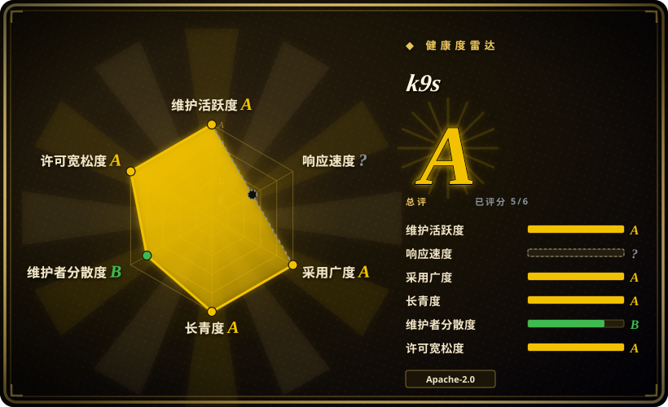
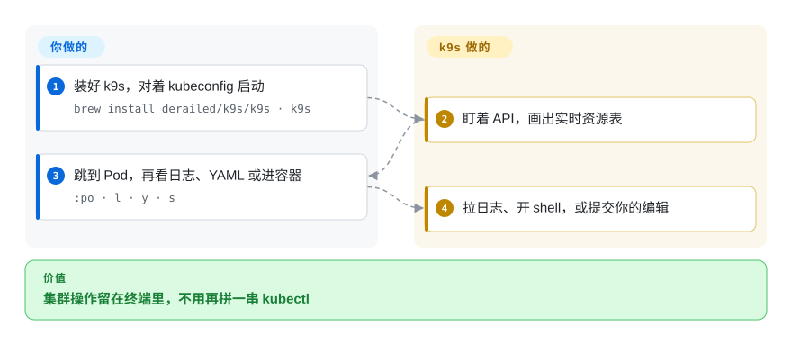

# k9s

你蹲在终端里对着 CrashLoopBackOff，下一条 `kubectl get`／`describe`／`logs` 已经在剪贴板里。k9s 是全屏键盘界面，盯着集群，让你在当前会话里看、跟日志、进容器。

## 何时使用

你从终端操作 Kubernetes——笔记本、跳板机、SSH 会话——痛点是来回敲：`kubectl get pods -n foo`，再 `describe`，再 `logs -f`，再 `exec`，命名空间每次都要重打。你装上 k9s，对着已经在用的 kubeconfig 启动，得到一张跟着 API 变的活表。`:po` 跳到 Pod，`l` 跟日志，`s` 开 shell，`y` 看 YAML，`ctrl-d` 确认后删除。你选它而不是 [Radar](radar.zh.md) 或 [Headlamp](headlamp.zh.md)，是因为浏览器是错的表面（SSH、隔离跳板、人已经住在 tmux 里）。你选它而不是 [Freelens](freelens.zh.md)，是因为你不要 Electron 桌面。决定性的取舍是**终端里的速度，对上图形工作台**：k9s 没有拓扑图、没有团队可分享的 URL、也没有 MCP 服务。

## 怎么用起来

k9s 是挡在 Kubernetes API 前面的 Go TUI。你拿自己的 kubeconfig 跑一个二进制；它像 `kubectl` 一样 list／watch 资源，再用 tview／tcell 画出来。你要做的是用别名和快捷键导航，必要时丢一份 `plugins.yaml` 去调 `kubectl` 或别的命令。k9s 做的是让视图保持活的、套上你在 `views.yaml` 里定制的列，并遵守 `--readonly`，让删除／编辑根本不出现。它更像持续刷新的 `kubectl`，不像控制台：不用往集群里装服务，也不要账号。

<!-- flow-steps:begin (generated from flows/k9s.json by tools/flow_card.py — do not edit) -->

流程文字版

1. **你**：装好 k9s，对着 kubeconfig 启动 — `brew install derailed/k9s/k9s · k9s`
2. **k9s**：盯着 API，画出实时资源表
3. **你**：跳到 Pod，再看日志、YAML 或进容器 — `:po · l · y · s`
4. **k9s**：拉日志、开 shell，或提交你的编辑

**价值**：集群操作留在终端里，不用再拼一串 kubectl

<!-- flow-steps:end -->

## 何时不用

- **需要看集群的人不住在终端里。** 用集群内的 [Headlamp](headlamp.zh.md) 或本机的 [Radar](radar.zh.md)，给他们浏览器。k9s 是 TUI，没有可分享的 URL。
- **你需要拓扑、GitOps 诊断，或给 AI agent 用的 MCP。** 用 [Radar](radar.zh.md)。k9s 会盯资源，也能开 Popeye 做消毒视图；它不提供关联图，也不提供 Model Context Protocol 服务。
- **你要旧版 Lens 那种带扩展的桌面窗口。** 用 [Freelens](freelens.zh.md)。k9s 以键盘为先，没有 Electron 插件宿主。
- **组织已经买了 Lens 席位和扩展。** 在这笔投资核销之前留在 [Lens](lens.zh.md)；k9s 加载不了 Lens 扩展。
- **集群大到高基数 kind 的全量 watch 会垮，你又不能把命名空间收窄。** Radar 为这种失败写了分页和命名空间范围开关；k9s 在偏旧的 Kubernetes 或 RBAC 不够时“多半会炸”——README 原话。先试 `--readonly` 和命名空间参数，但别指望它变成舰队控制台。

## 横向对比

| 替代品 | 是否收录 | 我们的评价 | 取舍 |
|---|---|---|---|
| [Radar](radar.zh.md) | 已收录 | 循环必须留在终端、还要过 SSH 时选 k9s；需要拓扑、Helm／GitOps、审计或 MCP 时选 Radar。 | k9s 在 shell 里更快，还有七年 Lindy；Radar 是 2026 年的项目，用年龄换一体的诊断界面。 |
| [Headlamp](headlamp.zh.md) | 已收录 | 个人加速 kubectl 选 k9s；团队要带 RBAC 按钮的浏览器界面和 kubernetes-sigs 治理时选 Headlamp。 | Headlamp 能装进集群、靠插件长大；k9s 成不了共享控制台。 |
| [Freelens](freelens.zh.md) | 已收录 | 拒绝桌面应用时选 k9s；要 Lens 风格窗口又不想要 Mirantis 账号时选 Freelens。 | Freelens 是 Electron IDE；k9s 是可以丢在跳板机上的几 MB Go 二进制。 |
| [Lens](lens.zh.md) | 已收录 | 要 Apache-2.0、不要账号时选 k9s；只有已经在为 IDE／Teamwork／支持付钱时才选 Lens。 | Lens 是商业产品，GitHub 上的开源树已停；k9s 仍是真开源 CLI。 |

## 技术栈

- **Go** TUI（`github.com/derailed/tview`、`tcell`）对接 `k8s.io/client-go` v0.37。
- **Helm v3** 客户端库，用来看 release。
- 可选 **grype／syft**（Anchore），打开镜像扫描时用。
- **Hey**，对着端口转发做 HTTP 压测。
- 配置走 XDG（`~/.config/k9s`），皮肤、别名、热键、插件都是 YAML。

## 依赖

- 和 `kubectl` 同一份 kubeconfig；更推荐 Kubernetes 1.28+（README：在较新版本上最好用；每版带兼容矩阵）。
- 256 色终端（Unix 上 `TERM=xterm-256color`）。
- 编辑命令需要 `$EDITOR`／`$KUBE_EDITOR`。
- 不用在集群里装东西、CRD 或 agent。进节点 shell 是可选 feature gate，会拉起辅助 Pod。

## 运维难度

**低。** 一个二进制，没有守护进程，没有数据库。配置是本地 YAML；共享跳板机上最要紧的安全开关是 `--readonly`。运维成本是 RBAC（你浏览的 kind 要有 list／watch）和保持二进制更新。只有按集群维护一大摊插件／热键时难度才上去。

## 健康度与可持续性

- **维护（2026-09）：** 活跃——最后推送 2026-09-25，最新发布 `v0.51.0`（2026-06-06）。未归档。
- **治理／公交车因子：** 个人名下（`derailed`／Fernand Galiana，Imhotep Software LLC）。README 拉赞助，并写明没有大公司托底。即使贡献者不少，也按**单维护者形态**来看。[推断]
- **年龄与 Lindy：** 2019-01 创建，2026 年仍在推——**又老又活**，本分类里很强的先验。
- **采用：** 约 3.47 万 star，Homebrew、发行版包装（Arch、Fedora、Debian）都有。很多 SRE 的默认肌肉记忆。
- **风险旗标：** 许可无问题（Apache-2.0）。可持续性风险是维护者集中，不是改许可证。

## 存疑（未验证）

- [未验证] 2026-09-27 GitHub API：34689 star、2297 fork、85 个未关 issue。
- [推断] 公交车因子按单维护者形态，因为 `owner.type` 是 User，README 是 Fernand Galiana 第一人称；本轮没有独立统计贡献者人数。
- [未验证] 镜像扫描（grype／syft）和 Popeye 集成本轮没有实操。
- [推断] 很大的集群可能撞上 watch／list 上限；README 警告在偏旧 Kubernetes 或 RBAC 不够时“多半会炸”，没有公布 Pod 数量上限。
