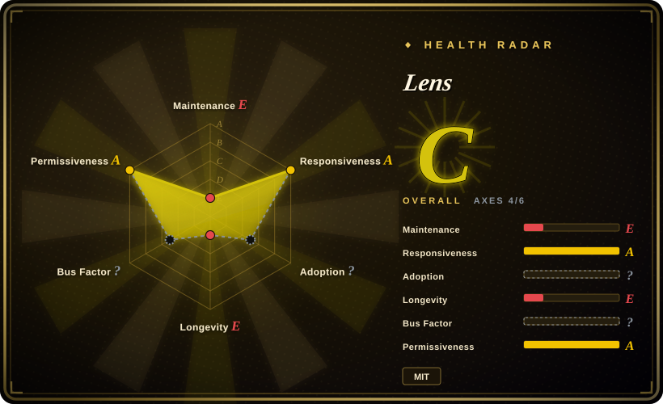
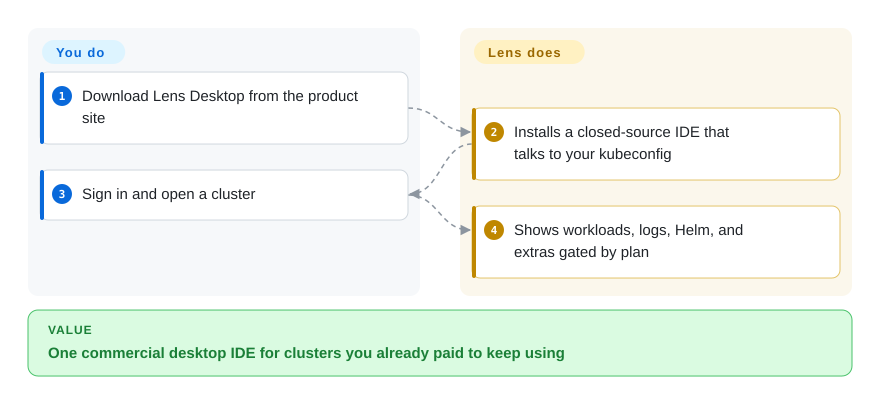

# Lens

You already run Kubernetes from a paid desktop IDE with extensions and team cluster catalogs, and switching tools would throw away that workflow. Lens is Mirantis's commercial product — the GitHub repo is no longer the app you download.

## When to use

You (or your org) already standardized on Lens Desktop: extensions, Teamwork cluster discovery, commercial support, or a seat you are not going to rip out this quarter. You keep using it because the switching cost is the point, not because it is the open-source default. For a **new** selection, this page is usually a negative: the README on `lensapp/lens` says the open-source Desktop was retired, contributions go through the extension API, and the product lives at k8slens.dev. You pick Lens over [Freelens](freelens.md) only when those commercial pieces (Ask AI, paid GitOps, SSO at org tier, support) are already bought. You pick it over [Radar](radar.md) / [Headlamp](headlamp.md) only if the team will not move off the Electron IDE. The deciding tradeoff is **existing Lens investment versus leaving a closed product**.

## Q&A

**Is the GitHub repository still the product?** No. The current default-branch README states the open-source Lens Desktop was retired and is no longer maintained; Mirantis still develops the closed product. GitHub languages on the default branch are empty; last push was 2025-02-11. If you want that desktop as open source, the continuation is [Freelens](freelens.md).

**Can a company use the Personal (free) plan?** The pricing page (2026-09) says organizations with over $10 million in annual revenue or funding need a paid subscription, except a 30-day evaluation. GitOps, Ask AI, and the built-in MCP server are listed under Plus, not Personal.

## How it works

You download Lens Desktop from the website, sign in, and it reads local kubeconfigs like the old OSS app. The running product is proprietary. What you do is install, authenticate, and work in the IDE. What Lens does is talk to the cluster with your kubeconfig and unlock extras by plan. The MIT license on the GitHub repo applies to the remaining repository content, not to the binary you get from k8slens.dev.

<!-- flow-steps:begin (generated from flows/lens.json by tools/flow_card.py — do not edit) -->

Text version of the flow

1. **You**: Download Lens Desktop from the product site
2. **Lens**: Installs a closed-source IDE that talks to your kubeconfig
3. **You**: Sign in and open a cluster
4. **Lens**: Shows workloads, logs, Helm, and extras gated by plan

**Value**: One commercial desktop IDE for clusters you already paid to keep using

<!-- flow-steps:end -->

## When NOT to use

- **You need an open-source desktop IDE with no account.** Use [Freelens](freelens.md), the MIT fork of Open Lens. Lens OSS is retired.
- **You need Apache-2.0, no login, MCP and GitOps in the free binary.** Use [Radar](radar.md).
- **You need a vendor-neutral in-cluster web UI.** Use [Headlamp](headlamp.md).
- **You live in SSH and a TUI.** Use [k9s](k9s.md).
- **Your company is above the Personal-plan revenue gate and will not pay.** Do not "just download Personal"; the pricing page forbids it. Freelens, Radar, or Headlamp are the honest OSS exits.
- **You expected to send PRs to `lensapp/lens` and change the core.** The README says core contributions are closed; only extensions remain.

## Comparison

| Alternative | In index | Our verdict | Tradeoff |
|---|---|---|---|
| [Freelens](freelens.md) | ✅ | Choose Freelens when you want the Lens window without Mirantis; choose Lens only if Teamwork, paid AI/GitOps, or support is already the constraint. | Freelens is MIT and account-free; Lens is the commercial line with plan gates. |
| [Radar](radar.md) | ✅ | Choose Radar for a local OSS diagnosis UI plus MCP; choose Lens when the team will not leave the Lens IDE. | Radar is a 2026 Go binary; Lens is a mature closed desktop with a retired OSS tree. |
| [Headlamp](headlamp.md) | ✅ | Choose Headlamp for an in-cluster SIG UI; choose Lens for a commercial laptop IDE. | Headlamp is Apache-2.0 under kubernetes-sigs; Lens is not a shared cluster console unless you buy Teamwork. |
| [k9s](k9s.md) | ✅ | Choose k9s for terminal speed with no account; choose Lens when a desktop IDE is mandatory and already licensed. | k9s is Apache-2.0 and seven years active; Lens's GitHub repo is stale relative to the closed product. |

## Tech stack

- **Current product:** proprietary desktop (Mirantis). Not present in the default GitHub tree.
- **Historical OSS (retired):** Electron / TypeScript, which is what [Freelens](freelens.md) still is.
- Extension API remains the documented way to add behavior.

## Dependencies

- A supported desktop OS; a kubeconfig.
- A Lens account for the product (Login on k8slens.dev).
- Paid plan for GitOps, Ask AI / MCP, cloud-provider integrations, and org-scale use above the revenue threshold.
- No in-cluster install for the IDE itself.

## Ops difficulty

**Low** as a desktop app, **high as a license problem**. You do not operate a server; you operate seats, SSO, and the Personal-versus-paid boundary. The GitHub repo is not a viable source of product updates (last push 2025-02).

## Health & viability

- **Maintenance of this repo (2026-09):** Stale as an application codebase — last push 2025-02-11, latest GitHub release dated 2024-01, languages empty. The **product** is still marketed on k8slens.dev in 2026; that is not the same as this repository being alive.
- **Governance:** Mirantis, Inc. Vendor-owned, closed core.
- **Age & Lindy:** Created 2018-11. Age does not rescue a retired OSS tree. The commercial product may persist; this repo is not the bet.
- **Adoption:** ~23.2k stars, mostly historical. Do not read stars as "OSS health".
- **Risk flags:** Relicense-by-retirement (OSS Desktop discontinued). Open-core / plan gating. Revenue qualification on the free tier. Issues-and-docs repo, not a contribution tree.

## Caveats (unverified)

- [未验证] GitHub API 2026-09-27: 23236 stars, 1478 forks, 1169 open issues, `pushed_at` 2025-02-11, `language` null.
- [未验证] Pricing details (Plus $25/mo annual, $10M revenue rule, GitOps/MCP on Plus) taken from k8slens.dev/pricing on 2026-09-27; plans change.
- [推断] Frontmatter `language: TypeScript` describes the retired OSS stack / Freelens lineage, not the closed binary.
- [未验证] Whether Teamwork still requires a separate org SKU was not mapped beyond the pricing tables.
