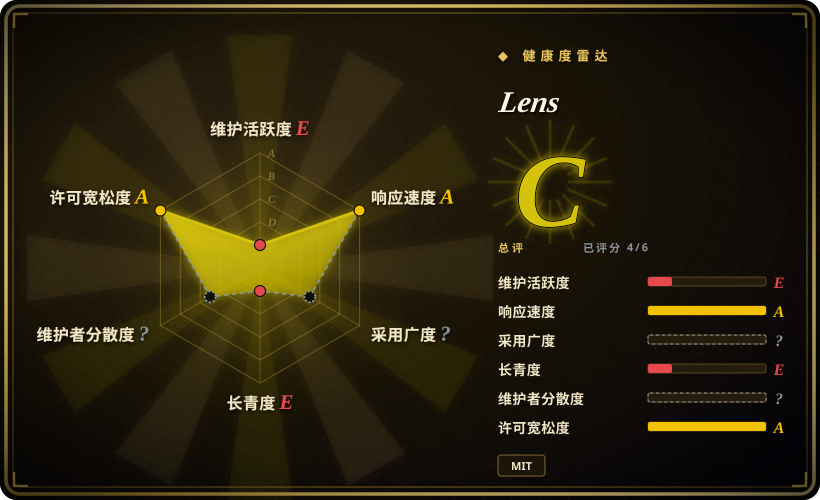
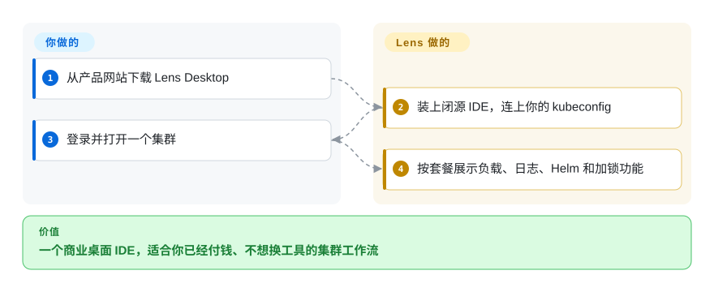

# Lens

你已经在用带扩展和团队集群目录的付费桌面 IDE 跑 Kubernetes，换工具会丢掉这套工作流。Lens 是 Mirantis 的商业产品——GitHub 仓库不再是你下载的那个应用。

## 何时使用

你（或你的组织）已经把 Lens Desktop 标准化了：扩展、Teamwork 集群发现、商业支持，或这季度拆不掉的席位。你继续用它，是因为切换成本才是重点，不是因为它是开源默认。对**新**选型，本页通常是反面：`lensapp/lens` 的 README 写明开源 Desktop 已退休、不再维护，贡献走扩展 API，产品在 k8slens.dev。你选它而不是 [Freelens](freelens.zh.md)，只有那些商业件（Ask AI、付费 GitOps、组织级 SSO、支持）已经买了。你选它而不是 [Radar](radar.zh.md)／[Headlamp](headlamp.zh.md)，只有团队不肯离开这套 Electron IDE。决定性的取舍是**已有的 Lens 投资，对上离开闭源产品**。

## 快问快答

**GitHub 仓库还是你下载的那个产品吗？** 不是。当前默认分支 README 写明开源 Lens Desktop 已退休、不再维护；Mirantis 仍在开发闭源产品。默认分支上 GitHub languages 为空；最后一次推送是 2025-02-11。若你要开源的那套桌面，续作是 [Freelens](freelens.zh.md)。

**公司能用 Personal（免费）套餐吗？** 定价页（2026-09）写明年收入或融资超过 1000 万美元的组织需要付费订阅，30 天评估除外。GitOps、Ask AI 和内置 MCP 列在 Plus 下，不在 Personal。

## 怎么用起来

你从网站下载 Lens Desktop，登录，它像旧 OSS 应用一样读本地 kubeconfig。正在跑的产品是专有的。你要做的是安装、鉴权、在 IDE 里干活。Lens 做的是用你的 kubeconfig 连集群，并按套餐解锁额外能力。GitHub 仓库上的 MIT 适用于仓库里剩下的内容，不适用于你从 k8slens.dev 拿到的二进制。

<!-- flow-steps:begin (generated from flows/lens.json by tools/flow_card.py — do not edit) -->

流程文字版

1. **你**：从产品网站下载 Lens Desktop
2. **Lens**：装上闭源 IDE，连上你的 kubeconfig
3. **你**：登录并打开一个集群
4. **Lens**：按套餐展示负载、日志、Helm 和加锁功能

**价值**：一个商业桌面 IDE，适合你已经付钱、不想换工具的集群工作流

<!-- flow-steps:end -->

## 何时不用

- **你需要不要账号的开源桌面 IDE。** 用 [Freelens](freelens.zh.md)，Open Lens 的 MIT 分支。Lens OSS 已退休。
- **你需要 Apache-2.0、不用登录，免费二进制里就有 MCP 和 GitOps。** 用 [Radar](radar.zh.md)。
- **你需要厂商中立的集群内网页界面。** 用 [Headlamp](headlamp.zh.md)。
- **你住在 SSH 和 TUI 里。** 用 [k9s](k9s.zh.md)。
- **公司超过 Personal 套餐的收入门槛，又不付钱。** 不要“先下个 Personal”；定价页禁止。Freelens、Radar 或 Headlamp 才是诚实的开源出口。
- **你指望给 `lensapp/lens` 提 PR 改核心。** README 写明核心贡献已关闭；只剩扩展。

## 横向对比

| 替代品 | 是否收录 | 我们的评价 | 取舍 |
|---|---|---|---|
| [Freelens](freelens.zh.md) | 已收录 | 要那扇 Lens 窗、但不要 Mirantis 时选 Freelens；只有支持或上锁功能已经是约束时才选 Lens。 | Freelens 是 MIT、不要账号；Lens 是带套餐门槛的商业线。 |
| [Radar](radar.zh.md) | 已收录 | 本机 OSS 诊断界面加 MCP 选 Radar；团队不肯离开 Lens IDE 时才选 Lens。 | Radar 是 2026 年的 Go 二进制；Lens 是成熟闭源桌面，开源树已停。 |
| [Headlamp](headlamp.zh.md) | 已收录 | 集群内 SIG 界面选 Headlamp；商业笔记本 IDE 选 Lens。 | Headlamp 是 kubernetes-sigs 下的 Apache-2.0；Lens 除非买 Teamwork，否则不是共享集群控制台。 |
| [k9s](k9s.zh.md) | 已收录 | 终端速度、不要账号选 k9s；桌面 IDE 是硬性要求且已经有许可时选 Lens。 | k9s 是 Apache-2.0，活跃七年；Lens 的 GitHub 仓库相对闭源产品已经发呆。 |

## 技术栈

- **当前产品：** 专有桌面（Mirantis）。不在 GitHub 默认树里。
- **历史 OSS（已退休）：** Electron／TypeScript，也就是 [Freelens](freelens.zh.md) 现在还是的东西。
- 扩展 API 仍是文档里添加行为的方式。

## 依赖

- 受支持的桌面操作系统；一份 kubeconfig。
- 产品要 Lens 账号（k8slens.dev 上的 Login）。
- GitOps、Ask AI／MCP、云厂商集成，以及超过收入门槛的组织级使用，需要付费套餐。
- IDE 本身不用装进集群。

## 运维难度

作为桌面应用**低**，作为许可问题**高**。你不运维服务器；你运维席位、SSO，以及 Personal 对付费的边界。GitHub 仓库不是产品更新的可靠来源（最后推送 2025-02）。

## 健康度与可持续性

- **本仓库的维护（2026-09）：** 作为应用代码已经发呆——最后推送 2025-02-11，GitHub 上最新 release 标 2024-01，languages 为空。**产品** 2026 年仍在 k8slens.dev 上卖；那不等于这个仓库还活着。
- **治理：** Mirantis, Inc。厂商所有，核心闭源。
- **年龄与 Lindy：** 2018-11 创建。年龄救不了已退休的开源树。商业产品可能还在；这个仓库不是那笔赌注。
- **采用：** 约 2.32 万 star，多半是历史。别把 star 读成“OSS 健康”。
- **风险旗标：** 用退休完成的改许可（OSS Desktop 停更）。开源核心／套餐上锁。免费档的收入资格。这是 issue 和文档仓库，不是贡献树。

## 存疑（未验证）

- [未验证] 2026-09-27 GitHub API：23236 star、1478 fork、1169 个未关 issue，`pushed_at` 2025-02-11，`language` 为 null。
- [未验证] 定价细节（Plus 年付每月 25 美元、1000 万美元收入规则、GitOps／MCP 在 Plus）取自 2026-09-27 的 k8slens.dev/pricing；套餐会变。
- [推断] 前言里 `language: TypeScript` 描述的是已退休 OSS 栈／Freelens 谱系，不是闭源二进制。
- [未验证] Teamwork 是否仍要单独的组织 SKU，定价表以外没有展开。
