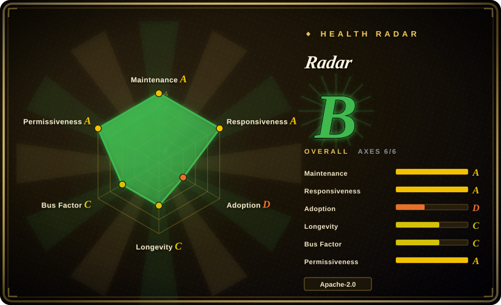
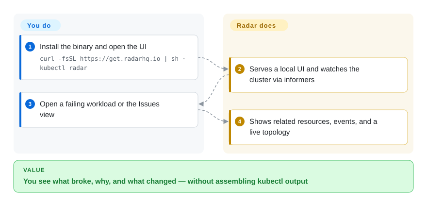

# Radar

A Deployment is failing and you cannot tell whether the Service, the image, or last night's Helm upgrade did it, and your coding agent is drowning in raw YAML. Radar is a local Go binary that draws the topology, the event timeline, and a token-light MCP view of the same cluster.

## When to use

You are debugging a live cluster from a laptop: CrashLoopBackOff on one pod, a Helm revision that might have caused it, an Argo Application that looks OutOfSync, and an AI session that will waste a context window if you paste `kubectl get -o yaml`. You run `kubectl radar`, a browser opens on localhost, and Radar watches via informers and pushes updates over SSE. You pick it over [k9s](k9s.md) when you need relationships and GitOps/Helm in the same window, not just a faster table. You pick it over [Headlamp](headlamp.md) when you want that diagnosis path **built in** rather than assembled from plugins, and you do not need kubernetes-sigs stewardship. You pick it over [Freelens](freelens.md) / [Lens](lens.md) when you refuse an Electron IDE and an account. The deciding tradeoff is **integrated operations versus age and governance**: Radar is Apache-2.0 and account-free, and it is eight months old.

## Q&A

**Do I need a Radar account, or is Cloud required?** No. The README states the OSS binary talks to the Kubernetes API with your kubeconfig, keeps cluster data on the machine, and does not require an account, agent, or cloud backend. Radar Cloud is a separate hosted product for multi-cluster SSO; skip it unless that is the job.

**Is the GitHub OSS build feature-gated against Cloud?** The README calls OSS fully featured and the recommended way to run Radar. Treat vendor "no-relicense pledge" and MCP-versus-kubectl speed claims as marketing until you reproduce them; they are not selection facts.

## How it works

Radar is a single Go process that is also a kubectl plugin. You install it, run `kubectl radar` (or `radar`), and it binds a local HTTP server (default `127.0.0.1:9280`), opens a browser, and starts informers against the current context. The UI is a TypeScript frontend served by that process; an MCP server is on by default so an external agent can call Radar's tools instead of raw kubectl. What you do is pick a kubeconfig/context and look at Issues, Topology, Helm, GitOps, Traffic, Checks. What Radar does is cache, correlate, and push live updates. Optional Helm-in-cluster deploy exists for a shared team URL with OIDC or an auth proxy.

<!-- flow-steps:begin (generated from flows/radar.json by tools/flow_card.py — do not edit) -->

Text version of the flow

1. **You**: Install the binary and open the UI — `curl -fsSL https://get.radarhq.io | sh · kubectl radar`
2. **Radar**: Serves a local UI and watches the cluster via informers
3. **You**: Open a failing workload or the Issues view
4. **Radar**: Shows related resources, events, and a live topology

**Value**: You see what broke, why, and what changed — without assembling kubectl output

<!-- flow-steps:end -->

## When NOT to use

- **You need kubernetes-sigs / CNCF-sandbox governance, or you must host arbitrary UI plugins.** Use [Headlamp](headlamp.md). Radar is a Skyhook (YC W23) product with a Cloud upsell; its extension model is not Headlamp's plugin SDK.
- **The only surface you have is a terminal over SSH.** Use [k9s](k9s.md). Radar's value is a browser (or desktop app) plus MCP, not a TUI.
- **You want the Lens desktop layout and its extension catalog.** Use [Freelens](freelens.md) if it must stay MIT and account-free; use [Lens](lens.md) only if you already pay.
- **You will not bet on an eight-month-old repo** (created 2026-01-20) even if it is busy. Prefer [k9s](k9s.md) or [Headlamp](headlamp.md) for Lindy; Radar's star count on a young repo is a hype signal to discount, not proof.
- **You cannot give the process list/watch on the kinds it graphs**, or you need a dashboard that is only metrics. Use Grafana (observability category) for PromQL boards; Radar reads the Kubernetes API first and Prometheus only when you point it at one.

## Comparison

| Alternative | In index | Our verdict | Tradeoff |
|---|---|---|---|
| [k9s](k9s.md) | ✅ | Choose Radar when you need graphs, Helm/GitOps, audit, or MCP; choose k9s when the loop must stay in a terminal. | k9s is older, smaller, and SSH-native; Radar spends a browser and a larger binary to keep related objects on one screen. |
| [Headlamp](headlamp.md) | ✅ | Choose Radar for out-of-the-box diagnosis; choose Headlamp when SIG stewardship or a custom plugin host is the constraint. | Headlamp is the safer long-term governance bet; Radar is deeper on GitOps/traffic/upgrade-impact in core. |
| [Freelens](freelens.md) | ✅ | Choose Radar if the job is "what broke and why"; choose Freelens if the job is "the Lens window, still open source". | Freelens preserves Electron muscle memory; Radar is a Go server you can also Helm into the cluster. |
| [Lens](lens.md) | ✅ | Choose Radar when you need Apache-2.0 without an account; choose Lens only with an existing commercial commitment. | Lens GitOps/MCP sit on paid plans and a revenue gate; Radar OSS includes MCP and GitOps in the binary. |

## Tech stack

- **Go 1.26** backend (`k8s.io/client-go` v0.37, Helm v3, chi HTTP, MCP Go SDK, optional SQLite/Postgres for timeline).
- **TypeScript** UI; **Wails v2** for the optional desktop app.
- OIDC (`coreos/go-oidc`); Prometheus client libraries; Cilium types for Hubble traffic when present.

## Dependencies

- A kubeconfig (or in-cluster config). No CRDs or agents required for the core UI.
- Local mode binds loopback by default; non-loopback listen needs authentication.
- Optional: Prometheus-compatible metrics, Hubble/Istio/Beyla/Caretta for live traffic, OpenCost/Kubecost for cost, Karpenter CRDs for capacity — features hide when the source is missing.
- In-cluster: Helm chart from `skyhook-io/helm-charts`, plus ingress/OIDC if you share it.

## Ops difficulty

**Low** on a laptop (one binary, no account). **Medium** in-cluster: you own Helm, exposure, OIDC/proxy, and RBAC for impersonation. Timeline SQLite can grow; flags cap it. MCP is on unless `--no-mcp`.

## Health & viability

- **Maintenance (2026-09):** Very active — `v1.14.1` on 2026-09-17, pushed 2026-09-27.
- **Governance / backing:** Organization `skyhook-io` / KoalaOps dba Skyhook, YC W23. Roadmap is vendor-owned; OSS is Apache-2.0 with a Cloud SKU. [推断]
- **Age & Lindy:** Created 2026-01-20 — **young**. Age × still-active does **not** yet support a long remaining-life prior; treat as unproven relative to k9s/Headlamp.
- **Adoption:** ~3.5k stars in eight months. Fast, not Lindy.
- **Risk flags:** Open-core shape (OSS + Cloud). No relicense observed in this pass. Do not take the vendor comparison site as independent review.

## Caveats (unverified)

- [未验证] GitHub API 2026-09-27: 3510 stars, 231 forks, 92 open issues, created 2026-01-20.
- [未验证] "Tested on tens of thousands of pods" and MCP-versus-kubectl speed are README/vendor-benchmark claims; not reproduced here.
- [推断] Bus factor is company-team rather than foundation; a vendor can still relicense or pivot Cloud.
- [未验证] Desktop app (Wails) feature parity with `kubectl radar` was not checked.
