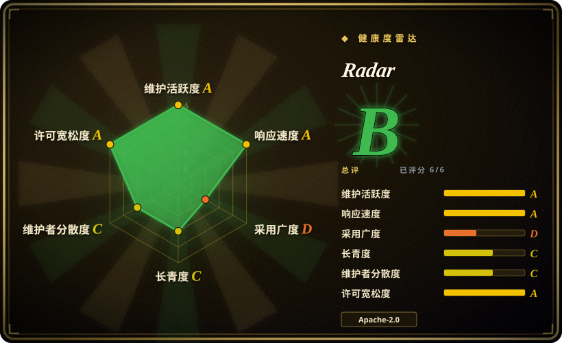
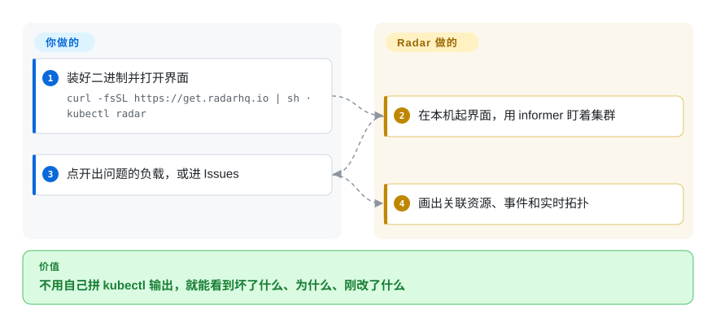

# Radar

一个 Deployment 在失败，你分不清是 Service、镜像，还是昨晚的 Helm 升级搞的，而你的编码 agent 被原始 YAML 灌满上下文。Radar 是本机 Go 二进制，画出拓扑、事件时间线，以及同一集群上给 AI 用的省 token 的 MCP 视图。

## 何时使用

你在笔记本上排活集群的障：一个 Pod CrashLoopBackOff，一次可能是元凶的 Helm 修订，一个看起来 OutOfSync 的 Argo Application，再加一场 AI 会话——如果把 `kubectl get -o yaml` 贴进去会烧掉窗口。你跑 `kubectl radar`，浏览器在本机打开，Radar 用 informer 盯着，经 SSE 推更新。你选它而不是 [k9s](k9s.zh.md)，是因为你要关系和同一窗口里的 GitOps／Helm，而不只是更快的表。你选它而不是 [Headlamp](headlamp.zh.md)，是因为这条诊断路径要**内置**，不要靠插件拼，而且你不需要 kubernetes-sigs 托管。你选它而不是 [Freelens](freelens.zh.md)／[Lens](lens.zh.md)，是因为你拒绝 Electron IDE 和账号。决定性的取舍是**一体运维对上年龄与治理**：Radar 是 Apache-2.0、不要账号，而且才八个月。

## 快问快答

**要不要 Radar 账号，或者必须上 Cloud？** 不要。README 写明 OSS 二进制用你的 kubeconfig 打 Kubernetes API，集群数据留在本机，不要求账号、agent 或云后端。Radar Cloud 是另一款托管产品，给多集群 SSO 用；不是那份工作就跳过。

**GitHub 上的 OSS 会不会相对 Cloud 砍功能？** README 称 OSS 功能完整，并且是推荐跑法。厂商的“不改许可承诺”和 MCP 对比 kubectl 的速度，在你复现之前都当营销，不当选型事实。

## 怎么用起来

Radar 是一个 Go 进程，同时也是 kubectl 插件。你装上，跑 `kubectl radar`（或 `radar`），它在本机绑 HTTP（默认 `127.0.0.1:9280`），打开浏览器，对着当前 context 起 informer。界面是这个进程端出来的 TypeScript 前端；MCP 服务默认开着，外部 agent 可以调 Radar 的工具，而不必啃原始 kubectl。你要做的是选 kubeconfig／context，去看 Issues、拓扑、Helm、GitOps、流量、检查。Radar 做的是缓存、关联、推实时更新。可选的集群内 Helm 部署，给团队一个带 OIDC 或鉴权代理的共享 URL。

<!-- flow-steps:begin (generated from flows/radar.json by tools/flow_card.py — do not edit) -->

流程文字版

1. **你**：装好二进制并打开界面 — `curl -fsSL https://get.radarhq.io | sh · kubectl radar`
2. **Radar**：在本机起界面，用 informer 盯着集群
3. **你**：点开出问题的负载，或进 Issues
4. **Radar**：画出关联资源、事件和实时拓扑

**价值**：不用自己拼 kubectl 输出，就能看到坏了什么、为什么、刚改了什么

<!-- flow-steps:end -->

## 何时不用

- **你需要 kubernetes-sigs／CNCF Sandbox 治理，或必须托管任意 UI 插件。** 用 [Headlamp](headlamp.zh.md)。Radar 是 Skyhook（YC W23）的产品，带 Cloud 升级路径；扩展模型不是 Headlamp 那套插件 SDK。
- **你手上只有 SSH 过去的终端。** 用 [k9s](k9s.zh.md)。Radar 的价值是浏览器（或桌面应用）加 MCP，不是 TUI。
- **你要 Lens 桌面布局和它的扩展目录。** 必须 MIT、不要账号时用 [Freelens](freelens.zh.md)；只有已经付钱时才用 [Lens](lens.zh.md)。
- **你不愿押一个才八个月的仓库**（创建于 2026-01-20），哪怕它很忙。要 Lindy 请选 [k9s](k9s.zh.md) 或 [Headlamp](headlamp.zh.md)；年轻仓库上的 star 是该打折的热度信号，不是证明。
- **你没法给这个进程它要画的那些 kind 的 list／watch**，或者你只要指标看板。PromQL 看板用 Grafana（可观测分类）；Radar 先读 Kubernetes API，只有你指向 Prometheus 时才读指标。

## 横向对比

| 替代品 | 是否收录 | 我们的评价 | 取舍 |
|---|---|---|---|
| [k9s](k9s.zh.md) | 已收录 | 需要图、Helm／GitOps、审计或 MCP 时选 Radar；循环必须留在终端时选 k9s。 | k9s 更老、更小、天生过 SSH；Radar 用浏览器和更大的二进制，换同一屏上的关联对象。 |
| [Headlamp](headlamp.zh.md) | 已收录 | 开箱即用的诊断选 Radar；SIG 托管或自定义插件宿主才是硬约束时选 Headlamp。 | Headlamp 是更稳的长期治理赌注；Radar 在核心里把 GitOps／流量／升级影响做深。 |
| [Freelens](freelens.zh.md) | 已收录 | 工作是“坏了什么、为什么”时选 Radar；工作是“还要 Lens 那扇窗、而且得开源”时选 Freelens。 | Freelens 保住 Electron 肌肉记忆；Radar 是也可以 Helm 进集群的 Go 服务。 |
| [Lens](lens.zh.md) | 已收录 | 要 Apache-2.0、不要账号时选 Radar；只有已有商业承诺时才选 Lens。 | Lens 的 GitOps／MCP 在付费套餐和收入门槛后面；Radar OSS 把 MCP 和 GitOps 放进二进制。 |

## 技术栈

- **Go 1.26** 后端（`k8s.io/client-go` v0.37、Helm v3、chi HTTP、MCP Go SDK、时间线可选 SQLite／Postgres）。
- **TypeScript** 界面；可选桌面应用用 **Wails v2**。
- OIDC（`coreos/go-oidc`）；Prometheus 客户端库；有 Hubble 时用 Cilium 类型看流量。

## 依赖

- 一份 kubeconfig（或集群内配置）。核心界面不要求 CRD 或 agent。
- 本机模式默认绑回环；非回环监听需要鉴权。
- 可选：兼容 Prometheus 的指标、Hubble／Istio／Beyla／Caretta 做实时流量、OpenCost／Kubecost 做成本、Karpenter CRD 做容量——源没有时功能会藏起来。
- 集群内：`skyhook-io/helm-charts` 的 Helm chart，共享时还要入口和 OIDC。

## 运维难度

笔记本上**低**（一个二进制，不要账号）。集群内**中**：你要管 Helm、暴露面、OIDC／代理，以及模拟身份用的 RBAC。时间线 SQLite 会涨，有开关封顶。除非 `--no-mcp`，MCP 默认开。

## 健康度与可持续性

- **维护（2026-09）：** 非常活跃——`v1.14.1` 在 2026-09-17，推送 2026-09-27。
- **治理／托底：** 组织 `skyhook-io`／KoalaOps（对外 Skyhook），YC W23。路线图是厂商的；OSS 是 Apache-2.0，另有 Cloud SKU。[推断]
- **年龄与 Lindy：** 创建于 2026-01-20——**年轻**。年龄×仍活跃还撑不起长剩余寿命先验；相对 k9s／Headlamp 当作未证明。
- **采用：** 八个月约 3500 star。涨得快，不是 Lindy。
- **风险旗标：** 开源核心加 Cloud 的形态。本轮没看到改许可。不要把厂商对比站当独立评审。

## 存疑（未验证）

- [未验证] 2026-09-27 GitHub API：3510 star、231 fork、92 个未关 issue，创建于 2026-01-20。
- [未验证] “在数万 Pod 上测过”和 MCP 对比 kubectl 的速度是 README／厂商基准，本轮未复现。
- [推断] 公交车因子是公司团队而不是基金会；厂商仍可能改许可或把 Cloud 当重心。
- [未验证] 桌面应用（Wails）与 `kubectl radar` 的功能是否对齐，本轮未查。
