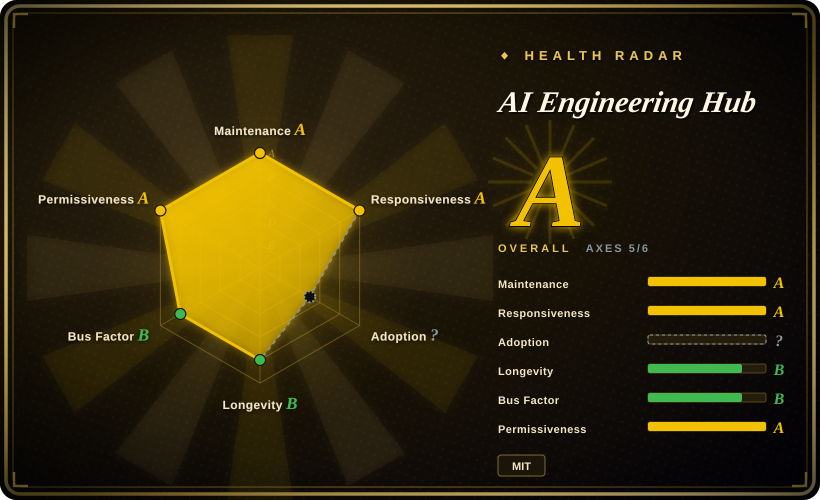
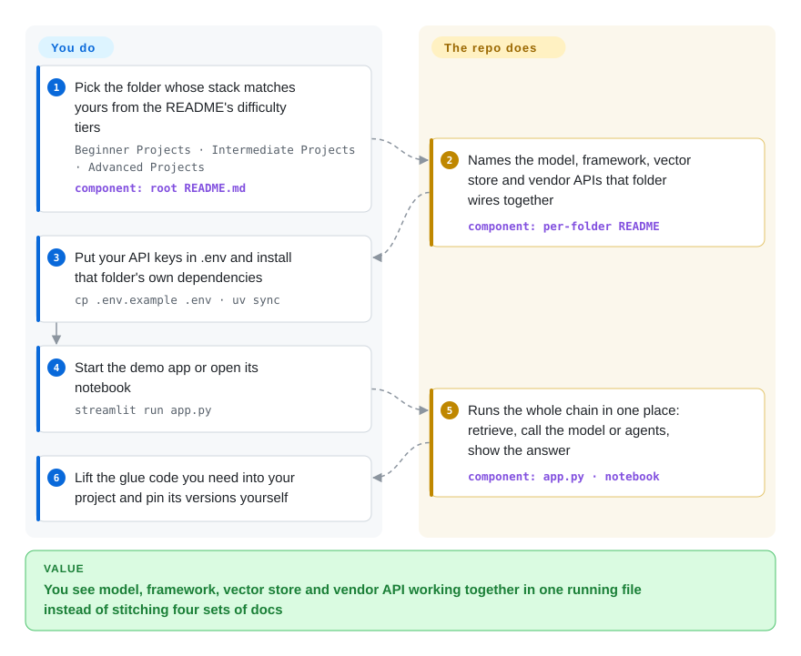

# AI Engineering Hub

You have to show a "chat with our documents" bot or a tool-using agent by Friday, and every framework's docs show only its own piece — nobody shows the model, the framework, the vector store and the web-search API working in one file. This repo is about 115 independent demo folders, each a small Streamlit app or notebook that already wires one such combination together, for you to run and copy from; it is demo code published by a newsletter team, not a library.

## When to use

You are a Python developer who has been asked to prototype an LLM feature — answer questions over a folder of PDFs with a local Llama, a CrewAI crew that falls back to web search, a voice agent, an MCP server that Cursor can call. You know what you want to build; what you are missing is a working example of the *combination*. The LlamaIndex docs show `VectorStoreIndex`, the Qdrant docs show a client, the Ollama docs show `ollama pull llama3.2`, and none of them show the three in one script with a UI on top. Searching for "agentic RAG with DeepSeek and Streamlit" gets you a blog post with half the imports missing.

You open this repo's README, find the folder whose stack is closest to yours (there are dozens of RAG variants, roughly ten MCP demos, voice and OCR apps, a few fine-tuning notebooks), run it with your own keys, and lift the glue. The deciding tradeoff against the alternatives: each folder is a *whole small app* built on named commercial and open tools, under MIT, so you may copy it into commercial work. A technique-per-notebook collection like RAG_Techniques goes deeper per idea but carries a non-commercial custom license. A framework's official examples are better maintained but never cross into another vendor's stack.

## How it works

The repository is a monorepo with no shared code: every top-level folder is self-contained, with its own README, its own dependency file, and usually an `app.py` (58 folders) or a notebook (40 folders). The root README is the table of contents, grouped into Beginner, Intermediate and Advanced tiers. Each folder README follows the same pattern — which tools it uses, which API keys to get, the install command (`uv sync` with a lock file in about 45 folders, a plain `pip install` or an unpinned `requirements.txt` in many others), and the run command (`streamlit run app.py` in 40 of them). What the repo does for you is choose the combination and write the glue: chunk the documents, push them into a vector store (a database that finds passages by meaning rather than by exact words), call the model or the agent crew, and display the result. What you do is everything an app needs to keep running: supply the keys and the local services (Ollama, Qdrant, Neo4j in Docker), pin versions, add tests, and rewrite the parts that only work on the author's machine. Think of it as a shelf of plated sample dishes, each with the brand of every ingredient on the card — useful for seeing what goes together, not a kitchen you can run a restaurant from.

<!-- flow-steps:begin (generated from flows/ai-engineering-hub.json by tools/flow_card.py — do not edit) -->

Text version of the flow

1. **You**: Pick the folder whose stack matches yours from the README's difficulty tiers — `Beginner Projects · Intermediate Projects · Advanced Projects` — component: `root README.md`
2. **AI Engineering Hub**: Names the model, framework, vector store and vendor APIs that folder wires together — component: `per-folder README`
3. **You**: Put your API keys in .env and install that folder's own dependencies — `cp .env.example .env · uv sync`
4. **You**: Start the demo app or open its notebook — `streamlit run app.py`
5. **AI Engineering Hub**: Runs the whole chain in one place: retrieve, call the model or agents, show the answer — component: `app.py · notebook`
6. **You**: Lift the glue code you need into your project and pin its versions yourself

**Value**: You see model, framework, vector store and vendor API working together in one running file instead of stitching four sets of docs

<!-- flow-steps:end -->

## When NOT to use

- **You need code you can ship.** There is no CI and no `.github/` directory, and only 2 test files exist among 1,488 files. Known breakage sits on `main`: `agentic_rag/src/agentic_rag/crew.py` calls `DocumentSearchTool(pdf='/Users/akshaypachaar/...')`, while the tool's constructor takes `file_path`, so the module fails on import (fix PR #245 open since 2026-06-18). `corrective-rag/workflow.py` tests `"no" in relevancy_results` against full model replies, so its web-search fallback almost never fires (PR #246). Build production code from the framework's own maintained docs instead — [LlamaIndex](../agent-frameworks/workflow-builders/llamaindex.md), [CrewAI](../agent-frameworks/agent-runtimes/agent-sdks/crewai.md). If you want a working RAG or agent app without writing one, use [Dify](../agent-frameworks/workflow-builders/dify.md).
- **You expect a demo to run as written today.** 93 of 115 folders have had no commit for over a year (41 for over 18 months). Many dependency files are unpinned (`github-rag`: 0 of 10 lines pinned; `multimodal-rag-assemblyai`: 0 of 16), so `pip` installs 2026 framework releases against 2024–25 code. `video-rag-gemini` still targets the deprecated `google-generativeai` SDK. Prefer folders that ship a `uv.lock` and have recent commits. For API usage patterns the vendor keeps current, use the vendor cookbooks (claude-cookbooks, openai-cookbook — not indexed).
- **You want a neutral answer about which tool or model to use.** Most demos are built around one commercial API: Firecrawl appears in 15 folder READMEs, AssemblyAI, Zep and Opik/Comet in 8 each, Bright Data in 7. The maintainers run the Daily Dose of Data Science newsletter, whose sign-up block sits in 96 of 106 folder READMEs, and the repo does not say whether a given demo is a vendor collaboration [未验证]. The "X vs Y" folders run one task once; they are not benchmarks. For tool choice, read this index's comparison pages. For model or RAG quality, measure your own data with [promptfoo](../llm-eval/promptfoo.md) or [Ragas](../llm-eval/ragas.md).
- **You want to understand a technique, not copy an app.** Folder READMEs are setup notes plus a YouTube link; the explanation lives in the newsletter or the video, not in the repo. For RAG techniques explained one at a time, RAG_Techniques (not indexed — mind its non-commercial license) is deeper. For how a coding-agent harness works, build one with [Learn Claude Code](../agent-dev-methodology/study-and-experiments/learn-claude-code.md) rather than reading `build-code-harness`.
- **You must stay fully local or offline.** Only 38 of 106 folder READMEs mention Ollama, while 72 ask for API keys. Even a "local" demo can need a cloud key: `build-code-harness` requires an OpenAI key for CrewAI's memory embedder even when the agents run through OpenRouter. Start from [Ollama](../llm-inference/local-runtimes/ollama.md) and a framework's local-model guide instead, or filter for the Ollama folders and check every import.
- **You copy code into a product without checking where it came from.** The root license is MIT, but some folders vendor other projects: `hugging-face-skills` extends huggingface/skills, which is Apache-2.0, and `kitops-mcp/ml-project/docs/` carries its own Apache-2.0 LICENSE. Take vendored code from its upstream repository, under its own license.

## Comparison

| Alternative | In index | Our verdict | Tradeoff |
|---|---|---|---|
| awesome-llm-apps (Shubhamsaboo) | not indexed | When you are hunting for a demo that matches your exact stack, check both collections and take whichever has the closer folder; pick this hub when its difficulty tiers or its MCP and model-comparison demos fit, and awesome-llm-apps when you want the larger, more actively pushed catalog. | Both are copy-and-adapt demo collections from individuals, without tests. awesome-llm-apps is Apache-2.0, about 3.7× the stars and was pushed 2026-09-30; this hub is MIT and smaller. Not added in this tab batch. |
| RAG_Techniques (NirDiamant) | not indexed | When you want to learn RAG one technique at a time — chunking, reranking, query rewriting — with a notebook and an explanation each, pick RAG_Techniques; pick this hub when you need a complete small app across vendors that you are allowed to reuse commercially. | Deeper per-technique teaching and its own evaluation folder, but a custom non-commercial license; this hub is shallow per folder but MIT. Not added in this tab batch. |
| claude-cookbooks · openai-cookbook | not indexed | When the question is how to call one vendor's API correctly — tool use, caching, structured output — pick that vendor's cookbook; pick this hub when you need several vendors' tools wired together into one app. | Vendor-maintained and kept current with the API, but single-vendor by design; this hub crosses vendors but its folders go stale. Not added in this tab batch. |
| [LlamaIndex](../agent-frameworks/workflow-builders/llamaindex.md) · [CrewAI](../agent-frameworks/agent-runtimes/agent-sdks/crewai.md) docs and examples | ✅ | When you are writing code you will maintain, start from the framework's own documentation and examples; use this hub only to see how that framework was combined with a vector store, a UI and a vendor API. | Framework docs follow the current release and break less, but they stop at their own API boundary; the hub shows the cross-tool glue, frozen at whatever version it was written against. |
| [Learn Claude Code](../agent-dev-methodology/study-and-experiments/learn-claude-code.md) | ✅ | When the goal is to understand how an agent harness works mechanism by mechanism, pick Learn Claude Code; pick this hub when you want many different finished demos to borrow from rather than one guided build. | A structured 17-lesson course on one subject versus a wide, shallow shelf of unrelated apps. |

## Tech stack

- Python (most folder READMEs ask for 3.11 or 3.12), as Jupyter notebooks (40 folders) and Streamlit or Chainlit apps (`app.py` in 58 folders); a handful of TypeScript/Node folders (7 `package.json`, e.g. a React front end for the portfolio agent and the Motia workflows).
- Agent and RAG frameworks: CrewAI (named in 26 folder READMEs), LlamaIndex (19), with AutoGen, LangChain, OpenAI Swarm and others in one or two folders each.
- Models through Ollama, OpenAI, OpenRouter, Anthropic, Groq, SambaNova, Gemini; vector stores Qdrant and Milvus; MCP servers for Cursor and Claude.
- Packaging is per folder: 49 `pyproject.toml` with 45 `uv.lock`, 20 `requirements.txt` (pinning varies from none to full), 5 Dockerfiles.

## Dependencies

- Nothing repo-wide: each folder is installed separately, in its own virtual environment.
- API keys for the vendors that folder uses — 72 of 106 folder READMEs ask for at least one (OpenAI, Firecrawl, AssemblyAI, Bright Data, Zep, Comet/Opik, GroundX and others). Most offer free tiers, but the demos spend real credits.
- Local services where the demo needs them: Ollama for local models, Docker for Neo4j, Qdrant or Milvus.
- A GPU, or a hosted notebook, for the fine-tuning notebooks (Unsloth, GRPO).

## Ops difficulty

**Low to start, medium to keep working.** Running one demo is a clone, a key or two, `uv sync` and `streamlit run app.py` — under an hour when its dependencies still resolve. The cost comes after: there are no releases to pin to, and an unpinned folder pulls this week's CrewAI or LlamaIndex against code written a year earlier. Upstream fixes wait in a queue of 102 open pull requests, so you own every repair. Treat each folder as a snapshot you fork into your own repository, not something you track.

## Health & viability

- **Maintenance — active at the edges, frozen in the middle (verified 2026-10-05).** Last push 2026-09-10. New demos still land about once or twice a month in 2026, against roughly ten folders touched per month in the first half of 2025. Existing folders are rarely revisited: 93 of 115 have had no commit in 12 months, and community fixes pile up (102 open PRs, against 70 merged ever). The radar's responsiveness grade of A is measured from the first response on recent pull requests, and here that is the CodeRabbit review bot (checked on #245, #246, #261, #262), not a maintainer — read it as "PRs get an automated review", not "fixes get merged".
- **Governance / bus factor — a small content team.** The repo is owned by a personal account (Akshay Pachaar). Of 16 contributors, four account for nearly all commits (265, 109, 63 and 60), all from the Daily Dose of Data Science team. There is no CONTRIBUTING.md, although the README links one. The roadmap follows the newsletter's content calendar, not users' bug reports [推断].
- **Backing, age and Lindy — young, hyped, funded by attention.** Created 2024-10-21 (about two years old), 38.2k stars and 6.3k forks. The homepage is the newsletter sign-up page, so the repo works as a marketing funnel for that newsletter. On a Lindy reading, two years is too young for the age to say much. The practical risk is small, though, because you copy from it rather than depend on it — if it stopped tomorrow, your copied folder would not change.
- **Adoption.** High reach (stars, forks, a Trendshift badge), but nothing installs it as a package, so no downstream dependents can be counted; adoption means readers and forks.
- **Risk flags.** MIT at the root, with Apache-2.0 vendored folders inside. The README is out of date: it still advertises "93+ Production-Ready Projects" and lists 88 of the 115 folders. Demo code contains the maintainer's absolute filesystem paths. None of these block reading it; together they block treating it as a dependency.

## Caveats (unverified)

- [未验证] Whether individual demos are paid or partnered vendor content: the repo carries newsletter sign-up blocks and vendor-specific setup, but no sponsorship disclosure either way; checking would need the newsletter's own sponsor records.
- [推断] "93 of 115 folders untouched for 12+ months" counts the last commit touching each top-level folder (GitHub commits API, 2026-10-05). A folder can still run without commits, and one with a recent commit can still be broken.
- [推断] The roadmap claim (content calendar over bug reports) is inferred from commit history — new demos merged while fix PRs #245 and #246 have sat open since 2026-06-18 — not from any stated policy.
- [推断] The "almost never fires" reading of `corrective-rag` comes from reading the code and PR #246; the demo was not run here.
- [未验证] GPU requirement for the fine-tuning notebooks: inferred from their use of Unsloth and GRPO training, not executed here.
- [未验证] Star, fork, PR and contributor counts are point-in-time GitHub figures (2026-10-05) and move quickly.
- [推断] Classified as `type: app` because the content is runnable demo applications with real dependencies; it is not a single deployable app, and you read and copy it rather than operate it.
