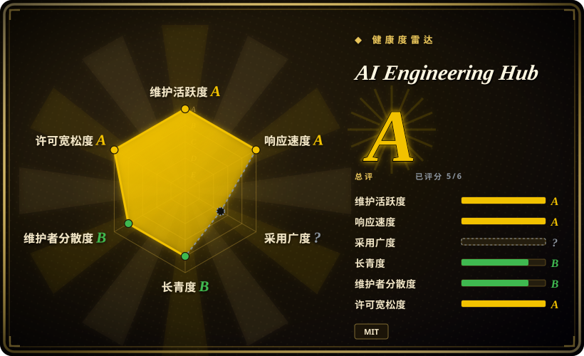
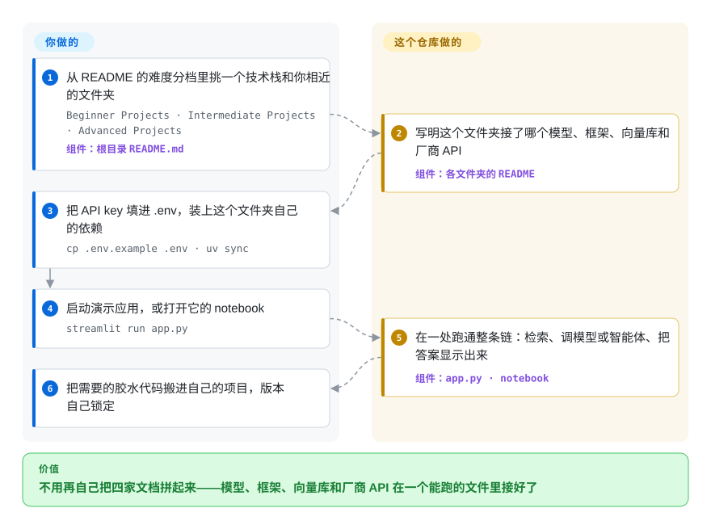

# AI Engineering Hub

周五前要演示一个“和公司文档对话”的机器人或一个会调工具的智能体，可每家框架的文档只讲自己那一块，没人给你看模型、框架、向量库和联网搜索 API 在同一个文件里跑起来是什么样。这个仓库是大约 115 个互不依赖的演示文件夹，每个都是一个小 Streamlit 应用或 notebook，已经把某一种组合接好，供你跑起来照着抄；它是一个 newsletter 团队发布的演示代码，不是库。

## 何时使用

你是写 Python 的开发者，被要求先做一个 LLM 功能的原型：用本地 Llama 回答一堆 PDF 里的问题，搭一个查不到就去网上搜的 CrewAI 智能体团队，做一个语音助手，或者写一个能让 Cursor 调用的 MCP 服务。要做什么你很清楚，缺的是这几样东西*组合在一起*的可运行样例。LlamaIndex 文档讲 `VectorStoreIndex`，Qdrant 文档讲客户端，Ollama 文档讲 `ollama pull llama3.2`，没有一份把三者放进同一个脚本、上面再套个界面。搜“agentic RAG + DeepSeek + Streamlit”，搜到的博客一半 import 是缺的。

这时你打开这个仓库的 README，找到技术栈和你最接近的文件夹（RAG 变体几十个，MCP 演示十来个，还有语音、OCR 应用和几个微调 notebook），填上自己的 key 跑起来，把胶水代码搬走。和替代品比，决定性的取舍在于：这里每个文件夹都是一个*完整的小应用*，用的工具都点了名（商业的、开源的都有），而且整个仓库是 MIT 许可，可以抄进商业项目。RAG_Techniques 这种一个 notebook 讲一种技巧的合集，单个技巧讲得更深，但用的是禁止商用的自定义许可。框架官方示例维护得更好，可从不跨到别家的技术栈。

## 怎么用起来

仓库是一个没有共享代码的大杂烩：每个顶层文件夹自成一体，有自己的 README、自己的依赖文件，通常还有一个 `app.py`（58 个文件夹）或一个 notebook（40 个文件夹）。根目录 README 就是目录，按入门、中级、高级三档分组。每个文件夹的 README 写法相同：用了哪些工具、要去申请哪些 API key、安装命令（约 45 个文件夹带锁文件、用 `uv sync`，另有不少是裸 `pip install` 或没锁版本的 `requirements.txt`）、启动命令（40 个是 `streamlit run app.py`）。仓库替你做的，是选定组合并写好胶水：把文档切块，存进向量库（一种按意思而不是按字面找段落的数据库），调用模型或智能体团队，再把结果显示出来。你要做的，是让一个应用长期跑下去所需的一切：提供 key 和本地服务（Ollama，以及用 Docker 起的 Neo4j、Qdrant），锁定版本，补测试，改掉那些只在作者电脑上能跑的地方。可以把它想成一排摆好盘的样品菜，每道菜的卡片上写着每样食材的牌子——适合看什么和什么能搭，不是能直接开饭馆的厨房。

<!-- flow-steps:begin (generated from flows/ai-engineering-hub.json by tools/flow_card.py — do not edit) -->

流程文字版

1. **你**：从 README 的难度分档里挑一个技术栈和你相近的文件夹 — `Beginner Projects · Intermediate Projects · Advanced Projects` — 组件：`根目录 README.md`
2. **AI Engineering Hub**：写明这个文件夹接了哪个模型、框架、向量库和厂商 API — 组件：`各文件夹的 README`
3. **你**：把 API key 填进 .env，装上这个文件夹自己的依赖 — `cp .env.example .env · uv sync`
4. **你**：启动演示应用，或打开它的 notebook — `streamlit run app.py`
5. **AI Engineering Hub**：在一处跑通整条链：检索、调模型或智能体、把答案显示出来 — 组件：`app.py · notebook`
6. **你**：把需要的胶水代码搬进自己的项目，版本自己锁定

**价值**：不用再自己把四家文档拼起来——模型、框架、向量库和厂商 API 在一个能跑的文件里接好了

<!-- flow-steps:end -->

## 何时不用

- **你要的是能直接上线的代码。** 仓库没有 CI，也没有 `.github/` 目录，1488 个文件里只有 2 个测试文件。`main` 上就有已知的坏代码：`agentic_rag/src/agentic_rag/crew.py` 里写的是 `DocumentSearchTool(pdf='/Users/akshaypachaar/...')`，而这个工具的构造函数参数叫 `file_path`，模块一导入就报错（修复 PR #245 自 2026-06-18 起一直没合）。`corrective-rag/workflow.py` 拿 `"no" in relevancy_results` 去匹配模型的完整回复，所以联网兜底几乎永远不会触发（PR #246）。要写上线代码，从框架自己维护的文档起步——[LlamaIndex](../agent-frameworks/workflow-builders/llamaindex.zh.md)、[CrewAI](../agent-frameworks/agent-runtimes/agent-sdks/crewai.zh.md)；如果只想要一个能用的 RAG 或智能体应用、不想自己写，用 [Dify](../agent-frameworks/workflow-builders/dify.zh.md)。
- **你指望演示照原样今天就能跑。** 115 个文件夹里有 93 个一年以上没有提交（41 个超过 18 个月）。很多依赖文件没锁版本（`github-rag` 10 行里锁了 0 行，`multimodal-rag-assemblyai` 16 行里锁了 0 行），`pip` 会把 2026 年的框架版本装到 2024—2025 年写的代码下面。`video-rag-gemini` 还在用已废弃的 `google-generativeai` SDK。优先挑带 `uv.lock`、最近有提交的文件夹；要看厂商持续维护的 API 用法，去看厂商自己的 cookbook（claude-cookbooks、openai-cookbook，未收录）。
- **你想要一个中立的选型结论。** 多数演示围绕某一家商业 API 搭建：Firecrawl 出现在 15 个文件夹的 README 里，AssemblyAI、Zep、Opik／Comet 各 8 个，Bright Data 7 个。维护者运营 Daily Dose of Data Science newsletter，106 个文件夹 README 中有 96 个带它的订阅广告，而仓库没有说明哪个演示是和厂商合作的内容 [未验证]。那些“X vs Y”文件夹只是把一个任务跑一遍，不是基准测试。工具选型请看本索引的对比页；模型或 RAG 质量请用 [promptfoo](../llm-eval/promptfoo.zh.md) 或 [Ragas](../llm-eval/ragas.zh.md) 在自己的数据上测。
- **你想弄懂一种技术，而不是抄一个应用。** 文件夹 README 只有安装说明加一个 YouTube 链接，讲解在 newsletter 或视频里，不在仓库里。想一种一种地学 RAG 技巧，RAG_Techniques（未收录，注意它禁止商用的许可）更深。想搞清楚编码智能体的运行框架（harness）怎么工作，跟着 [Learn Claude Code](../agent-dev-methodology/study-and-experiments/learn-claude-code.zh.md) 自己搭一遍，比读 `build-code-harness` 更合适。
- **你必须完全本地或离线运行。** 106 个文件夹 README 里只有 38 个提到 Ollama，却有 72 个要 API key。就算是“本地”演示也可能需要云端 key：`build-code-harness` 即使让智能体走 OpenRouter，也必须提供 OpenAI key 给 CrewAI 的记忆嵌入模型用。要纯本地，就从 [Ollama](../llm-inference/local-runtimes/ollama.zh.md) 加框架的本地模型指南起步，或者只挑用 Ollama 的文件夹并逐个检查 import。
- **你要把代码抄进产品却不核对来源。** 根目录是 MIT 许可，但有些文件夹是搬来的别人的项目：`hugging-face-skills` 是对 huggingface/skills（Apache-2.0）的扩展，`kitops-mcp/ml-project/docs/` 带着自己的 Apache-2.0 LICENSE。这类代码请回到上游仓库，按它自己的许可取用。

## 横向对比

| 替代品 | 是否收录 | 我们的评价 | 取舍 |
|---|---|---|---|
| awesome-llm-apps（Shubhamsaboo） | 未收录 | 想找和自己技术栈完全一致的演示时，两边都翻一遍，哪边的文件夹更贴近就用哪边；本仓库的难度分档、MCP 和模型对比演示合用时选它，想要更大、推送更勤的目录时选 awesome-llm-apps。 | 两者都是个人维护、没有测试、拿来改的演示合集；awesome-llm-apps 用 Apache-2.0，星数约为本仓库的 3.7 倍，2026-09-30 还有推送；本仓库是 MIT，规模更小。本批次未收录。 |
| RAG_Techniques（NirDiamant） | 未收录 | 想一种一种地学 RAG 技巧（切块、重排序、查询改写），每种配一个 notebook 和讲解，选 RAG_Techniques；需要一个跨厂商、允许商用复用的完整小应用，选本仓库。 | 它对单个技巧讲得更深，还自带评估目录，但用的是禁止商用的自定义许可；本仓库每个文件夹都浅，但是 MIT。本批次未收录。 |
| claude-cookbooks · openai-cookbook | 未收录 | 问题是“某一家的 API 怎么调才对”（工具调用、缓存、结构化输出）时，选那家的 cookbook；需要把几家的工具接进同一个应用时，选本仓库。 | 厂商维护，跟着 API 一起更新，但天生只讲一家；本仓库跨厂商，可文件夹会过时。本批次未收录。 |
| [LlamaIndex](../agent-frameworks/workflow-builders/llamaindex.zh.md) · [CrewAI](../agent-frameworks/agent-runtimes/agent-sdks/crewai.zh.md) 的文档与示例 | ✅ | 要写自己长期维护的代码，从框架官方文档和示例起步；本仓库只用来看这个框架是怎么和向量库、界面、厂商 API 拼在一起的。 | 框架文档跟着当前版本走，坏得少，但止步于自己的 API 边界；本仓库给出跨工具的胶水，却停在写它时的那个版本。 |
| [Learn Claude Code](../agent-dev-methodology/study-and-experiments/learn-claude-code.zh.md) | ✅ | 目标是一个机制一个机制地弄懂智能体运行框架时，选 Learn Claude Code；想要很多现成的不同演示来借用、而不是一条带你搭到底的路线时，选本仓库。 | 一边是围绕一个主题的 17 课结构化课程，一边是又宽又浅、彼此无关的一排应用。 |

## 技术栈

- Python（多数文件夹 README 要求 3.11 或 3.12），形式是 Jupyter notebook（40 个文件夹）和 Streamlit 或 Chainlit 应用（58 个文件夹有 `app.py`）；另有少量 TypeScript／Node 文件夹（7 个 `package.json`，例如投资组合智能体的 React 前端和 Motia 工作流）。
- 智能体与 RAG 框架：CrewAI（26 个文件夹 README 提到）、LlamaIndex（19 个），AutoGen、LangChain、OpenAI Swarm 等各只出现在一两个文件夹里。
- 模型经由 Ollama、OpenAI、OpenRouter、Anthropic、Groq、SambaNova、Gemini 调用；向量库用 Qdrant 和 Milvus；MCP 服务面向 Cursor 和 Claude。
- 打包按文件夹各自为政：49 个 `pyproject.toml`、45 个 `uv.lock`、20 个 `requirements.txt`（从完全不锁到全部锁定都有），5 个 Dockerfile。

## 依赖

- 没有仓库级的统一依赖：每个文件夹单独安装，各用各的虚拟环境。
- 该文件夹用到的厂商 API key——106 个文件夹 README 里有 72 个至少要一个（OpenAI、Firecrawl、AssemblyAI、Bright Data、Zep、Comet／Opik、GroundX 等）。大多有免费额度，但跑演示会花真钱。
- 演示需要时的本地服务：本地模型用 Ollama，Neo4j、Qdrant、Milvus 用 Docker 起。
- 微调类 notebook（Unsloth、GRPO）需要 GPU 或托管的 notebook 环境。

## 运维难度

**上手低，保持能跑是中等。** 跑一个演示就是克隆、填一两个 key、`uv sync`、`streamlit run app.py`——只要依赖还能装上，一小时以内。麻烦在后面：没有可以锁定的发布版本，没锁版本的文件夹会把本周的 CrewAI 或 LlamaIndex 装到一年前写的代码下面；上游修复排在 102 个未合并的 PR 队列里，所以每次修理都得你自己来。把每个文件夹当作复制进你自己仓库的快照，而不是持续跟踪的上游。

## 健康度与可持续性

- **维护——边缘还在长，中间已冻结（2026-10-05 核实）。** 最近推送 2026-09-10。2026 年仍以每月一到两个的速度加新演示，而 2025 年上半年大约每月有十个文件夹被改动。已有文件夹很少回头维护：115 个里有 93 个 12 个月没有提交，社区修复不断堆积（102 个未合并 PR，历史上合并的总共 70 个）。雷达上响应度的 A 是按近期 PR 的首次回应时间算的，而这里的首次回应来自 CodeRabbit 审查机器人（已在 #245、#246、#261、#262 上核对），不是维护者——它说明的是“PR 会收到自动审查”，不是“修复会被合并”。
- **治理与巴士系数——一个小内容团队。** 仓库挂在个人账号下（Akshay Pachaar）。16 位贡献者里，四个人贡献了几乎全部提交（265、109、63、60 次），都来自 Daily Dose of Data Science 团队。README 链接了 CONTRIBUTING.md，但这个文件并不存在。路线图跟着 newsletter 的内容排期走，而不是跟着用户报的 bug 走 [推断]。
- **背书、年龄与 Lindy——年轻、热门、靠注意力供养。** 创建于 2024-10-21（约两年），3.82 万星、6.3 千 fork。主页就是 newsletter 订阅页，所以这个仓库实际上是那份 newsletter 的引流入口。按 Lindy 先验，两岁还太年轻，年龄说明不了什么。不过实际风险不大，因为你是从它这里抄代码，而不是依赖它——它明天停更，你抄走的文件夹也不会变。
- **采用情况。** 曝光很高（星数、fork、Trendshift 徽章），但没有人把它当包安装，所以数不出下游依赖；所谓采用，就是读者和 fork。
- **风险信号。** 根目录 MIT，内部夹带 Apache-2.0 的搬运文件夹。README 已经过时：还在宣传“93+ Production-Ready Projects”，115 个文件夹只列了 88 个。演示代码里留着维护者本机的绝对路径。这些都不妨碍读它，但加在一起，就不该把它当依赖。

## 存疑（未验证）

- [未验证] 单个演示是否属于付费或合作的厂商内容：仓库里有 newsletter 订阅广告和针对特定厂商的配置，但两个方向的赞助声明都没有；要核实需要 newsletter 自己的赞助记录。
- [推断] “115 个文件夹里 93 个 12 个月以上没动”统计的是每个顶层文件夹最后一次被提交触及的时间（GitHub commits API，2026-10-05）。没有提交的文件夹也可能还能跑，最近有提交的也可能是坏的。
- [推断] “路线图跟内容排期走、不跟 bug 报告走”是从提交历史推出的——新演示不断合并，而修复 PR #245、#246 自 2026-06-18 起一直挂着——不是任何明文政策。
- [推断] `corrective-rag` 联网兜底“几乎永远不会触发”的判断来自读代码和 PR #246，这里没有实际运行该演示。
- [未验证] 微调 notebook 需要 GPU：根据它们使用 Unsloth 和 GRPO 训练推断，这里没有运行。
- [未验证] 星数、fork、PR 和贡献者数量都是 GitHub 的时点数据（2026-10-05），变化很快。
- [推断] 归为 `type: app`，是因为内容是带真实依赖、可运行的演示应用；它并不是一个可部署的单体应用，你是读它、抄它，而不是运维它。
