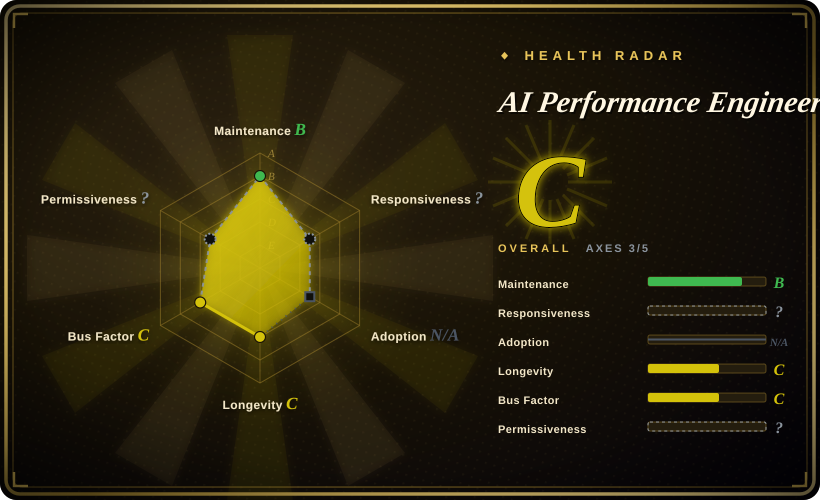
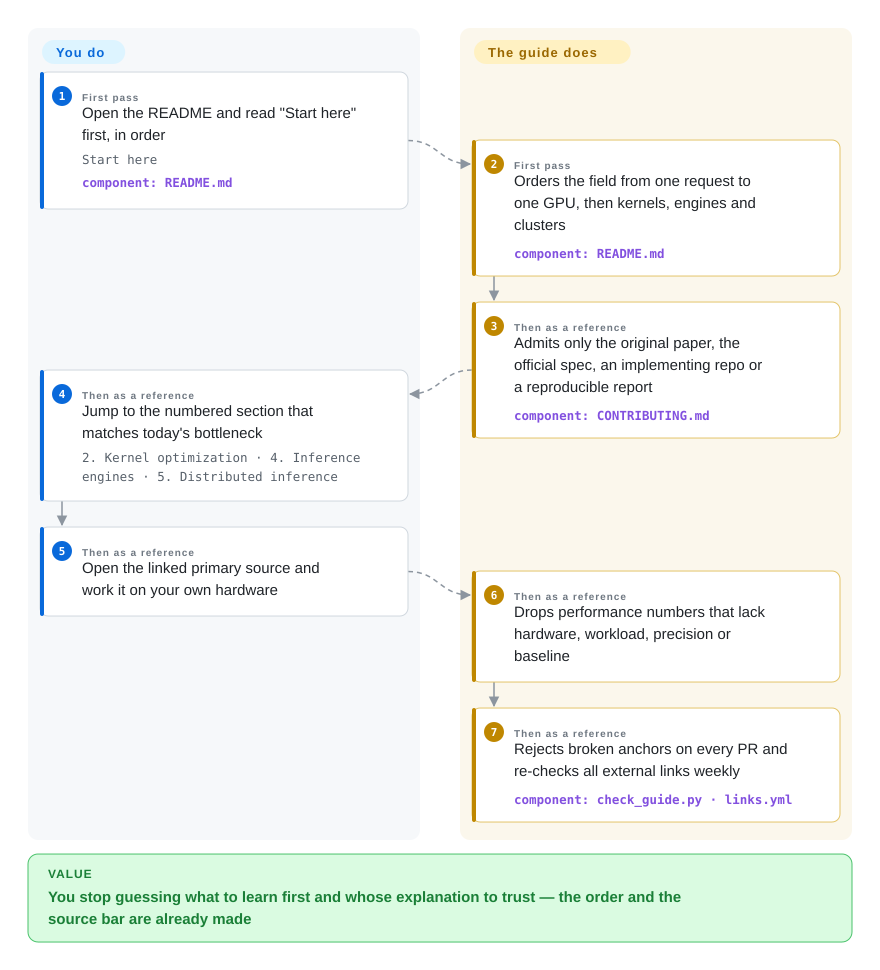

# AI Performance Engineering Resources

Your model is too slow and you know the fixes have names — FlashAttention, PagedAttention, a roofline limit, some Triton or CUTLASS thing — but you cannot tell which explanation is authoritative, which blog tutorial is worth an afternoon, or which of it you need to understand first. This repository is a read-in-order path through that field: 124 links that run from one inference request to one GPU, then kernels, engines and distributed serving, gated so every entry is the original paper, the official spec, the implementing repository, or an implementer report detailed enough to reproduce.

## When to use

You have moved from "I can call PyTorch" to "I have to make this fast" — a decode step at 40 tokens/s when the SLO wants 120, a matmul kernel at a fraction of what the hardware can do, a serving stack that degrades the moment concurrency rises — and you have no map of the field. You have a browser full of tabs: an NVIDIA tuning guide, three FlashAttention explanations, a vLLM config reference, a paper you are not sure is the original. What you lack is not links but *order and authority*: which of those explains the mechanism, which merely restates it, and what you must understand before the next one makes sense. This list resolves that. Read "Start here" first — eight sources that build the minimum mental model (one request through prefill and decode, the roofline model of whether a kernel is limited by compute or by memory bandwidth, transformer inference arithmetic) — and afterwards use the numbered sections as a reference keyed to whatever bottleneck you have that week.

The deciding tradeoff against the obvious alternatives is *selection under a stated source bar*. A generic awesome-list, a course syllabus or a vendor's tutorial index gives you volume; this list gives you a short one where each entry is one of four things — the paper that introduced the mechanism, the official spec or reference, the repository that implements it, or a direct implementer report with code, measurements and enough detail to reproduce. That is why it is only 124 links, and why it is the pick when you have to *justify* a technique rather than merely learn an API: you can cite what you read.

## How it works

The artifact is one ordered Markdown file plus two guardrails in CI; the order is the mechanism. The sections run from one inference request (prefill and decode — the two phases of producing an answer: read the prompt, then emit tokens one at a time — plus KV memory and batching) to one GPU (threads, warps, blocks, the memory hierarchy, PTX), then to kernels (matmul tiling, tensor cores, FlashAttention), the programming models you write them in (Triton, CUTLASS/CuTe), inference engines (scheduling, KV cache, quantization, speculative decoding), distributed serving (tensor and pipeline parallelism, NCCL, MoE dispatch, prefill/decode disaggregation) and finally the current hardware generations. That sequence is a dependency order rather than a classification — the list's own framing is that you cannot judge a continuous-batching scheduler before you know why decode is memory-bound — so reading it out of order costs you the point of the later sections. The maintainers own correctness and freshness: `scripts/check_guide.py` rejects broken internal anchors and duplicate links on every pull request, a scheduled job re-checks every external URL weekly, `CONTRIBUTING.md` states who is allowed into the list, and the fast-moving "Frontier" section carries its own verification date. You own the reading and the reproduction — nothing here executes for you; it routes you to the primary source and to the exercise you then run on your own hardware.

<!-- flow-steps:begin (generated from flows/gpu-perf-engineering-resources.json by tools/flow_card.py — do not edit) -->

Text version of the flow

1. **You** (First pass): Open the README and read "Start here" first, in order — `Start here` — component: `README.md`
2. **AI Performance Engineering Resources** (First pass): Orders the field from one request to one GPU, then kernels, engines and clusters — component: `README.md`
3. **AI Performance Engineering Resources** (Then as a reference): Admits only the original paper, the official spec, an implementing repo or a reproducible report — component: `CONTRIBUTING.md`
4. **You** (Then as a reference): Jump to the numbered section that matches today's bottleneck — `2. Kernel optimization · 4. Inference engines · 5. Distributed inference`
5. **You** (Then as a reference): Open the linked primary source and work it on your own hardware
6. **AI Performance Engineering Resources** (Then as a reference): Drops performance numbers that lack hardware, workload, precision or baseline
7. **AI Performance Engineering Resources** (Then as a reference): Rejects broken anchors on every PR and re-checks all external links weekly — component: `check_guide.py · links.yml`

**Value**: You stop guessing what to learn first and whose explanation to trust — the order and the source bar are already made

<!-- flow-steps:end -->

## When NOT to use

- **You need something to install and run, not to read.** Nothing here compiles. If the job is to stand up a serving endpoint today, go to an engine page instead — [vLLM](../llm-inference/serving-engines/vllm.md) or [SGLang](../llm-inference/serving-engines/sglang.md) — and read its own docs; come back here when you need to know why its scheduler behaves the way it does.
- **You have no NVIDIA GPU and no plan to rent one.** The kernel half is NVIDIA-shaped throughout — CUDA, PTX, CUTLASS, tensor cores, Nsight — while AMD, TPU and Trainium get one short section each. If you are AMD-first or TPU-first, your primary path is the vendor's own docs (ROCm, JAX Pallas) plus the list's papers; expect the papers, not equivalent exercise depth.
- **You want to be taught, graded or credentialed.** This is a self-directed path with no lectures, deadlines, feedback or certificate, and nothing in it tells you whether you actually understood a section. Choose a university course, a video lecture series or a paid program for that.
- **You want this week's news or the newest models.** The list is deliberately conservative: numbers without hardware, workload, precision and baseline are omitted by policy, "Frontier" items are dated and stay on a watch-list until a spec, a shipped implementation and a reproducible measurement all exist. For currency, follow the hardware vendors and the GPU MODE community instead.
- **You need links that cannot rot.** Every entry is a third-party URL, and link decay is this artifact's structural failure mode; the weekly check slows it and does not stop it. If you need an offline, versioned corpus, mirror the sources you actually rely on.
- **You want to contribute a summary, tutorial or leaderboard claim.** It will be rejected by design — see `CONTRIBUTING.md` — so publish that on your own site and submit only primary sources.

## Comparison

| Alternative | In index | Our verdict | Tradeoff |
|---|---|---|---|
| [vLLM](../llm-inference/serving-engines/vllm.md) · [SGLang](../llm-inference/serving-engines/sglang.md) | ✅ | Choose the engine page when the task is to deploy and tune an endpoint now — it carries the flags, config surface and failure modes; choose this list when you must understand *why* the knob exists, which is what its PagedAttention, Sarathi-Serve and SGLang citations give you. | Runnable software with operational detail, but each page covers one engine and assumes you already know the mechanism underneath — the list is exactly the other way round. |
| gpu-mode/lectures | 未收录 | Choose the GPU MODE lectures when you learn from a talk and a companion notebook and want the community's current hands-on framing; choose this list when you want the canonical written source per mechanism and a citable reason for a technique. | Lecture materials with recency and community energy behind them, but a talk is not a specification and the curriculum follows the series — deliberately left as a separate backlog entry rather than a second page here. |
| NVIDIA CUDA documentation and architecture tuning guides | 非仓库 | Choose the vendor docs when you are implementing against one architecture and need normative behavior, limits and flags; choose this list when you do not yet know which of the hundred doc pages to read, or what has to come before it. | Authoritative and current per architecture, with no ordering, no cross-vendor view, and no notion of what belongs to a beginner. Out of scope as a repository — it is a documentation site. |
| *Programming Massively Parallel Processors* (PMPP) | 非仓库 | Choose the textbook when you want to be taught GPU programming end to end, with exercises, and to be examined on it; choose this list when you need the primary source for one mechanism today and want to move between kernels and serving. | The structured pedagogical path with real depth on fundamentals — but a book on GPU programming, not a living reference spanning inference engines, serving and distributed systems. Not a repository. |
| University systems courses (CS149, 6.172) and paid online GPU courses | 非仓库 | Choose a course when you need teaching, a schedule, feedback or a credential; choose this list when the missing piece is only the reading order plus the sources, and you will supply your own discipline. | Taught, graded and time-boxed by someone else — at the cost of a fixed syllabus instead of whatever your own bottleneck is this week. Course sites and hosted programs, not repositories. |

## Health & viability

- **Maintenance — active but small (verified 2026-09-23).** 24 commits in total since the repo was created 2026-01-12; last push 2026-09-12, when three external link/section PRs merged. A "V2" restructure of the guide landed 2026-08-23. No tagged releases, which is expected for a Markdown guide rather than a gap. The recent commit shape (link fixes, one added resource) is a maintained reference, not active development.
- **Governance / bus factor — one organization, essentially one author.** The repo is Organization-owned by `wafer-ai`; GitHub lists 7 contributors, and the top one accounts for 17 of the 24 commits, with the rest being single-link pull requests. There is a real contribution contract (`CONTRIBUTING.md`) and 10 pull requests have been merged, so outside changes do land — but the editorial direction is one company's. [推断] The bus-factor reading is inferred from commit concentration, not from a governance document.
- **Backing, age and the Lindy prior — young, vendor-backed, and partly a hiring surface.** The repo is about eight months old, and the README links Wafer's hiring page, so a commercial inference-infrastructure company maintains it as a reference and a funnel. Age × still-active argues *against* treating it as a proven long-term bet: 3.7k stars in eight months is a hyped young repo, and a company project can lose interest with its hiring needs. [推断]
- **Adoption — high for its age, shallow in kind.** ~3,755 stars and 346 forks in eight months, 7 merged outside contributions; every one is a link-level fix, so adoption shows reach rather than an ecosystem built on it. Issuers/PRs are merged and the open-issue count is 0, which is consistent with fast cleanup rather than neglect.
- **Freshness model — deliberate and dated.** "Frontier" is stamped "Verified on 2026-08-23" and kept out of the core path; performance numbers missing hardware, workload, precision or baseline are dropped by policy; every external URL is re-checked weekly by CI. The realistic decay path is a primary source moving or a vendor retiring a documentation URL.
- **Risk flags — the license is declared, not filed.** The README states MIT, but there is no `LICENSE` file in the repository and GitHub's license API reports none (verified 2026-09-23). [推断] MIT is plainly the intent, but anyone redistributing, vendoring or mirroring this list should get the file added upstream first rather than rely on the README line.

## Caveats (unverified)

- [未验证] The composition figures (124 links: 41 papers, 39 official vendor documentation pages, 19 GitHub repositories, the remainder implementer write-ups) are a count over the README on 2026-09-23 and change with every merge.
- [未验证] MIT is declared in the README only; no `LICENSE` file exists in the repository as of 2026-09-23 and GitHub reports no detected license.
- [推断] "Essentially one maintainer" is read from commit counts (top contributor 17 of 24) rather than from any governance file; contributor share is not the same as decision authority.
- [推断] Whether the list stays vendor-neutral is not measurable from the repository: every core entry is third-party, but the maintainer is a commercial inference-infrastructure vendor and no editorial-independence policy was found.
- [未验证] Coverage depth for AMD, TPU and Trainium was judged from headings and link counts, not by reading every linked source; the balance could differ from that impression.
- [未验证] Star, fork, commit and PR counts are a GitHub API snapshot taken 2026-09-23 and move continuously.
- [未验证] The claim that "Frontier" is conservative rests on the README's own framing and its 2026-08-23 stamp, not on an independent audit of what was excluded from it.
- [推断] The stated dependency order — that a scheduler cannot be judged before the memory-bound nature of decode is understood — is my reading of the list's own sequence, not a claim the project makes about learning science.
