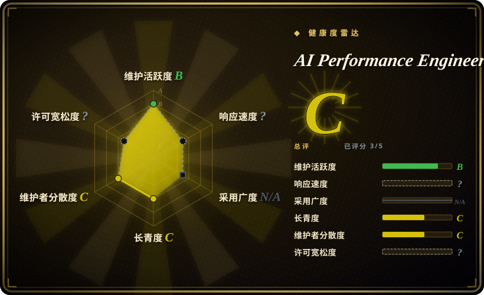
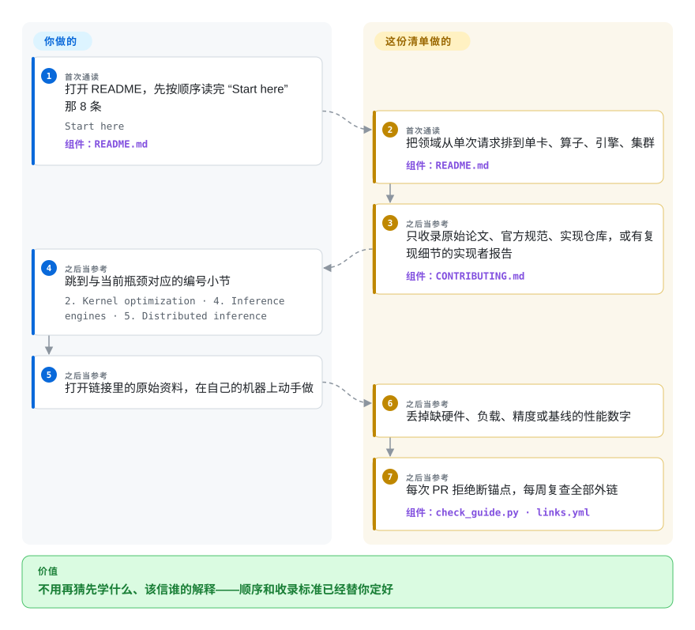

# AI Performance Engineering Resources

模型跑得慢，而你知道那些解法都有名字——FlashAttention、PagedAttention、roofline 上限、Triton 或 CUTLASS 里的某个东西——但你分不清哪份讲解是权威的、哪篇博客值得花一下午，也不确定这些概念该按什么顺序学。这个仓库把它排成了一条按顺序读的路径：124 条链接，从单次推理请求排到单卡、算子、引擎和分布式服务，并用收录标准筛掉二手转述，只留原始论文、官方规范、实现仓库，或有复现细节的实现者报告。

## 何时使用

你已经从「会调 PyTorch」走到「得把它变快」——decode 阶段只有 40 tokens/s 而 SLO 要 120，矩阵乘算子只跑到硬件能力的一小截，并发一上来服务栈就开始退化——但你手里没有这张领域地图。浏览器里摊着一堆标签页：一份 NVIDIA 调优指南、三种 FlashAttention 讲解、一页 vLLM 配置参考，还有一篇你不确定是不是原始论文的文章。你缺的不是链接，是*顺序与权威性*：哪一份讲的是机制本身，哪一份只是复述，以及下一个概念要建立在什么之上。这份清单解决的正是这件事。先读 “Start here”——8 条建立最小模型的资料（一次请求如何走完 prefill 与 decode、判断算子受算力还是显存带宽限制的 roofline 模型、transformer 推理的算术量）——之后把它当参考手册，按当周的瓶颈去查对应小节。

和显而易见的替代品相比，决定性的取舍是*在一套明确收录标准下做筛选*。通用的 awesome 清单、课程大纲、厂商教程目录给你的是数量；这份清单给你一条短的，而且每一条都必须是四类之一：提出该机制的原始论文、定义它的官方规范或参考、实现它的仓库，或带代码与测量、细节足以复现的实现者报告。所以它只有 124 条链接，也所以当你要*论证*某个技术选型而不是单纯学会一个 API 时选它——你引得出自己读过什么。

## 怎么用起来

产物就是一个排好序的 Markdown 文件，加 CI 里的两道护栏；顺序本身就构成机制。各节从一次推理请求（prefill 与 decode——生成答案的两个阶段：先读入提示，再逐个吐 token——以及 KV 显存与批处理）排到单张 GPU（线程、warp、block、显存层级、PTX），再到算子（matmul 分块、tensor core、FlashAttention）、写算子用的编程模型（Triton、CUTLASS／CuTe）、推理引擎（调度、KV cache、量化、投机解码）、分布式服务（张量与流水线并行、NCCL、MoE 分发、prefill／decode 分离），最后是当前几代硬件。这个顺序是依赖顺序而不是分类——清单自己的说法是：在没搞懂 decode 为什么受显存带宽限制之前，你判断不了连续批处理调度器的好坏——所以跳着读会丢掉后面几节的意义。正确性与新鲜度由维护者负责：`scripts/check_guide.py` 在每个 PR 上拒绝断掉的内链锚点和重复链接，一个定时任务每周复查全部外部链接，`CONTRIBUTING.md` 规定了什么能进清单，「Frontier」这一节自带核验日期。你自己负责读和复现——这里没有任何东西替你运行；它只把你引到原始资料，以及之后你在自己硬件上动手做的练习。

<!-- flow-steps:begin (generated from flows/gpu-perf-engineering-resources.json by tools/flow_card.py — do not edit) -->

流程文字版

1. **你**（首次通读）：打开 README，先按顺序读完 “Start here” 那 8 条 — `Start here` — 组件：`README.md`
2. **AI Performance Engineering Resources**（首次通读）：把领域从单次请求排到单卡、算子、引擎、集群 — 组件：`README.md`
3. **AI Performance Engineering Resources**（之后当参考）：只收录原始论文、官方规范、实现仓库，或有复现细节的实现者报告 — 组件：`CONTRIBUTING.md`
4. **你**（之后当参考）：跳到与当前瓶颈对应的编号小节 — `2. Kernel optimization · 4. Inference engines · 5. Distributed inference`
5. **你**（之后当参考）：打开链接里的原始资料，在自己的机器上动手做
6. **AI Performance Engineering Resources**（之后当参考）：丢掉缺硬件、负载、精度或基线的性能数字
7. **AI Performance Engineering Resources**（之后当参考）：每次 PR 拒绝断锚点，每周复查全部外链 — 组件：`check_guide.py · links.yml`

**价值**：不用再猜先学什么、该信谁的解释——顺序和收录标准已经替你定好

<!-- flow-steps:end -->

## 何时不用

- **你要的是能装能跑的东西，不是读物。** 这里没有一行代码可编译。如果当下任务是搭起一个推理端点，直接看引擎页——[vLLM](../llm-inference/serving-engines/vllm.zh.md) 或 [SGLang](../llm-inference/serving-engines/sglang.zh.md)——读它们自己的文档；等你需要知道它的调度器为什么这样表现时再回来。
- **你没有 NVIDIA GPU，也不打算租。** 算子那半段通篇是 NVIDIA 形状——CUDA、PTX、CUTLASS、tensor core、Nsight——而 AMD、TPU、Trainium 各只有一小节。如果你是 AMD 或 TPU 优先，主要路径是厂商自己的文档（ROCm、JAX Pallas）加上这里的论文；拿到的是论文，不是同等密度的练习。
- **你想被教、被批改、被认证。** 这是一条自学的路径，没有课、没有截止日期、没有反馈、没有证书，也没有任何机制告诉你某一节是否真的学懂了。要这些就选大学课程、视频讲座系列或付费训练营。
- **你要本周新闻或最新模型。** 这份清单刻意保守：缺少硬件、负载、精度和基线四项的性能数字按政策直接省略，「Frontier」条目带日期，且要等规范、已发货实现和可复现测量三者齐备才会进主干。要时效性就去看硬件厂商和 GPU MODE 社区。
- **你需要不会失效的链接。** 每一条都是第三方 URL，链接腐烂就是这类产物的结构性失效模式；每周检查只是拖慢它，拦不住它。要离线、可版本化的语料，就自己镜像真正依赖的原文。
- **你想投递二手总结、教程或排行榜说法。** 按设计会被拒——见 `CONTRIBUTING.md`——那类内容发在自己的站点上，这里只收原始资料。

## 横向对比

| 替代品 | 是否收录 | 我们的评价 | 取舍 |
|---|---|---|---|
| [vLLM](../llm-inference/serving-engines/vllm.zh.md) · [SGLang](../llm-inference/serving-engines/sglang.zh.md) | ✅ | 当下任务是部署并调优一个端点时选引擎页：它带着参数、配置面和失败模式；当你必须搞懂某个开关*为什么*存在时选本页清单，它的 PagedAttention、Sarathi-Serve、SGLang 引用正好给你这个。 | 可运行的软件加运维细节，但每页只覆盖一个引擎，而且默认你已经懂下面的机制——本页清单恰好是反过来。 |
| gpu-mode/lectures | 未收录 | 你靠讲座加配套 notebook 学习、想要社区当下偏实操的讲法时选 GPU MODE 讲座；你要每个机制的权威书面出处、要一个能被引用的技术理由时选本页清单。 | 有讲座视频和材料，时效性和社区热度都更好，但讲座不是规范，课程表随系列变化——这里刻意只作为待收录条目，不另开页面。 |
| NVIDIA CUDA 文档与各代架构调优指南 | 非仓库 | 你正对着某一代架构做实现、需要规范行为、上限和参数时选厂商文档；你还不知道上百页文档里该读哪一页、也不知道它之前要先读什么时选本页清单。 | 按架构权威且最新，但没有顺序、没有跨厂商视角，也没有「哪些属于入门」的概念。它是文档站点，按形态不在收录范围内。 |
| 《Programming Massively Parallel Processors》（PMPP） | 非仓库 | 你想被完整地教一遍 GPU 编程、要配套习题、要被考核时选教材；你今天就要某个机制的原始出处、要在算子和服务之间来回移动时选本页清单。 | 结构化、有教学法的路径，基础深度真实——但它是讲 GPU 编程的书，不是横跨推理引擎、服务和分布式系统的活参考。书不是仓库。 |
| 大学系统课程（CS149、6.172）与付费在线 GPU 课程 | 非仓库 | 你需要教学、日程、反馈或凭证时选课程；你缺的只是阅读顺序和出处、纪律可以自己提供时选本页清单。 | 别人替你授课、打分、限时——代价是固定教学大纲，而不是你当周真正的瓶颈。课程站点与托管项目，不是仓库。 |

## 健康度与可持续性

- **维护状态——活跃但体量小（核验于 2026-09-23）。** 仓库创建于 2026-01-12，至今共 24 次 commit；最近一次推送 2026-09-12，当天合了三个链接／小节类 PR；2026-08-23 落地过一次「V2」重构。没有 tag 发布，对一个 Markdown 指南来说属正常而非缺口。近期 commit 的形态（修链接、加一条资源）说明这是一份在被维护的参考，而不是在持续开发。
- **治理／巴士系数——一个组织，基本一个作者。** 仓库归 `wafer-ai` 组织所有；GitHub 列了 7 位贡献者，头一位占了 24 次 commit 里的 17 次，其余都是单链接 PR。存在真实的投稿契约（`CONTRIBUTING.md`），已有 10 个 PR 被合并，外部改动确实能进——但编辑方向是一家公司的。 [推断] 巴士系数这一判断是从 commit 集中度推出的，不是来自治理文件。
- **背书、年龄与 Lindy——年轻、厂商背书，且部分承担招聘职能。** 仓库约 8 个月大，README 里链到 Wafer 的招聘页，也就是说一家商业推理基础设施公司把它同时当作参考资料和招聘入口。年龄 × 仍在活跃这条先验在这里是不利的：8 个月涨到 3.7k star 属于年轻而热的仓库，公司项目也可能随招聘需求一起失去兴趣。 [推断]
- **采用度——按年龄算高，但性质浅。** 8 个月约 3,755 star、346 fork，7 个外部贡献被合并；每一个都是链接级修正，所以采用度体现的是触达面，而不是有人在它之上建了生态。没有积压的开放 issue 和频繁合并的 PR，符合「清理快」而不是「无人管」。
- **新鲜度模型——刻意设计且有日期。** 「Frontier」标着「Verified on 2026-08-23」并被挡在主干之外；缺硬件、负载、精度或基线的性能数字按政策省略；全部外链由 CI 每周复查。现实的腐坏路径是原始资料换地址，或厂商下掉某个文档 URL。
- **风险信号——license 只是声明，没有落成文件。** README 写的是 MIT，但仓库里没有 `LICENSE` 文件，GitHub 的 license API 也报告没有（核验于 2026-09-23）。 [推断] MIT 显然是本意，但要再分发、内嵌或镜像这份清单的人，应先让上游补上该文件，而不是依赖 README 那一行。

## 存疑（未验证）

- [未验证] 构成数据（124 条链接中 41 篇论文、39 页官方厂商文档、19 个 GitHub 仓库，其余为实现者文章）是 2026-09-23 对 README 的清点结果，每次合并都会变。
- [未验证] MIT 只写在 README 里；截至 2026-09-23 仓库中不存在 `LICENSE` 文件，GitHub 也未识别出 license。
- [推断] 「基本一个维护者」是从 commit 数（头名 17／24）读出来的，不是来自任何治理文件；贡献占比不等于决策权。
- [推断] 这份清单能否保持厂商中立，从仓库本身无法测量：主干条目全是第三方，但维护者是一家商业推理基础设施厂商，且未发现编辑独立性政策。
- [未验证] AMD、TPU、Trainium 的覆盖深度是看标题和链接数判断的，没有逐条读过所引资料；实际比重可能与这个印象不同。
- [未验证] star、fork、commit、PR 数都是 2026-09-23 的 GitHub API 快照，持续变动。
- [未验证] 「Frontier 刻意保守」这一判断依据的是 README 自己的表述和它的 2026-08-23 日期戳，而不是对被排除条目的独立审计。
- [推断] 所谓依赖顺序——不先理解 decode 受显存带宽限制就判断不了调度器——是我对清单自身排序逻辑的解读，不是项目方关于学习科学的论断。
