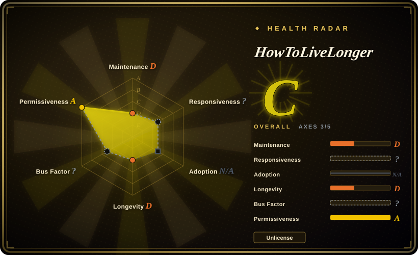
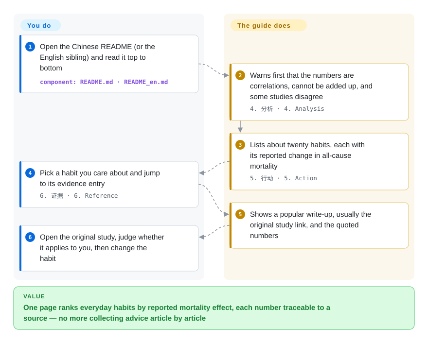

# HowToLiveLonger

You keep reading that coffee, nuts, walking or going to bed early adds years to your life — each claim from a different article, with no way to tell which effect is large and which is noise. This guide puts about twenty everyday habits on one page, each tagged with the change in all-cause mortality (the chance of dying from any cause over a study's follow-up) that some study reported, and links each number back to the article and, usually, the study it came from.

## When to use

You are a programmer — the guide's own audience — who sits ten hours a day, and a routine check-up has just made "health" feel like a project rather than a slogan. You start reading and immediately hit contradictions: one article says sleeping before 22:00 raises mortality 43%, another says seven hours is all that matters; one says salt kills, another (a *European Heart Journal* analysis of 181 countries) says higher sodium goes with longer life. What you want is not another article but a *ranking*: of the twenty things you could change, which ones have the largest reported effect, and where does each number come from?

That is what this repository is: a Chinese-first, single-page evidence digest shaped like an OKR — objective, key results, a caveats section, an action list with a percent change in all-cause mortality per habit (racquet sports three times a week −47%, coffee −22% to −12%, regular tooth brushing −25%, smoking +~50%), then an evidence section that quotes the figures and links the source. Pick it over a mechanism-first lifestyle essay such as HumanSystemOptimization when you want a *number per habit* to prioritise by, and over official dietary or activity guidelines when you want effects compared across domains (food, sleep, exercise, wealth, mood) on one scale. The price is rigour: the numbers come from single observational studies, about 60% of the links are news or Q&A reposts rather than journals, and the page stopped being updated in early 2024.

## How it works

The whole artifact is two Markdown files — `README.md` in Chinese, the canonical one, and `README_en.md` — plus a GitHub Actions workflow that, whenever the Chinese file changes, machine-translates the added lines with Google Translate and opens a pull request so a human can merge them into the English file. The page reads top-down like an OKR: the objective (live longer), two headline "key results" (−66.67% all-cause mortality, roughly +20 years), an analysis section that warns the numbers are correlations, cannot be added together and sometimes conflict, then the action list, then the evidence grouped as *input* (solid, liquid, gas, light, drugs), *output* (exercise, sleep, sitting) and *context* (mood, wealth, weight, COVID). The maintainer did the selecting: he picked one or two studies per habit, extracted the headline effect, and wrote it next to the habit. You do everything after that — open the original study, decide whether a cohort of Italian adults or Chinese men over 72 resembles you, and decide whether a correlation is worth acting on. Think of it as a benchmark leaderboard where every row was copied from a different paper run on different hardware: useful for spotting which knobs matter at all, misleading the moment you add the rows up — which is exactly how the "+20 years" headline was produced, through a formula the author wrote himself, `ΔLifeSpan=(1/(1+ΔACM)-1)*10`, and invites readers to improve.

<!-- flow-steps:begin (generated from flows/how-to-live-longer.json by tools/flow_card.py — do not edit) -->

Text version of the flow

1. **You**: Open the Chinese README (or the English sibling) and read it top to bottom — component: `README.md · README_en.md`
2. **HowToLiveLonger**: Warns first that the numbers are correlations, cannot be added up, and some studies disagree — `4. 分析 · 4. Analysis`
3. **HowToLiveLonger**: Lists about twenty habits, each with its reported change in all-cause mortality — `5. 行动 · 5. Action`
4. **You**: Pick a habit you care about and jump to its evidence entry — `6. 证据 · 6. Reference`
5. **HowToLiveLonger**: Shows a popular write-up, usually the original study link, and the quoted numbers
6. **You**: Open the original study, judge whether it applies to you, then change the habit

**Value**: One page ranks everyday habits by reported mortality effect, each number traceable to a source — no more collecting advice article by article

<!-- flow-steps:end -->

## When NOT to use

- **You are deciding whether to take a drug or supplement.** The action list names metformin, a multivitamin, spermidine and glucosamine with mortality figures, but gives no dosing, no contraindication beyond a short metformin side-effect list, and the glucosamine and spermidine figures come from single observational studies relayed through news sites. Issue #168 ("can people without diabetes take a low dose of metformin daily?") sits unanswered. Ask a clinician, and read a systematic review on the Cochrane Library instead.
- **You need graded, systematic evidence.** Of the 72 unique external links in the Chinese README (counted 2026-10-01), 44 point to Zhihu answers, Sohu/163 news reposts, medical news sites or an industry brochure (the American Pistachio Growers' research leaflet backs the nut entry); only 28 reach a journal, preprint or government source. Each habit rests on one or two studies, with no meta-analytic weighting or grading of evidence quality. For "how strong is the evidence for X", use Cochrane reviews or Examine.com.
- **You want to add the numbers up.** The "−66.67% ACM, ~+20 years" key result is the author's own arithmetic over effects that the same README says are not independent and cannot be summed. Treat the action list as a list of candidates, not a forecast; a clinician's risk calculator answers "what is my risk" far better.
- **You need current evidence.** The README content last changed on 2024-01-30 (a one-line edit to the alcohol advice); since then there has been one CI-only commit (2025-05-19). PR #171, which corrects the bedtime entry with the paper's adjusted hazard ratios, has been open since 2025-07, and 5 of the 72 links returned 404 on 2026-10-01. If recency matters, HumanSystemOptimization (pushed 2025-09) or human_infra (pushed 2026-09) are maintained alternatives, with their own caveats below.
- **You read only English.** `README_en.md` is a partly machine-translated sibling that has drifted: the English action list still allows "less than 100g [alcohol] per week", while the Chinese canonical file was changed to "quit alcohol" on 2024-01-30. Read the Chinese file (machine-translate it if needed), or use an English-native source such as Examine.com.
- **You want practices and mechanisms — when to get light, how to time caffeine and exercise.** This page is a table of effect sizes, not a protocol. HumanSystemOptimization explains the physiology (circadian rhythm, light, temperature) and turns it into daily practices.

## Comparison

| Alternative | In index | Our verdict | Tradeoff |
|---|---|---|---|
| zijie0/HumanSystemOptimization (健康学习到150岁) | not indexed | Choose HumanSystemOptimization when you want to understand *why* a practice works — sleep, light, temperature, dopamine — and get a daily routine out of it; choose this guide when you want one percent-mortality number per habit to decide what to change first. | Mechanism-first narrative distilled largely from Andrew Huberman's podcast, updated through 2025 — but few effect sizes to rank by, and no license file. Not added in this tab batch. |
| tradecatlabs/human_infra | not indexed | Choose human_infra when you want an actively maintained (2026-09) docs-as-code knowledge base that treats longevity evidence as one domain of a larger research map with review status; choose this guide when you want a one-page, read-in-ten-minutes action list. | Structured, checked and current, but sprawling (immortality timelines, memory editing) and young (created 2025-10), with its license marked pending. Not added in this tab batch. |
| atilatech/awesome-longevity | not indexed | Choose awesome-longevity when you are mapping the longevity *field* — companies, investors, conferences, blogs; choose this guide when the question is what to change in your own daily habits. | An ecosystem directory, not health advice — no effect sizes, no evidence, and small (42 stars). Not added in this tab batch. |
| Cochrane Library systematic reviews · Examine.com | not a repo | Choose these when the decision carries real risk (a drug, a supplement, a diet change on top of a condition) and you need evidence weighted across many studies and graded for quality; choose this guide only to discover which habits are worth asking about. | Systematic, graded and kept current — Examine partly behind a paywall, Cochrane written for clinicians, neither ranks habits across domains on one page. Hosted publications, not repositories. |
| WHO physical-activity guidelines · 中国居民膳食指南 (Chinese Dietary Guidelines) | not a repo | Choose the official guidelines when you need the consensus recommendation that a doctor or employer will recognise; choose this guide when you want the size of the reported effect next to each habit. | Authoritative and consensus-reviewed — this guide itself cites both for its sitting entry — but split by domain and phrased as recommendations, not effect sizes. Official documents, not repositories. |

## Health & viability

- **Maintenance — dormant, not archived (verified 2026-10-01).** 77 commits in total: 58 in April–May 2022 when the repo went viral, 17 in July 2023 (mostly the translation workflow and English edits), one content change on 2024-01-30 and one CI fix on 2025-05-19. No releases, which is normal for a Markdown guide; three pull requests are open, the oldest from 2023-04, and 44 issues are open. For a page whose value is *current evidence*, this is the deciding signal.
- **Governance / bus factor — one person's editorial judgment.** Owned by a personal account (`geekan`, 44 commits); the second contributor (`qhy040404`, 20) built the translation workflow and hosts some images. There is no CONTRIBUTING file and no written rule for which studies get in, so the admission bar is whatever the author picked in 2022.
- **Backing, age and the Lindy prior — the prior does not help here.** The repo is four and a half years old, but its content effectively stopped after about 21 months; age × still-active fails, so Lindy says nothing reassuring. The README's top badge points to MetaGPT, the author's multi-agent framework, which is where his visible effort now goes. [推断]
- **Adoption — enormous reach, little verification.** ~35.5k stars and ~2.4k forks (2026-10-01) measure the 2022 attention spike, not review: issue #166 ("has anyone checked the accuracy?") has one joking reply and no maintainer answer, and the corrections that do arrive (PR #171) are not merged.
- **Risk flags — license is clean, the content is the risk.** `LICENSE` is the Unlicense (public-domain dedication), so copying or adapting the list is legally trivial. The real risks are content ones: health claims sourced through secondary articles, link rot (5 confirmed 404s, a broken image reported in issue #179), and a Chinese/English divergence a reader cannot see from inside one file.

## Caveats (unverified)

- [未验证] The link counts (72 unique external links; 44 secondary, 28 journal or official; 5 returning 404) come from one automated pass over `README.md` on 2026-10-01. 32 links returned 403 to an automated client — publisher and Zhihu bot blocking — so their real availability is unknown, 6 more timed out or returned 502, and one returned 401.
- [未验证] Whether each percent figure in the action list matches the cited paper was not checked against the papers themselves; the page only reports what the README states.
- [推断] The dairy entry cites the PURE dairy study, but the linked PDF's filename names a different paper ("Association of dietary patterns and dietary diversity…"), which suggests a mislink; the PDF host returned 502, so it could not be opened.
- [推断] That the author's attention has moved to MetaGPT is inferred from the README badge and the commit history, not from any statement in the repository.
- [未验证] English/Chinese drift was confirmed for the alcohol line only; other divergences between `README_en.md` and `README.md` were not audited line by line.
- [未验证] Star, fork, issue and commit counts are a GitHub API snapshot taken 2026-10-01.
- [未验证] Descriptions of the substitutes (HumanSystemOptimization's reliance on Huberman's podcast, human_infra's scope and license status, Examine.com's paywall) come from their READMEs and public pages, read once on 2026-10-01, not from a full review.
