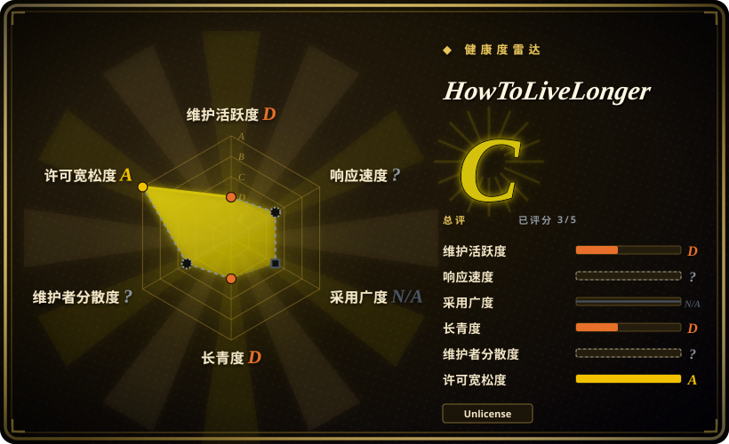
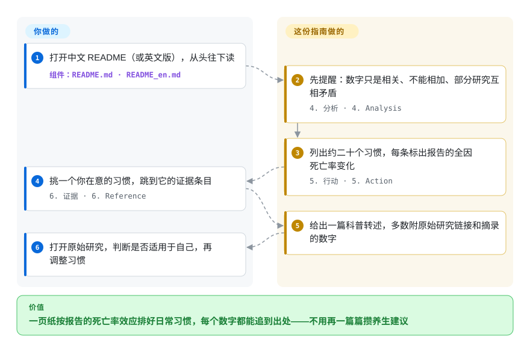

# HowToLiveLonger

你隔三差五刷到“喝咖啡能长寿”“早睡反而伤身”“每天走七千步”，每条出自不同的文章，分不清哪个效应大、哪个只是噪音。这份指南把二十来个日常习惯摆在同一页上，每条标出某项研究报告的全因死亡率（随访期间因任何原因死亡的概率）变化，并链回转述文章，多数还附上原始研究。

## 何时使用

你是个程序员——正是这份指南写给的人——一天坐十个小时，最近一次体检让“健康”从口号变成了待办项目。你开始查资料，马上撞上互相打架的说法：一篇说 22 点前睡觉全因死亡率高 43%，另一篇说睡够 7 小时才是关键；一篇说盐吃多了要命，另一篇（《欧洲心脏杂志》对 181 个国家的分析）说钠摄入越高、预期寿命越长。你缺的不是又一篇文章，而是一张*排序表*：能改的二十件事里，哪几件报告的效应最大，每个数字又出自哪里？

这个仓库就是这张表：一份中文优先、单页的证据摘要，按 OKR 的格式写成——目标、关键结果、一节“分析”讲注意事项、一份行动清单（每个习惯标出全因死亡率变化：每周三次挥拍运动 −47%，喝咖啡 −22% 到 −12%，好好刷牙 −25%，吸烟 +~50%），最后是证据部分，摘录数字并给出链接。和 HumanSystemOptimization 这种从机理讲起的生活方式长文相比，当你要的是*每个习惯一个数字*、好拿来排优先级时选它；和官方膳食或运动指南相比，当你想把饮食、睡眠、运动、财富、情绪放在同一把尺子上比时选它。代价是严谨性：数字来自单个观察性研究，大约六成链接是新闻或问答转述而非期刊，而且这一页从 2024 年初起就没再更新。

## 怎么用起来

整个仓库就是两份 Markdown——中文的 `README.md`（以它为准）和英文的 `README_en.md`——外加一个 GitHub Actions 工作流：中文文件一有改动，它就把新增的行交给谷歌翻译机翻，再开一个 PR 等人审核后并进英文版。页面自上而下按 OKR 排：目标（活得更久）、两条“关键结果”（全因死亡率降低 66.67%、预期寿命约增加 20 年）、一节分析（提醒这些数字只是相关、不能相加、有时互相矛盾），然后是行动清单，最后是证据，分成*输入*（固体、液体、气体、光照、药物）、*输出*（运动、睡眠、久坐）和*上下文*（情绪、贫富、体重、新冠）三组。挑选这一步作者替你做了：每个习惯挑一两篇研究，摘出主效应，写在习惯旁边。之后的事都归你——打开原始研究，判断“意大利成年人”或“72 岁以上中国男性”的队列像不像你，再决定一个相关性值不值得照着做。可以把它想成一张跑分榜，每一行抄自不同的论文、跑在不同的硬件上：用来发现哪些旋钮有影响很好用，一旦把各行加起来就会误导人——而“+20 年”这个标题恰恰是这样加出来的，用的是作者自拟、并欢迎读者改进的公式 `ΔLifeSpan=(1/(1+ΔACM)-1)*10`。

<!-- flow-steps:begin (generated from flows/how-to-live-longer.json by tools/flow_card.py — do not edit) -->

流程文字版

1. **你**：打开中文 README（或英文版），从头往下读 — 组件：`README.md · README_en.md`
2. **HowToLiveLonger**：先提醒：数字只是相关、不能相加、部分研究互相矛盾 — `4. 分析 · 4. Analysis`
3. **HowToLiveLonger**：列出约二十个习惯，每条标出报告的全因死亡率变化 — `5. 行动 · 5. Action`
4. **你**：挑一个你在意的习惯，跳到它的证据条目 — `6. 证据 · 6. Reference`
5. **HowToLiveLonger**：给出一篇科普转述，多数附原始研究链接和摘录的数字
6. **你**：打开原始研究，判断是否适用于自己，再调整习惯

**价值**：一页纸按报告的死亡率效应排好日常习惯，每个数字都能追到出处——不用再一篇篇攒养生建议

<!-- flow-steps:end -->

## 何时不用

- **你在决定要不要吃某种药或补剂。** 行动清单里列了二甲双胍、复合维生素、亚精胺、葡萄糖胺，并配了死亡率数字，但没有剂量，禁忌只有一小段二甲双胍不良反应；葡萄糖胺和亚精胺的数字都来自单个观察性研究、经新闻网站转述。issue #168（“没有糖尿病的人可以日常服用最低剂量的二甲双胍吗？”）至今无人回答。请去问医生，并改读 Cochrane Library 上的系统综述。
- **你需要分级的、系统的证据。** 中文 README 里 72 个不重复的外部链接（2026-10-01 统计）中，44 个指向知乎回答、搜狐／网易转载、医学资讯站或一份行业宣传册（坚果条目引用的是美国开心果种植者协会的研究手册）；只有 28 个通向期刊、预印本或政府来源。每个习惯只靠一两篇研究撑着，没有荟萃加权，也没有证据质量分级。想知道“X 的证据有多硬”，用 Cochrane 系统综述或 Examine.com。
- **你想把数字加起来。** “全因死亡率 −66.67%、寿命约 +20 年”这条关键结果，是作者对一堆效应做的自家算术，而同一份 README 自己就说这些变量不独立、不能简单叠加。把行动清单当候选清单，别当预测；想知道“我的风险是多少”，医生用的风险计算器回答得好得多。
- **你需要最新证据。** README 内容最后一次改动是 2024-01-30（改了一行饮酒建议），此后只有一次纯 CI 提交（2025-05-19）。PR #171 用论文里的校正后风险比修正了就寝时间那条，自 2025-07 起一直没合并；2026-10-01 检查时 72 个链接中有 5 个返回 404。如果在乎时效，HumanSystemOptimization（2025-09 仍有推送）或 human_infra（2026-09 仍有推送）是还在维护的替代品，各自的问题见下表。
- **你只读英文。** `README_en.md` 部分是机翻的副本，已经和中文版走岔：英文行动清单仍写着“每周不超过 100g 酒精”，而中文版在 2024-01-30 就改成了“戒酒”。请读中文版（必要时自己机翻），或改用 Examine.com 这类英文原生来源。
- **你要的是做法和机理——几点晒太阳、咖啡因和运动怎么安排时间。** 这一页是一张效应量表，不是作息方案。HumanSystemOptimization 讲清了生理机制（昼夜节律、光照、体温），并落到每天的具体做法上。

## 横向对比

| 替代品 | 是否收录 | 我们的评价 | 取舍 |
|---|---|---|---|
| zijie0/HumanSystemOptimization（健康学习到150岁） | 未收录 | 想弄懂某个做法*为什么*有效——睡眠、光照、体温、多巴胺——并据此排出一套日常作息时，选 HumanSystemOptimization；想给每个习惯配一个死亡率百分比、决定先改哪件事时，选本指南。 | 以机理为主线的长文，大量内容提炼自 Andrew Huberman 的播客，更新到 2025 年——但几乎没有可用来排序的效应量，也没有许可证文件。本批次未收录。 |
| tradecatlabs/human_infra | 未收录 | 想要一个仍在活跃维护（2026-09）、按 docs-as-code 组织、把长寿证据作为更大研究地图中一个领域并标注复核状态的知识库时，选 human_infra；想要一页、十分钟读完的行动清单时，选本指南。 | 结构化、有检查、够新，但铺得很开（永生年表、记忆编辑都在里面）且很年轻（2025-10 创建），许可证标注为待定。本批次未收录。 |
| atilatech/awesome-longevity | 未收录 | 想摸清长寿这个*行业*——公司、投资人、会议、博客——时，选 awesome-longevity；问题是“我自己每天该改什么习惯”时，选本指南。 | 是行业名录不是健康建议——没有效应量、没有证据，规模也小（42 星）。本批次未收录。 |
| Cochrane Library 系统综述 · Examine.com | 非仓库 | 决定本身有真实风险（吃药、吃补剂、带着基础病调整饮食），需要跨多篇研究加权并分级的证据时，选它们；本指南只适合用来发现哪些习惯值得去问。 | 系统、分级、持续更新——但 Examine 部分内容收费，Cochrane 写给临床医生看，两者都不会把不同领域的习惯排在同一页上。都是托管的出版物，不是仓库。 |
| 世卫组织身体活动指南 · 中国居民膳食指南 | 非仓库 | 需要医生或单位都认可的共识建议时，选官方指南；想在每个习惯旁边看到报告的效应大小时，选本指南。 | 权威、经过共识评审——本指南的久坐条目自己就引用了这两份——但按领域分开，写成推荐而不是效应量。官方文件，不是仓库。 |

## 健康度与可持续性

- **维护——休眠但未归档（2026-10-01 核实）。** 总共 77 次提交：58 次集中在 2022 年 4–5 月走红期间，17 次在 2023 年 7 月（主要是翻译工作流和英文版修改），2024-01-30 一次内容改动，2025-05-19 一次 CI 修复。没有发版，对 Markdown 指南来说正常；3 个 PR 未合并，最早一个来自 2023-04，44 个 issue 未关闭。对一份价值在于*证据够新*的页面来说，这是决定性信号。
- **治理与巴士因子——一个人的编辑判断。** 归属个人账号（`geekan`，44 次提交）；第二贡献者（`qhy040404`，20 次）搭了翻译工作流并托管部分图片。没有 CONTRIBUTING 文件，也没有写明哪些研究能进，收录标准就是作者 2022 年挑的那一批。
- **背书、年龄与 Lindy 先验——这里先验帮不上忙。** 仓库四年半了，但内容大约在 21 个月后就基本停了；年龄 × 仍活跃这一条不成立，Lindy 给不出任何安慰。README 顶部的徽章指向作者的多智能体框架 MetaGPT，他看得见的精力如今在那边。[推断]
- **采用度——传播极广，核验极少。** 约 3.55 万星、2.4 千 fork（2026-10-01），量的是 2022 年那波关注，不是评审：issue #166（“有人校验准确性吗？”）只有一条玩笑式回复，维护者没回应；真送上门的修正（PR #171）也没合并。
- **风险信号——许可证干净，风险在内容本身。** `LICENSE` 是 Unlicense（放弃版权、进入公有领域），复制或改编这份清单在法律上毫无障碍。真正的风险在内容：健康结论经二手文章转述、链接失效（确认 5 个 404，issue #179 报告了一张图片打不开）、以及读者在单个文件里看不出的中英文版本分歧。

## 存疑（未验证）

- [未验证] 链接统计（72 个不重复外链；44 个二手来源、28 个期刊或官方来源；5 个返回 404）来自 2026-10-01 对 `README.md` 的一次自动检查。32 个链接对自动化客户端返回 403——出版商和知乎的反爬拦截——所以实际是否可用未知；另有 6 个超时或返回 502，1 个返回 401。
- [未验证] 行动清单里每个百分比是否与所引论文一致，没有对照论文原文核对；本页只转述 README 的说法。
- [推断] 乳制品条目引用的是 PURE 乳制品研究，但所链 PDF 的文件名是另一篇论文（“Association of dietary patterns and dietary diversity…”），像是链错了；该 PDF 所在站点返回 502，无法打开确认。
- [推断] “作者的精力已转到 MetaGPT”是从 README 徽章和提交历史推出来的，仓库里没有任何相关声明。
- [未验证] 中英文版本分歧只核实了饮酒那一行；`README_en.md` 与 `README.md` 之间的其他差异没有逐行比对。
- [未验证] 星数、fork 数、issue 数和提交数是 2026-10-01 的 GitHub API 快照。
- [未验证] 对替代品的描述（HumanSystemOptimization 依赖 Huberman 播客、human_infra 的范围与许可证状态、Examine.com 的付费墙）来自 2026-10-01 读过一遍的 README 和公开页面，不是完整评审。
