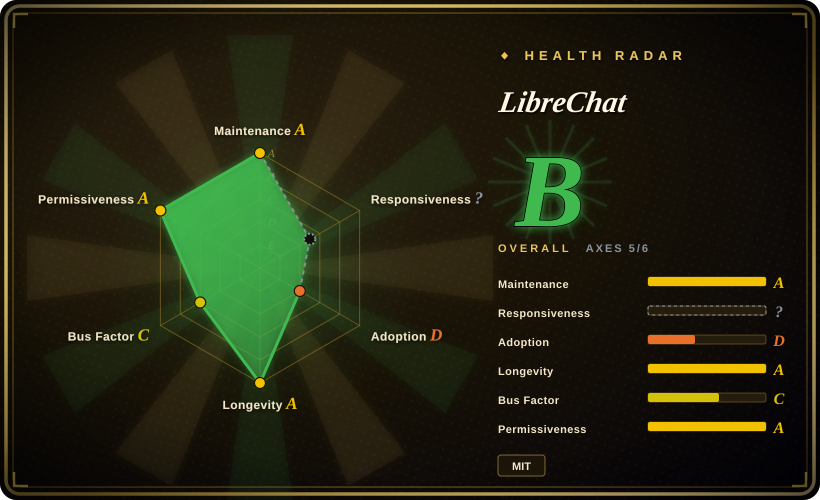
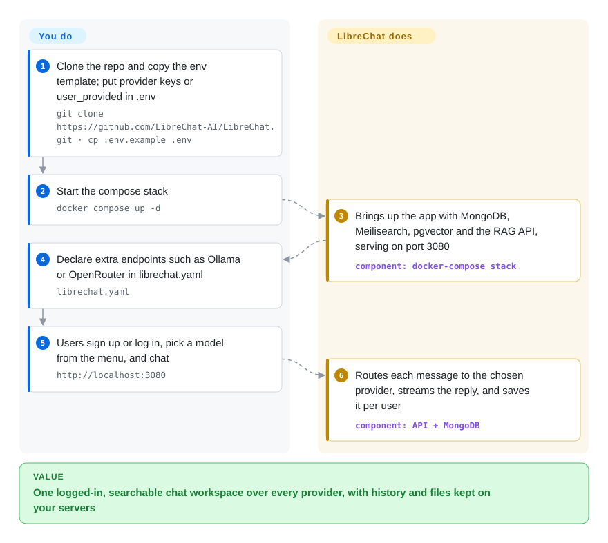

# LibreChat

Half your colleagues want Claude, the other half GPT, the data team runs a model on Bedrock, and meanwhile people paste internal documents into whichever vendor's web tab is open. LibreChat is one self-hosted, multi-user chat app: everyone logs in to your server, picks any of those providers from one model menu, and their history, files, and agents stay in your database.

## When to use

You run internal tooling for a company of a few hundred people. Legal has just found a customer contract pasted into someone's personal ChatGPT tab, the engineering org wants Claude via AWS Bedrock because that is where the enterprise agreement lives, and the data team wants a local model through Ollama for anything sensitive. Buying three SaaS seats per person solves none of the data-location problem. You reach for LibreChat: one Docker Compose stack behind your SSO (OAuth2, OpenID, LDAP), with OpenAI, Anthropic, Bedrock, Azure, Vertex AI, Google, and any OpenAI-compatible endpoint declared in one config file, and conversation history, uploads, shared prompts, and agents stored in a MongoDB you own.

You pick it over [Open WebUI](open-webui.md) when the license and the provider mix decide: LibreChat is plain MIT, while Open WebUI's license forbids removing its branding once a deployment passes 50 users a month, and LibreChat treats cloud providers like Bedrock and Vertex as first-class endpoints rather than "anything OpenAI-compatible". You pick it over [NextChat](nextchat.md) because NextChat has no user accounts — one shared password, history in each browser — while LibreChat gives every employee a real account, server-side search over their chats, and per-role permissions an admin can edit live.

## How it works

LibreChat is a web app (a React front end and a Node/Express API) that sits between your users and the model providers. **The chat UI, user accounts, conversation storage, search, file handling, and the agent runtime ship with it** — you write configuration, not code: `.env` holds secrets and provider keys (or marks a key `user_provided` so each user enters their own), and `librechat.yaml` declares extra endpoints such as OpenRouter or a local Ollama, plus agent, MCP, and interface settings. The default compose file starts the app next to MongoDB (the system of record for users and messages), Meilisearch (the search index behind "search all messages"), and a separate Python RAG API with a pgvector database (Postgres with vector search) that turns uploaded files into searchable chunks. When a user sends a message, the API routes it to the endpoint they picked, streams the answer back, and saves the turn; agents add tools on top — MCP servers (the Model Context Protocol, a standard plug for external tools), file search, web search, and a code interpreter. Running it beyond one box (Redis for resumable streams, Helm for Kubernetes, OpenTelemetry export) is configuration on the same stack.

<!-- flow-steps:begin (generated from flows/librechat.json by tools/flow_card.py — do not edit) -->

Text version of the flow

1. **You**: Clone the repo and copy the env template; put provider keys or user_provided in .env — `git clone https://github.com/LibreChat-AI/LibreChat.git · cp .env.example .env`
2. **You**: Start the compose stack — `docker compose up -d`
3. **LibreChat**: Brings up the app with MongoDB, Meilisearch, pgvector and the RAG API, serving on port 3080 — component: `docker-compose stack`
4. **You**: Declare extra endpoints such as Ollama or OpenRouter in librechat.yaml — `librechat.yaml`
5. **You**: Users sign up or log in, pick a model from the menu, and chat — `http://localhost:3080`
6. **LibreChat**: Routes each message to the chosen provider, streams the reply, and saves it per user — component: `API + MongoDB`

**Value**: One logged-in, searchable chat workspace over every provider, with history and files kept on your servers

<!-- flow-steps:end -->

## When NOT to use

- **You are one person who wants a chat window on a laptop.** The default stack is five containers (app, admin panel, MongoDB, Meilisearch, pgvector + RAG API). Use [Open WebUI](open-webui.md) (`pip install open-webui`, SQLite by default) or [NextChat](nextchat.md) (one container, history in the browser) instead.
- **Your models are mostly local and you want the UI to manage them.** LibreChat reaches Ollama as a custom endpoint declared in `librechat.yaml`; [Open WebUI](open-webui.md) ships an image with Ollama bundled and is built around local-model serving, so it is the shorter path for a local-first setup.
- **MongoDB is not allowed in your stack.** The API requires a MongoDB-compatible store (`MONGO_URI`; DocumentDB is supported). If your platform team only runs Postgres, [Open WebUI](open-webui.md) runs on SQLite or PostgreSQL.
- **You need to publish an AI app or workflow to external customers.** LibreChat is an internal chat workspace with agents, not an app builder with published endpoints and visual workflows — use [Dify](../agent-frameworks/workflow-builders/dify.md) for that.
- **You cannot staff upgrade reviews.** Every GitHub release is flagged pre-release, the version line is still `0.8.x`, and the README tells you to read the changelog for breaking changes before each update. If nobody will do that, pin an image tag and stay on it, or choose the thinner [NextChat](nextchat.md), which has far less surface to break.

## Comparison

| Alternative | In index | Our verdict | Tradeoff |
|---|---|---|---|
| [Open WebUI](open-webui.md) | ✅ | For a company-wide chat portal over many cloud providers, pick LibreChat; pick Open WebUI when local models via Ollama are the center and SQLite/Postgres must replace MongoDB. | Open WebUI is lighter to start and stronger on local models and built-in RAG, but its license keeps the "Open WebUI" branding mandatory above 50 users; LibreChat is MIT and needs MongoDB + Meilisearch + pgvector. |
| [NextChat](nextchat.md) | ✅ | Pick NextChat for a personal BYOK client deployed in minutes; pick LibreChat as soon as you need per-user accounts and server-side history. | NextChat is one container with browser-local storage and one shared password; LibreChat costs a database stack but gives SSO, search, agents, and an admin panel. |
| [HiveChat](../team-chat/hivechat.md) | ✅ | Pick HiveChat for a small team whose main need is per-group model access and token quotas on a light Postgres app; pick LibreChat when agents, MCP, file search, and many auth backends matter more. | HiveChat is narrower and simpler to run but younger and less active; LibreChat has the larger feature surface and heavier ops. |
| Lobe Chat (`lobehub/lobe-chat`) | not indexed | Pick Lobe Chat when a polished consumer-style UI and its plugin/agent market matter most; pick LibreChat for enterprise auth and provider breadth. | Both are TypeScript chat platforms; we have not read Lobe Chat's repo, so this positioning is general, not verified here. |
| [Dify](../agent-frameworks/workflow-builders/dify.md) | ✅ | Pick Dify to build and publish LLM apps and workflows; pick LibreChat to give employees one chat workspace. | Dify is an app/workflow builder with its own license conditions; LibreChat is an end-user chat app, not a builder. |

## Tech stack

- **App:** TypeScript/JavaScript npm-workspaces monorepo — `api/` (Node 24 per `.nvmrc`, Express 5, Mongoose), `client/` (React 18 + Vite), shared `packages/` (the agent runtime is the `@librechat/agents` package).
- **Datastores:** MongoDB (users, conversations, agents), Meilisearch (message search), PostgreSQL + pgvector (file embeddings for RAG); Redis optional for multi-instance deployments.
- **RAG service:** a separate Python service, `LibreChat-AI/rag-api`, shipped as its own container.
- **Deployment:** Docker Compose files and Helm charts (`helm/librechat`, `helm/librechat-rag-api`) in the repo; OpenTelemetry export and Langfuse tracing as options.

## Dependencies

- **Containers you run:** the LibreChat API, the admin panel, MongoDB, Meilisearch, pgvector, and the RAG API (all in the default `docker-compose.yml`).
- **Model providers:** API keys for whichever providers you enable (OpenAI, Anthropic, Bedrock, Azure, Vertex, Google, or OpenAI-compatible endpoints), or a reachable Ollama/vLLM server for local models. The RAG API also needs an embeddings provider.
- **Optional services:** an OAuth/OpenID/LDAP identity provider, Redis, S3 or CloudFront for file storage, a code-interpreter backend, and search/scraper providers for web search.

## Ops difficulty

**Medium.** First boot is `cp .env.example .env && docker compose up -d`, but you are now operating MongoDB, Meilisearch, and Postgres — backups, upgrades, and disk growth from uploads are yours. The main recurring cost is upgrades: the project moves fast on a `0.x` version line and asks you to read the changelog for breaking changes each time. SSO, per-role permissions, and endpoint changes are mostly config edits (some live in the admin panel without a redeploy). Scaling out adds Redis and a load balancer; Helm charts exist for Kubernetes.

## Health & viability

- **Maintenance — very active (as of 2026-10-08).** Commits land daily; v0.8.8 shipped 2026-10-01 after four release candidates since mid-August. All GitHub releases are marked pre-release, so "stable" is defined by the changelog, not by GitHub flags.
- **Governance — founder-led, now inside a company.** Danny Avila founded it and still authors most commits; ClickHouse announced on 2025-11-04 that it acquired LibreChat and hired the team, and the admin-panel image is now published under a `clickhouse/` registry path. The roadmap therefore belongs to one vendor whose stated goal is an "Agentic Data Stack" around its database.
- **Age & Lindy — moderate.** Created 2023-02 (about 3.6 years) and continuously active since, which outlasts most first-wave ChatGPT clones; a corporate owner extends the runway but adds strategy risk.
- **Adoption.** About 45.4k stars and 9.3k forks (GitHub API, 2026-10-08); ClickHouse names Shopify, Daimler Truck, and others as users. The npm-based adoption axis grades low only because the app is deployed as containers, not consumed as a package.
- **Risk flags.** MIT license with no relicense to date; the acquisition is the thing to watch — a future open-core split is possible but not announced.

## Caveats (unverified)

- [未验证] Star/fork counts, the v0.8.8 date, and the commit cadence are GitHub API snapshots from 2026-10-08.
- [未验证] Shopify and Daimler Truck as users come from ClickHouse's acquisition announcement (clickhouse.com/blog/clickhouse-acquires-librechat), not from independent confirmation.
- [推断] "A future open-core split is possible" is a general reading of vendor ownership; neither ClickHouse nor the repo has announced license changes.
- [推断] Lobe Chat and HiveChat positioning in the comparison reflects their general scope, not a feature-by-feature test.
- [未验证] The 50-user branding threshold is from Open WebUI's LICENSE file as read on 2026-10-08; check it again before relying on it.
