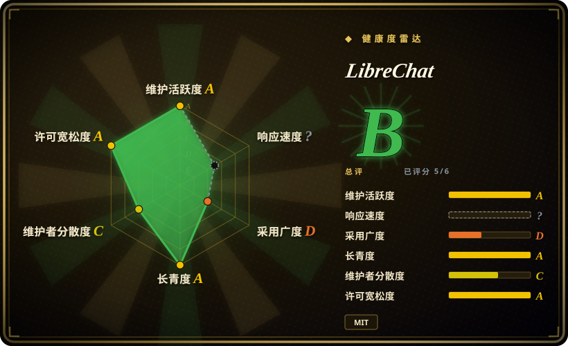
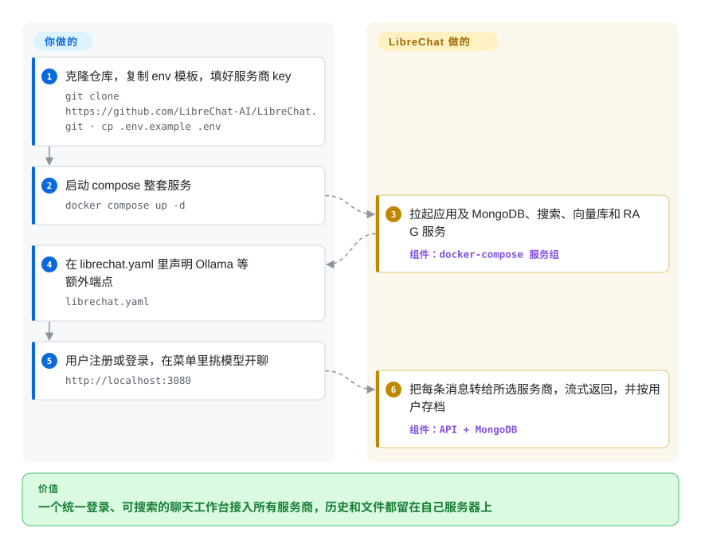

# LibreChat

公司里一半人要用 Claude，另一半要 GPT，数据组的模型跑在 Bedrock 上，与此同时大家把内部文档随手贴进哪个厂商的网页都有。LibreChat 是一个自己部署的多用户聊天应用：所有人登录你的服务器，在同一个模型菜单里挑上面任何一家，聊天记录、文件和智能体都留在你自己的数据库里。

## 何时使用

你在一家几百人的公司负责内部工具。法务刚发现有人把一份客户合同贴进了自己的个人 ChatGPT 标签页；工程团队要通过 AWS Bedrock 用 Claude，因为企业协议签在那边；数据组则要求敏感内容只走 Ollama 上的本地模型。每人买三份 SaaS 席位，数据放在哪的问题一个也没解决。这时你会想到 LibreChat：一套挂在你 SSO（OAuth2、OpenID、LDAP）后面的 Docker Compose，OpenAI、Anthropic、Bedrock、Azure、Vertex AI、Google 以及任何 OpenAI 兼容端点都在一个配置文件里声明，聊天记录、上传文件、共享提示词和智能体都存在你自己掌握的 MongoDB 里。

它和 [Open WebUI](open-webui.zh.md) 之间，看许可证和服务商构成：LibreChat 是纯 MIT，而 Open WebUI 的许可证规定部署每月超过 50 个用户后不得去掉它的品牌标识；LibreChat 把 Bedrock、Vertex 这类云厂商当一等端点支持，而不是统统归为“OpenAI 兼容”。它和 [NextChat](nextchat.zh.md) 之间，看账号：NextChat 没有用户账号，只有一个共享密码，历史存在各自浏览器里；LibreChat 给每个员工一个真实账号、服务端的聊天全文搜索，以及管理员能在线修改的按角色权限。

## 怎么用起来

LibreChat 是一个夹在用户和模型服务商之间的 Web 应用（React 前端加 Node/Express 后端）。**聊天界面、用户账号、对话存储、搜索、文件处理和智能体运行时都是它自带的**——你写的是配置，不是代码：`.env` 放密钥和服务商 key（也可以把 key 标成 `user_provided`，让每个用户自己填），`librechat.yaml` 声明 OpenRouter、本地 Ollama 这类额外端点，以及智能体、MCP 和界面设置。默认的 compose 文件会在应用旁边拉起 MongoDB（用户和消息的主存储）、Meilisearch（“搜索全部消息”背后的检索索引），以及一个独立的 Python RAG API 和 pgvector 数据库（带向量检索的 Postgres），后者把上传文件切成可检索的片段。用户发消息时，后端把它转给所选端点，流式返回答案并存档；智能体在此之上接工具——MCP 服务器（Model Context Protocol，一种接外部工具的标准插口）、文件检索、联网搜索和代码解释器。要扩到多台机器（Redis 支撑断线续流、Helm 上 Kubernetes、OpenTelemetry 导出），也只是在同一套服务上加配置。

<!-- flow-steps:begin (generated from flows/librechat.json by tools/flow_card.py — do not edit) -->

流程文字版

1. **你**：克隆仓库，复制 env 模板，填好服务商 key — `git clone https://github.com/LibreChat-AI/LibreChat.git · cp .env.example .env`
2. **你**：启动 compose 整套服务 — `docker compose up -d`
3. **LibreChat**：拉起应用及 MongoDB、搜索、向量库和 RAG 服务 — 组件：`docker-compose 服务组`
4. **你**：在 librechat.yaml 里声明 Ollama 等额外端点 — `librechat.yaml`
5. **你**：用户注册或登录，在菜单里挑模型开聊 — `http://localhost:3080`
6. **LibreChat**：把每条消息转给所选服务商，流式返回，并按用户存档 — 组件：`API + MongoDB`

**价值**：一个统一登录、可搜索的聊天工作台接入所有服务商，历史和文件都留在自己服务器上

<!-- flow-steps:end -->

## 何时不用

- **你只是一个人，想在笔记本上有个聊天窗口。** 默认就是五个容器（应用、管理面板、MongoDB、Meilisearch、pgvector 加 RAG API）。改用 [Open WebUI](open-webui.zh.md)（`pip install open-webui`，默认 SQLite）或 [NextChat](nextchat.zh.md)（单容器，历史存在浏览器里）。
- **你的模型主要在本地，希望界面帮你管模型。** LibreChat 把 Ollama 当作 `librechat.yaml` 里声明的自定义端点；[Open WebUI](open-webui.zh.md) 提供内置 Ollama 的镜像，本来就围绕本地模型设计，本地优先时它路径更短。
- **你的技术栈不允许 MongoDB。** 后端必须有 MongoDB 兼容存储（`MONGO_URI`，支持 DocumentDB）。如果平台组只运维 Postgres，选 [Open WebUI](open-webui.zh.md)，它跑在 SQLite 或 PostgreSQL 上。
- **你要把 AI 应用或工作流发布给外部客户。** LibreChat 是带智能体的内部聊天工作台，不是能发布接口、画可视化流程的应用搭建平台——那种需求用 [Dify](../agent-frameworks/workflow-builders/dify.zh.md)。
- **没人能负责升级前的审查。** GitHub 上每个 release 都标着 pre-release，版本线还在 `0.8.x`，README 要求每次升级前先读 changelog 里的破坏性变更。如果没人做这件事，就固定一个镜像 tag 不动，或者改用面更窄的 [NextChat](nextchat.zh.md)，能坏的地方少得多。

## 横向对比

| 替代品 | 是否收录 | 我们的评价 | 取舍 |
|---|---|---|---|
| [Open WebUI](open-webui.zh.md) | ✅ | 给全公司做一个接多家云服务商的聊天门户，选 LibreChat；以 Ollama 本地模型为中心、且要用 SQLite 或 Postgres 替代 MongoDB 时，选 Open WebUI。 | Open WebUI 起步更轻，本地模型和内置 RAG 更强，但许可证要求超过 50 个用户时必须保留“Open WebUI”品牌；LibreChat 是 MIT，代价是要运维 MongoDB、Meilisearch 和 pgvector。 |
| [NextChat](nextchat.zh.md) | ✅ | 几分钟部署一个自带 key 的个人客户端，选 NextChat；一旦需要每人一个账号和服务端历史，选 LibreChat。 | NextChat 单容器、历史存浏览器、只有一个共享密码；LibreChat 要付出一套数据库，换来 SSO、搜索、智能体和管理面板。 |
| [HiveChat](../team-chat/hivechat.zh.md) | ✅ | 小团队主要诉求是按分组分配模型和 token 额度、想要轻量的 Postgres 应用时，选 HiveChat；更看重智能体、MCP、文件检索和多种认证后端时，选 LibreChat。 | HiveChat 范围更窄、更好运维，但更年轻、更不活跃；LibreChat 功能面更大，运维也更重。 |
| Lobe Chat（`lobehub/lobe-chat`） | 未收录 | 最看重精致的消费级界面和它的插件、智能体市场时，选 Lobe Chat；要企业认证和服务商覆盖面时，选 LibreChat。 | 两者都是 TypeScript 聊天平台；我们没读过 Lobe Chat 的仓库，这里的定位是一般印象，未经核实。 |
| [Dify](../agent-frameworks/workflow-builders/dify.zh.md) | ✅ | 要搭建并发布 LLM 应用和工作流，选 Dify；要给员工一个统一的聊天工作台，选 LibreChat。 | Dify 是应用和工作流搭建平台，许可证带附加条件；LibreChat 是终端用户聊天应用，不是搭建器。 |

## 技术栈

- **应用：** TypeScript/JavaScript 的 npm workspaces 单仓——`api/`（按 `.nvmrc` 用 Node 24，Express 5、Mongoose）、`client/`（React 18 + Vite）、共享的 `packages/`（智能体运行时是 `@librechat/agents` 包）。
- **数据存储：** MongoDB（用户、对话、智能体）、Meilisearch（消息搜索）、PostgreSQL + pgvector（RAG 用的文件向量）；多实例部署可选 Redis。
- **RAG 服务：** 独立的 Python 服务 `LibreChat-AI/rag-api`，单独一个容器。
- **部署：** 仓库里有 Docker Compose 文件和 Helm chart（`helm/librechat`、`helm/librechat-rag-api`）；可选 OpenTelemetry 导出和 Langfuse 追踪。

## 依赖

- **要运行的容器：** LibreChat 后端、管理面板、MongoDB、Meilisearch、pgvector 和 RAG API（都在默认 `docker-compose.yml` 里）。
- **模型服务商：** 你启用的服务商的 API key（OpenAI、Anthropic、Bedrock、Azure、Vertex、Google 或 OpenAI 兼容端点），或可访问的 Ollama、vLLM 本地模型服务。RAG API 还需要一个 embedding 服务商。
- **可选服务：** OAuth、OpenID 或 LDAP 身份源，Redis，S3 或 CloudFront 文件存储，代码解释器后端，以及联网搜索用的搜索和抓取服务商。

## 运维难度

**中等。** 首次启动就是 `cp .env.example .env && docker compose up -d`，但从此你要运维 MongoDB、Meilisearch 和 Postgres——备份、升级和上传文件带来的磁盘增长都归你。主要的持续成本是升级：项目在 `0.x` 版本线上迭代很快，要求每次升级前读 changelog 里的破坏性变更。SSO、按角色权限和端点调整大多是改配置（一部分能在管理面板里在线改，不用重新部署）。横向扩展要加 Redis 和负载均衡；上 Kubernetes 有现成的 Helm chart。

## 健康度与可持续性

- **维护——非常活跃（截至 2026-10-08）。** 每天都有提交；v0.8.8 于 2026-10-01 发布，此前从 8 月中旬起出了四个候选版。GitHub 上所有 release 都标着 pre-release，所以“稳定版”以 changelog 为准，而不是看 GitHub 标记。
- **治理——创始人主导，现已归属一家公司。** Danny Avila 创建了项目，至今贡献大部分提交；ClickHouse 于 2025-11-04 宣布收购 LibreChat 并接收团队，管理面板镜像现在发布在 `clickhouse/` 仓库路径下。路线图因此归一家厂商所有，它公开的目标是围绕自家数据库做“Agentic Data Stack”。
- **年龄与 Lindy——中等。** 2023-02 创建（约 3.6 年），一直持续活跃，熬过了大多数第一波 ChatGPT 仿制界面；公司接手延长了续航，但带来了战略风险。
- **采用。** 约 4.54 万 star、9.3 千 fork（GitHub API，2026-10-08）；ClickHouse 点名 Shopify、Daimler Truck 等用户。采用度这一轴按 npm 包打分偏低，只是因为它以容器形式部署，而不是作为包被依赖。
- **风险信号。** MIT 许可证，至今没有改过许可证；要盯的是收购——将来拆成开源核心加付费版是可能的，但目前没有宣布。

## 存疑（未验证）

- [未验证] star 和 fork 数、v0.8.8 日期、提交节奏都是 2026-10-08 的 GitHub API 快照。
- [未验证] Shopify、Daimler Truck 是用户这一点来自 ClickHouse 的收购公告（clickhouse.com/blog/clickhouse-acquires-librechat），没有独立核实。
- [推断] “将来可能拆成开源核心加付费版”是对厂商持有的一般判断；ClickHouse 和仓库都没有宣布过许可证变化。
- [推断] 横向对比里 Lobe Chat 和 HiveChat 的定位来自它们的一般范围，不是逐项功能实测。
- [未验证] 50 个用户的品牌门槛取自 2026-10-08 读到的 Open WebUI LICENSE 文件；依赖它之前请再核一次。
