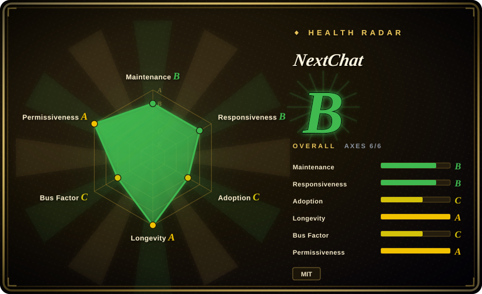
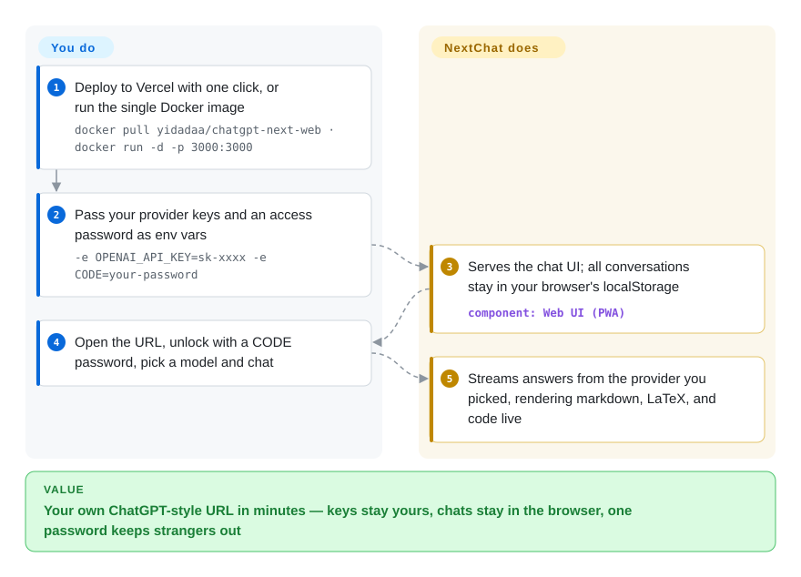

# NextChat

You pay for OpenAI, Anthropic, and DeepSeek keys, yet each vendor's web app wants its own account, its own tab, and keeps your conversations on its servers. NextChat collapses them into one self-hosted, ChatGPT-style chat UI: you feed your keys (or a gateway URL) to a Vercel one-click or a single Docker container, and the chat history stays in your own browser's local storage.

## When to use

You want a private ChatGPT-style chat UI that you control, fronting whatever model APIs you already pay for, without sending your conversations through a vendor's SaaS. You have an OpenAI key, an Anthropic key, maybe a local Ollama box, and you'd rather not juggle a different app per provider or keep raw keys in a desktop client. You click "Deploy to Vercel", paste your `OPENAI_API_KEY` (and optionally a `CODE` access password so the public URL isn't open to the world), and within minutes you have a fast PWA chat front-end — markdown, prompt templates, local conversation history in the browser, and a model picker that spans OpenAI, Claude, Gemini, DeepSeek, and more. Data lives in your browser's local storage, not a server you have to back up.

You also reach for it as a shareable team deployment in the cheap-and-cheerful sense: a small group fronting a shared gateway or a single set of provider keys behind one `CODE` password, plus the native desktop and mobile builds when people want an app icon instead of a tab. It's the "deploy in five minutes, point it at my keys" option — the floor of self-hosted chat UIs, not a platform you administer.

## How it works

NextChat is a Next.js/React app with one client core: a PWA whose conversations and settings live entirely in your browser's localStorage, plus a thin server process that holds the environment variables you passed at deploy time and relays chat requests to providers — so keys need not sit in the browser, and the desktop app can relay through Tauri's fetch instead. Providers are switched on with env vars: `OPENAI_API_KEY` (required), `CODE` (comma-separated access passwords), and optional `ANTHROPIC_API_KEY`, `GOOGLE_API_KEY`, `DEEPSEEK_API_KEY`, `AZURE_URL`, and others; `BASE_URL` points the whole app at any OpenAI-compatible endpoint (the README recommends pairing it with self-deployed model runners like RWKV-Runner or LocalAI), while `CUSTOM_MODELS` decides which model ids appear in the picker. From there it streams tokens from whichever provider you pick, renders markdown/LaTeX/mermaid, applies prompt templates (masks), and adds artifacts, plugins, and realtime chat; MCP support is opt-in at build time via `ENABLE_MCP=true`. What stays yours: the provider keys and every governance question — the community edition has no accounts, quotas, or server-side history.

<!-- flow-steps:begin (generated from flows/nextchat.json by tools/flow_card.py — do not edit) -->

Text version of the flow

1. **You**: Deploy to Vercel with one click, or run the single Docker image — `docker pull yidadaa/chatgpt-next-web · docker run -d -p 3000:3000`
2. **You**: Pass your provider keys and an access password as env vars — `-e OPENAI_API_KEY=sk-xxxx -e CODE=your-password`
3. **NextChat**: Serves the chat UI; all conversations stay in your browser's localStorage — component: `Web UI (PWA)`
4. **You**: Open the URL, unlock with a CODE password, pick a model and chat
5. **NextChat**: Streams answers from the provider you picked, rendering markdown, LaTeX, and code live

**Value**: Your own ChatGPT-style URL in minutes — keys stay yours, chats stay in the browser, one password keeps strangers out

<!-- flow-steps:end -->

## When NOT to use

- **You need a multi-user platform with RBAC, per-user accounts, and token quotas.** The community edition is single-user-shaped: one `CODE` password gates the whole instance, with no user accounts, no per-group model access, no usage caps. For centralized admin-over-team governance, use [HiveChat](../team-chat/hivechat.md) or [LibreChat](librechat.md). (The README markets a separate paid Enterprise Edition with permission control and security auditing — that is not this open-source repo.)
- **You need a project that is shipping today.** The maintenance cadence has decelerated: the last tagged release (v2.16.1) is from 2025-07-29 and the newest commit on `main` is 2026-08-11 (GitHub API, 2026-09-28). If an active release line is a hard requirement, pick [LibreChat](librechat.md) or [Open WebUI](open-webui.md), which are still cutting releases; re-check this repo's status before committing either way.
- **You're deploying the pure front-end and worried about key exposure.** On a static/Vercel deploy where the browser talks to providers, your API key and proxy config can be reachable client-side; the `CODE` password gates access but is not real per-user auth. Put it behind a server-side proxy or gateway, and never expose an unprotected instance with a real key. [未验证]
- **You want an agent framework or orchestration layer.** It's a chat client, not a place to build tools, multi-step agents, or RAG pipelines. It has MCP client support, but it is not an agent runtime — for that, reach for an agent framework.
- **You need a model server.** NextChat runs *no* models; it calls provider APIs (or your Ollama/OpenAI-compatible endpoint). The inference backend is yours to supply.
- **You need a self-hosted knowledge base / document RAG.** No built-in vector store or document ingestion; it's a conversational front-end, not a retrieval platform.
- **You depend on a heavyweight governance/audit story.** Single-vendor open-source project whose cadence has decelerated (see above); conversation history is client-local by default, so there's no central audit log or server-side retention to govern.

## Comparison

| Alternative | In index | Our verdict | Tradeoff |
|---|---|---|---|
| [LibreChat](librechat.md) | ✅ | Choose LibreChat when you need a full multi-user platform rather than a lightweight single-deploy client. | Accounts, many auth backends, RAG, assistants, and code interpreter; far more capable and far heavier to run. NextChat is a lighter client, not a team platform. |
| Lobe Chat | 未收录 | Choose Lobe Chat when you want a polished multi-provider UI with plugins, knowledge base, and optional multi-user modes. | Broader feature surface and heavier once cloud/DB features are enabled. NextChat stays minimal and browser-local. |
| [Open WebUI](open-webui.md) | ✅ | Choose Open WebUI when Ollama/local-model serving, RBAC, users, and pipelines matter more than a static/Vercel-style client. | Strong self-hosted UI for local models, but it needs a server and database. NextChat trades those features for simpler deployment and less backend operation. |
| [HiveChat](../team-chat/hivechat.md) | ✅ | Choose HiveChat when you need admin-managed team chat with per-group model access, token quotas, and Postgres-backed user accounts. | HiveChat is the team-governance answer NextChat's community edition deliberately is not. |
| ChatGPT / Claude.ai (commercial SaaS) | 未收录 | Choose commercial SaaS when zero-ops vendor management is more important than self-hosting and provider choice. | Locked to one model family with the provider holding your data; NextChat trades that convenience for self-hosting, multi-provider choice, and key/data control. |

## Tech stack

- **Language:** TypeScript (~92% of the code, GitHub languages 2026-09-28), with SCSS/JS and platform packaging.
- **Framework:** Next.js + React; ships as a PWA web app and as native desktop/mobile builds (Tauri for desktop, per the roadmap; iOS app on the App Store).
- **Storage:** conversation history and settings in browser local storage by default — no required server-side database for the community edition.
- **Providers (per README env vars):** OpenAI, Azure OpenAI, Google Gemini, Anthropic Claude, Baidu, ByteDance, Alibaba, iFlytek, ChatGLM, DeepSeek, SiliconFlow, 302.AI, Stability — plus any OpenAI-compatible endpoint via `BASE_URL` (self-deployed runners like RWKV-Runner or LocalAI are the README's suggestion).
- **Extras:** prompt templates/masks, markdown (LaTeX, mermaid, code highlight), artifacts, plugins, realtime chat; MCP support behind build-time `ENABLE_MCP=true`.

## Dependencies

- **Runtime:** NodeJS ≥ 18 and Docker ≥ 20 for the self-hosted paths; the published image is `yidadaa/chatgpt-next-web` (a one-line `setup.sh` installer also exists); desktop/mobile apps are standalone builds (~5MB client per the README). No database is required for the community edition.
- **Provider keys (yours to supply):** at minimum `OPENAI_API_KEY` (multiple keys can be comma-joined), plus keys/base-URLs for any other providers you enable. NextChat calls these APIs; it does not host models.
- **Access control:** an optional `CODE` environment variable sets comma-separated access passwords for a public deployment — this is the only built-in gate, not per-user auth.
- **Install paths:** one-click Vercel deploy (also Zeabur/Gitpod buttons), Docker image, shell script, and prebuilt desktop/mobile apps; building from source needs a Node toolchain (`yarn install · yarn dev`).

## Ops difficulty

**Low.** This is the project's whole point — the Vercel one-click path gives you a running instance with no server to manage, and the Docker image is a single container with no database. Day-2 burden is mostly: rotating provider keys, setting a strong `CODE` password (and ideally fronting it with a gateway so keys aren't client-reachable), and tracking this single-vendor project's decelerating `main`/release cadence (last tag v2.16.1, 2025-07). Because state is browser-local, there's nothing to back up server-side — which is also why it doesn't scale into multi-user territory: there's no central data layer to govern. The hard part isn't running NextChat; it's recognizing when "shared password over my keys" has outgrown its limits and you need a real team platform instead.

## Health & viability

- **Responsiveness**: Grade B — median first-response time 339.8 hours across 5 qualifying issues/PRs.
- **Maintenance — visibly decelerating (as of 2026-09).** Newest commit on `main`: **2026-08-11** (48 days quiet at check time); newest tagged release: **v2.16.1, 2025-07-29** — ~14 months stale, and the whole repo has had no push since 2026-08-11 (GitHub API). Not archived, but this is coasting on both branches of the story: pins to releases lag the ecosystem, and even `main` is no longer moving week to week.
- **Governance & bus factor — single-vendor, open-core-adjacent.** Organization-owned (ChatGPTNextWeb), but the scorer counts **2 active maintainers** in the last 12 months with the top contributor at ~94% of commits. The vendor monetizes a separate paid Enterprise Edition (brand UI, admin-managed resources, permissions, security auditing — README), so treat governance as vendor-controlled, not foundation-style. [推断]
- **Age & Lindy — moderate.** Created 2023-03, ~3.5 years old; old enough to have outlived the first wave of ChatGPT-clone UIs, but its durability rests on the vendor's continued interest — which the 2026 quiet period puts in question.
- **Adoption & ecosystem.** ~88.8k stars / ~59k forks (GitHub API, 2026-09-28) and ~695k release downloads (scorer) — still the "deploy-in-five-minutes" floor of self-hosted chat UIs by mindshare; but stars overstate current maintenance, and the feature surface is deliberately thin vs. LibreChat/Open WebUI/Lobe Chat. [未验证：生产采用广度]
- **Risk flags — open-core boundary + staleness.** The paid Enterprise Edition (permissions/RBAC) is the gated tier; capabilities you might expect (multi-user auth) live behind it, not in this MIT repo. If you pin to releases, the v2.16.1-vs-`main` gap is a supply-chain flag; the newer risk is that both have gone quiet. No relicense or CVE history asserted here.

## Caveats (unverified)

- [未验证] Stars (88,823), forks, last commit 2026-08-11, and the v2.16.1 release date are GitHub API snapshots of 2026-09-28 — volatile, re-check.
- [未验证] The "key-exposure on pure-frontend deploys" caution reflects how a browser-to-provider static deploy works in general; the exact exposure depends on your deployment topology (server-side proxy vs. direct), so audit your own setup rather than assuming.
- [未验证] The paid Enterprise Edition's terms were not verified here — the README advertises it (business@nextchat.club) but the product is closed and separate from this MIT repo.
- [推断] "Single-user-shaped community edition" is inferred from the `CODE`-password-only access model and browser-local storage, not from a documented hard limit on concurrent users.
- [推断] "Maintenance decelerating" reads one 48-day quiet stretch together with a 14-month release gap; it could resume without warning — check again before betting on it either way.
- [推断] Comparison verdicts (LibreChat/Open WebUI being broader, Lobe Chat heavier) reflect general project positioning, not a benchmarked head-to-head; LibreChat, Open WebUI, and HiveChat are indexed here, Lobe Chat is not.
