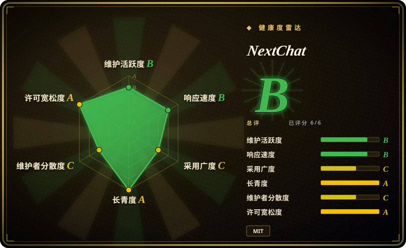
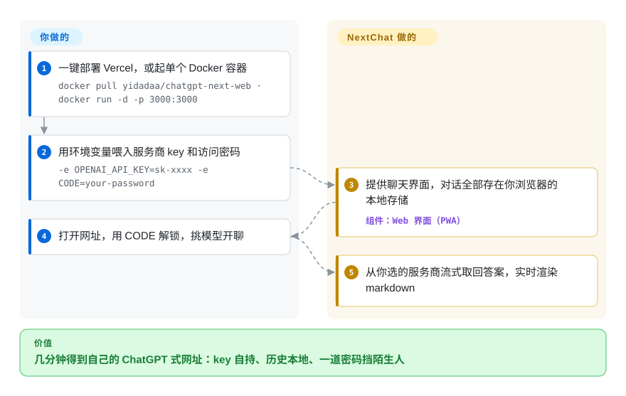

# NextChat

你手里有 OpenAI、Anthropic、DeepSeek 的 key，但每家的网页端都要各自的账号与标签页，对话还留在他们的服务器上。NextChat 把它们收进一个自部署的 ChatGPT 风格聊天界面：key（或网关地址）交给一次 Vercel 一键部署或一个 Docker 容器，聊天记录留在你自己浏览器的 local storage 里。

## 何时使用

你想要一个自己掌控的、ChatGPT 风格的私有聊天界面，接住你本来就在付费的那些模型 API，而不把对话送进某家厂商的 SaaS。你手里有一个 OpenAI key、一个 Anthropic key，也许还有一台本地 Ollama，但你不想为每个服务商各开一个 app，也不想把裸 key 塞进桌面客户端。你点一下「Deploy to Vercel」，填进 `OPENAI_API_KEY`（再可选地设一个 `CODE` 访问密码，免得公网 URL 对全世界敞开），几分钟内就有了一个快速的 PWA 聊天前端——markdown、prompt 模板、对话历史存在浏览器本地、一个横跨 OpenAI、Claude、Gemini、DeepSeek 等的模型选择器。数据存在你浏览器的 local storage 里，而不是某个你得操心备份的服务器上。

你也会把它当成「便宜好用」意义上的可共享团队部署：一小撮人共用一套服务商 key 或一个共享网关，后面只用一个 `CODE` 密码挡着；再加上原生桌面和移动端构建，适合那些想要一个 app 图标而非一个标签页的人。它是「五分钟部署、指向我的 key」那一档——自部署聊天 UI 的地板，而不是一个需要你去管理的平台。

## 怎么用起来

NextChat 是一个 Next.js/React 应用：客户端是一个 PWA，对话和设置全部存在浏览器的 localStorage 里；服务端是一个薄薄的 Next.js 进程，保管你部署时传入的环境变量、把请求转发给各服务商——key 不必落在浏览器里，桌面端则改用 Tauri 自带的 fetch 去转发。服务商靠环境变量开关：`OPENAI_API_KEY`（必需）、`CODE`（逗号分隔的访问密码），再按需加 `ANTHROPIC_API_KEY`、`GOOGLE_API_KEY`、`DEEPSEEK_API_KEY`、`AZURE_URL` 等；`BASE_URL` 能把整个应用指到任意 OpenAI 兼容端点（README 推荐搭配 RWKV-Runner、LocalAI 这类自部署模型运行器），`CUSTOM_MODELS` 决定选择器里出现哪些模型。之后它就从你选定的服务商流式取回回答，渲染 markdown、LaTeX、mermaid，套用 prompt 模板（mask），并带 artifacts、插件与实时语音；MCP 要在构建时设 `ENABLE_MCP=true` 才开。留在你手里的：key 本身，以及一切治理问题——社区版没有账号、配额或服务端历史。

<!-- flow-steps:begin (generated from flows/nextchat.json by tools/flow_card.py — do not edit) -->

流程文字版

1. **你**：一键部署 Vercel，或起单个 Docker 容器 — `docker pull yidadaa/chatgpt-next-web · docker run -d -p 3000:3000`
2. **你**：用环境变量喂入服务商 key 和访问密码 — `-e OPENAI_API_KEY=sk-xxxx -e CODE=your-password`
3. **NextChat**：提供聊天界面，对话全部存在你浏览器的本地存储 — 组件：`Web 界面（PWA）`
4. **你**：打开网址，用 CODE 解锁，挑模型开聊
5. **NextChat**：从你选的服务商流式取回答案，实时渲染 markdown

**价值**：几分钟得到自己的 ChatGPT 式网址：key 自持、历史本地、一道密码挡陌生人

<!-- flow-steps:end -->

## 何时不用

- **你需要带 RBAC、独立用户账号和 token 配额的多用户平台。** 社区版是单用户形态：一个 `CODE` 密码挡住整个实例，没有用户账号、没有按组的模型权限、没有用量上限。要做集中式的「管理员管团队」治理，用 [HiveChat](../team-chat/hivechat.zh.md) 或 [LibreChat](librechat.zh.md)。（README 确实在推销一个收费企业版，带权限控制与安全审计；那不是这个开源仓库。）
- **你要一个现在仍在发版的项目。** 维护节奏已明显放缓：最近的 tag release 是 v2.16.1（2025-07-29），`main` 上最近一次提交停在 2026-08-11（GitHub API，2026-09-28 核）。若活跃的发布线是硬要求，请选仍在持续剪 release 的 [LibreChat](librechat.zh.md) 或 [Open WebUI](open-webui.zh.md)，无论选谁都先复查本仓库现状。
- **你部署的是纯前端，又担心 key 暴露。** 在浏览器直连服务商的静态/Vercel 部署里，你的 API key 和代理配置可能在客户端可达；`CODE` 密码只挡访问，不是真正的按用户鉴权。把它放到服务端代理或网关后面，绝不要把带真实 key 的实例无保护地暴露出去。[未验证]
- **你想要一个 agent 框架或编排层。** 它是聊天客户端，不是搭工具、多步 agent 或 RAG 管线的地方。它带 MCP 客户端能力，但不是 agent 运行时——那种需求请用 agent 框架。
- **你需要一个模型服务端。** NextChat *不跑*任何模型；它调用服务商 API（或你的 Ollama/OpenAI 兼容端点）。推理后端得你自己供。
- **你需要自部署的知识库 / 文档 RAG。** 没有内建向量库或文档摄入；它是对话前端，不是检索平台。
- **你依赖一套重型的治理/审计能力。** 单一厂商的开源项目，发版节奏已经放缓（见上文）；对话历史默认存在客户端本地，因此没有集中的审计日志或服务端留存可供治理。

## 横向对比

| 替代品 | 是否收录 | 我们的评价 | 取舍 |
|---|---|---|---|
| [LibreChat](librechat.zh.md) | ✅ | 需要完整多用户平台，而不是轻量单次部署客户端时，选 LibreChat。 | 账号、多种鉴权后端、RAG、assistants、代码解释器；能力强得多，也重得多。NextChat 是更轻的客户端，不是团队平台。 |
| Lobe Chat | 未收录 | 需要精致的多服务商 UI、插件、知识库和可选多用户模式时，选 Lobe Chat。 | 功能面更宽，开启 cloud/DB 功能后更重。NextChat 保持极简、浏览器本地。 |
| [Open WebUI](open-webui.zh.md) | ✅ | Ollama/本地模型服务、RBAC、用户和 pipelines 比静态/Vercel 式客户端更重要时，选 Open WebUI。 | 它是强本地模型场景的自部署 UI，但需要服务器和数据库。NextChat 用这些能力换来了更简单的部署和更少后端运维。 |
| [HiveChat](../team-chat/hivechat.zh.md) | ✅ | 需要管理员托管的团队聊天、按组模型权限、token 配额和 Postgres 用户账号时，选 HiveChat。 | HiveChat 正是 NextChat 社区版有意不去做的团队治理答案。 |
| ChatGPT / Claude.ai（商业 SaaS） | 未收录 | 零运维厂商托管比自部署和服务商选择更重要时，选商业 SaaS。 | 锁定单一模型家族，数据由服务商持有。NextChat 用这份便利换来了自部署、多服务商选择和 key/数据掌控。 |

## 技术栈

- **语言：** TypeScript（约占代码 92%，GitHub languages 2026-09-28），外加 SCSS/JS 与各平台打包。
- **框架：** Next.js + React；以 PWA web app 形态发布，同时提供原生桌面/移动端构建（桌面端按 roadmap 用 Tauri；iOS 应用已上架 App Store）。
- **存储：** 对话历史和设置默认存在浏览器 local storage——社区版不强制要求服务端数据库。
- **服务商（按 README 的环境变量清单）：** OpenAI、Azure OpenAI、Google Gemini、Anthropic Claude、百度、字节、阿里、讯飞、ChatGLM、DeepSeek、SiliconFlow、302.AI、Stability——外加经 `BASE_URL` 接入的任意 OpenAI 兼容端点（README 的建议是搭配 RWKV-Runner、LocalAI 这类自部署运行器）。
- **其他：** prompt 模板/masks、markdown（LaTeX、mermaid、代码高亮）、artifacts、插件、实时语音；MCP 能力藏在构建期开关 `ENABLE_MCP=true` 后面。

## 依赖

- **运行时：** 自部署路径要求 NodeJS ≥ 18、Docker ≥ 20；发布镜像是 `yidadaa/chatgpt-next-web`（另有一行式 `setup.sh` 安装脚本）；桌面/移动端是独立构建（README 称客户端约 5MB）。社区版不需要数据库。
- **服务商 key（你自己供）：** 至少要 `OPENAI_API_KEY`（可用逗号连接多个 key），再加上你要启用的其他服务商的 key/base-URL。NextChat 调这些 API，它不托管模型。
- **访问控制：** 可选的 `CODE` 环境变量设定逗号分隔的访问密码——这是唯一的内建闸门，不是按用户鉴权。
- **安装路径：** 一键 Vercel 部署（也有 Zeabur/Gitpod 按钮）、Docker 镜像、shell 脚本，以及预编译的桌面/移动 app；从源码构建需要 Node 工具链（`yarn install · yarn dev`）。

## 运维难度

**低。** 这正是项目的全部立意——Vercel 一键路径给你一个跑起来的实例，没有服务器要管，Docker 镜像也是单容器、无数据库。Day-2 负担主要是：轮换服务商 key、设一个强 `CODE` 密码（最好再用网关挡在前面，免得 key 在客户端可达），以及留意这个单一厂商项目已放缓的 `main`/发版节奏（最近的 tag 还是 2025-07 的 v2.16.1）。因为状态是浏览器本地的，服务端没什么要备份——这也正是它无法迈进多用户领域的原因：没有可供治理的集中数据层。难的不是把 NextChat 跑起来；难的是认出「共享密码 + 我的 key」何时已经超出了它的能力边界，该换一个真正的团队平台了。

## 健康度与可持续性

- **响应速度**：Grade B——中位首次响应时间 339.8 小时，基于 5 个 qualifying issues/PRs。
- **维护——明显减速（截至 2026-09）。** `main` 上最近一次提交为 **2026-08-11**（核查时已静默 48 天）；最近一个带 tag 的发布是 **v2.16.1，2025-07-29**——已陈旧约 14 个月，且整个仓库自 2026-08-11 之后再无任何推送（GitHub API）。未归档，但故事的两条线都在惯性滑行：pin 到 release 会落后生态，连 `main` 也不再周周有动静。
- **治理与 bus factor——单一厂商，近 open-core。** 由 Organization（ChatGPTNextWeb）持有，但评分器数到近 12 个月仅 **2 名活跃维护者**，头号贡献者约占 94% 提交。该厂商另有收费企业版变现（品牌 UI、管理员统管的资源、权限控制、安全审计——README），所以把治理视作厂商掌控，而非基金会式。[推断]
- **年龄与 Lindy——中等。** 创建于 2023-03，约 3.5 年；老到熬过了第一波 ChatGPT 克隆 UI，但其存续取决于厂商的持续投入——2026 年的静默期让这一点存疑。
- **采用与生态。** 约 88.8k star / 约 59k fork（GitHub API，2026-09-28）、release 下载约 69.5 万（评分器）——以心智占有而论，它仍是自部署聊天 UI「五分钟部署」的地板；但 star 高估了当前的维护程度，且功能面相比 LibreChat/Open WebUI/Lobe Chat 是有意做薄的。[未验证：生产采用广度]
- **风险标记——open-core 边界 + 停滞。** 收费企业版（权限/RBAC）是被门控的那一档；你可能期待的能力（多用户鉴权）藏在它后面，而不在这个 MIT 仓库里。若你 pin 到 release，「v2.16.1 vs. `main` 的落差」本身就是供应链标记；更新的风险是两者都已归于安静。此处不断言重新授权或 CVE 历史。

## 存疑（未验证）

- [未验证] Star 数（88,823）、fork 数、最近提交 2026-08-11 与 v2.16.1 发布日期均为 2026-09-28 的 GitHub API 快照——易变，请重新核实。
- [未验证]「纯前端部署 key 暴露」这一提醒反映的是浏览器直连服务商的静态部署的一般机理；确切的暴露程度取决于你的部署拓扑（服务端代理 vs. 直连），请审计你自己的配置而非默认假设。
- [未验证] 收费企业版的条款未在此核实——README 确在推销它（business@nextchat.club），但该产品闭源、独立于这个 MIT 仓库。
- [推断]「社区版是单用户形态」是从「只有 `CODE` 密码的访问模型 + 浏览器本地存储」推断出来的，而非来自某个文档化的并发用户硬上限。
- [推断]「维护减速」是把一段 48 天的静默与 14 个月的发版落差合起来读的；它可能无预警恢复——无论往哪个方向下注，都请先再核查。
- [推断] 对比结论（LibreChat/Open WebUI 更宽、Lobe Chat 更重）反映的是一般项目定位，而非实测正面对决；LibreChat、Open WebUI、HiveChat 此处已收录，Lobe Chat 未收录。
