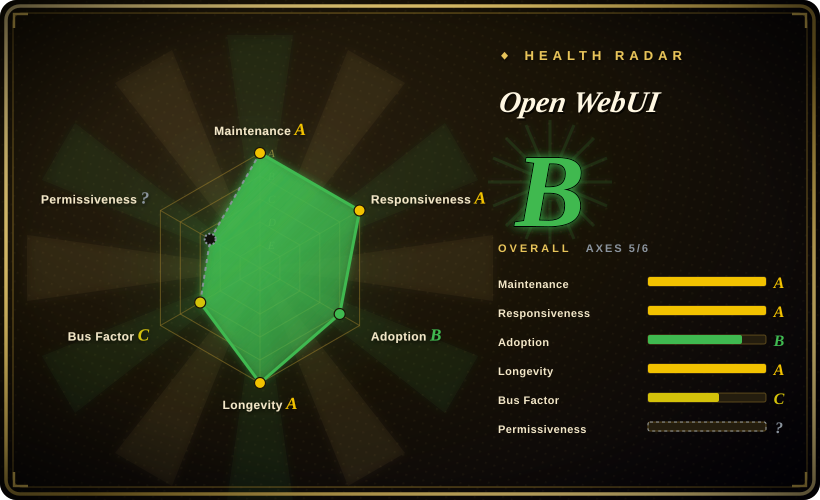
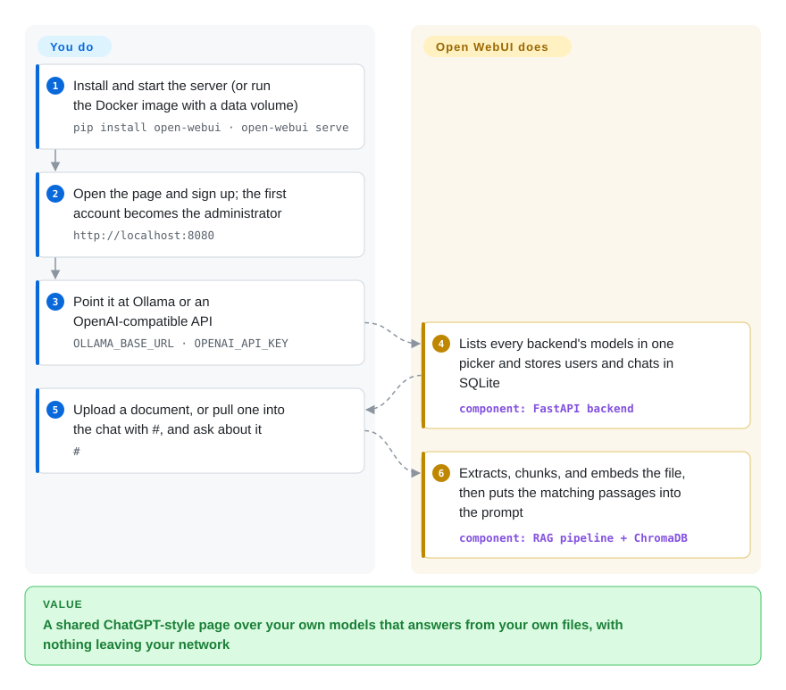

# Open WebUI

You have models running on your own machine or GPU box, but Ollama only gives you a terminal and an API on port 11434 — nobody else in the house or the team can use it, and it cannot read your PDFs. Open WebUI is the ChatGPT-style web front end you put on top: one container or one `pip install`, accounts and permissions for whoever you share it with, and document upload so the model answers from your files.

## When to use

You run a GPU server for a research group or a small company and have Ollama serving Llama and Qwen models on it. People keep asking for "the ChatGPT thing, but ours": they want to drop in a 40-page policy PDF and ask what it says about travel reimbursements, without the file leaving the building, and some machines are on a network with no internet at all. You start Open WebUI with one `docker run` (or the `:ollama` image that bundles Ollama), sign up — the first account becomes the administrator — and add users, groups, and per-group model access. Uploaded files are extracted, split into chunks, and embedded into a local vector store, so answers cite your documents; with `HF_HUB_OFFLINE=1` the whole thing runs air-gapped.

You pick it over [LibreChat](librechat.md) when local models and lightness decide: Open WebUI runs as one process on SQLite by default and treats Ollama as home ground, while LibreChat needs MongoDB, Meilisearch, and pgvector and is strongest as a multi-cloud-provider portal. You pick it over [NextChat](nextchat.md) because NextChat has no accounts and no document retrieval — just a shared password and browser-local history. The price is the license: above 50 users a month you may not remove the "Open WebUI" branding without an enterprise license.

## How it works

Open WebUI is a single Python web server (FastAPI) that also serves the SvelteKit front end, so one process is the whole app. **It ships the chat UI, user accounts with roles and groups, chat storage, and a full document-retrieval pipeline** — you point it at model backends (`OLLAMA_BASE_URL` for Ollama, or an OpenAI-compatible URL plus key for vLLM, LM Studio, OpenRouter and similar) and mount a data volume; it does the rest. Chats and users go into SQLite unless you set `DATABASE_URL` to PostgreSQL. RAG (retrieval-augmented generation — looking up relevant passages from your files and pasting them into the prompt) works out of the box: an uploaded file is text-extracted, chunked, embedded with a small local model (`all-MiniLM-L6-v2` by default), and stored in ChromaDB unless you pick one of the other supported vector databases. You extend it without forking: Python "Functions" (filters that rewrite messages, actions that add buttons, pipes that act as custom models), tools, and MCP or OpenAPI tool servers.

<!-- flow-steps:begin (generated from flows/open-webui.json by tools/flow_card.py — do not edit) -->

Text version of the flow

1. **You**: Install and start the server (or run the Docker image with a data volume) — `pip install open-webui · open-webui serve`
2. **You**: Open the page and sign up; the first account becomes the administrator — `http://localhost:8080`
3. **You**: Point it at Ollama or an OpenAI-compatible API — `OLLAMA_BASE_URL · OPENAI_API_KEY`
4. **Open WebUI**: Lists every backend's models in one picker and stores users and chats in SQLite — component: `FastAPI backend`
5. **You**: Upload a document, or pull one into the chat with #, and ask about it — `#`
6. **Open WebUI**: Extracts, chunks, and embeds the file, then puts the matching passages into the prompt — component: `RAG pipeline + ChromaDB`

**Value**: A shared ChatGPT-style page over your own models that answers from your own files, with nothing leaving your network

<!-- flow-steps:end -->

## When NOT to use

- **You need to rebrand it for more than 50 users.** The Open WebUI License (BSD-3 plus a branding clause, in force since April 2025) forbids altering the "Open WebUI" name and logo in deployments above 50 end users in a rolling 30 days unless you hold written permission or an enterprise license. For a white-labelled internal or customer portal, use [LibreChat](librechat.md) (MIT).
- **Your legal policy requires an OSI-approved license or no CLA.** The current license is not an OSI license, GitHub reports it as `NOASSERTION`, and contributions require signing a CLA. Choose [LibreChat](librechat.md) or [NextChat](nextchat.md), both MIT.
- **You are building an AI product for external customers.** Open WebUI is a chat workspace, not an app builder that publishes workflows behind an API — use [Dify](../agent-frameworks/workflow-builders/dify.md).
- **You need hard per-group token budgets out of the box.** Open WebUI tracks usage and cost in admin dashboards, and caps are something you build with plugins; [HiveChat](../team-chat/hivechat.md) has per-group quotas as its core feature.
- **You only use cloud APIs and do not want to run a server.** If there is no local model and no document retrieval in the picture, [NextChat](nextchat.md) deploys as a static client in minutes and keeps keys and history in the browser.

## Comparison

| Alternative | In index | Our verdict | Tradeoff |
|---|---|---|---|
| [LibreChat](librechat.md) | ✅ | For a local-model, document-chat setup that one person can run, pick Open WebUI; pick LibreChat for a company-wide portal across many cloud providers, or whenever the branding clause is a blocker. | Open WebUI is one process on SQLite with built-in RAG; LibreChat is MIT with no branding condition but needs MongoDB, Meilisearch, and pgvector. |
| [NextChat](nextchat.md) | ✅ | Pick NextChat for a single-user cloud-API client with zero backend; pick Open WebUI once you need accounts, local models, or answers grounded in your files. | NextChat is lighter and MIT but has one shared password and no retrieval; Open WebUI costs a server and a data volume. |
| [HiveChat](../team-chat/hivechat.md) | ✅ | Pick HiveChat when per-group token quotas are the requirement; pick Open WebUI when local models, RAG, and plugins matter more. | HiveChat is narrow and younger; Open WebUI is broader and far more active but leaves budget caps to plugins. |
| [Dify](../agent-frameworks/workflow-builders/dify.md) | ✅ | Pick Dify to build and publish LLM apps and workflows; pick Open WebUI to give people a chat interface over your models. | Dify is a builder with its own license conditions; Open WebUI is an end-user chat app with a plugin system. |
| AnythingLLM (`Mintplex-Labs/anything-llm`) | not indexed | Consider it when "chat with my documents" in workspaces is the whole need; pick Open WebUI for a general multi-user chat front end over Ollama. | Overlapping scope; we have not read its repo, so this positioning is general, not verified here. |

## Tech stack

- **Backend:** Python 3.11–3.12 (`requires-python >= 3.11, < 3.13`), FastAPI, SQLAlchemy; SQLite by default (optionally encrypted), PostgreSQL optional; Redis for multi-worker or multi-node deployments.
- **Frontend:** SvelteKit 2 on Svelte 5, built into static assets served by the backend.
- **Retrieval:** ChromaDB by default; PGVector, Qdrant, Milvus, Elasticsearch, OpenSearch, Pinecone, S3Vector, Oracle 23ai supported; local sentence-transformers embeddings by default; Tika, Docling, and OCR engines for extraction.
- **Packaging:** PyPI package `open-webui`, Docker images `ghcr.io/open-webui/open-webui` (`:main`, `:cuda`, `:ollama`), Kubernetes via kustomize or Helm.

## Dependencies

- **Runtime:** Docker, or Python 3.11 for the pip install; a persistent volume for `/app/backend/data` (the README warns that omitting it loses your data).
- **Models:** an Ollama server (or the bundled `:ollama` image) and/or OpenAI-compatible API keys.
- **Optional:** NVIDIA GPU + container toolkit for the `:cuda` image, PostgreSQL, Redis, an external vector database, S3/GCS/Azure Blob for files, LDAP/OAuth/SCIM identity provider, web-search provider keys.

## Ops difficulty

**Low for one box, medium for a team.** A single `docker run` with a named volume is a working install, and SQLite needs no care at small scale. The work grows with use: model files from Ollama are large downloads, the embedding model is fetched from Hugging Face on first use (pre-seed it for offline sites), and releases on the `0.x` line arrive every few weeks with database migrations, so back up the data volume before upgrading. A shared deployment means moving to PostgreSQL, adding Redis for multiple workers, and wiring SSO.

## Health & viability

- **Maintenance — very active (as of 2026-10-08).** v0.11.4 shipped 2026-09-21, after v0.11.0 on 2026-07-27 and three point releases in between; daily work happens on the `dev` branch and lands on `main` at release time, so a quiet `main` for a couple of weeks is normal.
- **Governance — company-owned, founder-dominated.** Copyright sits with Open WebUI Inc.; creator Timothy Baek (`tjbck`) has authored the large majority of commits, contributors sign a CLA, and an Enterprise plan is sold alongside. The roadmap is the company's.
- **Age & Lindy — young but durable so far.** Created 2023-10 (about three years) and active the whole time; old for this wave of tools, young by Lindy standards.
- **Adoption — very high.** About 154k stars and 22.5k forks (GitHub API, 2026-10-08) and 1,302,921 PyPI downloads in the last month (scorer); the de-facto web front end for Ollama users.
- **Risk flags — the license.** The project moved from MIT to BSD-3 on 2025-01-10 and added the branding clause on 2025-04-18 (commits named in `LICENSE_HISTORY`); code from before those commits keeps its original license. Two relicenses in a short span, a CLA, and a commercial tier mean further license tightening cannot be ruled out.

## Caveats (unverified)

- [未验证] Star/fork counts, PyPI download volume, and release dates are API snapshots from 2026-10-08.
- [未验证] The 50-user branding threshold and CLA requirement are quoted from `LICENSE` on `main` as read on 2026-10-08; license text can change again with any commit.
- [推断] "Caps are something you build with plugins" reads the README (usage analytics in admin dashboards; rate limits listed as a plugin use case); we did not find or rule out a native per-group quota setting.
- [推断] "Further license tightening cannot be ruled out" is a judgment from the relicense history and commercial tier, not an announced plan.
- [推断] AnythingLLM's positioning in the comparison is general knowledge, not read from its repo.
