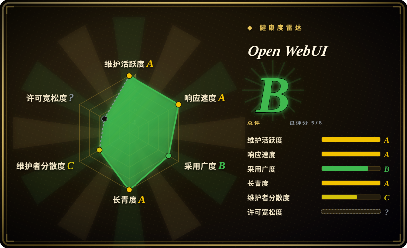
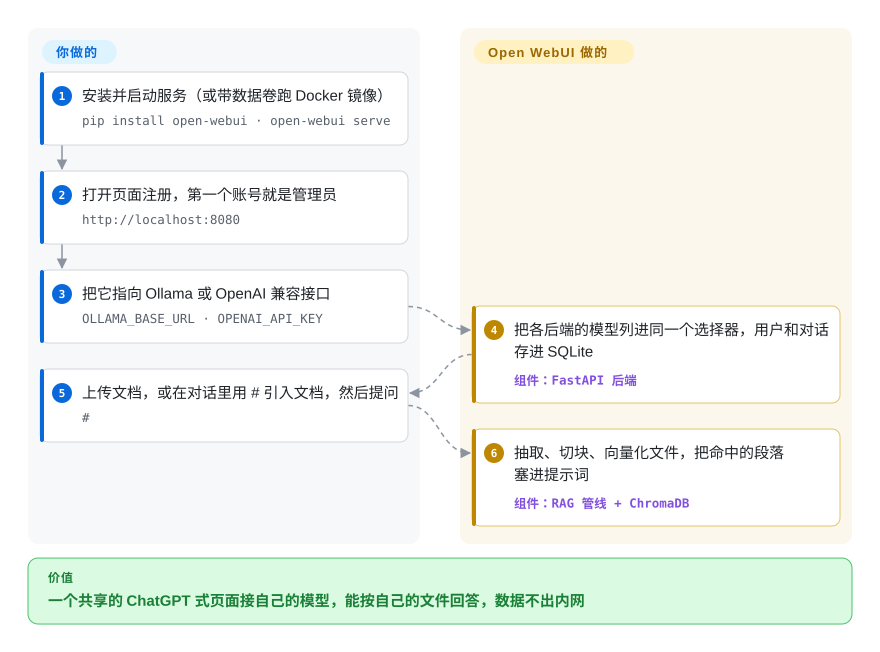

# Open WebUI

模型已经在你自己的电脑或 GPU 服务器上跑起来了，可 Ollama 只给你一个终端和 11434 端口上的接口——家里人、组里同事都用不上，它也读不了你的 PDF。Open WebUI 就是罩在上面的那层 ChatGPT 式网页：一个容器或一条 `pip install`，给共享的人开账号、分权限，上传文档后模型能照着你的文件回答。

## 何时使用

你为一个课题组或小公司管着一台 GPU 服务器，上面用 Ollama 跑着 Llama、Qwen 等模型。大家不断来问能不能有个“自己的 ChatGPT”：想把一份 40 页的制度 PDF 丢进去，问差旅报销怎么算，文件又不能出这栋楼；有些机器所在的网络干脆不通外网。你用一条 `docker run`（或内置 Ollama 的 `:ollama` 镜像）启动 Open WebUI，注册——第一个账号就是管理员——再添加用户、分组和按组的模型权限。上传的文件会被抽取文字、切块、向量化存进本地向量库，回答能引用你的文档；设上 `HF_HUB_OFFLINE=1`，整套系统可以完全离线运行。

它和 [LibreChat](librechat.zh.md) 之间，看本地模型和轻重：Open WebUI 默认一个进程加 SQLite，Ollama 是它的主场；LibreChat 要 MongoDB、Meilisearch 和 pgvector，长处是接多家云服务商的门户。它和 [NextChat](nextchat.zh.md) 之间，看账号和文档检索：NextChat 两样都没有，只有一个共享密码和存在浏览器里的历史。代价在许可证：每月用户超过 50 人时，没有企业授权就不能去掉“Open WebUI”品牌标识。

## 怎么用起来

Open WebUI 是一个 Python Web 服务（FastAPI），同时托管 SvelteKit 前端，所以一个进程就是整个应用。**聊天界面、带角色和分组的用户账号、对话存储，以及一整条文档检索管线都是它自带的**——你只需要把它指向模型后端（Ollama 用 `OLLAMA_BASE_URL`，vLLM、LM Studio、OpenRouter 之类用 OpenAI 兼容地址加 key），再挂一个数据卷，其余它来做。对话和用户默认存进 SQLite，设了 `DATABASE_URL` 就改用 PostgreSQL。RAG（检索增强生成：先从你的文件里找出相关段落，再贴进提示词）开箱即用：上传的文件先抽取文字、切块，用一个本地小模型（默认 `all-MiniLM-L6-v2`）转成向量，默认存进 ChromaDB，也可以换成它支持的其他向量库。扩展不需要改源码：Python 写的 “Functions”（改写消息的过滤器、加按钮的动作、充当自定义模型的管道）、工具，以及 MCP 或 OpenAPI 工具服务器。

<!-- flow-steps:begin (generated from flows/open-webui.json by tools/flow_card.py — do not edit) -->

流程文字版

1. **你**：安装并启动服务（或带数据卷跑 Docker 镜像） — `pip install open-webui · open-webui serve`
2. **你**：打开页面注册，第一个账号就是管理员 — `http://localhost:8080`
3. **你**：把它指向 Ollama 或 OpenAI 兼容接口 — `OLLAMA_BASE_URL · OPENAI_API_KEY`
4. **Open WebUI**：把各后端的模型列进同一个选择器，用户和对话存进 SQLite — 组件：`FastAPI 后端`
5. **你**：上传文档，或在对话里用 # 引入文档，然后提问 — `#`
6. **Open WebUI**：抽取、切块、向量化文件，把命中的段落塞进提示词 — 组件：`RAG 管线 + ChromaDB`

**价值**：一个共享的 ChatGPT 式页面接自己的模型，能按自己的文件回答，数据不出内网

<!-- flow-steps:end -->

## 何时不用

- **你要给超过 50 个用户的部署换品牌。** Open WebUI License（BSD-3 加品牌条款，2025 年 4 月起生效）规定：滚动 30 天内终端用户超过 50 人的部署，除非拿到书面许可或企业授权，不得改动“Open WebUI”名称和标识。要做白标的内部或客户门户，用 [LibreChat](librechat.zh.md)（MIT）。
- **法务要求 OSI 认可的许可证，或不接受 CLA。** 现行许可证不是 OSI 许可证，GitHub 识别为 `NOASSERTION`，贡献代码要签 CLA。选 [LibreChat](librechat.zh.md) 或 [NextChat](nextchat.zh.md)，两者都是 MIT。
- **你在给外部客户做 AI 产品。** Open WebUI 是聊天工作台，不是能把工作流发布成接口的应用搭建平台——用 [Dify](../agent-frameworks/workflow-builders/dify.zh.md)。
- **你要开箱即用的按组 token 预算硬上限。** Open WebUI 在管理面板里统计用量和费用，上限要靠插件自己做；[HiveChat](../team-chat/hivechat.zh.md) 把按组额度当核心功能。
- **你只用云端 API，不想跑服务器。** 如果既没有本地模型也不需要文档检索，[NextChat](nextchat.zh.md) 几分钟就能部署成静态客户端，key 和历史都留在浏览器里。

## 横向对比

| 替代品 | 是否收录 | 我们的评价 | 取舍 |
|---|---|---|---|
| [LibreChat](librechat.zh.md) | ✅ | 一个人就能维护的本地模型加文档问答，选 Open WebUI；面向全公司、接多家云服务商的门户，或品牌条款成了障碍时，选 LibreChat。 | Open WebUI 一个进程加 SQLite，自带 RAG；LibreChat 是 MIT、没有品牌条件，但要运维 MongoDB、Meilisearch 和 pgvector。 |
| [NextChat](nextchat.zh.md) | ✅ | 单人、只用云端 API、不要后端，选 NextChat；一旦需要账号、本地模型或基于自己文件的回答，选 Open WebUI。 | NextChat 更轻、MIT，但只有一个共享密码、没有检索；Open WebUI 要一台服务器和一个数据卷。 |
| [HiveChat](../team-chat/hivechat.zh.md) | ✅ | 硬性需求是按组 token 额度时，选 HiveChat；更看重本地模型、RAG 和插件时，选 Open WebUI。 | HiveChat 范围窄、更年轻；Open WebUI 面更广、活跃得多，但预算上限要靠插件。 |
| [Dify](../agent-frameworks/workflow-builders/dify.zh.md) | ✅ | 要搭建并发布 LLM 应用和工作流，选 Dify；要给人一个接你自己模型的聊天界面，选 Open WebUI。 | Dify 是带附加许可条件的搭建平台；Open WebUI 是带插件系统的终端用户聊天应用。 |
| AnythingLLM（`Mintplex-Labs/anything-llm`） | 未收录 | 需求只是按工作区“和我的文档聊天”时可以考虑它；要一个接 Ollama 的通用多用户聊天前端，选 Open WebUI。 | 两者范围有重叠；我们没读过它的仓库，这里的定位是一般印象，未经核实。 |

## 技术栈

- **后端：** Python 3.11–3.12（`requires-python >= 3.11, < 3.13`）、FastAPI、SQLAlchemy；默认 SQLite（可加密），可选 PostgreSQL；多 worker 或多节点部署用 Redis。
- **前端：** SvelteKit 2 + Svelte 5，构建成静态资源由后端托管。
- **检索：** 默认 ChromaDB；支持 PGVector、Qdrant、Milvus、Elasticsearch、OpenSearch、Pinecone、S3Vector、Oracle 23ai；默认用本地 sentence-transformers 做向量化；文字抽取可用 Tika、Docling 和多种 OCR 引擎。
- **分发：** PyPI 包 `open-webui`，Docker 镜像 `ghcr.io/open-webui/open-webui`（`:main`、`:cuda`、`:ollama`），Kubernetes 可用 kustomize 或 Helm。

## 依赖

- **运行时：** Docker，或 pip 安装所需的 Python 3.11；`/app/backend/data` 要挂持久卷（README 警告不挂会丢数据）。
- **模型：** 一个 Ollama 服务（或内置 Ollama 的 `:ollama` 镜像），和／或 OpenAI 兼容接口的 key。
- **可选：** 跑 `:cuda` 镜像需要 NVIDIA GPU 和 container toolkit；PostgreSQL、Redis、外部向量库、S3/GCS/Azure Blob 文件存储、LDAP/OAuth/SCIM 身份源、联网搜索服务商的 key。

## 运维难度

**单机低，团队用中等。** 一条带命名卷的 `docker run` 就是可用的安装，小规模下 SQLite 不用管。工作量随使用增长：Ollama 的模型文件动辄几个 GB，向量化模型首次使用时要从 Hugging Face 下载（离线环境要预先放好），`0.x` 版本线每隔几周发一版且带数据库迁移，升级前先备份数据卷。给多人共享时，要换 PostgreSQL、为多 worker 加 Redis、再接 SSO。

## 健康度与可持续性

- **维护——非常活跃（截至 2026-10-08）。** v0.11.4 于 2026-09-21 发布，此前 v0.11.0 发于 2026-07-27，中间还有三个小版本；日常开发在 `dev` 分支，发版时才合进 `main`，所以 `main` 安静一两周是正常的。
- **治理——公司持有，创始人主导。** 版权归 Open WebUI Inc.；作者 Timothy Baek（`tjbck`）贡献了绝大多数提交，贡献者要签 CLA，同时在卖企业版。路线图归这家公司。
- **年龄与 Lindy——年轻，但目前站得住。** 2023-10 创建（约三年），一直保持活跃；在这一波工具里算老的，按 Lindy 标准仍算年轻。
- **采用——非常高。** 约 15.4 万 star、2.25 万 fork（GitHub API，2026-10-08），上个月 PyPI 下载 1,302,921 次（评分器数据）；是 Ollama 用户事实上的默认网页前端。
- **风险信号——许可证。** 项目于 2025-01-10 从 MIT 改为 BSD-3，2025-04-18 加入品牌条款（对应提交记录在 `LICENSE_HISTORY` 里）；这些提交之前的代码保留原许可证。短时间内两次改许可证，加上 CLA 和商业版，不能排除今后进一步收紧。

## 存疑（未验证）

- [未验证] star 和 fork 数、PyPI 下载量、发版日期都是 2026-10-08 的 API 快照。
- [未验证] 50 个用户的品牌门槛和 CLA 要求摘自 2026-10-08 读到的 `main` 分支 `LICENSE`；许可证文本随时可能随某次提交再变。
- [推断] “上限要靠插件自己做”是读 README 得出的（管理面板做用量统计；限流列为插件用途之一）；我们没有找到、也没有排除原生的按组额度设置。
- [推断] “不能排除进一步收紧”是根据改许可证的历史和商业版做的判断，不是已宣布的计划。
- [推断] 横向对比里 AnythingLLM 的定位来自一般了解，没有读它的仓库。
