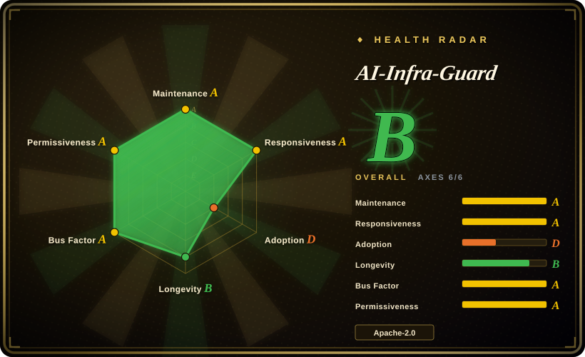
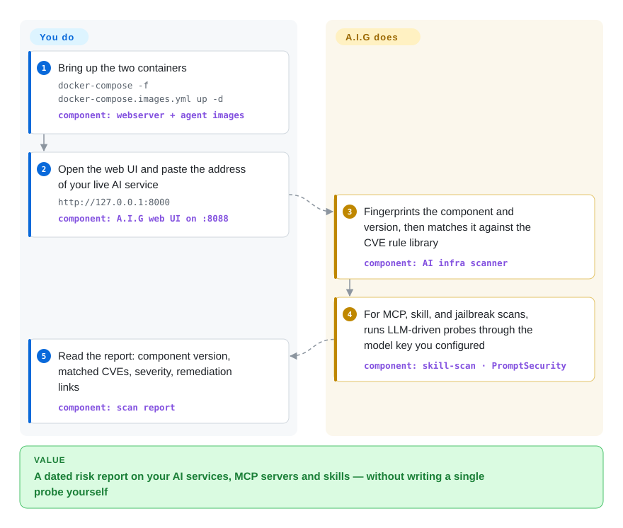

# AI-Infra-Guard

Your AI stack grew by accretion — a vLLM here, an Ollama there, MCP servers and agent skills pulled from strangers' repos — and nobody can say which known CVEs or malicious instructions are sitting inside it. AI-Infra-Guard (A.I.G) is Tencent Zhuque Lab's self-hosted AI red-teaming platform: point it at a live AI service, an MCP repository, or a skill directory and it fingerprints the component, matches a 2,000+ rule CVE library, and runs LLM-driven audits, with results in one web UI.

## When to use

You're the engineer who owns a company's self-hosted AI infrastructure — vLLM or Ollama serving models, ComfyUI for images, n8n or Dify wiring agents together — plus a growing pile of third-party MCP servers and agent skills that developers installed from GitHub. Security review asks two questions you can't answer today: "which of these services has known CVEs?" (Ollama and vLLM both had remote-code-execution disclosures) and "what did that `SKILL.md` from a stranger's repo actually instruct the agent to do?". Answering by hand means reading NVD feeds per component and auditing each skill yourself.

A.I.G is the reach-for when the audit surface is the *whole AI asset inventory*, not one model endpoint. The AI infra scan fingerprints a live service from its address (`http://192.168.1.100:11434`) and matches it against a rule library we counted at 2,169 YAML rules across 132 component directories (as of 2026-09-23); the MCP and skill scans are LLM-driven multi-stage audits that classify findings against a T01–T09 taxonomy (instruction hijacking, memory poisoning, embedded malicious code, privilege escalation); and the jailbreak evaluation runs multi-turn attacks (Many-Shot, PAIR, GOAT, ActorAttack) against your model endpoint. The deciding tradeoff against garak or promptfoo: those red-team a *model or your own app* from a CLI, while A.I.G scans the *infrastructure and supply-chain assets around the model* from a platform you deploy once.

## How it works

The deployment is two containers, not a fleet: a Go webserver holding the web UI, API, and a SQLite task database, plus an agent container that executes scans — it bundles nmap and a headless Chromium, which is why the Compose file grants it `SYS_ADMIN` and `seccomp:unconfined`. The CVE scan needs no model: fingerprint rules and vulnerability rules are local YAML under `data/fingerprints/` and `data/vuln/`, so it works against an offline rule snapshot. The other half of the platform is LLM-driven: MCP-server, skill, and agent scans run multi-stage audits (info collection, code audit, vulnerability review) through an LLM endpoint you configure — by default the skill-scan CLI points at OpenRouter, so set `LLM_API_KEY` and a base URL your data policy allows before scanning proprietary code. The jailbreak evaluator likewise attacks whatever model endpoint you register in Settings. One boundary matters: there is **no authentication** — upstream says the platform is for internal use and must not be exposed on a public network. If you only need the skill audit, skip the platform entirely: `pip install aig-skill-scan` runs the same pipeline as a standalone CLI with SARIF output for CI.

<!-- flow-steps:begin (generated from flows/ai-infra-guard.json by tools/flow_card.py — do not edit) -->

Text version of the flow

1. **You**: Bring up the two containers — `docker-compose -f docker-compose.images.yml up -d` — component: `webserver + agent images`
2. **You**: Open the web UI and paste the address of your live AI service — `http://127.0.0.1:8000` — component: `A.I.G web UI on :8088`
3. **AI-Infra-Guard**: Fingerprints the component and version, then matches it against the CVE rule library — component: `AI infra scanner`
4. **AI-Infra-Guard**: For MCP, skill, and jailbreak scans, runs LLM-driven probes through the model key you configured — component: `skill-scan · PromptSecurity`
5. **You**: Read the report: component version, matched CVEs, severity, remediation links — component: `scan report`

**Value**: A dated risk report on your AI services, MCP servers and skills — without writing a single probe yourself

<!-- flow-steps:end -->

## When NOT to use

- **You want a CI gate on your own LLM app's prompts and outputs.** A.I.G has no assertion/test-case model for app regressions — use [promptfoo](promptfoo.md) (YAML evals plus `redteam` in CI) or [DeepEval](deepeval.md) for that; A.I.G audits infrastructure and assets, not your app's behavior on a test suite.
- **You only need to red-team one model endpoint from a Python script.** Use [garak](garak.md) or PyRIT: both run probe modules against an endpoint without deploying a two-container platform. A.I.G's jailbreak evaluation overlaps them, but standing up the platform for that alone is overweight.
- **You need attacks blocked at runtime, in production.** A.I.G is an offline scanner; nothing sits in the request path. For inline guardrails (input/output filtering on live traffic) look at NeMo Guardrails instead.
- **You want to give a team access over the network.** There is no built-in auth, RBAC, or audit log for multi-user use, and upstream explicitly warns against public deployment. Either front it with your own SSO/VPN, or look at the hosted Pro version (aigsec.ai) — but that is a separate commercial offering, not this repo.
- **Your policy forbids sending code to external LLM APIs, and you can't run a local model endpoint.** The MCP/skill/agent scans and jailbreak judge all route through a configurable LLM API (OpenRouter by default in the CLI). The CVE fingerprint scan still works without any model — but that is the less differentiating half of the platform.
- **You want a five-minute MCP-only check.** A single-purpose CLI like Invariant Labs' mcp-scan is lighter than deploying a platform when MCP is the whole scope.
- **The targets aren't yours.** This is a self-examination red-teaming tool; scanning infrastructure you are not authorized to test is out of scope regardless of tooling.

## Comparison

| Alternative | In index | Our verdict | Tradeoff |
|---|---|---|---|
| [garak](garak.md) | ✅ | Choose garak when the target is a single model endpoint and you want scriptable probe modules in Python/CI; choose A.I.G when the audit must cover the whole self-hosted stack — service CVEs, MCP servers, and skills — from one UI. | garak is a CLI with nothing to operate but only sees the model; A.I.G sees the infrastructure around the model, at the cost of a Docker deployment and an LLM key for half its scans. |
| [promptfoo](promptfoo.md) | ✅ | Choose promptfoo to gate releases of your own LLM app with YAML assertions and red-team probes in CI; choose A.I.G for periodic security self-examination of the infrastructure and third-party agent assets around the app. | promptfoo is a local-first CLI with an assertion model but no asset inventory or CVE matching; A.I.G keeps a persistent report database and UI but has no app-regression test model. |
| [Giskard](giskard.md) | ✅ | Choose Giskard for scan-and-report testing of ML/LLM app behavior inside a Python dev loop; choose A.I.G when the question is "what known CVEs and malicious skills sit on our infra" rather than "does the model behave badly". | Giskard tests model/app behavior and integrates with Python workflows; A.I.G fingerprints deployed services and audits supply-chain assets, which Giskard does not cover. |
| PyRIT | 未收录 | Choose PyRIT (Microsoft's Python Risk Identification Toolkit) when you want to compose multi-turn jailbreak campaigns in code; A.I.G bundles comparable attacks (PAIR, GOAT, ActorAttack) behind a UI but is a platform, not a programming toolkit. | Left unindexed in this batch (scope kept to one page; recorded as backlog). PyRIT gives library-level flexibility and orchestration primitives; it has no infra CVE scanning, no web UI, and no report management. |
| mcp-scan (Invariant Labs) | 未收录 | Choose it for a fast MCP-only configuration and tool-pinning check without deploying anything; choose A.I.G when MCP scanning is one item on a longer AI-asset audit list. | Left unindexed in this batch (same backlog note). mcp-scan is a single-purpose CLI — minutes to run, nothing to operate; A.I.G's MCP scan is LLM-driven and platform-integrated, so it costs a deployment plus an API key. |

## Tech stack

- **Backend:** Go — the webserver, the scan agent, and a unified CLI (`cmd/`), with the task store in SQLite (`DB_PATH=/app/db/tasks.db`).
- **Scan services:** Python 3.12 — `skill-scan` (also published as the `aig-skill-scan` pip package), `mcp-scan`, the API checker, and `AIG-PromptSecurity` (the Dockerfile sets deepeval/deepteam telemetry opt-outs, indicating the jailbreak side builds on those libraries). [推断]
- **Frontend:** TypeScript (largest source tree after Python per GitHub language stats).
- **Rule libraries as data:** YAML fingerprint rules in `data/fingerprints/`, vulnerability rules in `data/vuln/` (132 component directories, 2,169 YAML files counted 2026-09-23), MCP rules in `data/mcp/`, jailbreak datasets in `data/eval/` — new rules land as data-file PRs, which is the project's main community-contribution path.
- **Agent runtime:** the scan-agent image bundles nmap and Chromium (with `chromium-sandbox`) for network and browser-driven agent scanning.
- **Distribution:** Docker images `zhuquelab/aig-server` and `zhuquelab/aig-agent`; presented at Black Hat EU 2025 Arsenal.

## Dependencies

- **Runtime:** Docker 20.10+ with Compose; upstream lists 4GB+ RAM and 10GB+ disk. No external database — state is a local SQLite file on a volume.
- **Elevated container privileges:** the agent container wants `SYS_ADMIN`, `seccomp:unconfined`, and 2GB shared memory (the Chromium sandbox); locked-down Docker hosts or some rootless setups may refuse this.
- **LLM API access:** required for the MCP/skill/agent scans and jailbreak evaluation — set `LLM_API_KEY` and a base URL (the skill-scan CLI defaults to OpenRouter). Scan spend is real API cost, and target source code flows to whichever endpoint you configure.
- **A target model endpoint:** jailbreak evaluation needs the base URL and key of the model under test (Settings → Model Config).
- **Network reachability** from the agent container to whatever you scan (live service URLs for infra scan; GitHub or an uploaded archive for MCP/skill scans).

## Ops difficulty

**Medium.** Day one is genuinely easy — one Compose file, two prebuilt images, open `localhost:8088`. The ongoing burden is elsewhere: the agent container's elevated capabilities may fight your host's security policy; there is no auth, so exposure beyond localhost is on you (VPN/SSO proxy or nothing); rule-library freshness rides on image releases, so staying current means pulling new images on the project's 2–3-week release cadence; and LLM-driven scans turn security auditing into a metered API bill you need to budget and point at an approved endpoint. There is no clustering, HA, or multi-user management to operate — the ceiling is low, but the privilege and data-flow questions are real.

## Health & viability

- **Maintenance — very active (as of 2026-09-23).** Six releases between 2026-07-27 and 2026-09-17 (v4.5.0 → v4.6.2, roughly every 2–3 weeks), each expanding the rule library (155 new CVE rules in v4.6.2 alone); last push 2026-09-20. Shipping, not coasting.
- **Governance & bus factor — vendor team, not foundation.** Owned by Tencent Zhuque Lab (part of Tencent's Security Platform Department, founded 2019); the README names a ~12-person core team, and GitHub's top contributors (boy-hack 188, aigsec 144, rocie799 125 commits) map to it. Roadmap is vendor-controlled; no CLA found in `CONTRIBUTING.md` (checked 2026-09-23).
- **Backing & longevity — strong backing, short track record.** Created 2024-12-25 (~21 months old) and still very active; the Lindy prior is weak simply because the project is young, but the backer is a large vendor's dedicated AI-security lab with a Black Hat EU 2025 Arsenal slot. The symmetrical risk: big-vendor OSS priority can shift with org strategy. [推断]
- **Adoption & ecosystem.** ~6.6k stars and 613 forks (2026-09-23); a PyPI package (`aig-skill-scan` 0.2.2), plug-and-play skills on ClawHub, a badge listing in `awesome-deepseek-integration`, and Chinese/English docs plus seven more README translations. Real but young ecosystem.
- **Risk flags.** (1) No authentication by design — internal-deployment-only posture. (2) A hosted "Pro" version (aigsec.ai) gated by invitation code suggests an open-core trajectory; the OSS/Pro feature split is not documented in the repo. [推断] (3) LLM-driven scans exfiltrate target code to whatever LLM endpoint is configured — OpenRouter by default — which is a data-governance decision, not a detail.

## Caveats (unverified)

- [未验证] The SkillTrustBench F1 scores quoted upstream (0.97–0.98 across five frontier models) are self-reported on Tencent's own benchmark; not independently reproduced.
- [未验证] The v4.6.0 release notes claim "146 AI components"; we counted 132 component directories under `data/vuln/` on 2026-09-23 (2,169 YAML rule files). The component/dir mapping was not reconciled.
- [推断] The agent container's `SYS_ADMIN` / `seccomp:unconfined` requirement is attributed to Chromium sandboxing because `Dockerfile_Agent` installs `chromium` and `chromium-sandbox`; not confirmed with the maintainers.
- [推断] The `AIG-PromptSecurity` jailbreak engine building on deepeval/deepteam is inferred from telemetry opt-out variables in `Dockerfile_Agent`, not from reading its imports.
- [推断] Open-core trajectory (hosted Pro at aigsec.ai) is inferred from the invitation-code mechanism in the README; the actual feature split between OSS and Pro is undocumented.
- [未验证] Agent-scan support for Dify and Coze workflows, and the "10 OWASP skills" of Agent-Scan, are README claims not exercised here.
- [未验证] Star and fork counts (~6.6k / 613 as of 2026-09-23) are date-sensitive GitHub numbers, not adoption evidence.
- [推断] Comparison positioning of PyRIT and mcp-scan comes from their public documentation reputation, not a head-to-head run; both are recorded as unindexed backlog.
