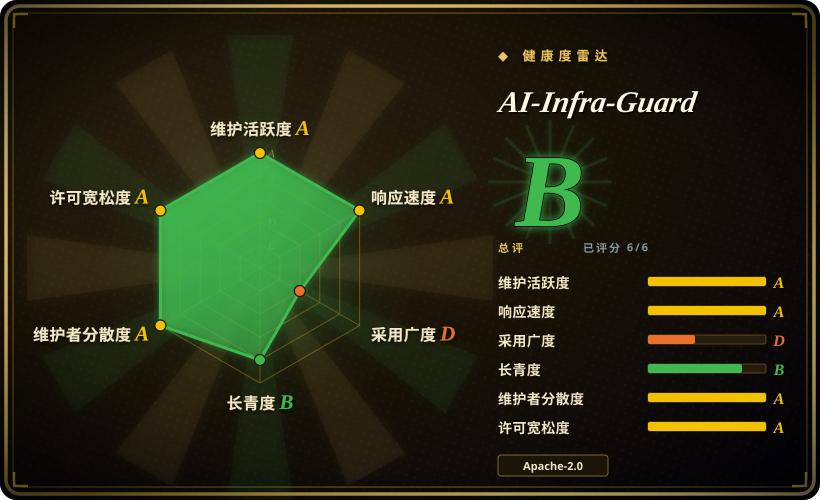
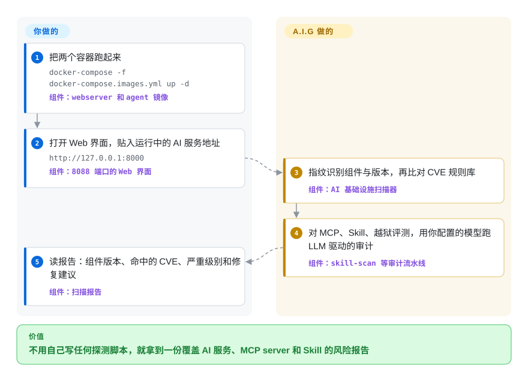

# AI-Infra-Guard

你的 AI 基础设施是东拼西凑起来的：这边一个 vLLM，那边一个 Ollama，外加从陌生仓库拉下来的 MCP server 和 Agent Skill，没人说得清里面躺着哪些已知 CVE 或恶意指令。AI-Infra-Guard（A.I.G）是腾讯朱雀实验室开源的自托管 AI 红队平台：把运行中的 AI 服务地址、MCP 仓库或 Skill 目录交给它，它会指纹识别组件、比对 2000 多条规则的 CVE 库，并跑 LLM 驱动的审计，结果汇总在一个 Web 界面里。

## 何时使用

你是公司里管自托管 AI 基础设施的那个人：vLLM 或 Ollama 在跑模型，ComfyUI 出图，n8n 或 Dify 串 agent 流程，外加一堆开发同事从 GitHub 上随手装的第三方 MCP server 和 Agent Skill。安全评审问了你两个答不上来的问题：「这些服务里哪些有已知 CVE？」（Ollama 和 vLLM 都爆过远程代码执行漏洞）以及「那份从陌生仓库拉来的 `SKILL.md` 到底指使 agent 干了什么？」。靠人肉回答，意味着逐个组件翻 NVD、逐份 Skill 亲自审计。

A.I.G 的触发场景，是审计面覆盖**整个 AI 资产清单**而不是单个模型端点的时候。AI 基础设施扫描只要一个服务地址（比如 `http://192.168.1.100:11434`），指纹识别后比对规则库——我们实际数过，2026-09-23 当天是 132 个组件目录、2169 条 YAML 规则；MCP 和 Skill 扫描是 LLM 驱动的多阶段审计，按 T01–T09 分类法出结论（指令劫持、记忆投毒、内嵌恶意代码、提权等）；越狱评测则用多轮攻击（Many-Shot、PAIR、GOAT、ActorAttack）打你的模型端点。和 garak、promptfoo 的决定性差别在这里：那两个是从命令行红队**模型或你自己的应用**，A.I.G 是从一个部署一次的平台出发，扫**模型周围的基础设施和供应链资产**。

## 快问快答

**「我自己写的 chat 应用，能用 A.I.G 做红队吗？」** ——不能。它审的是你**接进来的外部 AI 资产**：自托管的模型服务、第三方 MCP server、Agent Skill，以及 Dify／Coze 那类平台化 agent 工作流。你自己写的 chat 后端，它没有东西可抓。要打自己应用的 HTTP 接口，用 promptfoo 的 `redteam` 加自定义 provider。（2026-09-23，提问背景是一个 Go 写的「找达人」chat，自带 admission、scrub、攻击语料一整套注入防护链。）

**「所以它是测模型端点的，不是 agent 安全红队？」** ——说反了。五个模块里四个对着 agent 和基础设施资产（Agent 扫描、MCP 扫描、Skill 扫描、CVE 扫描）；只有越狱评测碰裸模型端点。而且那一项测的是「**模型**好不好骗」，不是「**你的应用**防不防得住」——你自己的防护层挡在攻击者和模型之间，骗过模型不等于骗过你的系统。

**「它检查的是接进来的东西危不危险，而不是自己建的牢不牢固？」** ——正是，这就是一句话选型口诀。唯一的半个例外是上面说的越狱评测，它也只打到模型为止，够不着你的应用。

## 怎么用起来

部署形态是两个容器，不是一队服务：一个 Go 写的 webserver 装着 Web 界面、API 和一个 SQLite 任务库；一个 agent 容器负责执行扫描，里面打包了 nmap 和无头 Chromium，所以 Compose 文件给它开了 `SYS_ADMIN` 和 `seccomp:unconfined`。CVE 扫描不需要任何模型：指纹规则和漏洞规则都是本地 YAML（在 `data/fingerprints/` 和 `data/vuln/` 下），离线也能跑。平台的另一半是 LLM 驱动的：MCP server、Skill、Agent 三类扫描走「信息收集→代码审计→漏洞复核」的多阶段流水线，用你自己配置的 LLM 端点——skill-scan 命令行默认指向 OpenRouter，所以扫私有代码前，先把 `LLM_API_KEY` 和 base URL 换成你的数据策略允许的端点。越狱评测同理，打的是你在设置里登记的那个模型。有一条边界必须记住：**平台没有鉴权**，上游明确说它只供内部使用，不能暴露到公网。如果你只需要 Skill 审计，可以不部署平台：`pip install aig-skill-scan` 就是同一条流水线的独立命令行，输出 SARIF，可以直接接 CI。

<!-- flow-steps:begin (generated from flows/ai-infra-guard.json by tools/flow_card.py — do not edit) -->

流程文字版

1. **你**：把两个容器跑起来 — `docker-compose -f docker-compose.images.yml up -d` — 组件：`webserver 和 agent 镜像`
2. **你**：打开 Web 界面，贴入运行中的 AI 服务地址 — `http://127.0.0.1:8000` — 组件：`8088 端口的 Web 界面`
3. **AI-Infra-Guard**：指纹识别组件与版本，再比对 CVE 规则库 — 组件：`AI 基础设施扫描器`
4. **AI-Infra-Guard**：对 MCP、Skill、越狱评测，用你配置的模型跑 LLM 驱动的审计 — 组件：`skill-scan 等审计流水线`
5. **你**：读报告：组件版本、命中的 CVE、严重级别和修复建议 — 组件：`扫描报告`

**价值**：不用自己写任何探测脚本，就拿到一份覆盖 AI 服务、MCP server 和 Skill 的风险报告

<!-- flow-steps:end -->

## 何时不用

- **你要给自己 LLM 应用的 prompt 和输出设 CI 门禁。** A.I.G 没有断言／测试用例模型，管不了应用回归——那是 [promptfoo](promptfoo.zh.md)（YAML 评测加 `redteam` 进 CI）或 [DeepEval](deepeval.zh.md) 的地盘；A.I.G 审的是基础设施和资产，不是你的应用在一组测试上的表现。
- **你只想用 Python 脚本红队一个模型端点。** 用 [garak](garak.zh.md) 或 PyRIT：两者都能直接对端点跑探针模块，不用部署双容器平台。A.I.G 的越狱评测和它们有重叠，但单为这件事把平台立起来太重了。
- **你要在生产流量里实时拦截攻击。** A.I.G 是离线扫描器，请求路径上什么都没有。要在运行时做输入输出护栏，看 NeMo Guardrails 那类项目。
- **你想把它挂到内网给团队用。** 它没有内建鉴权、RBAC 和多人审计日志，上游明确警告不要公开部署。要么自己套一层 SSO／VPN，要么看托管 Pro 版（aigsec.ai）——但那是独立的商业产品，不是这个仓库。
- **你的策略不允许代码发给外部 LLM API，又跑不了本地模型端点。** MCP／Skill／Agent 扫描和越狱评审都要走可配置的 LLM API（命令行默认 OpenRouter）。CVE 指纹扫描确实完全不依赖模型，但那是这个平台差异化较小的那一半。
- **你只想花五分钟查一下 MCP。** 如果范围只有 MCP，Invariant Labs 的 mcp-scan 这种单一用途命令行比部署一个平台轻得多。
- **目标不是你的。** 这是自查性质的红队工具；扫没有授权的基础设施，用什么工具都不在讨论范围内。

## 横向对比

| 替代品 | 是否收录 | 我们的评价 | 取舍 |
|---|---|---|---|
| [garak](garak.zh.md) | 已收录 | 目标是单个模型端点、想在 Python／CI 里跑可编程探针时选 garak；要在一个界面里审整套自托管栈（服务 CVE、MCP server、Skill）时选 A.I.G。 | garak 是一条命令行，零运维，但眼里只有模型；A.I.G 看得见模型周围的基础设施，代价是 Docker 部署和半数扫描要烧 LLM key。 |
| [promptfoo](promptfoo.zh.md) | 已收录 | 给自己应用的发布设 YAML 断言和红队门禁时选 promptfoo；定期给应用周围的基础设施和第三方 agent 资产做安全自查时选 A.I.G。 | promptfoo 是本地优先的命令行，有断言模型，但没有资产清单和 CVE 比对；A.I.G 有持久报告库和界面，却没有应用回归测试模型。 |
| [Giskard](giskard.zh.md) | 已收录 | 在 Python 开发循环里测 ML／LLM 应用行为时选 Giskard；问题是「我们基础设施上躺着哪些已知 CVE 和恶意 Skill」而不是「模型行为是否异常」时选 A.I.G。 | Giskard 测的是模型／应用行为，贴合 Python 工作流；A.I.G 做的是部署中服务的指纹识别和供应链资产审计，这块 Giskard 不覆盖。 |
| PyRIT | 未收录 | 想用代码编排多轮越狱攻击时选 PyRIT（微软的 Python 风险识别工具箱）；A.I.G 把同类攻击（PAIR、GOAT、ActorAttack）装进了界面，但它是平台，不是编程工具箱。 | 本批次未收录（控制范围只写一篇，记为 backlog）。PyRIT 提供库级的灵活度和编排原语，但没有基础设施 CVE 扫描、没有 Web 界面、没有报告管理。 |
| mcp-scan（Invariant Labs） | 未收录 | 只想快速查 MCP 配置和工具劫持、什么都不想部署时选它；MCP 扫描只是一长串 AI 资产审计清单里的一项时选 A.I.G。 | 本批次未收录（同上记为 backlog）。mcp-scan 是单一用途命令行，几分钟跑完、零运维；A.I.G 的 MCP 扫描是 LLM 驱动、平台集成的，所以要付出一次部署加一个 API key。 |

## 技术栈

- **后端：** Go——webserver、扫描 agent 和统一命令行（`cmd/`），任务存储用 SQLite（`DB_PATH=/app/db/tasks.db`）。
- **扫描服务：** Python 3.12——`skill-scan`（同时以 `aig-skill-scan` 发到 PyPI）、`mcp-scan`、API checker，以及 `AIG-PromptSecurity`（Dockerfile 里设置了 deepeval／deepteam 的遥测关闭变量，据此推断越狱侧建在这两个库上）。[推断]
- **前端：** TypeScript（按 GitHub 语言统计是 Python 之后第二大源码树）。
- **规则库即数据：** `data/fingerprints/` 放指纹 YAML，`data/vuln/` 放漏洞规则（2026-09-23 实际清点为 132 个组件目录、2169 个 YAML 文件），`data/mcp/` 放 MCP 规则，`data/eval/` 放越狱数据集——新规则以数据文件 PR 的形式合入，这是社区贡献的主通道。
- **Agent 运行环境：** 扫描 agent 镜像内置 nmap 和 Chromium（含 `chromium-sandbox`），用于网络扫描和浏览器驱动的 agent 流程扫描。
- **分发形态：** Docker 镜像 `zhuquelab/aig-server` 和 `zhuquelab/aig-agent`；入选过 Black Hat EU 2025 Arsenal。

## 依赖

- **运行时：** Docker 20.10+ 加 Compose；上游要求 4GB 以上内存、10GB 以上磁盘。不需要外部数据库，状态就是卷里的一个 SQLite 文件。
- **容器特权：** agent 容器要 `SYS_ADMIN`、`seccomp:unconfined` 和 2GB 共享内存（Chromium 沙箱所需），加固过的 Docker 宿主机或某些 rootless 环境可能拒绝。
- **LLM API：** MCP／Skill／Agent 扫描和越狱评测都需要——设好 `LLM_API_KEY` 和 base URL（skill-scan 命令行默认 OpenRouter）。扫描会实打实产生 API 账单，且被扫的源码会流向你配置的那个端点。
- **被测模型端点：** 越狱评测要在「设置→模型配置」里登记目标模型的 base URL 和 key。
- **网络可达性：** agent 容器要能连到被扫目标（基础设施扫描要在线服务地址；MCP／Skill 扫描用 GitHub 地址或上传的源码包）。

## 运维难度

**中等。** 第一天确实轻松：一个 Compose 文件、两个预构建镜像，打开 `localhost:8088` 就完事。负担在后面：agent 容器的特权要求可能撞上宿主机安全策略；没有鉴权，超出 localhost 的暴露全靠自己（VPN／SSO 代理，或者干脆不暴露）；规则库的新鲜度绑在镜像发布上，要跟上项目两三周一次的发布节奏就得持续拉新镜像；LLM 驱动的扫描还把安全审计变成一笔要预算、要指向合规端点的计量 API 开销。好消息是没有集群、高可用、多用户管理要运维——天花板很低，但特权和数据流向的问题是真实存在的。

## 健康度与可持续性

- **维护状态——非常活跃（截至 2026-09-23）。** 2026-07-27 到 2026-09-17 之间发了六版（v4.5.0 到 v4.6.2，约两三周一版），每版都在扩规则库（仅 v4.6.2 就新增 155 条 CVE 规则）；最后一次 push 是 2026-09-20。是在持续交付，不是滑行。
- **治理与 bus factor——厂商团队，不是基金会。** 所有者是腾讯朱雀实验室（腾讯安全平台部下属，2019 年成立）；README 列了约 12 人的核心团队，GitHub 上的头部贡献者（boy-hack 188、aigsec 144、rocie799 125 次提交）都能对上号。路线图由厂商掌控；`CONTRIBUTING.md` 里没找到 CLA（2026-09-23 检查）。
- **背书与寿命——背书强，资历短。** 仓库创建于 2024-12-25（约 21 个月），至今高度活跃；Lindy 先验偏弱纯粹因为项目年轻，但背后是大厂专门的 AI 安全实验室，还有 Black Hat EU 2025 Arsenal 的席位。对称的风险是：大厂开源的优先级会随组织战略变动。[推断]
- **采用与生态。** 约 6.6k star、613 fork（2026-09-23）；有 PyPI 包（`aig-skill-scan` 0.2.2）、ClawHub 上即插即用的 skill、`awesome-deepseek-integration` 的徽标收录，以及中英文档外加七种语言的 README 翻译。生态是真的，但也确实年轻。
- **风险信号。** （1）设计上无鉴权——只适合内部部署的姿态。（2）邀请码机制的托管 Pro 版（aigsec.ai）暗示 open-core 走向；OSS 和 Pro 的功能分界在仓库里没有文档。[推断]（3）LLM 驱动的扫描会把被扫代码发给配置的任何 LLM 端点——默认是 OpenRouter——这是个数据治理决策，不是细节。

## 存疑（未验证）

- [未验证] 上游引用的 SkillTrustBench F1 分数（五个前沿模型 0.97–0.98）是腾讯在自家基准上的自报数据，未独立复现。
- [未验证] v4.6.0 发布说明称覆盖「146 个 AI 组件」；我们 2026-09-23 在 `data/vuln/` 下数到 132 个组件目录（2169 个 YAML 规则文件），组件与目录的对应关系没有核对。
- [推断] agent 容器的 `SYS_ADMIN`／`seccomp:unconfined` 需求归因于 Chromium 沙箱，因为 `Dockerfile_Agent` 安装了 `chromium` 和 `chromium-sandbox`；未向维护者确认。
- [推断] `AIG-PromptSecurity` 越狱引擎建在 deepeval／deepteam 之上，是从 `Dockerfile_Agent` 的遥测关闭变量推断的，没有实际读它的 import。
- [推断] open-core 走向（aigsec.ai 托管 Pro 版）是从 README 的邀请码机制推断的；OSS 与 Pro 的实际功能分界没有文档。
- [未验证] Agent 扫描对 Dify／Coze 工作流的支持，以及 Agent-Scan 的「10 个 OWASP 技能」，都是 README 的说法，没有实际跑过。
- [未验证] star 和 fork 数（2026-09-23 约 6.6k／613）是时效性强的 GitHub 数字，不能当作采用证据。
- [推断] PyRIT 和 mcp-scan 的对比定位来自它们的公开文档口碑，不是同场实测；两者都记为未收录 backlog。
