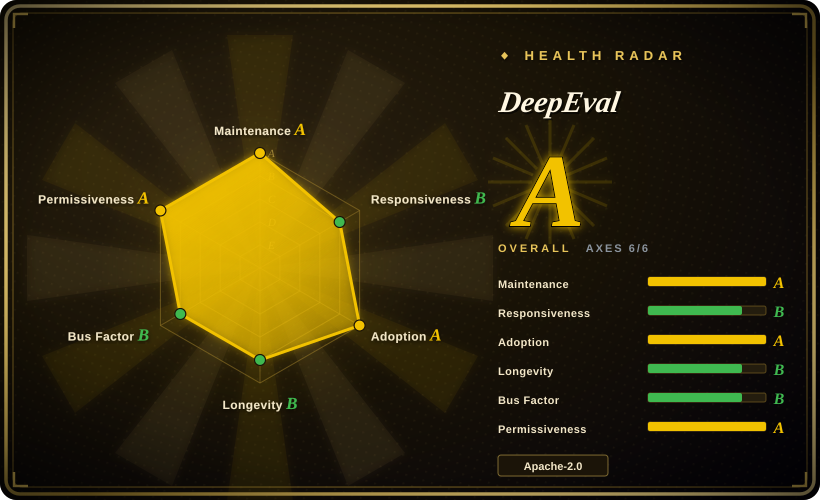
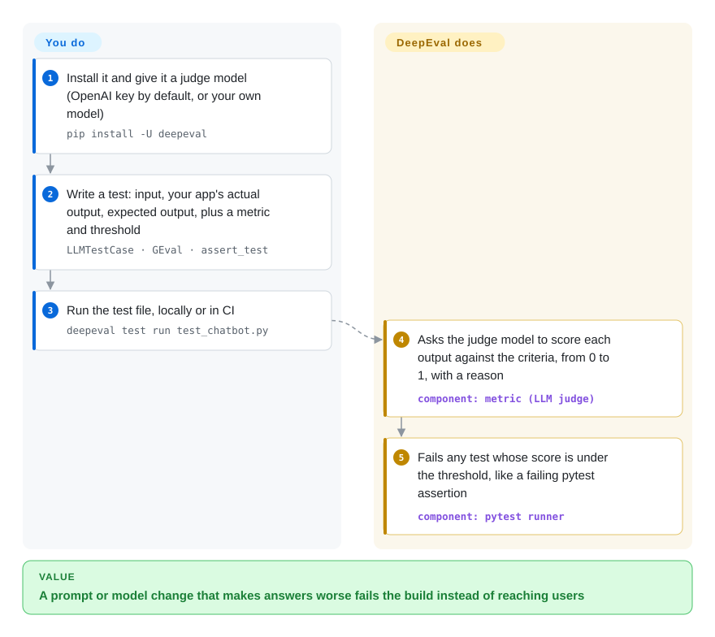

# DeepEval

Last week your support bot said "You have 30 days to get a full refund"; after a prompt tweak it says "Refunds are not possible", and nobody notices until a customer does. DeepEval turns that check into a pytest-style test: you write the question, the answer you expect, and a grading rule, and another LLM scores each answer so the build fails when quality drops.

## When to use

You are a Python developer shipping a RAG chatbot or an agent built with LangChain, LlamaIndex, or the OpenAI Agents SDK. Every prompt edit or model swap is a gamble: the answers look fine on the three examples you tried by hand, then a retrieval change quietly makes the bot invent policy text. You want the same safety net you have for ordinary code — a test file in the repo, a red build in CI — but "is this answer correct?" cannot be checked with `==`. DeepEval gives you test cases (`LLMTestCase`), about three dozen ready-made metrics (faithfulness to the retrieved context, answer relevancy, hallucination, tool correctness, task completion for agents, multi-turn metrics), and G-Eval for your own rubric written in plain English; `deepeval test run` executes them through pytest.

You pick it over [promptfoo](promptfoo.md) when your team lives in Python and wants evals as code next to the app — fixtures, loops, tracing decorators on your own functions — rather than a YAML suite run by a Node CLI. You pick it over [Ragas](ragas.md) when you need more than RAG scores: agent trajectories, conversation metrics, and a pytest runner with pass/fail thresholds come in the same package.

## How it works

DeepEval is a Python library plus a CLI that wraps pytest. **It ships the metrics and the judging prompts** — most metrics are "LLM-as-a-judge": DeepEval sends your app's output, the expected output, and the criteria to a separate model (OpenAI by default; any model you wrap works) and gets back a score between 0 and 1 with a written reason. You supply the test data and decide the threshold below which a test fails. For agents, you put the `@observe` decorator on your own functions; DeepEval records each step (LLM calls, tool calls, retrieval) as a trace and can score the whole trajectory or a single step. It can also generate synthetic test datasets from your documents and run standard benchmarks such as MMLU. Results print locally; `deepeval login` optionally uploads them to Confident AI, the company's hosted dashboard.

<!-- flow-steps:begin (generated from flows/deepeval.json by tools/flow_card.py — do not edit) -->

Text version of the flow

1. **You**: Install it and give it a judge model (OpenAI key by default, or your own model) — `pip install -U deepeval`
2. **You**: Write a test: input, your app's actual output, expected output, plus a metric and threshold — `LLMTestCase · GEval · assert_test`
3. **You**: Run the test file, locally or in CI — `deepeval test run test_chatbot.py`
4. **DeepEval**: Asks the judge model to score each output against the criteria, from 0 to 1, with a reason — component: `metric (LLM judge)`
5. **DeepEval**: Fails any test whose score is under the threshold, like a failing pytest assertion — component: `pytest runner`

**Value**: A prompt or model change that makes answers worse fails the build instead of reaching users

<!-- flow-steps:end -->

## When NOT to use

- **Your team is not on Python.** The engine and docs are Python-first; a TypeScript SDK exists but its releases are still `0.9.x` and partly pre-release. Use [promptfoo](promptfoo.md), whose YAML suites and CLI do not care what language your app is in.
- **You need cheap, deterministic checks.** Most DeepEval metrics call a judge LLM on every run, so each CI run costs tokens and scores can wobble between runs. For "the reply must be valid JSON / must contain the order ID", use [promptfoo](promptfoo.md)'s deterministic assertions or plain pytest asserts and keep LLM judging for what really needs it.
- **You are red-teaming a model for jailbreaks and prompt injection.** Red teaming moved out of DeepEval into the separate DeepTeam package in v3.0; for a dedicated vulnerability scanner use [garak](garak.md).
- **You want a self-hosted dashboard for production traces and online evals.** DeepEval's own UI is Confident AI, a hosted commercial platform. If traces and eval history must stay on your servers, use [Langfuse](langfuse.md) and keep DeepEval as the scoring library in CI.
- **Nothing may leave the machine by default.** Anonymous PostHog telemetry is on until you set `DEEPEVAL_TELEMETRY_OPT_OUT=1`, and the default judge is OpenAI's API. In an air-gapped setting, opt out and wrap a local model as the judge — or choose [Ragas](ragas.md) if you only need RAG metrics and prefer a library with no vendor platform attached.

## Comparison

| Alternative | In index | Our verdict | Tradeoff |
|---|---|---|---|
| [promptfoo](promptfoo.md) | ✅ | For a Python team that wants evals as pytest code beside the app, pick DeepEval; pick promptfoo when suites must be language-agnostic YAML with model matrices and built-in red teaming. | DeepEval offers deeper metric libraries and tracing of your own functions; promptfoo has cheaper deterministic assertions and needs Node. |
| [Ragas](ragas.md) | ✅ | Pick Ragas when RAG retrieval and answer metrics are all you need; pick DeepEval when you also test agents, multi-turn chats, and want a pass/fail test runner. | Ragas is narrower and RAG-focused; DeepEval is broader but tied to a vendor's hosted platform for reporting. |
| [Giskard OSS](giskard.md) | ✅ | Pick Giskard when you want automated scans that hunt for failure categories in an agent; pick DeepEval when you already know the cases and want them as regression tests. | Giskard leans toward discovery and scanning; DeepEval toward test cases you write and gate on. |
| [Langfuse](langfuse.md) | ✅ | Pick Langfuse for self-hosted tracing, prompt management, and eval history in production; pick DeepEval for metric scoring in tests and CI. | Langfuse is a platform you operate; DeepEval is a library — they are often used together. |
| [garak](garak.md) | ✅ | Pick garak to probe a model for jailbreaks, leakage, and injection; pick DeepEval to check that your app answers correctly. | Different questions: garak asks "can it be made to fail?", DeepEval asks "does it do its job?". |

## Tech stack

- **Language:** Python (`>=3.9`), packaged with Poetry; a separate TypeScript SDK lives in `typescript/`.
- **Core libraries:** pytest (plus xdist, repeat, rerunfailures, asyncio plugins), the `openai` client as the default judge, OpenTelemetry API/SDK for tracing, pydantic, Typer/Click for the CLI, PostHog for telemetry.
- **Integrations:** LangChain, LangGraph, LlamaIndex, CrewAI, Pydantic AI, OpenAI Agents, Anthropic and OpenAI client wrappers, Google ADK, AWS AgentCore, Vercel AI SDK, Mastra.

## Dependencies

- **Runtime:** a Python environment; `pip install -U deepeval`.
- **Judge model:** an `OPENAI_API_KEY` by default, or any other provider/local model you wrap as a custom judge — every LLM-judged metric calls it.
- **Optional:** a Confident AI account (`deepeval login`) for hosted reports; nothing else to run.

## Ops difficulty

**Low to set up, medium to keep trustworthy.** There is no server: install the package, add test files, add one CI step. The ongoing work is about the judge, not the tool: judge calls cost tokens on every run, scores vary slightly between runs and between judge models, so thresholds need calibrating against examples a human has graded, and changing the judge model can move every score. Pin the DeepEval version — the library is on major version 4 and metric APIs have changed across majors.

## Health & viability

- **Maintenance — very active (as of 2026-10-08).** Commits land daily; python-v4.2.4 shipped 2026-09-22 and point releases come every few weeks.
- **Governance — single vendor, broad contributor base.** Confident AI owns the repo and the roadmap; 103 people contributed in the past 12 months, but the top three account for most commits, which is why the governance grade dropped to B this cycle. Issue first-response also slowed (responsiveness now B: median first response 62.6 hours).
- **Business model.** The open-source library feeds Confident AI, a hosted commercial platform; the README and quickstart both push `deepeval login`. Open-core pressure is the main long-term risk — so far the library itself remains Apache-2.0 and fully usable without an account.
- **Age & Lindy — young but established.** Created 2023-08 (about 3 years), active throughout; among the most-downloaded Python eval libraries (2,487,290 PyPI downloads last month per the scorer).
- **Risk flags.** Telemetry on by default (opt-out env var); red teaming already split out into a separate package once, so features can move between repos.

## Caveats (unverified)

- [未验证] Star count (~18.7k), release dates, and contributor numbers are GitHub API / scorer snapshots from 2026-10-08.
- [未验证] "About three dozen ready-made metrics" is our count of the README metric list (36) on 2026-10-08; the docs may list more.
- [推断] "Scores wobble between runs" follows from LLM judging in general; we did not measure DeepEval's run-to-run variance.
- [推断] Giskard and Ragas positioning in the comparison reflects their general scope; their own pages here are first-pass and were not re-read for this comparison.
- [推断] "Metric APIs have changed across majors" is inferred from the v3/v4 major bumps and the README's current `SingleTurnParams` naming, not from a full changelog read.
