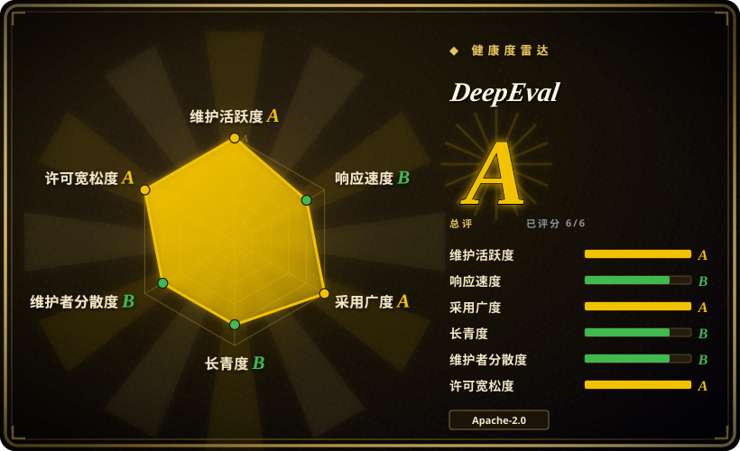
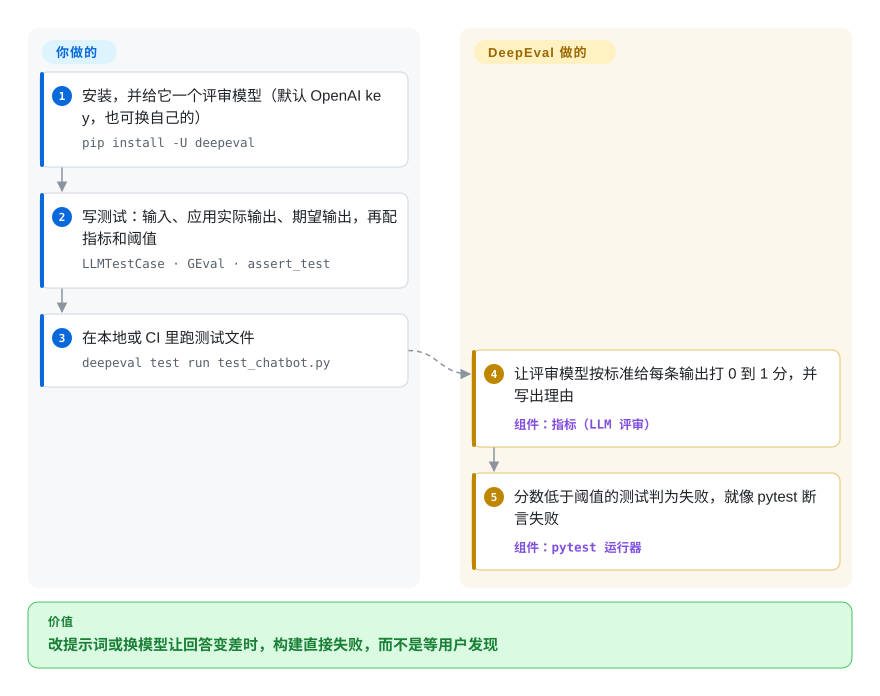

# DeepEval

上周你的客服机器人还说“30 天内可全额退款”，改了一版提示词后它说“不支持退款”，直到客户投诉才有人发现。DeepEval 把这种检查写成 pytest 式的测试：你写下问题、期望答案和评分标准，由另一个大模型给每条回答打分，质量一掉，构建就失败。

## 何时使用

你是 Python 开发者，在做一个 RAG 客服机器人或用 LangChain、LlamaIndex、OpenAI Agents SDK 搭的智能体。每改一次提示词、换一次模型都像赌博：手动试的三个例子看着没问题，结果检索一改，机器人开始自己编制度条文。你想要和普通代码一样的安全网——仓库里有测试文件，CI 里能亮红灯——可“这个回答对不对”没法用 `==` 判断。DeepEval 提供测试用例（`LLMTestCase`）、三十多个现成指标（对检索内容的忠实度、答案相关性、幻觉、工具调用正确性、智能体任务完成度、多轮对话指标），以及 G-Eval：用大白话写下你自己的评分标准就能当指标；`deepeval test run` 通过 pytest 把它们跑起来。

它和 [promptfoo](promptfoo.zh.md) 之间，看团队语言和写法：团队在 Python 里、想把评测当代码放在应用旁边——用 fixture、写循环、在自己的函数上加追踪装饰器——选 DeepEval；想要由 Node CLI 执行的 YAML 用例集，选 promptfoo。它和 [Ragas](ragas.zh.md) 之间，看范围：你要的不只是 RAG 分数，还要智能体轨迹、多轮对话指标和带阈值判通过／失败的 pytest 运行器，DeepEval 一个包都有。

## 怎么用起来

DeepEval 是一个 Python 库，外加一个包装 pytest 的命令行。**指标和评审提示词都是它自带的**——大多数指标是“LLM 当评委”：DeepEval 把应用的实际输出、期望输出和评分标准发给另一个模型（默认 OpenAI，也可以包装任何模型），拿回一个 0 到 1 的分数和一段文字理由。你负责提供测试数据，并决定分数低于多少算失败。测智能体时，你在自己的函数上加 `@observe` 装饰器，DeepEval 把每一步（LLM 调用、工具调用、检索）记成一条追踪，可以给整条轨迹或单个步骤打分。它还能从你的文档生成合成测试集，也能跑 MMLU 之类的标准基准。结果在本地打印；`deepeval login` 可选地把结果上传到 Confident AI——这家公司的托管看板。

<!-- flow-steps:begin (generated from flows/deepeval.json by tools/flow_card.py — do not edit) -->

流程文字版

1. **你**：安装，并给它一个评审模型（默认 OpenAI key，也可换自己的） — `pip install -U deepeval`
2. **你**：写测试：输入、应用实际输出、期望输出，再配指标和阈值 — `LLMTestCase · GEval · assert_test`
3. **你**：在本地或 CI 里跑测试文件 — `deepeval test run test_chatbot.py`
4. **DeepEval**：让评审模型按标准给每条输出打 0 到 1 分，并写出理由 — 组件：`指标（LLM 评审）`
5. **DeepEval**：分数低于阈值的测试判为失败，就像 pytest 断言失败 — 组件：`pytest 运行器`

**价值**：改提示词或换模型让回答变差时，构建直接失败，而不是等用户发现

<!-- flow-steps:end -->

## 何时不用

- **你的团队不用 Python。** 引擎和文档都以 Python 为先；虽然有 TypeScript SDK，但版本还在 `0.9.x`，部分仍是预发布。改用 [promptfoo](promptfoo.zh.md)，它的 YAML 用例集和 CLI 不在乎你的应用用什么语言写。
- **你要便宜、确定的检查。** DeepEval 多数指标每次运行都要调用评审模型，CI 每跑一次都花 token，分数在两次运行之间也会浮动。对“回复必须是合法 JSON、必须包含订单号”这类要求，用 [promptfoo](promptfoo.zh.md) 的确定性断言或普通 pytest 断言，把 LLM 评审留给真正需要它的地方。
- **你要对模型做越狱、提示注入这类红队测试。** 红队功能在 v3.0 起已经从 DeepEval 拆到独立的 DeepTeam 包；要专门的漏洞扫描器，用 [garak](garak.zh.md)。
- **你要一个自托管的生产追踪和在线评测看板。** DeepEval 自己的界面是 Confident AI，一个托管的商业平台。追踪和评测历史必须留在自己服务器上时，用 [Langfuse](langfuse.zh.md)，DeepEval 只在 CI 里当打分库。
- **默认情况下任何数据都不许出机器。** 匿名的 PostHog 遥测默认开启，要设 `DEEPEVAL_TELEMETRY_OPT_OUT=1` 才关；默认评审模型走 OpenAI 的 API。在隔离网络里，先关遥测再包装一个本地模型当评审——如果只需要 RAG 指标、又不想背后挂着厂商平台，选 [Ragas](ragas.zh.md)。

## 横向对比

| 替代品 | 是否收录 | 我们的评价 | 取舍 |
|---|---|---|---|
| [promptfoo](promptfoo.zh.md) | ✅ | Python 团队想把评测写成和应用放在一起的 pytest 代码，选 DeepEval；用例集必须与语言无关、要模型矩阵和内置红队时，选 promptfoo。 | DeepEval 指标库更深，能追踪你自己的函数；promptfoo 有更便宜的确定性断言，但需要 Node。 |
| [Ragas](ragas.zh.md) | ✅ | 只需要 RAG 检索和回答指标时，选 Ragas；还要测智能体、多轮对话，并要判通过／失败的测试运行器时，选 DeepEval。 | Ragas 范围更窄、专注 RAG；DeepEval 更全，但报告功能绑在厂商的托管平台上。 |
| [Giskard OSS](giskard.zh.md) | ✅ | 想让工具自动扫描、找出智能体会在哪类问题上出错，选 Giskard；已经知道要测哪些用例、想把它们变成回归测试，选 DeepEval。 | Giskard 偏向发现和扫描；DeepEval 偏向你自己写用例、拿来卡门禁。 |
| [Langfuse](langfuse.zh.md) | ✅ | 生产环境要自托管的追踪、提示词管理和评测历史，选 Langfuse；测试和 CI 里要指标打分，选 DeepEval。 | Langfuse 是要自己运维的平台；DeepEval 是库——两者常常一起用。 |
| [garak](garak.zh.md) | ✅ | 要探测模型会不会被越狱、泄露、注入，选 garak；要检查你的应用是否答得对，选 DeepEval。 | 问题不同：garak 问“能不能让它出错”，DeepEval 问“它有没有把活干好”。 |

## 技术栈

- **语言：** Python（`>=3.9`），用 Poetry 打包；另有一个 TypeScript SDK 在 `typescript/` 目录。
- **核心库：** pytest（以及 xdist、repeat、rerunfailures、asyncio 插件），默认评审用 `openai` 客户端，追踪用 OpenTelemetry API/SDK，另有 pydantic、命令行用的 Typer/Click、遥测用的 PostHog。
- **集成：** LangChain、LangGraph、LlamaIndex、CrewAI、Pydantic AI、OpenAI Agents、Anthropic 与 OpenAI 客户端包装、Google ADK、AWS AgentCore、Vercel AI SDK、Mastra。

## 依赖

- **运行时：** 一个 Python 环境；`pip install -U deepeval`。
- **评审模型：** 默认需要 `OPENAI_API_KEY`，也可以把其他服务商或本地模型包装成自定义评审——每个 LLM 评审类指标都会调用它。
- **可选：** 一个 Confident AI 账号（`deepeval login`）用来看托管报告；除此之外没有要运行的服务。

## 运维难度

**搭起来低，保持可信要中等投入。** 没有服务器：装包、加测试文件、在 CI 里加一步就行。长期的工作量在评审模型而不在工具本身：每次运行都要花评审调用的 token；分数在不同次运行、不同评审模型之间略有浮动，所以阈值要拿人工判过的样例来校准，换评审模型可能让所有分数一起移动。要固定 DeepEval 的版本——库已经到第 4 个大版本，指标 API 在大版本之间改过。

## 健康度与可持续性

- **维护——非常活跃（截至 2026-10-08）。** 每天都有提交；python-v4.2.4 于 2026-09-22 发布，小版本每隔几周一个。
- **治理——单一厂商，贡献者面广。** 仓库和路线图归 Confident AI；过去 12 个月有 103 人贡献过，但前三位占了大部分提交，这也是本轮治理评级降到 B 的原因。首次响应也变慢了（响应度现为 B：首次响应中位数 62.6 小时）。
- **商业模式。** 开源库为托管商业平台 Confident AI 引流；README 和快速上手都在推 `deepeval login`。长期最大的风险是开源核心化的压力——到目前为止库本身仍是 Apache-2.0，不注册账号也能完整使用。
- **年龄与 Lindy——年轻但已站稳。** 2023-08 创建（约 3 年），一直活跃；是下载量最大的 Python 评测库之一（评分器统计上个月 PyPI 下载 2,487,290 次）。
- **风险信号。** 遥测默认开启（可用环境变量关闭）；红队功能已经拆出去过一次，功能可能在仓库之间迁移。

## 存疑（未验证）

- [未验证] star 数（约 1.87 万）、发版日期和贡献者数量是 2026-10-08 的 GitHub API 与评分器快照。
- [未验证] “三十多个现成指标”是我们 2026-10-08 数 README 指标列表得到的（36 个）；文档里可能更多。
- [推断] “分数在两次运行之间会浮动”来自 LLM 评审的一般特性；我们没有实测 DeepEval 的运行间方差。
- [推断] 横向对比里 Giskard 和 Ragas 的定位来自它们的一般范围；本索引中它们的页面还是首版，这次对比没有重读。
- [推断] “指标 API 在大版本之间改过”是从 v3、v4 大版本号和 README 现用的 `SingleTurnParams` 命名推断的，没有通读 changelog。
