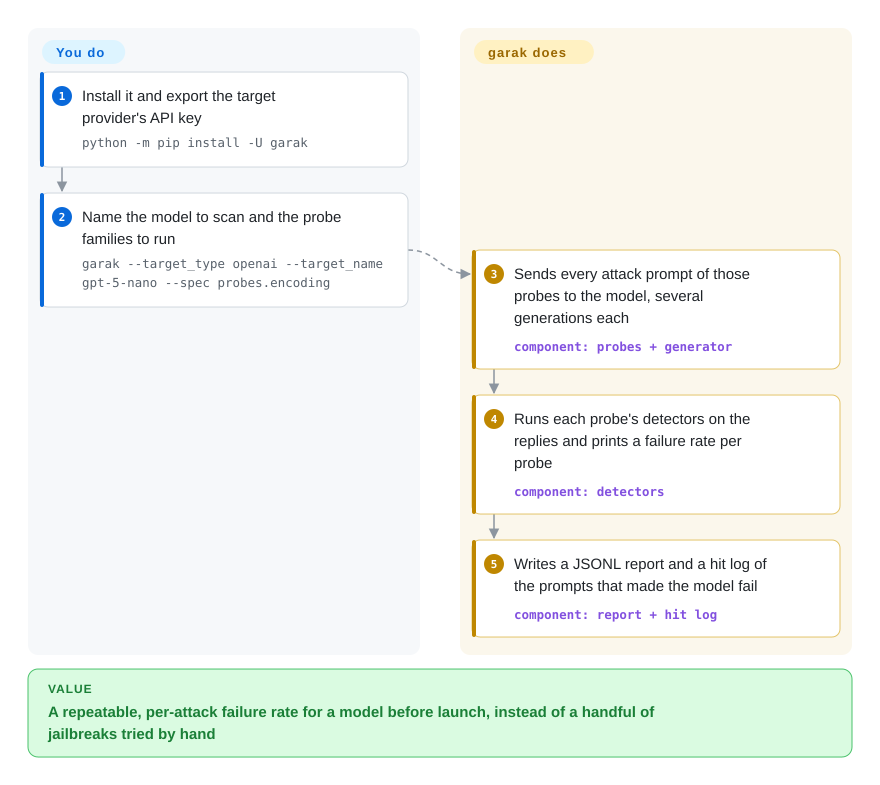

# garak

Before a model goes behind a public chat box, someone has to ask: will it write malware if the request is base64-encoded, repeat chunks of its training data, or obey a "DAN" jailbreak? garak fires hundreds of known attack prompts at the model, has detectors judge every reply, and reports a failure rate per attack type — roughly what nmap does for a network, aimed at an LLM.

## When to use

You are the security engineer or ML platform owner who has to sign off a model before launch — a fine-tuned Llama behind your own endpoint, or a vendor model you are about to expose to customers. Trying a few jailbreaks by hand proves nothing; you need the same scan you can rerun next month on the next model version and compare. garak is a command-line scanner from NVIDIA with a catalog of attack families (encoding-based injection, DAN-style jailbreaks, training-data replay, package hallucination, malware generation, cross-site exfiltration, toxicity prompts and more), each paired with detectors that decide whether a reply counts as a failure. One command like `python3 -m garak --target_type openai --target_name gpt-5-nano --spec probes.encoding` yields per-probe failure rates and a log of exactly which prompts got through.

You pick it over [promptfoo](promptfoo.md) when the question is "how does this model hold up against the known attack literature?" rather than "does my app still pass its test suite?" — garak's value is its research-derived probe catalog and plugin model, not assertions about your app. You pick it over [AI-Infra-Guard](ai-infra-guard.md) when the target is one model endpoint: garak is a pip-installed CLI with nothing to operate, while A.I.G is a deployed platform that also audits the infrastructure around the model.

## How it works

garak is built from four kinds of plugin. **Generators** connect to the model under test (Hugging Face models run locally, OpenAI, Bedrock, NIM, LiteLLM, Ollama, GGUF via llama.cpp, or any REST endpoint described in a small YAML file). **Probes** each carry a set of attack prompts; **detectors** read the replies and decide whether the model misbehaved — some are string or pattern checks, some are classifier models; and a **harness** wires them together. You choose the target and which probes to run (all of them if you don't say); garak sends each prompt several times (10 generations by default, because the same prompt can pass once and fail the next time), scores every reply with the probe's recommended detectors, and prints a FAIL count and failure rate per probe and detector. Everything is also written to a JSONL report and a hit log of the attempts that succeeded, which you can rerun and diff between model versions. New attacks are new plugin classes inheriting from a base class, so you extend it by writing Python, not by forking.

<!-- flow-steps:begin (generated from flows/garak.json by tools/flow_card.py — do not edit) -->

Text version of the flow

1. **You**: Install it and export the target provider's API key — `python -m pip install -U garak`
2. **You**: Name the model to scan and the probe families to run — `garak --target_type openai --target_name gpt-5-nano --spec probes.encoding`
3. **garak**: Sends every attack prompt of those probes to the model, several generations each — component: `probes + generator`
4. **garak**: Runs each probe's detectors on the replies and prints a failure rate per probe — component: `detectors`
5. **garak**: Writes a JSONL report and a hit log of the prompts that made the model fail — component: `report + hit log`

**Value**: A repeatable, per-attack failure rate for a model before launch, instead of a handful of jailbreaks tried by hand

<!-- flow-steps:end -->

## When NOT to use

- **You want to know whether your app gives correct answers.** garak only asks "can this model be made to fail?"; for functional quality of a RAG app or agent, use [DeepEval](deepeval.md) (pytest-style metrics) or [promptfoo](promptfoo.md) (YAML evals).
- **Red-team checks must live inside your app's CI test suite, next to ordinary assertions.** Use [promptfoo](promptfoo.md), whose `redteam` mode generates attacks against your actual prompts and app and reports in the same pipeline as your evals.
- **The audit surface is your whole AI deployment, not one model.** Exposed inference servers, MCP servers, and agent skills are out of garak's view; use [AI-Infra-Guard](ai-infra-guard.md).
- **You need a light install or a Windows-first workflow.** garak pulls in PyTorch, transformers, datasets, LangChain, LiteLLM, and a dozen provider SDKs, requires Python 3.11+, and is developed on Linux and macOS. For a lighter red-team pass on a laptop or Windows CI runner, [promptfoo](promptfoo.md)'s Node CLI is the smaller footprint.
- **You need adaptive multi-turn attacks against an agent with tools.** Most garak probes are fixed prompt sets; its LLM-driven attacker (`atkgen`) is documented as a prototype. For orchestrated multi-turn campaigns, look at Microsoft's PyRIT (`Azure/PyRIT`, not indexed).

## Comparison

| Alternative | In index | Our verdict | Tradeoff |
|---|---|---|---|
| [promptfoo](promptfoo.md) | ✅ | To benchmark a model against a broad catalog of published attacks, pick garak; to red-team your own app's prompts inside the same CI suite as your evals, pick promptfoo. | garak has deeper research-derived probes and Python plugins but no app-level assertions; promptfoo combines evals and red teaming with a lighter Node install. |
| [AI-Infra-Guard](ai-infra-guard.md) | ✅ | Pick garak for one model endpoint from a CLI; pick AI-Infra-Guard when the audit must cover service CVEs, MCP servers, and skills from one UI. | garak has nothing to operate but only sees the model; A.I.G sees the stack around it at the cost of a Docker deploy. |
| [DeepEval](deepeval.md) | ✅ | Pick DeepEval to test that your app does its job; pick garak to test whether the model can be pushed into harmful behavior. | Complementary questions; DeepEval's own red teaming moved to the separate DeepTeam package. |
| [Giskard OSS](giskard.md) | ✅ | Pick Giskard for scans that mix quality and safety issues of an agent with a testing-library workflow; pick garak for a dedicated, attack-focused scanner. | Giskard is broader and app-oriented; garak is narrower and deeper on attacks. |
| PyRIT (`Azure/PyRIT`) | not indexed | Pick PyRIT when a red team needs to script multi-turn, orchestrated attack campaigns; pick garak for a ready-made scan with a fixed catalog. | PyRIT is a framework you build campaigns in; garak is a scanner you run. Positioning from general knowledge, not read here. |

## Tech stack

- **Language:** Python (`>=3.11`), installed from PyPI as `garak`; CLI entry `garak` / `python -m garak`.
- **Structure:** plugin packages `garak/probes`, `garak/detectors`, `garak/generators`, `garak/harnesses`, `garak/evaluators`, each with a `base.py`.
- **Key libraries:** PyTorch, Hugging Face transformers/datasets/hub, LiteLLM, LangChain, provider SDKs (OpenAI, Anthropic, Cohere, Mistral, Replicate, Ollama, boto3 for Bedrock, NVIDIA Riva), NLTK.

## Dependencies

- **Runtime:** Python 3.11+ in its own environment (the README suggests a dedicated Conda env), with a multi-gigabyte install footprint because of PyTorch and transformers.
- **Target access:** credentials for the model under test, passed as environment variables (`OPENAI_API_KEY`, `BEDROCK_API_KEY`, `NIM_API_KEY`, `REPLICATE_API_TOKEN`, …), or a local Hugging Face/GGUF model — the latter wants a GPU for reasonable speed.
- **Downloads at run time:** some detectors and probes fetch classifier models or datasets from Hugging Face Hub on first use.

## Ops difficulty

**Low to run, medium to interpret.** There is no service: install, set a key, run. The costs are elsewhere: a full scan (all probes, 10 generations each) sends thousands of requests, so it takes hours and real API spend — scope it with `--spec`. Detectors are heuristics and classifiers, so a FAIL needs a human look at the hit log, and a low failure rate means "these known attacks mostly failed", not "the model is safe". Pin the version when comparing runs across months, because probes and detectors change between releases.

## Health & viability

- **Maintenance — very active (as of 2026-10-08).** Roughly monthly releases (v0.17.0 on 2026-09-09, v0.16.0 on 2026-08-04) and commits most weeks; issues get a first response quickly (median 13.4 hours per the scorer).
- **Governance — corporate-backed team.** Copyright is Leon Derczynski's and the repo now lives in the NVIDIA GitHub organization; the top contributors (`leondz`, `jmartin-tech`, `erickgalinkin`) are authors of the garak paper, 71 people contributed in the past 12 months, and no single person dominates.
- **Age & Lindy — reasonable.** Created 2023-05 (about 3.4 years), continuously active, with a citable research paper behind its design; for a security tool category that barely existed before 2023, that is long.
- **Adoption — niche but real.** About 9.5k stars (GitHub API, 2026-10-08) and 38,756 PyPI downloads in the last month per the scorer; it is a specialist tool, so lower volume than general eval libraries is expected.
- **Risk flags.** Apache-2.0, no relicense history; the main dependency risk is NVIDIA's continued interest, which today is visible in staffing and release cadence.

## Caveats (unverified)

- [未验证] Star count, release dates, and contributor numbers are GitHub API / scorer snapshots from 2026-10-08.
- [推断] "Hours and real API spend" for a full scan is estimated from the default of 10 generations per prompt across all probes; we did not time a run.
- [推断] "Multi-gigabyte install footprint" follows from the PyTorch + transformers dependencies; we did not measure an install.
- [推断] PyRIT and Giskard positioning in the comparison is general knowledge; neither repo was re-read for this page.
- [未验证] Which detectors download Hugging Face models on first use was not enumerated; check before running in an offline environment.
