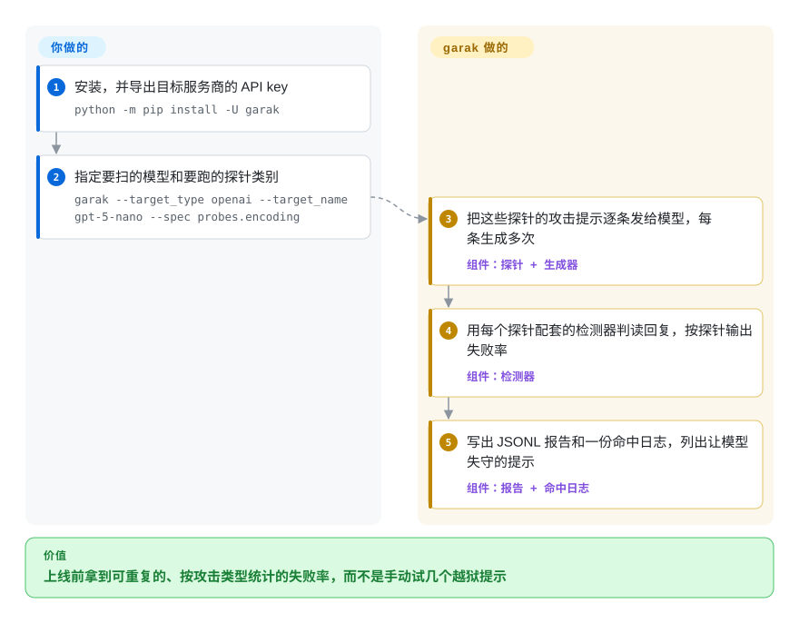

# garak

把模型放到公开的聊天框后面之前，总得有人问一句：请求换成 base64 编码后，它会不会照写恶意代码？会不会吐出训练数据？会不会听从“DAN”越狱？garak 把几百条已知攻击提示打给模型，由检测器判读每条回复，再按攻击类型报出失败率——大致相当于给大模型用的 nmap。

## 何时使用

你是安全工程师或 ML 平台负责人，模型上线前要由你签字放行——可能是部署在自家端点上的微调 Llama，也可能是即将开放给客户的厂商模型。手动试几个越狱提示什么也证明不了；你需要一套下个月换了新版本还能原样重跑、可以对比的扫描。garak 是 NVIDIA 出品的命令行扫描器，自带一份攻击类别目录（编码注入、DAN 式越狱、训练数据复现、包名幻觉、恶意代码生成、跨站数据外传、毒性提示等等），每类都配好判断“这条回复算不算失守”的检测器。一条 `python3 -m garak --target_type openai --target_name gpt-5-nano --spec probes.encoding` 就能拿到按探针统计的失败率，以及到底是哪些提示突破了模型的日志。

它和 [promptfoo](promptfoo.zh.md) 之间，看你问的问题：要知道“这个模型在已知攻击文献面前表现如何”，选 garak；要知道“我的应用还能不能通过它的测试集”，选 promptfoo——garak 的价值在于源自研究的探针目录和插件模型，而不是对你应用的断言。它和 [AI-Infra-Guard](ai-infra-guard.zh.md) 之间，看目标范围：只扫一个模型端点，garak 是 pip 装好就能用的命令行，没有东西要运维；A.I.G 是要部署的平台，还会审计模型周边的基础设施。

## 怎么用起来

garak 由四类插件拼成。**生成器**负责连上被测模型（本地运行的 Hugging Face 模型、OpenAI、Bedrock、NIM、LiteLLM、Ollama、通过 llama.cpp 跑的 GGUF，或用一个小 YAML 文件描述的任意 REST 端点）。**探针**各自带着一组攻击提示；**检测器**读回复并判定模型有没有失守——有的是字符串或模式匹配，有的是分类模型；**harness**（编排器）把它们串起来。你负责选目标和要跑哪些探针（不指定就全跑）；garak 把每条提示发送多次（默认生成 10 次，因为同一条提示这次过了下次可能失守），用探针推荐的检测器给每条回复打分，按探针和检测器打印失败次数和失败率。所有内容还会写进 JSONL 报告和一份记录成功攻击的命中日志，可以在不同模型版本之间重跑对比。新的攻击就是继承某个基类的新插件类，所以扩展它靠写 Python，不用 fork。

<!-- flow-steps:begin (generated from flows/garak.json by tools/flow_card.py — do not edit) -->

流程文字版

1. **你**：安装，并导出目标服务商的 API key — `python -m pip install -U garak`
2. **你**：指定要扫的模型和要跑的探针类别 — `garak --target_type openai --target_name gpt-5-nano --spec probes.encoding`
3. **garak**：把这些探针的攻击提示逐条发给模型，每条生成多次 — 组件：`探针 + 生成器`
4. **garak**：用每个探针配套的检测器判读回复，按探针输出失败率 — 组件：`检测器`
5. **garak**：写出 JSONL 报告和一份命中日志，列出让模型失守的提示 — 组件：`报告 + 命中日志`

**价值**：上线前拿到可重复的、按攻击类型统计的失败率，而不是手动试几个越狱提示

<!-- flow-steps:end -->

## 何时不用

- **你想知道应用答得对不对。** garak 只问“能不能让这个模型出错”；要测 RAG 应用或智能体的功能质量，用 [DeepEval](deepeval.zh.md)（pytest 式指标）或 [promptfoo](promptfoo.zh.md)（YAML 评测）。
- **红队检查必须放进应用的 CI 测试集，和普通断言并排。** 用 [promptfoo](promptfoo.zh.md)，它的 `redteam` 模式针对你真实的提示词和应用生成攻击，并和评测在同一条流水线里出报告。
- **审计范围是整套 AI 部署，而不是一个模型。** 暴露在外的推理服务、MCP 服务器、智能体技能都不在 garak 视野里；用 [AI-Infra-Guard](ai-infra-guard.zh.md)。
- **你要轻量安装，或者以 Windows 为主。** garak 会拉进 PyTorch、transformers、datasets、LangChain、LiteLLM 和十几个服务商 SDK，要求 Python 3.11+，而且是在 Linux 和 macOS 上开发的。想在笔记本或 Windows CI 机器上做一轮轻量红队，[promptfoo](promptfoo.zh.md) 的 Node 命令行占用小得多。
- **你要对带工具的智能体做自适应的多轮攻击。** garak 的大多数探针是固定的提示集合；它由 LLM 驱动的攻击者（`atkgen`）文档里写明还是原型。要编排多轮攻击行动，看微软的 PyRIT（`Azure/PyRIT`，未收录）。

## 横向对比

| 替代品 | 是否收录 | 我们的评价 | 取舍 |
|---|---|---|---|
| [promptfoo](promptfoo.zh.md) | ✅ | 要拿一份覆盖面广的已发表攻击目录给模型做基准测试，选 garak；要在和评测同一套 CI 里对自家应用的提示词做红队，选 promptfoo。 | garak 的探针更深、源自研究，可用 Python 插件扩展，但没有应用层断言；promptfoo 把评测和红队合在一起，Node 安装更轻。 |
| [AI-Infra-Guard](ai-infra-guard.zh.md) | ✅ | 用命令行扫一个模型端点，选 garak；审计要覆盖服务漏洞、MCP 服务器和技能、还想有统一界面，选 AI-Infra-Guard。 | garak 不用运维，但只看得见模型；A.I.G 看得见模型周边整套栈，代价是一次 Docker 部署。 |
| [DeepEval](deepeval.zh.md) | ✅ | 测应用有没有把活干好，选 DeepEval；测模型能不能被推向有害行为，选 garak。 | 两个互补的问题；DeepEval 自己的红队功能已经拆到独立的 DeepTeam 包。 |
| [Giskard OSS](giskard.zh.md) | ✅ | 想用测试库式的流程同时扫智能体的质量和安全问题，选 Giskard；要一个专注攻击的扫描器，选 garak。 | Giskard 更宽、面向应用；garak 更窄，在攻击上更深。 |
| PyRIT（`Azure/PyRIT`） | 未收录 | 红队要用脚本编排多轮、成体系的攻击行动，选 PyRIT；要一个目录固定、拿来就扫的工具，选 garak。 | PyRIT 是用来搭攻击行动的框架；garak 是直接运行的扫描器。定位来自一般了解，没有在这里读它的仓库。 |

## 技术栈

- **语言：** Python（`>=3.11`），从 PyPI 安装 `garak`；命令行入口 `garak` 或 `python -m garak`。
- **结构：** 插件包 `garak/probes`、`garak/detectors`、`garak/generators`、`garak/harnesses`、`garak/evaluators`，各带一个 `base.py`。
- **关键库：** PyTorch、Hugging Face 的 transformers、datasets 和 hub，LiteLLM、LangChain，各服务商 SDK（OpenAI、Anthropic、Cohere、Mistral、Replicate、Ollama、访问 Bedrock 用的 boto3、NVIDIA Riva），NLTK。

## 依赖

- **运行时：** 独立环境里的 Python 3.11+（README 建议单独建一个 Conda 环境），因为有 PyTorch 和 transformers，安装体积以 GB 计。
- **目标访问：** 被测模型的凭据，通过环境变量传入（`OPENAI_API_KEY`、`BEDROCK_API_KEY`、`NIM_API_KEY`、`REPLICATE_API_TOKEN` 等），或者本地的 Hugging Face、GGUF 模型——后者想要像样的速度得有 GPU。
- **运行时下载：** 部分检测器和探针首次使用时会从 Hugging Face Hub 拉分类模型或数据集。

## 运维难度

**跑起来低，读懂结果中等。** 没有服务要运行：安装、设 key、执行。成本在别处：一次完整扫描（全部探针、每条生成 10 次）会发出成千上万个请求，要跑几个小时，也会花真金白银的 API 费用——用 `--spec` 限定范围。检测器是启发式规则和分类器，所以每个 FAIL 都要有人看命中日志确认；失败率低的意思是“这些已知攻击大多没成功”，不是“模型是安全的”。跨月份对比结果时要固定版本，因为探针和检测器在版本之间会变。

## 健康度与可持续性

- **维护——非常活跃（截至 2026-10-08）。** 大约每月一版（v0.17.0 于 2026-09-09，v0.16.0 于 2026-08-04），大多数周都有提交；issue 首次响应很快（评分器统计中位数 13.4 小时）。
- **治理——有企业支持的团队。** 版权署名 Leon Derczynski，仓库现在在 NVIDIA 的 GitHub 组织下；头几位贡献者（`leondz`、`jmartin-tech`、`erickgalinkin`）都是 garak 论文的作者，过去 12 个月有 71 人贡献，没有哪一个人独大。
- **年龄与 Lindy——尚可。** 2023-05 创建（约 3.4 年），一直活跃，设计背后有一篇可引用的研究论文；在一个 2023 年前几乎不存在的安全工具品类里，这已经算长寿。
- **采用——小众但真实。** 约 9.5 千 star（GitHub API，2026-10-08），评分器统计上个月 PyPI 下载 38,756 次；它是专业工具，下载量低于通用评测库在意料之中。
- **风险信号。** Apache-2.0，没有改过许可证；主要的依赖风险是 NVIDIA 是否持续投入，目前从人员和发版节奏上看得到投入。

## 存疑（未验证）

- [未验证] star 数、发版日期和贡献者数量是 2026-10-08 的 GitHub API 与评分器快照。
- [推断] 完整扫描“要跑几个小时、花真金白银”是按默认每条提示生成 10 次、跑全部探针估算的；我们没有计时实跑。
- [推断] “安装体积以 GB 计”来自 PyTorch 加 transformers 的依赖；我们没有实测安装大小。
- [推断] 横向对比里 PyRIT 和 Giskard 的定位来自一般了解；这次没有重读这两个仓库。
- [未验证] 哪些检测器首次使用时会下载 Hugging Face 模型没有逐个列出；在离线环境运行前请先确认。
