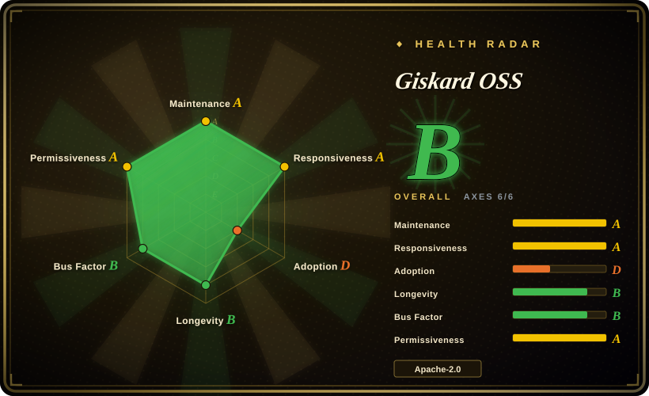
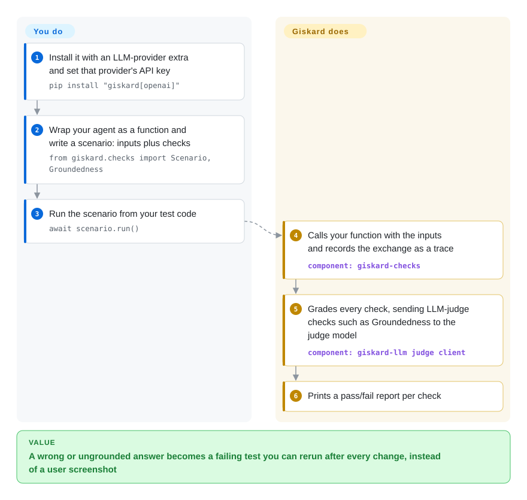

# Giskard OSS

Your support agent looks fine in the demo, then in production it quotes a 60-day return window when the policy says 30, or obeys an "ignore your instructions" line hidden in a customer's email, and you only hear about it from a screenshot. Giskard turns those failures into Python tests: you write scenarios whose checks include an LLM judge ("is this answer backed by the source text?"), and its scanner writes attack prompts for you from a one-sentence description of your agent.

## When to use

You're a Python engineer shipping a RAG assistant or a tool-using agent. Your code has pytest, but your answers have nothing: the same question can produce several valid replies, so `assert answer == expected` is useless, and after you swap the retriever the bot starts saying "Our return window is 60 days" while the policy document in its context says 30. You want that exact case pinned as a test that fails the next time it happens, plus a check before launch that the agent does not leak its instructions or follow injected ones.

Giskard v3 gives you both from Python. In `giskard-checks` you wrap your agent as a plain sync or async function, write a `Scenario` that sends it inputs (one turn or a whole conversation), and attach checks: string, regex and comparison assertions, semantic similarity, and LLM-as-judge checks such as `Groundedness` and `Conformity`. In `giskard-scan`, `vulnerability_scan` takes a plain-language description of your agent and generates adversarial suites (prompt injection, harmful content, stereotypes, misinformation) across OWASP LLM Top-10 categories, and `quality_scan` generates RAG test questions from a knowledge base. Pick it over promptfoo when your tests should be Python code that calls your function directly rather than a YAML matrix run by a Node CLI; over garak when you want probes written for *your* agent's described job rather than a fixed probe library aimed at a model endpoint.

## How it works

Giskard v3 is a family of small Python packages: `giskard-checks` for writing tests, `giskard-scan` for generated attack and RAG-quality suites, both sitting on `giskard-llm`, a provider-agnostic client (one interface over OpenAI, Anthropic, Google, Azure, or anything LiteLLM reaches). Your system is a *target*: any function that takes inputs and returns outputs. A *scenario* is a script of interactions plus checks; Giskard calls your function, records the exchange as a *trace* (the log of what went in and what came out), then grades every check against it. Deterministic checks run locally; LLM-as-judge checks send the trace to a second model that grades the answer, like a teacher marking an essay against the textbook page, using your API key (default `openai/gpt-4o-mini`). What Giskard does for you: run the scenarios, record, judge, report, and for scans invent the attack prompts. What you do: wrap your agent, write the scenarios, rules and reference context, pay for the judge calls, and decide which failures block a release.

<!-- flow-steps:begin (generated from flows/giskard.json by tools/flow_card.py — do not edit) -->

Text version of the flow

1. **You**: Install it with an LLM-provider extra and set that provider's API key — `pip install "giskard[openai]"`
2. **You**: Wrap your agent as a function and write a scenario: inputs plus checks — `from giskard.checks import Scenario, Groundedness`
3. **You**: Run the scenario from your test code — `await scenario.run()`
4. **Giskard OSS**: Calls your function with the inputs and records the exchange as a trace — component: `giskard-checks`
5. **Giskard OSS**: Grades every check, sending LLM-judge checks such as Groundedness to the judge model — component: `giskard-llm judge client`
6. **Giskard OSS**: Prints a pass/fail report per check

**Value**: A wrong or ungrounded answer becomes a failing test you can rerun after every change, instead of a user screenshot

<!-- flow-steps:end -->

## When NOT to use

- **You want the automatic scan of a tabular or classic ML model** (bias and performance slices over a DataFrame). That detector suite is **v2-only**, v2 is no longer actively maintained, and the README says it is not planned for v3. Pinning `giskard>2,<3` means betting on unmaintained code; for tabular model validation look at a dedicated ML-testing tool such as Deepchecks or Evidently (both not indexed).
- **You are on Python older than 3.12.** v3 requires `>=3.12`. If you cannot upgrade, run [promptfoo](promptfoo.md), which is a Node CLI that sits outside your Python environment.
- **You need production tracing, dashboards and trend history of live traffic.** Giskard runs tests; it is not an observability backend. Use [Langfuse](langfuse.md) to record and score real traffic, and keep Giskard for pre-release suites.
- **Your test suite should be declarative config that non-Python reviewers can edit, run as a prompt × provider matrix in CI.** That is [promptfoo](promptfoo.md)'s shape; Giskard scenarios are Python code.
- **You want the widest library of attacks against a model endpoint, independent of your app code.** Use [garak](garak.md); Giskard can even call it as an optional scan backend (`giskard[garak]`), but the probe breadth lives in garak.
- **You have existing v2 code (`giskard.scan`, `giskard.Model`, RAGET `generate_testset`).** v3 is a rewrite, not an upgrade: the APIs changed, v3.0.0 only went GA on 2026-08-26, and the meta-package still carries a "Development Status :: 4 - Beta" classifier. Pin versions and budget a migration, or stay on [DeepEval](deepeval.md) if you need an API that has not just been reset.
- **Prompts may not leave your network.** LLM-judge checks and scan generators call an LLM provider; without one you are left with the deterministic checks. Routing the judge to a self-hosted model through the `litellm` extra is possible in principle, but judge quality then depends on that model.

## Comparison

| Alternative | In index | Our verdict | Tradeoff |
|---|---|---|---|
| [DeepEval](deepeval.md) | ✅ | Choose DeepEval when you want a pytest-native metric suite with an API that has been stable for longer; choose Giskard when you want agent scenarios and an auto-generated red-team scan from one Python package family. | DeepEval keeps evals in the pytest idiom; Giskard's v3 API is younger (GA 2026-08) but bundles multi-turn scenarios with `vulnerability_scan`. |
| [promptfoo](promptfoo.md) | ✅ | Choose promptfoo when evals should be declarative YAML run as a CI gate across many providers; choose Giskard when tests must call your Python agent directly as code. | promptfoo is config-first and language-agnostic (Node CLI); Giskard is code-first and requires Python 3.12+. |
| [garak](garak.md) | ✅ | Choose garak for breadth of known attacks against a model endpoint; choose Giskard when attacks should be generated for your agent's described role and run next to your functional tests. | garak's probe library is wider; Giskard's probes are tailored but depend on an LLM generator and its quality. |
| [Ragas](ragas.md) | ✅ | Choose Ragas when the job is RAG metrics over a dataset (faithfulness, context precision); choose Giskard when RAG quality is one part of agent tests that also need safety scans. | Ragas is metric-centric and RAG-specialized; Giskard covers RAG via `Groundedness` and `quality_scan` but is broader and less metric-deep. |
| PyRIT | 未收录 | Choose PyRIT for operator-driven, multi-turn red-team campaigns with attack orchestration; choose Giskard when the red-team pass should be one function call inside your test code. | PyRIT gives a red-teamer more manual control; Giskard automates suite generation but offers less campaign steering. |

## Tech stack

- **Language:** Python 3.12–3.14; async-first API (`await scenario.run()`).
- **Layout:** a uv workspace monorepo of five packages (`giskard-core`, `giskard-llm`, `giskard-agents`, `giskard-checks`, `giskard-scan`) built with hatchling; the `giskard` meta-package pulls in `giskard-checks`.
- **LLM access:** native provider extras for OpenAI, Anthropic, Google and Azure; LiteLLM via `giskard-agents[litellm]`.
- **Optional backends:** `regorus` for policy-style checks, and the heavy `garak` / `deepteam` extras as additional scan generators.

## Dependencies

- **Runtime:** Python 3.12+ and the `giskard` packages; no server, database or queue.
- **LLM provider:** an API key for LLM-judge checks and scan generation (default judge `openai/gpt-4o-mini`), installed via a provider extra such as `giskard[openai]`.
- **Telemetry:** aggregated analytics are on by default via `giskard-core`; opt out with `DO_NOT_TRACK=1` or `GISKARD_TELEMETRY_DISABLED=1` set before import.

## Ops difficulty

**Low.** It is a library that runs inside your test process, so there is nothing to deploy. The real costs are judge and generator API calls per run, non-determinism in LLM-judged checks (you will need thresholds or repeats to keep CI from flaking), and keeping up with a v3 API that was rewritten in 2026 — pin exact versions.

## Health & viability

- **Maintenance — very active (2026-10-08).** Commits land almost daily; v3.0.0 shipped 2026-08-26 and v3.0.1 on 2026-10-02 with per-package tags, and issues get a first response quickly.
- **Governance — vendor-owned, concentrated.** Giskard AI owns the roadmap; one contributor accounts for about half of the last year's commits, with a handful of other heavy committers. The v2→v3 rewrite, which dropped the tabular scan, shows the vendor is willing to break and narrow the API.
- **Age / Lindy — split verdict.** The repository dates from 2022-03 (about 4.6 years, still active), but the v3 codebase you would adopt is weeks old as a GA release; the Lindy prior supports the organisation, not the current API.
- **Adoption — thin.** About 5.9k stars but only 12,840 PyPI downloads last month for the meta-package and 2 dependent repos; adoption is the weakest axis.
- **Risk flags.** Apache-2.0 with no relicense history; default-on telemetry; v2 explicitly unmaintained; Beta classifier on v3.

## Caveats (unverified)

- [未验证] The telemetry claim (no prompts or outputs sent) comes from the README; the `giskard-core` telemetry code was not audited.
- [推断] Meta-package download counts may understate v3 use, because users can install `giskard-checks` or `giskard-scan` directly.
- [推断] Pointing judges at a self-hosted model through the `litellm` extra should work, since LiteLLM reaches local servers, but this was not tested and judge accuracy with small models is unknown.
- [未验证] Whether `quality_scan` matches v2 RAGET's test-set quality was not checked; the README only calls it the successor.
- [未验证] The contrasts with DeepEval, Ragas and PyRIT rest on their own pages or project descriptions, not on a side-by-side run.
- [未验证] The Deepchecks and Evidently suggestions for tabular validation were not re-verified in this pass.
