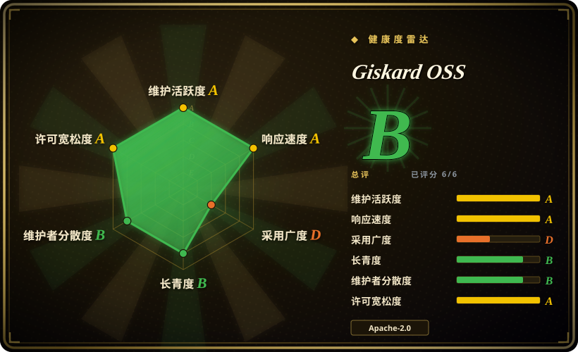
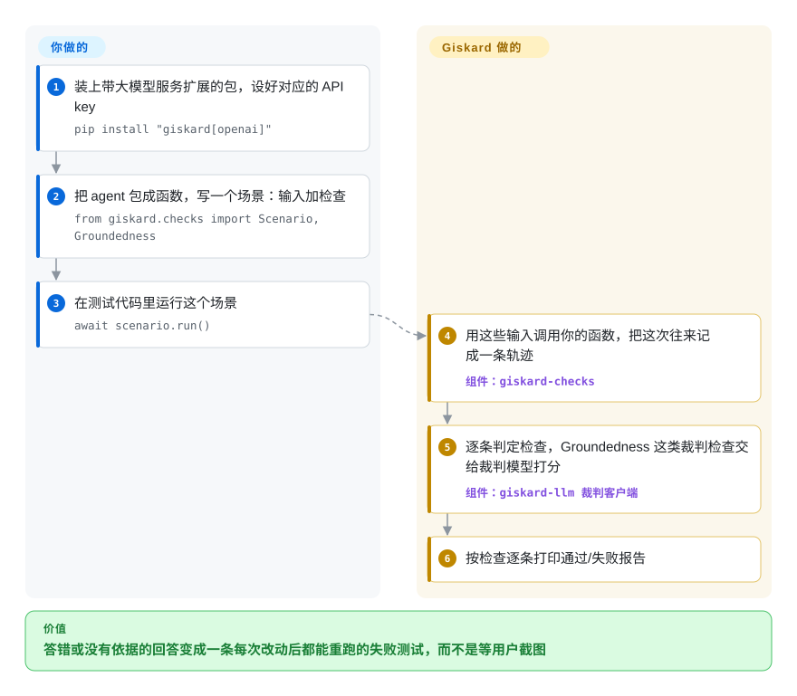

# Giskard OSS

你的客服 agent 演示时好好的，上线后却告诉用户“退货期 60 天”（政策写的是 30 天），或者照着客户邮件里藏的一句“忽略你之前的指令”去做，你要等用户截图才知道。Giskard 把这些故障写成 Python 测试：场景里的检查可以请一个大模型当裁判（“这个回答有没有原文依据？”），它的扫描器还能根据一句话的 agent 描述替你编出攻击提示词。

## 何时使用

你是用 Python 交付 RAG 助手或带工具调用的 agent 的工程师。代码有 pytest，回答却什么都没有：同一个问题可能有好几种都对的答法，`assert answer == expected` 根本用不上；换了检索器之后，机器人开始说“我们的退货期是 60 天”，而它上下文里的政策文档写的是 30 天。你想把这个具体案例钉成一条测试，下次再出现就让它失败；上线前还想确认 agent 不会泄露自己的指令、也不会执行别人注入的指令。

Giskard v3 在 Python 里同时给你这两样。在 `giskard-checks` 里，你把 agent 包成一个普通的同步或异步函数，写一个 `Scenario` 给它喂输入（单轮或整段对话），再挂上检查：字符串、正则、比较类断言，语义相似度，以及 `Groundedness`、`Conformity` 这类“大模型当裁判”的检查。在 `giskard-scan` 里，`vulnerability_scan` 读一段对 agent 的自然语言描述，按 OWASP LLM Top-10 的类别生成对抗测试集（提示注入、有害内容、刻板印象、虚假信息）；`quality_scan` 则从知识库生成 RAG 测试题。相比 promptfoo，当你希望测试就是直接调用你函数的 Python 代码、而不是由 Node CLI 跑的 YAML 矩阵时选它；相比 garak，当你要的是针对“你这个 agent 的职责”写出来的探针、而不是一套对着模型端点的固定探针库时选它。

## 怎么用起来

Giskard v3 是一组小的 Python 包：`giskard-checks` 用来写测试，`giskard-scan` 负责生成攻击和 RAG 质量测试集，两者都建在 `giskard-llm` 上——一个不绑定厂商的大模型客户端（同一套接口接 OpenAI、Anthropic、Google、Azure，或任何 LiteLLM 能接的服务）。你的系统叫“目标”（target）：任何接收输入、返回输出的函数都行。“场景”（scenario）是一串交互加一组检查；Giskard 调用你的函数，把这次往来记成一条“轨迹”（trace，即进去了什么、出来了什么的记录），再逐条按检查打分。确定性检查在本地跑；“大模型当裁判”的检查会用你的 API key 把轨迹交给第二个模型去评分（默认 `openai/gpt-4o-mini`），就像老师拿着课本那一页批改作文。Giskard 替你做的：跑场景、记录、评判、出报告，扫描时还替你想攻击提示词。你要做的：包装 agent，写场景、规则和参考上下文，承担裁判调用的费用，并决定哪些失败要挡住发版。

<!-- flow-steps:begin (generated from flows/giskard.json by tools/flow_card.py — do not edit) -->

流程文字版

1. **你**：装上带大模型服务扩展的包，设好对应的 API key — `pip install "giskard[openai]"`
2. **你**：把 agent 包成函数，写一个场景：输入加检查 — `from giskard.checks import Scenario, Groundedness`
3. **你**：在测试代码里运行这个场景 — `await scenario.run()`
4. **Giskard OSS**：用这些输入调用你的函数，把这次往来记成一条轨迹 — 组件：`giskard-checks`
5. **Giskard OSS**：逐条判定检查，Groundedness 这类裁判检查交给裁判模型打分 — 组件：`giskard-llm 裁判客户端`
6. **Giskard OSS**：按检查逐条打印通过/失败报告

**价值**：答错或没有依据的回答变成一条每次改动后都能重跑的失败测试，而不是等用户截图

<!-- flow-steps:end -->

## 何时不用

- **你要的是对表格数据或传统机器学习模型的自动扫描**（在 DataFrame 上找偏差、找性能薄弱的切片）。那套检测器**只在 v2 里有**，v2 已不再积极维护，README 也写明不打算移植到 v3。锁定 `giskard>2,<3` 等于押注一份没人维护的代码；表格模型校验请看 Deepchecks 或 Evidently 这类专门的 ML 测试工具（均未收录）。
- **你的 Python 低于 3.12。** v3 要求 `>=3.12`。升级不了就用 [promptfoo](promptfoo.zh.md)，它是 Node CLI，不进你的 Python 环境。
- **你要的是生产链路追踪、看板和线上流量的趋势历史。** Giskard 只跑测试，不是可观测性后端。用 [Langfuse](langfuse.zh.md) 记录并给真实流量打分，Giskard 留给发版前的测试集。
- **测试集应该是不懂 Python 的评审也能改的声明式配置，在 CI 里按 prompt × provider 矩阵跑。** 那是 [promptfoo](promptfoo.zh.md) 的形态；Giskard 的场景是 Python 代码。
- **你要的是对模型端点覆盖面最广的攻击库，与应用代码无关。** 用 [garak](garak.zh.md)；Giskard 甚至可以把它当可选扫描后端调用（`giskard[garak]`），但探针的广度在 garak 那边。
- **你手上有 v2 代码（`giskard.scan`、`giskard.Model`、RAGET 的 `generate_testset`）。** v3 是重写而不是升级：API 变了，v3.0.0 在 2026-08-26 才正式发布，元包的分类标记仍是“Development Status :: 4 - Beta”。要么锁版本并预留迁移工作量，要么在需要一套没被推倒重来过的 API 时留在 [DeepEval](deepeval.zh.md)。
- **提示词不能出你的网络。** 裁判检查和扫描生成器都要调用大模型服务；没有它，你只剩确定性检查。理论上可以通过 `litellm` 扩展把裁判指向自托管模型，但裁判质量就取决于那个模型了。

## 横向对比

| 替代品 | 是否收录 | 我们的评价 | 取舍 |
|---|---|---|---|
| [DeepEval](deepeval.zh.md) | ✅ | 想要贴合 pytest 写法、API 稳定得更久的指标套件，选 DeepEval；想在同一组 Python 包里拿到 agent 场景测试和自动生成的红队扫描，选 Giskard。 | DeepEval 让评测保持 pytest 的习惯写法；Giskard 的 v3 API 更年轻（2026-08 才正式发布），但把多轮场景和 `vulnerability_scan` 打包在一起。 |
| [promptfoo](promptfoo.zh.md) | ✅ | 评测应该是声明式 YAML、在 CI 里跨多家 provider 当闸门跑，选 promptfoo；测试必须作为代码直接调用你的 Python agent，选 Giskard。 | promptfoo 以配置为先、与语言无关（Node CLI）；Giskard 以代码为先，且要求 Python 3.12+。 |
| [garak](garak.zh.md) | ✅ | 要对模型端点覆盖尽量多的已知攻击，选 garak；要针对你 agent 的职责描述生成攻击、并和功能测试放在一起跑，选 Giskard。 | garak 的探针库更广；Giskard 的探针更贴合场景，但依赖一个大模型生成器及其质量。 |
| [Ragas](ragas.zh.md) | ✅ | 任务是在数据集上算 RAG 指标（忠实度、上下文精确率），选 Ragas；RAG 质量只是 agent 测试的一部分、还要做安全扫描，选 Giskard。 | Ragas 以指标为中心、专攻 RAG；Giskard 用 `Groundedness` 和 `quality_scan` 覆盖 RAG，面更广但指标没那么深。 |
| PyRIT | 未收录 | 要由红队人员主导、带攻击编排的多轮红队行动，选 PyRIT；要让红队检查只是测试代码里的一次函数调用，选 Giskard。 | PyRIT 给红队人员更多手动控制；Giskard 自动生成测试集，但对整场行动的操控更少。 |

## 技术栈

- **语言：** Python 3.12–3.14；以异步为先的 API（`await scenario.run()`）。
- **结构：** 由五个包组成的 uv workspace 单仓库（`giskard-core`、`giskard-llm`、`giskard-agents`、`giskard-checks`、`giskard-scan`），用 hatchling 构建；`giskard` 元包会拉进 `giskard-checks`。
- **大模型接入：** OpenAI、Anthropic、Google、Azure 有原生扩展；LiteLLM 通过 `giskard-agents[litellm]` 接入。
- **可选后端：** `regorus` 用于策略类检查；较重的 `garak` / `deepteam` 扩展可作为额外的扫描生成器。

## 依赖

- **运行时：** Python 3.12+ 和 `giskard` 系列包；不需要服务器、数据库或队列。
- **大模型服务：** 裁判检查和扫描生成需要一个 API key（默认裁判 `openai/gpt-4o-mini`），通过 `giskard[openai]` 这类扩展安装对应 SDK。
- **遥测：** `giskard-core` 默认开启聚合统计；在导入前设置 `DO_NOT_TRACK=1` 或 `GISKARD_TELEMETRY_DISABLED=1` 即可关闭。

## 运维难度

**低。** 它是在你测试进程里运行的库，没有东西要部署。真正的成本是：每次运行的裁判和生成器 API 调用费；大模型评分带来的不确定性（需要设阈值或重复运行，免得 CI 时好时坏）；以及跟上一套 2026 年刚重写的 v3 API——请锁定精确版本。

## 健康度与可持续性

- **维护——非常活跃（2026-10-08）。** 几乎每天都有提交；v3.0.0 于 2026-08-26 发布，v3.0.1 于 2026-10-02 发布并按包分别打 tag，issue 的首次响应很快。
- **治理——厂商主导，集中度高。** 路线图归 Giskard AI；过去一年约一半的提交来自一位贡献者，另有少数几位高频提交者。v2→v3 的重写砍掉了表格扫描，说明厂商愿意破坏并收窄 API。
- **年龄 / Lindy——结论要拆开看。** 仓库建于 2022-03（约 4.6 年，仍活跃），但你真正要采用的 v3 代码正式发布才几周；Lindy 先验支撑的是这个组织，而不是当前这套 API。
- **采用——偏薄。** 约 5.9k stars，但元包上月 PyPI 下载量只有 12,840 次，依赖仓库只有 2 个；采用是最弱的一轴。
- **风险信号。** Apache-2.0，无改许可证历史；遥测默认开启；v2 明确不再维护；v3 带 Beta 分类标记。

## 存疑（未验证）

- [未验证] “不发送提示词和输出”的遥测说法来自 README，没有审读 `giskard-core` 的遥测代码。
- [推断] 元包下载量可能低估 v3 的实际使用，因为用户可以直接安装 `giskard-checks` 或 `giskard-scan`。
- [推断] 通过 `litellm` 扩展把裁判指向自托管模型应该可行（LiteLLM 能接本地服务），但没有实测，小模型当裁判的准确度未知。
- [未验证] 没有核对 `quality_scan` 生成的测试集质量是否达到 v2 RAGET 的水平；README 只说它是继任者。
- [未验证] 与 DeepEval、Ragas、PyRIT 的对比依据的是它们各自的页面或项目描述，没有并排实测。
- [未验证] 推荐 Deepchecks、Evidently 做表格模型校验，本轮没有重新核实。
