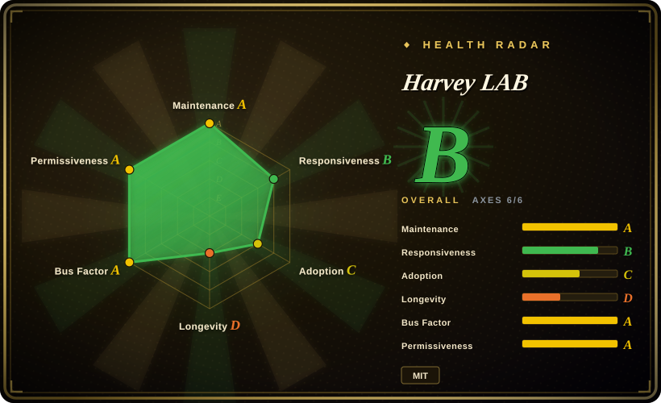
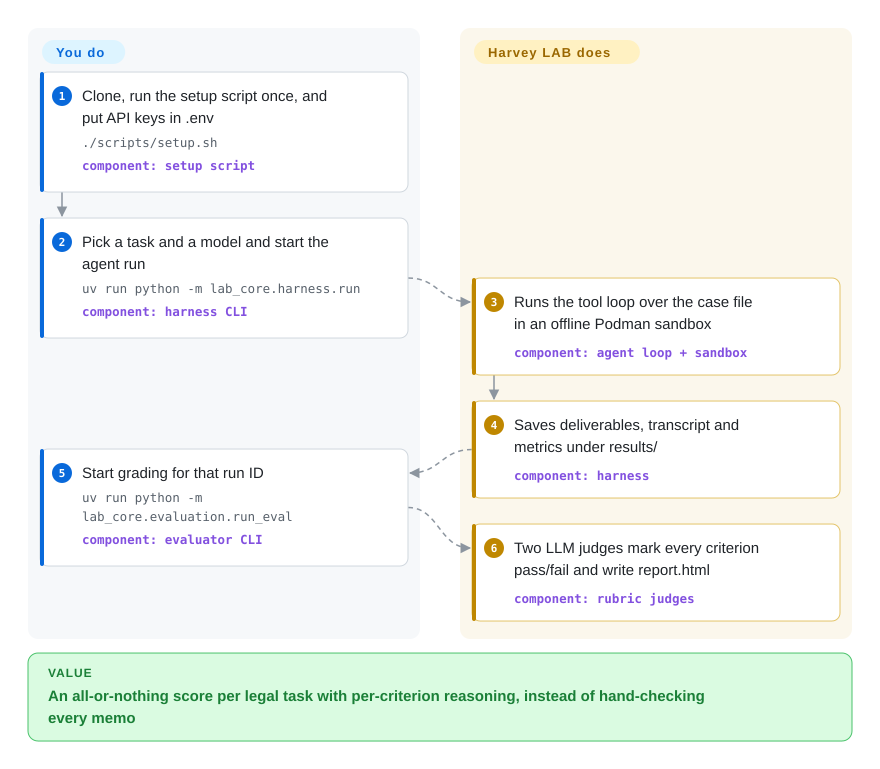

# Harvey LAB

You want to know whether an AI agent can do a junior lawyer's actual work — read a 60-document data room and hand back the red-flag memo — but most legal benchmarks only ask one-line questions with a Yes/No answer. Harvey LAB gives the agent a synthetic case file inside a locked, offline container, then has two LLM judges tick a lawyer-written pass/fail checklist against the memo it wrote; one missed item fails the whole task.

## When to use

You build or buy legal AI — an in-house legal-tech team choosing between Claude, GPT and Gemini for a diligence assistant, or a researcher who needs to show that an agent change actually helps with long legal assignments. Your current evidence is anecdotes: someone tried "review these contracts" in a chat window and the memo *looked* good, yet nobody checked whether it caught the change-of-control consent buried in document 37. Harvey LAB gives you about 1,660 fixed tasks across 24 practice areas plus contracting, each with its own document folder, a named deliverable (`red-flag-memorandum.docx`, a markup, a motion) and an expert-written rubric of explicit PASS/FAIL criteria — the tutorial task alone has 60 documents and 68 criteria.

Reach for it over LegalBench when the question is "can the agent finish a multi-document assignment and produce a usable file", not "does the model know legal reasoning in isolation"; and over a general framework such as [promptfoo](promptfoo.md) when you want a ready-made legal task corpus with a comparable headline number instead of writing every case and assertion yourself. The deciding tradeoff: you inherit Harvey's tasks, harness, judge pair and all-or-nothing scoring, in exchange for realism that short-form legal datasets do not have.

## How it works

The repository is two things kept on disk, with no database or web service: a `tasks/` tree (each task is a `task.json` with instructions, deliverable names and rubric criteria, plus a `documents/` folder of synthetic matter files) and the `lab_core` Python package that runs and grades agents. You pick a task and a model; LAB's own harness then runs a tool-calling loop — the model asks for an action, the harness performs it and feeds the result back — with seven tools (`bash`, `read`, `write`, `edit`, `glob`, `grep`, `finish`) inside a Podman container started with no network access, where the documents are mounted read-only and only the `output/` folder is writable. Grading is a separate step you trigger: each criterion is sent, together with only the deliverable files it names, to a Claude judge and a GPT judge, each returns pass or fail with reasoning, and the task scores 1.0 only if every criterion passes (the two judges' results are averaged, so one task scores 0, 0.5 or 1). Think of it as a bar-exam essay graded against a checklist by two examiners, rather than a multiple-choice sheet. You own the API keys, model choice, turn limits and interpretation; LAB owns the case files, sandbox, transcripts, scoring and the HTML report and comparison dashboards.

<!-- flow-steps:begin (generated from flows/harvey-labs.json by tools/flow_card.py — do not edit) -->

Text version of the flow

1. **You**: Clone, run the setup script once, and put API keys in .env — `./scripts/setup.sh` — component: `setup script`
2. **You**: Pick a task and a model and start the agent run — `uv run python -m lab_core.harness.run` — component: `harness CLI`
3. **Harvey LAB**: Runs the tool loop over the case file in an offline Podman sandbox — component: `agent loop + sandbox`
4. **Harvey LAB**: Saves deliverables, transcript and metrics under results/ — component: `harness`
5. **You**: Start grading for that run ID — `uv run python -m lab_core.evaluation.run_eval` — component: `evaluator CLI`
6. **Harvey LAB**: Two LLM judges mark every criterion pass/fail and write report.html — component: `rubric judges`

**Value**: An all-or-nothing score per legal task with per-criterion reasoning, instead of hand-checking every memo

<!-- flow-steps:end -->

## When NOT to use

- **You want a cheap, quick read on a model's legal reasoning, not a long agent run.** Use LegalBench (not indexed) instead: its 162 short input/output tasks (hearsay, rule QA, definition extraction) score by matching expected answers, while one LAB task means an agent run of many turns plus dozens of judge calls per criterion set.
- **You are evaluating a coding agent or code patches.** Use [SWE-bench](swe-bench.md): its grading is executable repository tests, whereas LAB's tasks are legal documents and its grading is LLM judgment.
- **You need regression tests for your own legal product's prompts, retrieval, or house style.** Use [promptfoo](promptfoo.md) or a framework such as Inspect AI (not indexed) and write cases from your own (sanitised) matters; LAB's corpus is fixed, synthetic and Harvey-authored, so a high LAB score says little about your firm's precedents or your RAG pipeline. You *can* add tasks in LAB's `task.json` format, but then you maintain a fork of a 2 GB repo.
- **Your agent is a product with its own tools and retrieval, not a bare model API.** LAB's harness drives models through its own adapters (Anthropic, OpenAI, Google, Mistral, Fireworks) and its own seven tools. To test a different agent you either write a `ModelAdapter` or drop your agent's deliverables into `results/<run-id>/output/` and run only the grader — the evaluator only requires that the run directory exist [推断: read from `run_eval.py`, not run]. If you need a harness designed around plugging in arbitrary agents, Inspect AI is the more general choice.
- **You need deterministic, judge-free scores or an official leaderboard.** Every score here is an LLM verdict: by default `claude-sonnet-4-6` plus `gpt-5.5`, so both an Anthropic and an OpenAI key are required and every re-grade costs API money. Judge-vs-answer variance is still an open question upstream (issue #158, 2026-09-04), and the repository ships no hosted leaderboard. If you need exact-match grading, use LegalBench-style tasks.
- **You cannot run containers or fetch a multi-gigabyte repository.** Every run executes in a Podman sandbox (macOS needs a Podman machine; Windows needs Windows 11 + WSL2), and the GitHub-reported repository size is about 2.1 GB of plain git blobs with no Git LFS. In a locked-down CI runner without Podman, a lighter framework such as [promptfoo](promptfoo.md) is the practical choice.
- **You will compare numbers produced at different commits or by other people.** Task rubrics are still being corrected (open reports that criteria in #149, #152 and #165 are unsatisfiable from the provided documents), and harness changes such as the 2026-09-03 `finish` tool made earlier results "not directly comparable" by the project's own CHANGELOG. Pin a commit and read `CHANGELOG.md` before citing any comparison.

## Comparison

| Alternative | In index | Our verdict | Tradeoff |
|---|---|---|---|
| [SWE-bench](swe-bench.md) | ✅ | Pick SWE-bench when the agent writes code and success can be proven by repository tests; pick Harvey LAB when the agent writes legal documents and success is a lawyer-style checklist. | SWE-bench grades with executable tests (objective, but Docker-heavy); LAB grades with two LLM judges (fits prose deliverables, but costs API calls per criterion and inherits judge variance). |
| LegalBench | not indexed | Pick LegalBench for fast, reproducible measurement of short legal reasoning skills; pick Harvey LAB when you need to test an agent working through a whole matter file end to end. | LegalBench is exact-answer and cheap per item but single-turn; LAB is long-horizon and realistic but slow and judge-dependent. Not added in this tab-intake batch. |
| BigLaw Bench (`harveyai/biglaw-bench`) | not indexed | Treat BigLaw Bench as Harvey's earlier benchmark description with sample tasks; pick Harvey LAB when you want the runnable harness, sandbox and full task corpus. | BigLaw Bench documents core, workflow and retrieval task families but its README describes them rather than shipping a comparable execution harness [推断]; LAB is the runnable successor. Not added in this tab-intake batch. |
| Inspect AI | not indexed | Pick Inspect AI when you need a general evaluation framework to build your own agent evals with custom solvers and scorers; pick Harvey LAB when you want a ready legal task set and do not want to author it. | Inspect AI gives full flexibility and many built-in evals but no legal corpus of this depth; LAB gives the corpus but a fixed harness shape. Not added in this tab-intake batch. |
| [promptfoo](promptfoo.md) | ✅ | Pick promptfoo to gate your own legal app's prompts and outputs in CI with assertions you write; pick Harvey LAB to benchmark models or agents on a shared, externally authored legal corpus. | promptfoo is lightweight and app-specific with no legal tasks built in; LAB brings 1,600+ tasks but requires Podman, two judge keys and long runs. |

## Tech stack

- **Language / packaging:** Python 3.12–3.13, packaged as `lab-core` (hatchling); commands run as `uv run python -m lab_core.<module>`. Version 1.1.0 is published as a wheel on the GitHub release, not on PyPI (PyPI returned 404 for `lab-core` on 2026-09-29).
- **Harness:** a custom agent loop (`lab_core/harness/agent_loop.py`) with provider adapters built on the `anthropic`, `openai`, `google-genai` and optional `mistralai` SDKs; Fireworks-served open models (Kimi, GLM, Nemotron) have their own adapter.
- **Sandbox:** Podman, one container per task, `--network=none --cap-drop=ALL`, image `ghcr.io/harveyai/lab-sandbox` built from a `python:3.12-slim` base.
- **Document handling:** pdfplumber, MarkItDown, pandas/openpyxl, python-pptx and the Pandoc CLI parse `.pdf/.docx/.xlsx/.pptx` for both the agent's `read` tool and the grader.
- **Reporting:** static `report.html` per run, and matplotlib/seaborn comparison dashboards; all state is files under `results/`.

## Dependencies

- **Runtime:** `uv`, Python 3.12/3.13, the Pandoc CLI, Podman (plus a running Podman machine on macOS/Windows) and the sandbox image; `scripts/setup.sh` installs or pulls all of these and is idempotent.
- **Model access:** API keys in `.env` — `ANTHROPIC_API_KEY` and `OPENAI_API_KEY` are required for the default judge pair; `GOOGLE_API_KEY`, Mistral or Fireworks keys only if you benchmark those models.
- **Data:** the task corpus lives in the repository itself (`tasks/`, excluded from the wheel), so a full clone is required; set `LAB_ROOT` when the package is installed elsewhere.
- **Platform:** Linux, macOS, or Windows 11 with WSL2 and CPU virtualization enabled.

## Ops difficulty

**Medium.** There is nothing to deploy or keep running — no server, no database — and one setup script covers installation. The weight is in operating the benchmark: a ~2 GB clone, a Podman runtime, long agent runs (the tutorial task takes about 20 minutes for a small model), paid API calls for both the agent and two judges, and discipline about comparability (pin the commit, keep the same judge profile, read the score-impact `CHANGELOG.md`). Sweeps across models and practice areas multiply all of that, so budget API spend and parallelism (`--parallel`) before running `all`.

## Health & viability

- **Maintenance:** Grade A — on 2026-09-29 the last default-branch commit was 12 days old with activity in 10 of the preceding 13 weeks; v1.0 was tagged 2026-07-24 and v1.1.0 released 2026-09-18, and the project keeps a score-impact `CHANGELOG.md` that tells you which commits are still comparable.
- **Responsiveness:** Grade B — median first response of 275.9 hours across 8 qualifying issues. Several substantive reports about unsatisfiable rubric criteria (#146, #147, #149, #152) and a grader that silently scores unreadable deliverables (#145) had no maintainer comment as of 2026-09-29, so expect to patch task defects locally.
- **Adoption:** Grade C — no PyPI package; the GitHub-release wheel shows 136,530 asset downloads, and the repository had 1,391 stars and 247 forks on 2026-09-29. Stars are high for a six-month-old repository, which reflects Harvey's brand as much as independent use [推断].
- **Longevity:** Grade D — the repository is 182 days old (created 2026-03-30). It is active, but there is no Lindy evidence yet; treat it as a young benchmark whose task set and harness are still moving.
- **Governance:** Grade A on contributor spread (20 active contributors, top contributor 25.5%), but the roadmap is owned by one company: `CODEOWNERS` requires approval from six named admins, and Harvey sells a commercial legal AI product, so the benchmark's task design and default judges are a vendor's choices.
- **Risk / license:** Grade A — MIT (`LICENSE`, "Copyright (c) 2026 Harvey AI"); it is the only license file, so it nominally covers the synthetic task documents as well [推断]; no relicense history. The tutorial notes the documents are machine-generated under lawyer review and "contain imperfections".

## Caveats (unverified)

- [推断] Grading external agents by placing deliverables in `results/<run-id>/output/` is read from `lab_core/evaluation/run_eval.py` (it only checks the run directory exists); it was not executed.
- [推断] BigLaw Bench being a description-first repository rather than a runnable harness comes from reading its README only; its data files were not inspected.
- [推断] The single root MIT `LICENSE` covering the task documents is inferred from the absence of any separate data license file (GitHub code search, 2026-09-29); the repository does not state it explicitly.
- [推断] Attributing part of the 1.4k stars to Harvey's brand rather than independent benchmark use is a judgment from the repository's age and the few external issue reporters; no usage census exists.
- [未验证] Task count: the README badge says 1,671 tasks and the tutorial says 1,660; an open PR (#156) is correcting stale counts, so the exact number was not re-counted (the GitHub tree API truncates on this repository).
- [未验证] The "about 20 minutes" tutorial runtime is author-reported and depends on model and provider latency; no run was reproduced for this page (needs Anthropic/OpenAI keys and Podman).
- [推断] Medium ops difficulty is an architectural judgment from the setup script, Podman requirement, repository size and per-criterion judge calls, not a measured deployment.
