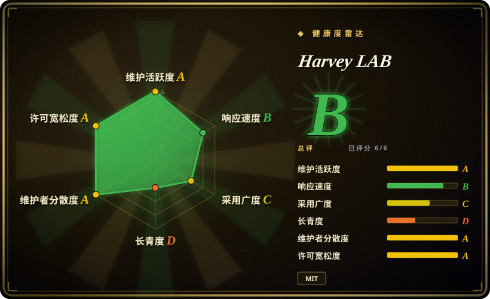
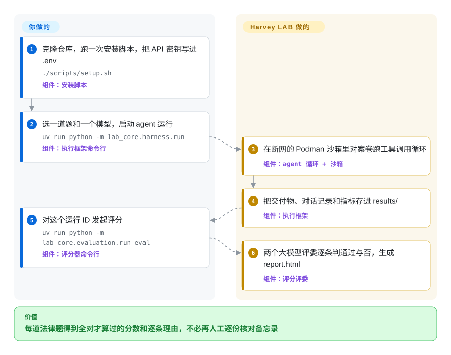

# Harvey LAB

你想知道一个 AI agent 能不能真干初级律师的活——读完 60 份文件的数据室、交回一份风险备忘录——可现有法律基准大多只问一句话、答“是 / 否”。Harvey LAB 把一整套虚构案卷放进断网的隔离容器交给 agent，再让两个大模型评委拿律师写好的逐条合格清单去对它写出的文件打勾；漏一条，整题判零分。

## 何时使用

你在做或在采购法律 AI：比如企业法务科技团队要在 Claude、GPT、Gemini 之间为尽调助手选模型，或者研究者要证明某次 agent 改动真的让长篇法律任务变好了。你手里现有的证据只是印象——有人在聊天窗口里让模型“审一下这些合同”，出来的备忘录看着像样，但没人核对它有没有抓到第 37 份文件里那条控制权变更须经同意的条款。Harvey LAB 提供约 1,660 道固定任务，覆盖 24 个执业领域加合同类，每题带自己的文件夹、指定的交付物（`red-flag-memorandum.docx`、一份修订稿、一份动议）和专家写的逐条 PASS/FAIL 评分标准——教程那一道题就有 60 份文件、68 条标准。

当你要问的是“agent 能不能把一整套多文件任务做完并交出能用的文件”，而不是“模型孤立地懂不懂法律推理”时，选它而不是 LegalBench；当你想要现成的法律任务库和可比的总分、而不想每个用例和断言都自己写时，选它而不是 [promptfoo](promptfoo.zh.md) 这类通用框架。关键取舍是：你接受 Harvey 定好的任务、执行框架、评委组合和全对才得分的计分方式，换来短题型法律数据集没有的真实度。

## 怎么用起来

仓库只有两样东西，全放在磁盘上，没有数据库也没有 Web 服务：一棵 `tasks/` 目录树（每道题是一个 `task.json`，写着指令、交付物文件名和评分标准，外加一个装虚构案卷的 `documents/` 文件夹），以及负责运行和评分的 Python 包 `lab_core`。你选一道题和一个模型；LAB 自带的执行框架随后跑一个工具调用循环——模型提出要做的动作，框架替它执行、把结果喂回去——可用的工具有七个（`bash`、`read`、`write`、`edit`、`glob`、`grep`、`finish`），全部在一个断网启动的 Podman 容器里执行，案卷只读挂载，只有 `output/` 可写。评分是你另外触发的一步：每条标准连同它点名的那几个交付文件，分别发给一个 Claude 评委和一个 GPT 评委，各自给出通过或不通过并附理由；只有全部标准都通过这道题才得 1 分（两个评委的结果取平均，所以单题得分只可能是 0、0.5 或 1）。可以把它想成两位考官拿核对清单批改的律考论述题，而不是一张选择题答题卡。API 密钥、选哪个模型、轮数上限和结论解读归你；案卷、沙箱、对话记录、评分、HTML 报告和对比看板归 LAB。

<!-- flow-steps:begin (generated from flows/harvey-labs.json by tools/flow_card.py — do not edit) -->

流程文字版

1. **你**：克隆仓库，跑一次安装脚本，把 API 密钥写进 .env — `./scripts/setup.sh` — 组件：`安装脚本`
2. **你**：选一道题和一个模型，启动 agent 运行 — `uv run python -m lab_core.harness.run` — 组件：`执行框架命令行`
3. **Harvey LAB**：在断网的 Podman 沙箱里对案卷跑工具调用循环 — 组件：`agent 循环 + 沙箱`
4. **Harvey LAB**：把交付物、对话记录和指标存进 results/ — 组件：`执行框架`
5. **你**：对这个运行 ID 发起评分 — `uv run python -m lab_core.evaluation.run_eval` — 组件：`评分器命令行`
6. **Harvey LAB**：两个大模型评委逐条判通过与否，生成 report.html — 组件：`评分评委`

**价值**：每道法律题得到全对才算过的分数和逐条理由，不必再人工逐份核对备忘录

<!-- flow-steps:end -->

## 何时不用

- **你只想便宜、快速地看一眼模型的法律推理能力，而不是跑一整轮 agent。** 改用 LegalBench（未收录）：它的 162 道短题（传闻证据判断、规则问答、定义抽取）按标准答案比对计分；而 LAB 的一道题就是一次多轮 agent 运行，外加对整套标准的几十次评委调用。
- **你评测的是写代码的 agent 或代码补丁。** 改用 [SWE-bench](swe-bench.zh.md)：它靠仓库里可执行的测试判分，LAB 的任务是法律文书、判分靠大模型的判断。
- **你要给自家法律产品的提示词、检索或行文风格做回归测试。** 改用 [promptfoo](promptfoo.zh.md) 或 Inspect AI（未收录）这类框架，用你自己（脱敏后）的案子写用例；LAB 的题库是固定的、虚构的、由 Harvey 编写，LAB 分数高并不说明它懂你所的先例或你的 RAG 流水线。你确实可以按 `task.json` 格式自己加题，但那就意味着你要维护一个 2 GB 仓库的分叉。
- **你的 agent 是自带工具和检索的产品，而不是一个裸模型 API。** LAB 的执行框架通过自己的适配器（Anthropic、OpenAI、Google、Mistral、Fireworks）驱动模型、用的是它自己那七个工具。要测别的 agent，要么写一个 `ModelAdapter`，要么把你的 agent 产出的交付物放进 `results/<run-id>/output/`、只跑评分器——评分器只要求这个运行目录存在（[推断] 读 `run_eval.py` 得出，没实际跑）。如果你要的是专为接入任意 agent 设计的评测框架，Inspect AI 更通用。
- **你需要确定性的、不靠评委的分数，或者一个官方排行榜。** 这里每个分数都是大模型的判定：默认是 `claude-sonnet-4-6` 加 `gpt-5.5`，所以 Anthropic 和 OpenAI 两把密钥都得有，每重评一次都要花 API 费用。答案波动和评委波动怎么分开，上游还挂着一个未解决的 issue（#158，2026-09-04）；仓库也不附带托管排行榜。要精确匹配式评分，用 LegalBench 这类题型。
- **你跑不了容器，或者拉不动几个 GB 的仓库。** 每次运行都在 Podman 沙箱里执行（macOS 要起 Podman machine，Windows 要 Windows 11 加 WSL2）；GitHub 报告的仓库体积约 2.1 GB，全是普通 git 对象，没用 Git LFS。在没有 Podman 的受限 CI 里，[promptfoo](promptfoo.zh.md) 这类轻量框架才现实。
- **你要拿不同提交、或别人跑出来的数字做对比。** 评分标准还在修正中（#149、#152、#165 都报告了某些标准凭给出的文件根本无法满足），而像 2026-09-03 加入的 `finish` 工具这类框架改动，按项目自己的 CHANGELOG 说法会让前后结果“不能直接比较”。引用任何对比之前，先固定提交、读 `CHANGELOG.md`。

## 横向对比

| 替代品 | 是否收录 | 我们的评价 | 取舍 |
|---|---|---|---|
| [SWE-bench](swe-bench.zh.md) | ✅ | 如果 agent 写的是代码、成败能用仓库测试证明，选 SWE-bench；如果 agent 写的是法律文书、成败是一张律师式核对清单，选 Harvey LAB。 | SWE-bench 用可执行测试判分（客观，但很吃 Docker 资源）；LAB 用两个大模型评委判分（适合散文式交付物，但每条标准都要花 API 调用，也继承评委的波动）。 |
| LegalBench | 未收录 | 要快速、可复现地测短小的法律推理能力，选 LegalBench；要测 agent 从头到尾处理一整套案卷，选 Harvey LAB。 | LegalBench 有标准答案、单题便宜，但只有单轮；LAB 长链路、贴近实务，但慢且依赖评委。本批 tab 收录未添加。 |
| BigLaw Bench（`harveyai/biglaw-bench`） | 未收录 | 把 BigLaw Bench 当作 Harvey 早先的基准说明加样例题；要可运行的执行框架、沙箱和完整题库，选 Harvey LAB。 | BigLaw Bench 描述了核心、工作流、检索三类任务，但它的 README 是在介绍任务而不是提供可比的执行框架[推断]；LAB 是可运行的后继者。本批 tab 收录未添加。 |
| Inspect AI | 未收录 | 要一个通用评测框架、用自定义 solver 和 scorer 搭自己的 agent 评测，选 Inspect AI；要现成的法律题库、不想自己出题，选 Harvey LAB。 | Inspect AI 灵活、自带很多评测，但没有这种深度的法律题库；LAB 有题库，但执行框架的形状是定死的。本批 tab 收录未添加。 |
| [promptfoo](promptfoo.zh.md) | ✅ | 要在 CI 里用自己写的断言守住自家法律应用的提示词和输出，选 promptfoo；要在一套外部编写、大家共用的法律题库上给模型或 agent 做基准，选 Harvey LAB。 | promptfoo 轻量、贴合具体应用，但不自带法律题；LAB 自带 1,600 多道题，但要 Podman、两把评委密钥和长时间运行。 |

## 技术栈

- **语言与打包：** Python 3.12–3.13，打包为 `lab-core`（hatchling），命令以 `uv run python -m lab_core.<module>` 形式运行。1.1.0 版以 wheel 形式挂在 GitHub Release 上，没有发到 PyPI（2026-09-29 查询 PyPI 的 `lab-core` 返回 404）。
- **执行框架：** 自写的 agent 循环（`lab_core/harness/agent_loop.py`），各家适配器基于 `anthropic`、`openai`、`google-genai` 和可选的 `mistralai` SDK；Fireworks 上托管的开源模型（Kimi、GLM、Nemotron）有单独的适配器。
- **沙箱：** Podman，每题一个容器，参数 `--network=none --cap-drop=ALL`，镜像 `ghcr.io/harveyai/lab-sandbox`，基于 `python:3.12-slim` 构建。
- **文档处理：** pdfplumber、MarkItDown、pandas/openpyxl、python-pptx 和 Pandoc 命令行，负责为 agent 的 `read` 工具和评分器解析 `.pdf/.docx/.xlsx/.pptx`。
- **报告：** 每次运行一个静态 `report.html`，matplotlib/seaborn 生成对比看板；所有状态都是 `results/` 下的文件。

## 依赖

- **运行时：** `uv`、Python 3.12/3.13、Pandoc 命令行、Podman（macOS/Windows 上还要一个在运行的 Podman machine）和沙箱镜像；`scripts/setup.sh` 会安装或拉取这些，可重复执行。
- **模型访问：** `.env` 里的 API 密钥——默认评委组合必须有 `ANTHROPIC_API_KEY` 和 `OPENAI_API_KEY`；`GOOGLE_API_KEY`、Mistral 或 Fireworks 的密钥只在评测这些模型时需要。
- **数据：** 题库就在仓库里（`tasks/`，不打进 wheel），所以必须完整克隆；包装在别处时用 `LAB_ROOT` 指向克隆目录。
- **平台：** Linux、macOS，或开启 WSL2 和 CPU 虚拟化的 Windows 11。

## 运维难度

**中。** 没有要部署或常驻的东西——没有服务、没有数据库——一个安装脚本就能装好。重量在于“把基准跑好”：约 2 GB 的克隆、Podman 运行时、漫长的 agent 运行（教程那道题用小模型也要约 20 分钟）、agent 和两个评委都要付费调用 API，还得守住可比性（固定提交、保持同一评委配置、读记录分数影响的 `CHANGELOG.md`）。跨模型、跨执业领域的批量运行会把这些成倍放大，跑 `all` 之前先算好 API 预算和并发（`--parallel`）。

## 健康度与可持续性

- **维护：** A 档——2026-09-29 时默认分支最后一次提交在 12 天前，前 13 周里有 10 周有活动；v1.0 于 2026-07-24 打标签，v1.1.0 于 2026-09-18 发布；项目还维护一份记录“分数影响”的 `CHANGELOG.md`，告诉你哪些提交之间的结果仍可比。
- **响应：** B 档——8 个合格 issue 的首次响应中位数为 275.9 小时。几条实质性的报告——评分标准无法满足（#146、#147、#149、#152）、评分器把读不出来的交付物静默拿去打分（#145）——截至 2026-09-29 都没有维护者回复，要做好在本地自行修补题目缺陷的准备。
- **采用：** C 档——没有 PyPI 包；GitHub Release 上的 wheel 资产下载数为 136,530，2026-09-29 仓库有 1,391 星、247 个 fork。对一个才半年的仓库来说星数偏高，这里面 Harvey 的品牌效应和独立使用各占多少说不清 [推断]。
- **存续：** D 档——仓库只有 182 天（2026-03-30 创建）。它在活跃，但还谈不上 Lindy 证据；把它当作题库和执行框架都还在变动的年轻基准。
- **治理：** 贡献者分布是 A 档（20 名活跃贡献者，最大贡献者占 25.5%），但路线图归一家公司：`CODEOWNERS` 要求六名指定管理员审批，而 Harvey 本身在卖商业法律 AI 产品，所以题目怎么设计、默认用哪些评委，都是一家厂商的选择。
- **风险 / 许可证：** A 档——MIT（`LICENSE` 写明“Copyright (c) 2026 Harvey AI”）；这是仓库里唯一的许可证文件，所以名义上也覆盖虚构案卷 [推断]；没有改许可证的历史。教程说明这些文件是在律师指导审核下批量生成的，“存在瑕疵”。

## 存疑（未验证）

- [推断]把交付物放进 `results/<run-id>/output/` 就能给外部 agent 评分，是读 `lab_core/evaluation/run_eval.py` 得出的（它只检查运行目录是否存在），没有实际执行。
- [推断]BigLaw Bench 是以说明为主、而非可运行执行框架的仓库，这一点只读了它的 README，没有检查其数据文件。
- [推断] 根目录那份 MIT `LICENSE` 覆盖题目文件，是由找不到任何单独数据许可证文件推出来的（2026-09-29 用 GitHub 代码搜索核对），仓库没有明说。
- [推断] 把 1.4k 星的一部分归于 Harvey 的品牌效应而非独立使用，是根据仓库年龄和外部 issue 报告者偏少做出的判断，没有使用情况统计。
- [未验证] 题目数量：README 徽章写 1,671 道，教程写 1,660 道；有一个未合并 PR（#156）在修正过时的计数，所以没有重新精确清点（GitHub 目录树 API 在这个仓库上会截断）。
- [未验证] 教程说“约 20 分钟”是作者自报的，取决于模型和服务商延迟；本页没有复现运行（需要 Anthropic/OpenAI 密钥和 Podman）。
- [推断] 运维难度“中”是根据安装脚本、Podman 要求、仓库体积和逐条评委调用做出的架构判断，不是实测部署。
