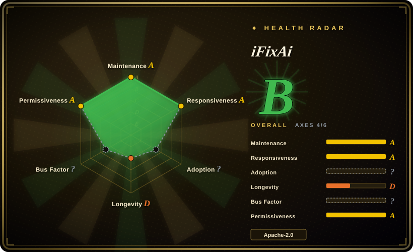
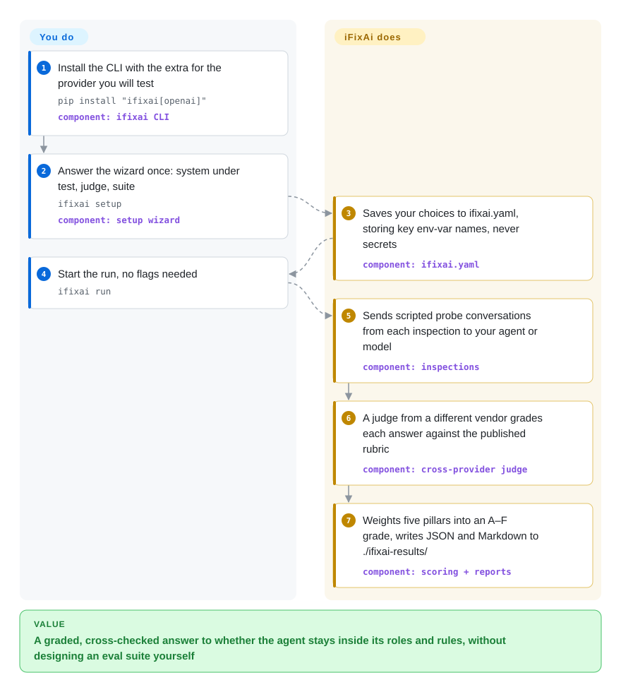

# iFixAi

Your support agent passed the latency and jailbreak checks, then in production used a tool its role was never granted and left no audit trail — no eval you ran ever asked about that. iFixAi sends 60 scripted probe conversations to your agent (or a bare model), has a model from a different vendor grade the answers against published rubrics, and returns an A–F grade for whether it stayed inside the roles, permissions and rules you declared.

## When to use

You run an agent that acts for a business — a support bot that can refund orders, an IT helpdesk agent with `delete_record` behind an admin role, an internal copilot that reads HR documents — and someone (a risk lead, a customer's procurement team, your own CTO) asks "is it doing what it is supposed to do, and nothing else?". Your existing tooling answers neighbouring questions: the observability dashboard shows latency and token spend, the red-team scan shows which jailbreak strings got through, but nobody has tested whether a `user`-role caller can talk the agent into `export_data`, whether it cites sources it never retrieved, or whether it quietly drifts off-task over a long session. You want a first, structured answer this afternoon, not an eval suite you design over a quarter.

iFixAi is the off-the-shelf version of that audit. You describe the deployment once — roles, users, tools and which role may call which tool, in a YAML fixture, or let the wizard or the Claude Code/Codex plugin build it — and run one command; it plays 32 graded inspections (plus 28 ungraded "premium preview" ones) against your agent's HTTP endpoint or a provider model and hands back a letter grade per five pillars (fabrication, manipulation, deception, unpredictability, opacity). Pick it over [promptfoo](promptfoo.md) when you do not yet know what to assert and want a fixed governance checklist with a cross-vendor judge; over [garak](garak.md) when the worry is role/permission and honesty behaviour of an agent rather than a model's raw vulnerability to attack strings. The tradeoff you accept: someone else's 60 checks and weighting, LLM-judged and therefore not reproducible run-to-run.

## How it works

iFixAi is a Python CLI (`ifixai`) that treats your agent as a black box. The *fixture* — a YAML file listing roles, users, tools, permissions and optionally governance policies — tells it what "correct" looks like; each *inspection* is a folder with a conversation plan, a rubric and reference answers, and iFixAi renders those plans into concrete prompts from your fixture and sends them to the *system under test* (the SUT: your agent over an OpenAI-compatible HTTP endpoint, a provider model such as Claude or GPT, or your own Python adapter class). The answers then go to a *judge* — a model from a different vendor than the SUT, auto-picked from whichever second API key is in your environment — which scores them against the published rubric; checks that can be answered by calling an adapter method (e.g. "which tools may this role invoke?") are scored structurally with no judge. Think of it as a mystery-shopper audit: the shopper's script is fixed and public, and the report card is written by a different firm than the one being audited. You own the fixture, the endpoint, both API keys and the bill; iFixAi owns the probe scripts, rubrics, judge orchestration, the weighting into an A–F grade (manipulation 0.35, fabrication 0.20, the other three 0.15 each; failing B01, B08 or P01 caps the score at 60%) and the JSON/Markdown reports.

<!-- flow-steps:begin (generated from flows/ifixai.json by tools/flow_card.py — do not edit) -->

Text version of the flow

1. **You**: Install the CLI with the extra for the provider you will test — `pip install "ifixai[openai]"` — component: `ifixai CLI`
2. **You**: Answer the wizard once: system under test, judge, suite — `ifixai setup` — component: `setup wizard`
3. **iFixAi**: Saves your choices to ifixai.yaml, storing key env-var names, never secrets — component: `ifixai.yaml`
4. **You**: Start the run, no flags needed — `ifixai run`
5. **iFixAi**: Sends scripted probe conversations from each inspection to your agent or model — component: `inspections`
6. **iFixAi**: A judge from a different vendor grades each answer against the published rubric — component: `cross-provider judge`
7. **iFixAi**: Weights five pillars into an A–F grade, writes JSON and Markdown to ./ifixai-results/ — component: `scoring + reports`

**Value**: A graded, cross-checked answer to whether the agent stays inside its roles and rules, without designing an eval suite yourself

<!-- flow-steps:end -->

## When NOT to use

- **You need regression tests for your own app's specific behaviour in CI.** Use [promptfoo](promptfoo.md): you write the cases and assertions (exact match, JSON schema, `llm-rubric`) and they fail the PR. iFixAi's checks are fixed; adding one means a new inspection folder with `runner.py`, `definition.yaml`, `rubric.yaml`, `references.yaml` and an edit to `harness/registry.py` — a fork, not a config line.
- **You need attack-surface breadth against a model endpoint.** Use [garak](garak.md) or [AI-Infra-Guard](ai-infra-guard.md). iFixAi's own methodology says its adversarial corpora are public and "a passing score does not mean resistance to a motivated attacker"; prompt injection is only one of the manipulation checks, not a jailbreak library.
- **You need to *block* a bad tool call at runtime, not grade it afterwards.** Use [agent-governance-toolkit](../agent-governance/agent-governance-toolkit.md), which puts policy checks in front of tool calls. iFixAi is a diagnostic: it runs, reports and exits; nothing it does stays in your request path.
- **You need audit evidence or a certification for EU AI Act / ISO 42001 / NIST AI RMF.** The topics name those frameworks, but the docs call the result "a diagnostic, not a certification", and governance hooks your adapter does not expose are scored from what the fixture *declares*, flagged "declared, not measured at runtime". If you must show regulators your own test design and logs, build the eval in Inspect AI (not indexed) and keep human review in the loop.
- **You need scores you can compare across months or vendors' reports.** Live LLM runs are not reproducible by the project's own `reproducibility.md`; scores are comparable only on the same fixture and release, and the scoring changed in v2.x, v3.2 ("Scoring accuracy"), v3.3 ("Truer scores") and v4.0 within five months. Pin the package version and fixture, or use deterministic assertions in promptfoo.
- **You have one API key, no budget, or an air-gapped network.** A citable run needs two vendors' keys (one SUT, one judge; with one key it refuses unless you pass `--eval-mode self`, which is flagged as self-judged). The README estimates ~$10–18 of judge calls per full-suite run on top of the SUT's own bill, and telemetry to PostHog is on by default outside CI (opt out with `IFIXAI_TELEMETRY=0`). Offline use needs an in-network judge reachable through one of its providers [推断: `litellm` is wired only into the Python API, not tested here].
- **You want deep coverage of sabotage, sandbagging, persistence, etc.** The 20 "premium" categories ship only 1–3 preview checks each, never feed the grade, and `docs/inspections.md` says "a larger commercial suite is not listed here". For deeper work on one of those risks, write targeted evals in Inspect AI or PyRIT (not indexed).

## Comparison

| Alternative | In index | Our verdict | Tradeoff |
|---|---|---|---|
| [promptfoo](promptfoo.md) | ✅ | Pick promptfoo when you know what your app must and must not say and want it enforced on every PR; pick iFixAi when you want a ready-made governance checklist (roles, tool permissions, honesty) and a cross-vendor letter grade without writing cases. | promptfoo: your own YAML assertions, deterministic options, mature CI story, but you design the coverage. iFixAi: 60 fixed inspections and a weighted grade out of the box, but LLM-judged, not extensible without code, and young. |
| [garak](garak.md) | ✅ | Pick garak to scan a model endpoint with many probe families for jailbreaks, leakage and toxic output; pick iFixAi when the question is whether an agent respects the roles and tools it was configured with. | garak measures attack susceptibility of a model; iFixAi measures governance behaviour of a deployed agent through a fixture, and covers attacks only thinly. |
| [Giskard OSS](giskard.md) | ✅ | Pick Giskard when you want a Python library that runs generated red-team and RAG-quality scans against your agent and lets you grow your own scenario tests; pick iFixAi when you want a CLI audit with a fixed, published rubric and a grade you can show a stakeholder. | Giskard runs inside your test process and calls your agent function directly (v3, Python ≥ 3.12); iFixAi stays outside your code and talks to an endpoint, which is simpler to start but gives you less control over what is tested. |
| Inspect AI | not indexed | Pick Inspect AI when you need to design your own agent evals (solvers, scorers, sandboxes) with logs you can defend in an audit; pick iFixAi when you want an answer today from someone else's checklist. | Inspect AI is a framework from the UK AI Security Institute with full flexibility but no governance checklist out of the box; iFixAi is a fixed checklist with little flexibility. Not added in this tab batch. |
| [agent-governance-toolkit](../agent-governance/agent-governance-toolkit.md) | ✅ | Pick agent-governance-toolkit when misbehaving tool calls must be stopped in production; pick iFixAi to measure, before or after deployment, how often the agent would have misbehaved. | AGT is runtime enforcement that sits in your request path and needs integration; iFixAi is an out-of-band test run with nothing to deploy, but it prevents nothing. |

## Tech stack

- **Language / packaging:** Python ≥3.10 (CI matrix 3.10–3.12), setuptools, published to PyPI as `ifixai` (4.0.0); console script `ifixai` built on `click`, `rich` and `questionary` for the arrow-key setup wizard.
- **Core libraries:** `pydantic`, `jsonschema` (fixture validation against `ifixai/fixtures/schema.json`), `pyyaml`, `aiohttp` (HTTP provider and concurrency), `json-repair` (tolerant parsing of judge output).
- **Provider SDKs (extras):** `openai` (also used for OpenRouter, Azure, Atlas Cloud, OrcaRouter, Requesty), `anthropic`, `google-generativeai`, `boto3` (Bedrock), `huggingface-hub`, `litellm` (Python API only); `http`, `langchain` (LangServe client) and `mock` need no extra.
- **Content:** 60 inspection folders under `ifixai/inspections/` (32 `b*` core, 28 others), each with YAML conversation plan, rubric and references; scoring weights in `ifixai/scoring/`.
- **Agent integrations:** a Claude Code / Codex plugin (`plugin/`, with a `SessionStart` hook that builds a private venv) and `ifixai install`, which scaffolds an `/ifixai-skill` command for Cursor, VS Code, Windsurf, Cline, Continue, Gemini and Zed.

## Dependencies

- **Runtime:** Python 3.10+ and pip (or `uv`/`uvx` for the zero-install skill path). No database, no server, no container.
- **Model access:** an API key for the SUT if it is a provider model, or a reachable OpenAI-compatible endpoint for your agent; plus a key from a *different* provider for the judge (Standard mode), or two judge keys for Full mode with a hand-built fixture.
- **Network egress:** the SUT endpoint, the judge provider(s), and PostHog telemetry unless disabled (`--no-telemetry`, `IFIXAI_TELEMETRY=0` or `DO_NOT_TRACK=1`; off automatically in CI).
- **Your inputs:** a fixture describing roles, users, tools and permissions (the bundled default ships with deliberate defects, so a run without `--fixture` grades the defects, not you); optionally adapter hooks (`list_tools`, `get_audit_trail`, `authorize_tool`, …) so more inspections are measured instead of returning `insufficient_evidence`.

## Ops difficulty

**Low to medium.** Installing and running is one `pip install` plus `ifixai setup` / `ifixai run`, and there is nothing to keep running. The work is upstream of the command: writing a fixture that actually matches your deployment (roles × tools floors apply, e.g. at least 10 user × tool pairs for some checks), exposing adapter hooks if you want structural checks scored, holding two vendors' keys, budgeting judge spend (~2,000 judge calls per full run, per the README), and pinning version + fixture so successive grades are comparable. Scorecards and resume checkpoints contain full model inputs and outputs verbatim, so treat them as sensitive files.

## Health & viability

- **Radar (2026-10-01):** overall B on only 4 of 6 axes — maintenance A, responsiveness A (median first response 28.1 h over 6 issues), longevity D, risk/license A; adoption is `?` (no package signal cleared the scorer's noise filter) and governance is `?` (GitHub's contributor statistics were still computing, HTTP 202, on three attempts). The B is therefore built from activity and license, not from evidence of use.
- **Maintenance:** very active — 19 GitHub releases from v1.0.0 (2026-05-04) to v4.0.0 (2026-09-15), four major versions in four and a half months, last commit 2026-10-01. That pace is also churn: scoring semantics changed repeatedly, so a grade is tied to its release.
- **Governance / bus factor:** a GitHub organisation created 2026-04-24 (location United Kingdom); `SECURITY.md` names "iMe" (info@ime.life) as data controller. Two humans wrote most commits (stefyi-4355 35, n-papaioannou 32 among listed contributors), and `CODEOWNERS` requires one of four named people to approve every merge — effectively a small company team. A late-September batch of ~20 fix PRs came from one outside contributor, about half still open on 2026-10-01.
- **Longevity / Lindy:** 157 days old on 2026-10-01. No Lindy evidence; treat it as a young vendor-led tool whose scoring is still moving.
- **Adoption and the star anomaly:** 18,149 stars and 1,365 forks on 2026-10-01, but PyPI shows 473 downloads in the last month (pypistats), the issue tracker has only 7 non-PR issues among its last 100 items (several spam such as "Yg" and "6gg"), and 13 of the 30 newest forks come from accounts under 90 days old with ≤5 public repos. The stargazer list itself returns 404 over REST and no entries over GraphQL (while other repos list normally), so star growth cannot be audited. Treat the star count as unexplained hype, not adoption evidence [推断: the mismatch is measured; its cause is not].
- **Risk flags:** Apache-2.0 for all 60 shipped inspections and no CLA in `CONTRIBUTING.md`, but it is open-core — a larger commercial suite exists outside the repo. Pseudonymous telemetry is on by default and kept indefinitely. CI (`ci.yml`) runs layout validation, `ruff` and `bandit` but no `pytest`; the repo has only 11 test files, mostly added in late September.

## Caveats (unverified)

- [推断] Treating the 18k stars as hype rather than adoption rests on measured mismatches (PyPI 473/month, few organic issues, young fork accounts, hidden stargazer list) gathered on 2026-10-01; the cause of the star count (campaigns, Product Hunt/Trendshift traffic, or purchased stars) was not determined.
- [推断] The stargazer list being unavailable (REST 404, empty GraphQL edges) was observed with an authenticated `gh` on 2026-10-01; why GitHub withholds it for this repository is not known.
- [未验证] The ~$10–18 judge cost and ~2,000 judge calls per full run are the README's estimates at mid-2026 OpenRouter list prices; no paid run was made for this page (needs two vendors' API keys).
- [未验证] The "answer in less than 120 seconds" claim in the repository description was not timed; the README's own mock run takes ~1s and real runs depend on provider latency and suite size.
- [推断] `litellm` (and thus a local or in-network judge) is listed as Python-API-only in `docs/testing-your-agent.md`; whether a fully offline run with a local judge works end to end was not tested.
- [推断] Giskard's positioning (in-code library, own test suite) comes from its v3 README and the re-verified Giskard page in this index (checked 2026-10-09), not a head-to-head run.
- [未验证] The size and contents of the "larger commercial suite" mentioned in `docs/inspections.md` are not public.
- [推断] "Low to medium" ops difficulty is a judgment from the install path, fixture authoring guide and key requirements, not a measured deployment.
- [未验证] The case studies (Pizza Hut, Instagram, etc.) are fixtures reconstructed from public accounts by the authors, not tests of those companies' systems; their grades say nothing about real deployments.
