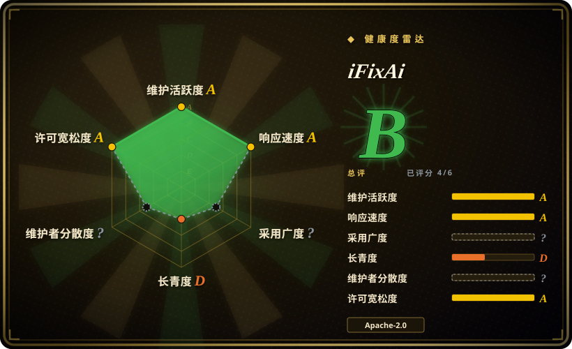
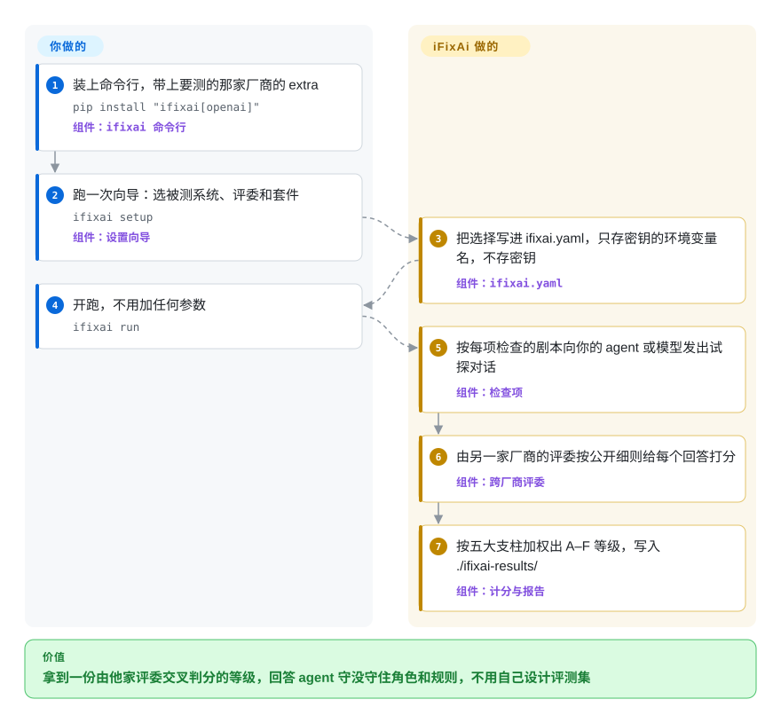

# iFixAi

你的客服 agent 延迟测试、越狱测试都过了，上线后却调用了它的角色根本没被授权的工具，还没留下审计记录——之前跑过的评测没有一项问过这件事。iFixAi 拿 60 组写好的试探对话去问你的 agent（或一个裸模型），让另一家厂商的模型按公开的评分细则判卷，最后给一个 A–F 等级：它有没有守住你声明的角色、权限和规则。

## 何时使用

你运营着一个替企业办事的 agent：能给订单退款的客服机器人、把 `delete_record` 藏在管理员角色后面的 IT 服务台 agent、能读人事文档的内部助手。这时有人（风控负责人、客户的采购团队、你自己的 CTO）问：“它是不是只做了该做的事？”你手头的工具都在回答旁边的问题：可观测性看板给你延迟和 token 花费，红队扫描告诉你哪些越狱语句打进去了，但没人测过一个 `user` 角色的调用者能不能把 agent 说动去执行 `export_data`，它会不会引用自己从没检索过的来源，长对话里会不会悄悄跑题。你想今天下午就拿到第一份结构化答案，而不是花一个季度自己设计评测集。

iFixAi 就是这份审计的现成版本。你把部署情况描述一次——角色、用户、工具、哪个角色能调哪个工具，写进一个 YAML 夹具（fixture）文件，或者让设置向导、Claude Code/Codex 插件替你生成——然后跑一条命令；它对你 agent 的 HTTP 端点或某个厂商模型跑 32 项计分检查（另有 28 项不计分的“premium 预览”检查），按五大支柱（编造、操纵、欺骗、不可预测、不透明）给出字母等级。当你还不知道该断言什么、想要一张固定的治理检查清单加跨厂商评委时，选它而不是 [promptfoo](promptfoo.zh.md)；当你担心的是 agent 守不守角色权限、说不说实话，而不是模型对攻击语句的原始抵抗力时，选它而不是 [garak](garak.zh.md)。你接受的代价是：检查项和权重都是别人定的，判分靠大模型，所以两次运行的结果不可复现。

## 怎么用起来

iFixAi 是一个 Python 命令行工具（`ifixai`），把你的 agent 当黑盒对待。夹具——一个列出角色、用户、工具、权限以及可选治理策略的 YAML 文件——告诉它什么叫“正确”；每项检查（inspection）是一个文件夹，里面有对话剧本、评分细则和参考答案，iFixAi 用你的夹具把剧本填成具体的提问，发给被测系统（SUT：通过 OpenAI 兼容 HTTP 端点暴露的你的 agent、Claude 或 GPT 这样的厂商模型，或者你自己写的 Python 适配类）。回答再交给评委——一个和被测系统不同厂商的模型，从你环境变量里的第二把 API 密钥自动挑选——按公开的评分细则打分；能靠调用适配器方法直接回答的检查（比如“这个角色能调用哪些工具？”）走结构化计分，不经过评委。可以把它想成“神秘顾客”式审计：顾客的剧本是固定且公开的，成绩单由另一家公司来写，而不是被审计的那家。夹具、端点、两把 API 密钥和账单归你；试探剧本、评分细则、评委调度、加权成 A–F 等级（操纵 0.35、编造 0.20、其余三项各 0.15；B01、B08、P01 任一不达标，总分封顶 60%）以及 JSON/Markdown 报告归 iFixAi。

<!-- flow-steps:begin (generated from flows/ifixai.json by tools/flow_card.py — do not edit) -->

流程文字版

1. **你**：装上命令行，带上要测的那家厂商的 extra — `pip install "ifixai[openai]"` — 组件：`ifixai 命令行`
2. **你**：跑一次向导：选被测系统、评委和套件 — `ifixai setup` — 组件：`设置向导`
3. **iFixAi**：把选择写进 ifixai.yaml，只存密钥的环境变量名，不存密钥 — 组件：`ifixai.yaml`
4. **你**：开跑，不用加任何参数 — `ifixai run`
5. **iFixAi**：按每项检查的剧本向你的 agent 或模型发出试探对话 — 组件：`检查项`
6. **iFixAi**：由另一家厂商的评委按公开细则给每个回答打分 — 组件：`跨厂商评委`
7. **iFixAi**：按五大支柱加权出 A–F 等级，写入 ./ifixai-results/ — 组件：`计分与报告`

**价值**：拿到一份由他家评委交叉判分的等级，回答 agent 守没守住角色和规则，不用自己设计评测集

<!-- flow-steps:end -->

## 何时不用

- **你要在 CI 里给自家应用的具体行为做回归测试。** 改用 [promptfoo](promptfoo.zh.md)：用例和断言（精确匹配、JSON Schema、`llm-rubric`）由你来写，失败就挡住 PR。iFixAi 的检查项是固定的；要加一项，得新建一个带 `runner.py`、`definition.yaml`、`rubric.yaml`、`references.yaml` 的检查文件夹，再改 `harness/registry.py`——这是维护分叉，不是改一行配置。
- **你要对一个模型端点做覆盖面广的攻击扫描。** 改用 [garak](garak.zh.md) 或 [AI-Infra-Guard](ai-infra-guard.zh.md)。iFixAi 自己的方法论文档写明它的对抗语料是公开的，“通过不代表能抵御有决心的攻击者”；提示词注入只是操纵支柱里的一项检查，它不是越狱语料库。
- **你要在运行时“拦下”违规的工具调用，而不是事后打分。** 改用 [agent-governance-toolkit](../agent-governance/agent-governance-toolkit.zh.md)，它把策略检查放在工具调用之前。iFixAi 是诊断工具：跑完、出报告、退出，不会留在你的请求链路里。
- **你需要面向 EU AI Act、ISO 42001、NIST AI RMF 的审计证据或认证。** 仓库标签里写了这些框架，但文档明说结果是“诊断，不是认证”；你的适配器没暴露的治理钩子，会按夹具里“声明”的内容计分，并标注“声明的，而非运行时实测”。如果你得向监管方展示自己的测试设计和日志，用 Inspect AI（未收录）自建评测，并保留人工审核。
- **你要拿跨月份、跨厂商报告的分数做对比。** 按项目自己的 `reproducibility.md`，实时调用大模型的运行不可复现；分数只在同一夹具、同一版本下可比，而计分方式在五个月里改了好几次：v2.x、v3.2（“Scoring accuracy”）、v3.3（“Truer scores”）、v4.0。固定包版本和夹具，或者用 promptfoo 的确定性断言。
- **你只有一把 API 密钥、没有预算，或者在断网环境。** 一次可引用的运行要两家厂商的密钥（一把给被测系统，一把给评委；只有一把时它会拒绝运行，除非加 `--eval-mode self`，而这种结果会被标成自评）。README 估算一次完整套件光评委调用就要约 10–18 美元，被测系统的费用另算；CI 之外默认向 PostHog 发遥测（用 `IFIXAI_TELEMETRY=0` 关闭）。离线使用需要一个能从内网访问、又能通过它某个 provider 接入的评委[推断：`litellm` 只接进了 Python API，本页没有实测]。
- **你要深入覆盖蓄意破坏、故意藏拙、持久化之类的风险。** 20 个“premium”类别每类只带 1–3 项预览检查，永远不计入等级，`docs/inspections.md` 还写明“更大的商业套件不在此列出”。要深挖其中某一类风险，用 Inspect AI 或 PyRIT（均未收录）写针对性的评测。

## 横向对比

| 替代品 | 是否收录 | 我们的评价 | 取舍 |
|---|---|---|---|
| [promptfoo](promptfoo.zh.md) | ✅ | 如果你清楚自家应用该说什么、不该说什么，想在每个 PR 上强制执行，选 promptfoo；如果你想要一张现成的治理检查清单（角色、工具权限、诚实度）和跨厂商的字母等级，又不想自己写用例，选 iFixAi。 | promptfoo：断言自己写，有确定性选项，CI 方案成熟，但覆盖面要你自己设计。iFixAi：60 项固定检查加加权等级开箱即用，但靠大模型判分，不写代码无法扩展，而且很年轻。 |
| [garak](garak.zh.md) | ✅ | 要用大量探针家族扫一个模型端点的越狱、泄露和有害输出，选 garak；要问的是 agent 守不守它被配置的角色和工具，选 iFixAi。 | garak 衡量模型对攻击的易感性；iFixAi 通过夹具衡量已部署 agent 的治理行为，攻击只覆盖得很薄。 |
| [Giskard OSS](giskard.zh.md) | ✅ | 想要一个 Python 库对你的 agent 跑自动生成的红队扫描和 RAG 质量扫描、并逐步攒出自己的场景测试，选 Giskard；想要一个评分细则固定且公开、能拿给相关方看等级的命令行审计，选 iFixAi。 | Giskard 跑在你的测试进程里，直接调用你的 agent 函数（v3，要求 Python ≥ 3.12）；iFixAi 待在代码之外、对着端点说话，上手更简单，但测什么你能控制的更少。 |
| Inspect AI | 未收录 | 要自己设计 agent 评测（solver、scorer、沙箱），并留下能在审计中站得住的日志，选 Inspect AI；想今天就用别人的检查清单拿到答案，选 iFixAi。 | Inspect AI 是英国 AI 安全研究所的框架，灵活度高，但不自带治理检查清单；iFixAi 是固定清单，灵活度低。本批 tab 收录未添加。 |
| [agent-governance-toolkit](../agent-governance/agent-governance-toolkit.zh.md) | ✅ | 生产环境里必须拦住违规工具调用时，选 agent-governance-toolkit；要在上线前后量一量 agent 会有多少次越界，选 iFixAi。 | AGT 是运行时强制执行，坐在你的请求链路里，需要集成；iFixAi 是链路之外的一次测试运行，什么都不用部署，但也什么都拦不住。 |

## 技术栈

- **语言与打包：** Python ≥3.10（CI 矩阵 3.10–3.12），setuptools，以 `ifixai` 发布到 PyPI（4.0.0）；命令行入口 `ifixai` 基于 `click`、`rich`，方向键设置向导用 `questionary`。
- **核心库：** `pydantic`、`jsonschema`（按 `ifixai/fixtures/schema.json` 校验夹具）、`pyyaml`、`aiohttp`（HTTP provider 与并发）、`json-repair`（宽容解析评委输出）。
- **各家 SDK（可选 extra）：** `openai`（也用于 OpenRouter、Azure、Atlas Cloud、OrcaRouter、Requesty）、`anthropic`、`google-generativeai`、`boto3`（Bedrock）、`huggingface-hub`、`litellm`（仅 Python API）；`http`、`langchain`（LangServe 客户端）和 `mock` 不需要 extra。
- **内容：** `ifixai/inspections/` 下 60 个检查文件夹（32 个 `b*` 核心项，其余 28 个），每个带 YAML 对话剧本、评分细则和参考答案；计分权重在 `ifixai/scoring/`。
- **agent 集成：** 一个 Claude Code / Codex 插件（`plugin/`，带一个 `SessionStart` 钩子，会建一个私有 venv），以及 `ifixai install`：给 Cursor、VS Code、Windsurf、Cline、Continue、Gemini、Zed 生成一个 `/ifixai-skill` 命令。

## 依赖

- **运行时：** Python 3.10+ 和 pip（走免安装 skill 路径则用 `uv`/`uvx`）。没有数据库、没有服务、不用容器。
- **模型访问：** 被测系统是厂商模型时要它的 API 密钥，测你自己的 agent 则要一个能访问的 OpenAI 兼容端点；另外还要一把“不同厂商”的密钥给评委（Standard 模式），Full 模式则要两把评委密钥加一份手写夹具。
- **出网：** 被测端点、评委厂商，以及未关闭时的 PostHog 遥测（`--no-telemetry`、`IFIXAI_TELEMETRY=0` 或 `DO_NOT_TRACK=1`；CI 中自动关闭）。
- **你要准备的输入：** 一份描述角色、用户、工具和权限的夹具（自带的默认夹具故意埋了缺陷，不加 `--fixture` 跑出来的等级评的是那些缺陷，不是你）；可选地实现适配器钩子（`list_tools`、`get_audit_trail`、`authorize_tool` 等），让更多检查真正被测量，而不是返回 `insufficient_evidence`。

## 运维难度

**低到中。** 安装和运行就是一次 `pip install` 加 `ifixai setup` / `ifixai run`，没有需要常驻的东西。功夫都在命令之前：写一份真正贴合你部署的夹具（有证据下限，比如某些检查要求至少 10 组用户 × 工具组合）、想让结构化检查计分就得暴露适配器钩子、备好两家厂商的密钥、给评委调用做预算（按 README，一次完整运行约 2,000 次评委调用），以及固定版本和夹具，让前后等级可比。评分卡和断点续跑文件会原样保存模型的完整输入输出，要当敏感文件对待。

## 健康度与可持续性

- **雷达（2026-10-01）：** 总评 B，但只基于 6 轴中的 4 轴——维护 A、响应 A（6 个 issue 的首次响应中位数 28.1 小时）、存续 D、风险 / 许可证 A；采用是 `?`（没有哪个包信号通过评分器的噪声过滤），治理是 `?`（GitHub 的贡献者统计接口连试三次都还在计算，返回 HTTP 202）。所以这个 B 是由活跃度和许可证撑起来的，不是由使用证据撑起来的。
- **维护：** 非常活跃——从 v1.0.0（2026-05-04）到 v4.0.0（2026-09-15）共 19 个 GitHub Release，四个半月里出了四个主版本，最后一次提交在 2026-10-01。这个节奏同时意味着频繁变动：计分语义反复调整，一个等级只在它所属的版本下有意义。
- **治理 / 巴士因子：** GitHub 组织创建于 2026-04-24（所在地英国）；`SECURITY.md` 写明数据控制者是 “iMe”（info@ime.life）。大部分提交出自两个人（贡献者列表里 stefyi-4355 35 次、n-papaioannou 32 次），`CODEOWNERS` 要求每次合并都得由四位指定人员之一批准——实际上是一个小公司团队在掌舵。9 月下旬有一位外部贡献者一口气提了约 20 个修复 PR，到 2026-10-01 大约一半仍未合并。
- **存续 / Lindy：** 到 2026-10-01 只有 157 天。谈不上 Lindy 证据；把它当作一个由厂商主导、计分方式仍在变化的年轻工具。
- **采用与星数异常：** 2026-10-01 有 18,149 星、1,365 个 fork，但 PyPI 最近一个月只有 473 次下载（pypistats）；最近 100 条 issue/PR 里非 PR 的 issue 只有 7 条，其中好几条是“Yg”“6gg”这类垃圾内容；最新的 30 个 fork 里有 13 个来自注册不到 90 天、公开仓库不超过 5 个的账号。星标用户列表本身通过 REST 返回 404、通过 GraphQL 返回空（其他仓库都能正常列出），所以星数的增长过程无法审计。把这个星数当作来历不明的热度，而不是采用证据[推断：落差是实测的，成因不明]。
- **风险信号：** 仓库里全部 60 项检查都是 Apache-2.0，`CONTRIBUTING.md` 没有 CLA；但它是开放核心模式——仓库之外还有一个更大的商业套件。默认开启的假名遥测数据会被无限期保留。CI（`ci.yml`）只跑结构校验、`ruff` 和 `bandit`，不跑 `pytest`；仓库只有 11 个测试文件，大多是 9 月下旬才加进来的。

## 存疑（未验证）

- [推断] 把 18k 星看作热度而非采用，依据是 2026-10-01 实测到的几处落差（PyPI 每月 473 次下载、自然 issue 很少、fork 账号很新、星标列表被隐藏）；星数的成因（推广活动、Product Hunt/Trendshift 带来的流量，还是买来的星）没有查明。
- [推断] 星标列表不可见（REST 404、GraphQL 返回空）是 2026-10-01 用已登录的 `gh` 观察到的；GitHub 为什么对这个仓库不公开列表，不清楚。
- [未验证] 一次完整运行约 10–18 美元评委费用、约 2,000 次评委调用，是 README 按 2026 年年中 OpenRouter 标价做的估算；本页没有做付费运行（需要两家厂商的 API 密钥）。
- [未验证] 仓库简介里“120 秒内给出答案”没有计时验证；README 自己的 mock 运行约 1 秒，真实运行取决于厂商延迟和套件大小。
- [推断] `litellm`（也就是接本地或内网评委的途径）在 `docs/testing-your-agent.md` 里只列为 Python API 可用；带本地评委的完全离线运行能否端到端跑通，没有测试。
- [推断] Giskard 的定位（嵌在代码里的库、自建测试集）来自它的 v3 README 和本索引里重核过的 Giskard 页（2026-10-09 核对），不是对比实测。
- [未验证] `docs/inspections.md` 提到的“更大的商业套件”规模和内容没有公开。
- [推断] 运维难度“低到中”是根据安装路径、夹具编写指南和密钥要求做出的判断，不是实测部署。
- [未验证] 案例研究（Pizza Hut、Instagram 等）是作者根据公开报道重建的夹具，并不是对这些公司系统的测试；它们的等级说明不了真实部署的情况。
