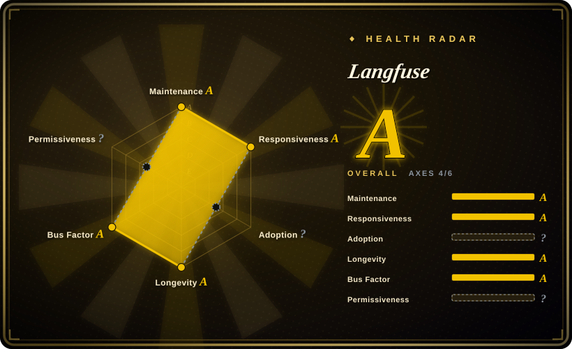
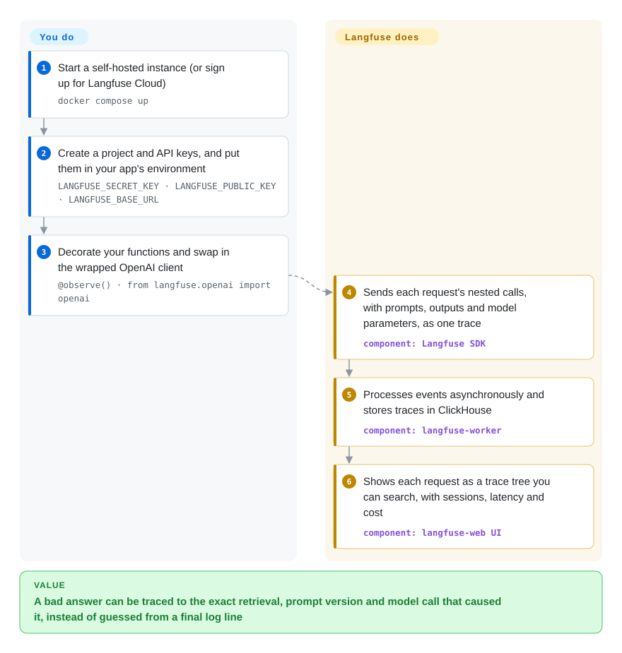

# Langfuse

A user reports that your agent gave a wrong answer yesterday; behind that one answer were a dozen model calls, two tool calls and a retrieval, and all your logs kept was the final text. Langfuse records every request as a nested trace (each call's prompt, output, tokens, cost and latency) in a web app you can self-host, then lets you score those traces with LLM judges, human labels or user feedback.

## When to use

You run an LLM feature in production — a RAG chatbot, a support agent, a multi-step workflow — and several people change its prompts every week. A customer writes in: "it told me the refund window was 60 days." To answer, you need to find that session, see what the retriever returned, which prompt version ran, which model call went off the rails and what it cost; `print` statements and your APM's HTTP spans don't show any of that. You want that record for every request, plus a way to score answers in bulk so "did last week's prompt change make things worse?" has a number behind it.

Langfuse is the platform for that loop. You instrument once (the `@observe()` decorator, the drop-in `langfuse.openai` wrapper, a LangChain/LlamaIndex callback, or plain OpenTelemetry) and every request lands as a trace in the UI. On top of the traces you get versioned prompts your app fetches at runtime (cached on client and server, so changing a prompt doesn't need a redeploy), datasets and experiments, and evaluators — LLM-as-judge, code, human annotation queues, user feedback — that score live or test traffic. Pick it over LangSmith when you need to self-host and stay framework-agnostic with an MIT core; over promptfoo when the question is "what is happening in production" rather than "does this change pass a pre-merge gate".

## How it works

Langfuse has two halves: an SDK inside your app and a server you run (or rent as Langfuse Cloud). The SDK wraps your functions so each step becomes a *span* — a timed record of one step with its inputs, outputs, model and token counts — nested under one *trace* per request, like a flight recorder for a single user question. The SDK sends those records to the server: a web container receives them, and a separate worker container processes them asynchronously and writes them to ClickHouse (a column database built for scanning millions of rows quickly), with Postgres holding app data such as users, prompts and settings, Redis queuing events, and S3-compatible storage holding large payloads. The UI then shows trace trees, sessions, cost and latency views; evaluators you configure score traces in the background, and prompt management and datasets reuse the same data. What Langfuse does for you: ingest, store, index, display, calculate cost, and run the judges you configured. What you do: instrument your code, run (or pay for) the multi-service stack, and decide what is worth scoring.

<!-- flow-steps:begin (generated from flows/langfuse.json by tools/flow_card.py — do not edit) -->

Text version of the flow

1. **You**: Start a self-hosted instance (or sign up for Langfuse Cloud) — `docker compose up`
2. **You**: Create a project and API keys, and put them in your app's environment — `LANGFUSE_SECRET_KEY · LANGFUSE_PUBLIC_KEY · LANGFUSE_BASE_URL`
3. **You**: Decorate your functions and swap in the wrapped OpenAI client — `@observe() · from langfuse.openai import openai`
4. **Langfuse**: Sends each request's nested calls, with prompts, outputs and model parameters, as one trace — component: `Langfuse SDK`
5. **Langfuse**: Processes events asynchronously and stores traces in ClickHouse — component: `langfuse-worker`
6. **Langfuse**: Shows each request as a trace tree you can search, with sessions, latency and cost — component: `langfuse-web UI`

**Value**: A bad answer can be traced to the exact retrieval, prompt version and model call that caused it, instead of guessed from a final log line

<!-- flow-steps:end -->

## When NOT to use

- **You only need a pre-merge regression gate over a fixed test set.** A server with six containers is a lot of machinery for that; run [promptfoo](promptfoo.md) or [DeepEval](deepeval.md) in CI instead. Langfuse's datasets and experiments earn their keep once you also want production traces.
- **You have no budget to operate four stateful stores.** Self-hosting v3 and later means Postgres, ClickHouse, Redis/Valkey and S3-compatible storage plus the web and worker containers; the README even warns that Docker's default logging can fill the disk. If nobody will run ClickHouse, use Langfuse Cloud (not a repo — a hosted service) or a lighter single-process tracer such as Arize Phoenix (not indexed).
- **You need SSO configuration, an audit-log viewer, data-retention policies, ingestion masking, FIPS mode or UI customization on a self-hosted instance.** Those live under the `ee/` directories with a commercial Enterprise License; the MIT core does not include them. If they are hard requirements and you won't buy a licence, evaluate Opik or Phoenix (both not indexed) against your list.
- **Your security posture forbids phone-home by default.** Self-hosted instances report usage statistics to PostHog unless you set `TELEMETRY_ENABLED=false`; make that part of your deployment config.
- **You can't absorb major-version migrations.** v2→v3 (2024-12) added ClickHouse, Redis, S3 and a worker; v3→v4 (2026-07-29) needs its own upgrade guide. Plan upgrades as projects, or use the hosted service.
- **You need adversarial security testing.** Langfuse scores what your traffic did; it does not attack your app. Use [garak](garak.md) or [Giskard OSS](giskard.md).

## Comparison

| Alternative | In index | Our verdict | Tradeoff |
|---|---|---|---|
| LangSmith | 非仓库 | Choose LangSmith when you are all-in on LangChain/LangGraph and want a managed service from the same vendor; choose Langfuse when you must self-host or stay framework-agnostic. | LangSmith is a closed, hosted product with tight LangChain integration; Langfuse's MIT core runs on your own infrastructure, at the cost of operating it. |
| Arize Phoenix | 未收录 | Choose Phoenix when you want an OpenTelemetry-native tracer that is light to stand up for a team or a notebook; choose Langfuse when you also need prompt management, annotation queues and a multi-user production deployment. | Phoenix is lighter to run; Langfuse bundles more of the LLMOps loop but needs the ClickHouse-based stack. |
| Opik | 未收录 | Choose Opik when its eval and guardrail features fit and Comet already sits in your MLOps stack; choose Langfuse for the larger integration list and contributor base. | Opik is a comparable Comet-backed platform; Langfuse has the broader community and a longer record as an OSS project. |
| [promptfoo](promptfoo.md) | ✅ | Choose promptfoo for a CLI-first regression and red-team gate in CI; choose Langfuse when production tracing, datasets and trend history are the main need. | promptfoo runs locally with nothing to host; Langfuse keeps history and live traffic but is a service to operate. |
| [Pezzo](pezzo.md) | ✅ | Choose Langfuse for new prompt-management and observability deployments; keep Pezzo only for an existing Pezzo stack you are ready to maintain yourself, since it looks stalled since mid-2025. | Both pair prompt versioning with observability; Langfuse is actively maintained, Pezzo is not. |

## Tech stack

- **Application:** TypeScript monorepo — Next.js 16 / React 19 / tRPC web app and a Node.js worker, both shipped as Docker images (`langfuse/langfuse`, `langfuse/langfuse-worker`); Node 24.
- **Data:** ClickHouse for traces, observations and scores; Postgres for application data; Redis/Valkey for queues and caching; S3-compatible blob storage (MinIO in the compose file) for large objects and exports.
- **Ingestion:** Python and JS/TS SDKs, framework integrations (OpenAI, LangChain, LlamaIndex, LiteLLM, Vercel AI SDK and more), a public REST API with an OpenAPI spec, and an OpenTelemetry endpoint (`/api/public/otel`).
- **Deployment:** Docker Compose for local/VM, a Helm chart (recommended for production), Terraform templates for AWS, Azure and GCP.

## Dependencies

- **Self-hosted:** Postgres, ClickHouse, Redis or Valkey, and S3-compatible storage, plus the web and worker containers — six services in the reference `docker-compose.yml`.
- **Your app:** the `langfuse` SDK (or an OTel exporter) and project API keys (`LANGFUSE_PUBLIC_KEY`, `LANGFUSE_SECRET_KEY`, `LANGFUSE_BASE_URL`).
- **Optional:** an LLM provider key configured in Langfuse if you use LLM-as-judge evaluators or the playground; an Enterprise License key for the `ee/` features.

## Ops difficulty

**Medium to high when self-hosted, low on Cloud.** `docker compose up` gets a local instance running in minutes, but production means sizing and backing up ClickHouse and Postgres, setting data retention, configuring log rotation, keeping Redis and object storage healthy, and following major-version upgrade guides. The README points to Helm on Kubernetes as the preferred production path.

## Health & viability

- **Maintenance — extremely active (2026-10-08).** Minor releases land almost daily (v4.50.0 to v4.54.0 between 2026-10-02 and 2026-10-07); v4.0.0 shipped 2026-07-29.
- **Governance — broad team, single owner.** 65 active maintainers in the last 12 months with the top contributor at about 13% of commits, so the bus factor is healthy; the roadmap belongs to one company.
- **Backing — changed hands in 2026.** Founded as a YC W23 startup; since January 2026 the team is part of ClickHouse, Inc., which now holds the copyright. ClickHouse is a well-funded database vendor whose own database is the trace store, which aligns incentives but ties the roadmap to an acquirer.
- **Age / Lindy — young but proven by use.** The repository dates from 2023-05 (about 3.4 years); the Lindy prior is modest, offset by heavy adoption: about 35.5k stars and roughly 18.9 million Docker pulls of the server image.
- **Risk flags.** Open core: MIT core, commercial `ee/` directories; default-on telemetry for self-hosted instances; major versions have brought infrastructure changes. The license axis is ungraded because the LICENSE file is not a single SPDX identifier.

## Caveats (unverified)

- [未验证] The precise boundary between MIT and `ee/` features was read from directory names (`audit-log-viewer`, `sso-settings`, `multi-tenant-sso`, `admin-api`, `ui-customization`, `dataRetention`, `ingestionMasking`, `fipsMode`), not from the pricing page; check the docs' open-source page before deciding.
- [未验证] Token cost calculation and LLM-as-judge evaluators are documented features, but neither was exercised in this pass.
- [推断] The comparison claims for Arize Phoenix (lighter single-process deployment) and Opik (Comet-backed) come from general knowledge of those projects, which have no pages here.
- [推断] The effect of the ClickHouse acquisition on the open-source roadmap is not yet visible; release cadence since January 2026 has stayed high.
- [未验证] The README says telemetry excludes raw traces, prompts and scores; the telemetry code was not audited.
