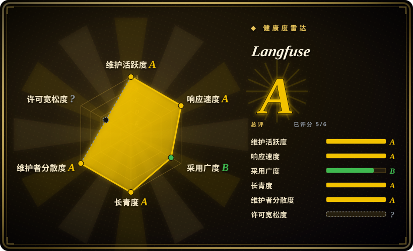
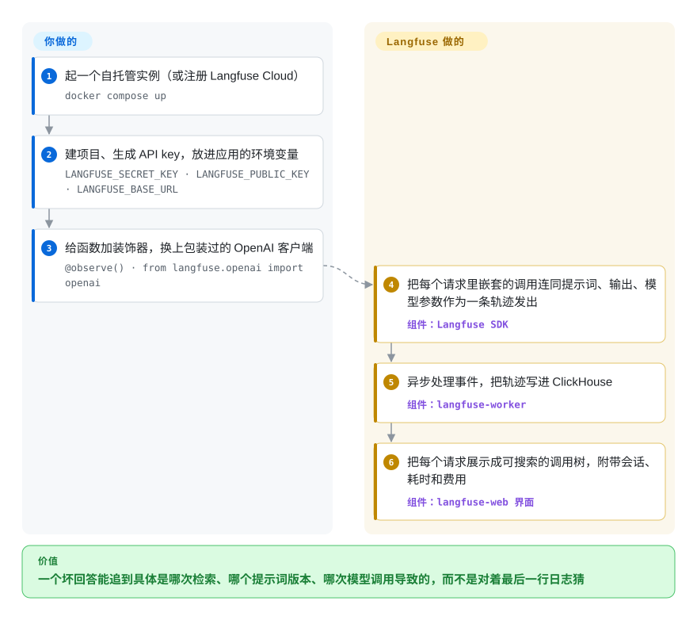

# Langfuse

用户说你的 agent 昨天答错了；那一个回答背后是十几次模型调用、两次工具调用和一次检索，而你的日志只留下了最终那段文字。Langfuse 把每个请求记成一棵嵌套的调用轨迹（每次调用的提示词、输出、token、费用和耗时），放进一个可以自托管的 Web 应用里，再让你用大模型裁判、人工标注或用户反馈给这些轨迹打分。

## 何时使用

你在生产环境跑着一个大模型功能——RAG 聊天机器人、客服 agent、多步工作流——每周都有好几个人在改它的提示词。客户来信：“它跟我说退款期是 60 天。”要回答这封信，你得找到那次会话，看检索器返回了什么、跑的是哪个版本的提示词、哪一次模型调用跑偏了、花了多少钱；`print` 语句和 APM 里的 HTTP 调用链都看不到这些。你希望每个请求都有这样一份记录，还希望能批量给回答打分，让“上周那次改提示词是不是改坏了？”有个数字可看。

Langfuse 就是为这个闭环做的平台。你只接一次（`@observe()` 装饰器、可直接替换的 `langfuse.openai` 包装、LangChain/LlamaIndex 回调，或者直接用 OpenTelemetry），每个请求就会作为一条轨迹出现在界面里。在轨迹之上，你还能拿到：应用在运行时拉取的版本化提示词（客户端和服务端都有缓存，改提示词不用重新部署）、数据集与实验，以及给线上或测试流量打分的评估器——大模型当裁判、代码评估、人工标注队列、用户反馈。相比 LangSmith，当你必须自托管、又不想绑死在某个框架上时选它（核心是 MIT 许可）；相比 promptfoo，当你要回答的是“生产环境里到底发生了什么”，而不是“这次改动能不能过合并前的闸门”时选它。

## 怎么用起来

Langfuse 分两半：嵌在你应用里的 SDK，和你自己运行（或者租用 Langfuse Cloud）的服务端。SDK 把你的函数包起来，让每一步变成一个“span”（一段带时间的记录，含这一步的输入、输出、模型和 token 数），同一个请求的所有 span 挂在一条“trace”（轨迹）下面，就像单个用户提问的飞行记录仪。SDK 把这些记录发给服务端：Web 容器负责接收，另一个 worker 容器异步处理并写进 ClickHouse（一种擅长快速扫描海量行的列式数据库），Postgres 存用户、提示词、设置这类应用数据，Redis 给事件排队，S3 兼容存储放大块载荷。之后界面里能看到调用树、会话、费用和耗时视图；你配置的评估器在后台给轨迹打分，提示词管理和数据集复用同一份数据。Langfuse 替你做的：接收、存储、建索引、展示、算费用，以及运行你配好的裁判。你要做的：给代码接入埋点，运行（或付费使用）这套多服务的系统，并决定哪些东西值得打分。

<!-- flow-steps:begin (generated from flows/langfuse.json by tools/flow_card.py — do not edit) -->

流程文字版

1. **你**：起一个自托管实例（或注册 Langfuse Cloud） — `docker compose up`
2. **你**：建项目、生成 API key，放进应用的环境变量 — `LANGFUSE_SECRET_KEY · LANGFUSE_PUBLIC_KEY · LANGFUSE_BASE_URL`
3. **你**：给函数加装饰器，换上包装过的 OpenAI 客户端 — `@observe() · from langfuse.openai import openai`
4. **Langfuse**：把每个请求里嵌套的调用连同提示词、输出、模型参数作为一条轨迹发出 — 组件：`Langfuse SDK`
5. **Langfuse**：异步处理事件，把轨迹写进 ClickHouse — 组件：`langfuse-worker`
6. **Langfuse**：把每个请求展示成可搜索的调用树，附带会话、耗时和费用 — 组件：`langfuse-web 界面`

**价值**：一个坏回答能追到具体是哪次检索、哪个提示词版本、哪次模型调用导致的，而不是对着最后一行日志猜

<!-- flow-steps:end -->

## 何时不用

- **你只需要一道针对固定测试集的合并前回归闸门。** 为这件事起一个六容器的服务端太重了；在 CI 里跑 [promptfoo](promptfoo.zh.md) 或 [DeepEval](deepeval.zh.md) 就够。等你还想要生产轨迹时，Langfuse 的数据集和实验才值回成本。
- **你没有运维四个有状态存储的预算。** 自托管 v3 及以后的版本意味着 Postgres、ClickHouse、Redis/Valkey 和 S3 兼容存储，再加 Web 与 worker 两个容器；README 甚至提醒 Docker 默认日志配置可能把磁盘写满。如果没人愿意养 ClickHouse，就用 Langfuse Cloud（非仓库，是托管服务），或者换一个更轻的单进程追踪工具，比如 Arize Phoenix（未收录）。
- **你在自托管实例上需要 SSO 配置、审计日志查看器、数据保留策略、接入数据脱敏、FIPS 模式或界面定制。** 这些在 `ee/` 目录下，走商业企业许可证，MIT 核心里没有。如果它们是硬需求而你又不打算买许可证，拿你的清单去评估 Opik 或 Phoenix（均未收录）。
- **你的安全要求不允许默认向外回传。** 自托管实例默认会把使用统计发到 PostHog，除非设置 `TELEMETRY_ENABLED=false`；把它写进你的部署配置。
- **你扛不住大版本迁移。** v2→v3（2024-12）加入了 ClickHouse、Redis、S3 和 worker；v3→v4（2026-07-29）也要按专门的升级指南来。把升级当成项目来排期，或者改用托管服务。
- **你需要对抗性的安全测试。** Langfuse 给你的流量做了什么打分，但它不会去攻击你的应用。用 [garak](garak.zh.md) 或 [Giskard OSS](giskard.zh.md)。

## 横向对比

| 替代品 | 是否收录 | 我们的评价 | 取舍 |
|---|---|---|---|
| LangSmith | 非仓库 | 你全面押注 LangChain/LangGraph、想要同一厂商的托管服务，选 LangSmith；必须自托管或不想绑定框架，选 Langfuse。 | LangSmith 是闭源托管产品，和 LangChain 集成紧；Langfuse 的 MIT 核心跑在你自己的基础设施上，代价是要自己运维。 |
| Arize Phoenix | 未收录 | 想要一个原生 OpenTelemetry、给团队或笔记本快速搭起来的轻量追踪工具，选 Phoenix；还需要提示词管理、标注队列和多用户生产部署，选 Langfuse。 | Phoenix 运行起来更轻；Langfuse 把更多 LLMOps 环节打包在一起，但需要基于 ClickHouse 的那套系统。 |
| Opik | 未收录 | 它的评测与护栏功能正合你用、你的 MLOps 栈里已经有 Comet，选 Opik；更看重集成清单和贡献者规模，选 Langfuse。 | Opik 是 Comet 支持的同类平台；Langfuse 社区更大，作为开源项目的历史也更长。 |
| [promptfoo](promptfoo.zh.md) | ✅ | 要一个以 CLI 为先、在 CI 里做回归和红队的闸门，选 promptfoo；主要需求是生产追踪、数据集和趋势历史，选 Langfuse。 | promptfoo 在本地跑，什么都不用托管；Langfuse 保留历史和线上流量，但它是一个要运维的服务。 |
| [Pezzo](pezzo.zh.md) | ✅ | 新上的提示词管理与可观测性部署选 Langfuse；只有已经在跑 Pezzo、并且准备自己维护时才留着它，因为它自 2025 年中起看起来已经停滞。 | 两者都把提示词版本管理和可观测性放在一起；Langfuse 持续维护，Pezzo 没有。 |

## 技术栈

- **应用：** TypeScript 单仓库——Next.js 16 / React 19 / tRPC 的 Web 应用加一个 Node.js worker，都以 Docker 镜像发布（`langfuse/langfuse`、`langfuse/langfuse-worker`）；Node 24。
- **数据：** ClickHouse 存轨迹、观测记录和分数；Postgres 存应用数据；Redis/Valkey 做队列和缓存；S3 兼容的对象存储（compose 文件里用 MinIO）存大对象和导出文件。
- **接入：** Python 与 JS/TS SDK，各种框架集成（OpenAI、LangChain、LlamaIndex、LiteLLM、Vercel AI SDK 等），带 OpenAPI 规范的公开 REST API，以及 OpenTelemetry 接入端点（`/api/public/otel`）。
- **部署：** 本地或单机用 Docker Compose，生产推荐 Helm chart，另有 AWS、Azure、GCP 的 Terraform 模板。

## 依赖

- **自托管：** Postgres、ClickHouse、Redis 或 Valkey、S3 兼容存储，再加 Web 和 worker 容器——参考 `docker-compose.yml` 里一共六个服务。
- **你的应用：** `langfuse` SDK（或一个 OTel 导出器）和项目 API key（`LANGFUSE_PUBLIC_KEY`、`LANGFUSE_SECRET_KEY`、`LANGFUSE_BASE_URL`）。
- **可选：** 如果用大模型裁判评估器或 playground，需要在 Langfuse 里配置一个大模型服务的 key；要用 `ee/` 功能则需要企业许可证 key。

## 运维难度

**自托管为中到高，用 Cloud 则低。** `docker compose up` 几分钟就能起一个本地实例，但生产环境意味着要给 ClickHouse 和 Postgres 定容量、做备份，设置数据保留，配置日志轮转，照看 Redis 和对象存储，并按大版本升级指南操作。README 把 Kubernetes 上的 Helm 部署列为首选的生产方式。

## 健康度与可持续性

- **维护——极其活跃（2026-10-08）。** 小版本几乎每天发布（2026-10-02 到 2026-10-07 之间从 v4.50.0 发到 v4.54.0）；v4.0.0 于 2026-07-29 发布。
- **治理——团队广，归属单一。** 过去 12 个月有 65 位活跃维护者，第一贡献者约占 13% 的提交，bus factor 健康；路线图归一家公司。
- **背书——2026 年易主。** 起家于 YC W23 的创业公司；自 2026 年 1 月起团队并入 ClickHouse, Inc.，版权现归它所有。ClickHouse 是资金充足的数据库厂商，它自家的数据库正是轨迹存储，利益一致，但路线图从此系于收购方。
- **年龄 / Lindy——年轻，但用量证明了它。** 仓库建于 2023-05（约 3.4 年），Lindy 先验一般，被大规模采用抵消：约 3.55 万 stars，服务端镜像约 1,890 万次 Docker 拉取。
- **风险信号。** 开放核心：MIT 核心加商业许可的 `ee/` 目录；自托管实例默认开启遥测；大版本都带来过基础设施变化。许可证一轴未评分，因为 LICENSE 文件不是单一的 SPDX 标识。

## 存疑（未验证）

- [未验证] MIT 与 `ee/` 功能的确切边界是从目录名读出来的（`audit-log-viewer`、`sso-settings`、`multi-tenant-sso`、`admin-api`、`ui-customization`、`dataRetention`、`ingestionMasking`、`fipsMode`），没有对照定价页；做决定前请查官方文档的开源说明页。
- [未验证] 按 token 计算费用和大模型裁判评估器都是文档里写明的功能，但本轮没有实际跑过。
- [推断] 对 Arize Phoenix（单进程部署更轻）和 Opik（由 Comet 支持）的对比说法来自对这两个项目的一般了解，它们在本索引里还没有页面。
- [推断] ClickHouse 收购对开源路线图的影响目前还看不出来；2026 年 1 月以来发布节奏一直很高。
- [未验证] README 说遥测不包含原始轨迹、提示词和分数；没有审读遥测代码。
