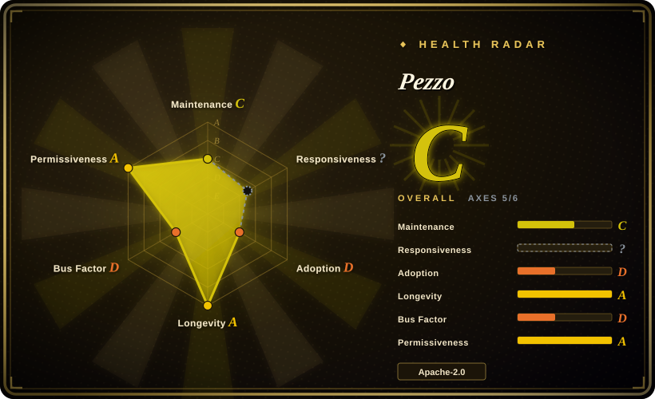
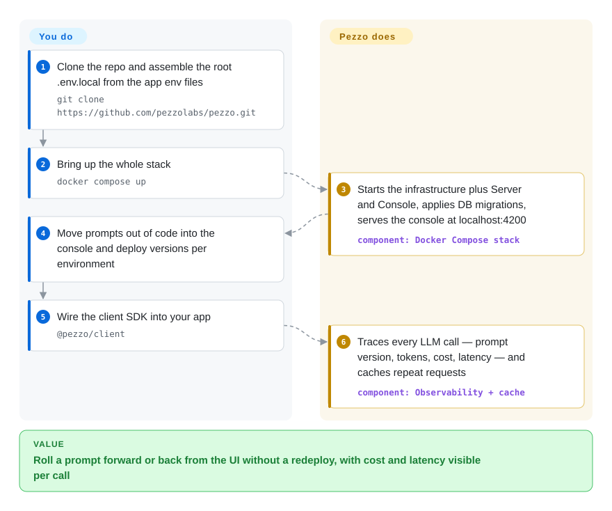

# Pezzo

Your prompts live as inline strings in the codebase — nobody knows which version is live, and editing one means a redeploy. Pezzo is a self-hosted console that versions prompts, fetches them into your app at call time, and traces what every LLM request cost and how long it took.

## When to use

You're a developer on a small product team that's started shipping LLM features, and your prompts are scattered across the codebase as inline strings — nobody knows which version is live, you can't see what a call cost or how long it took, and changing a prompt means a redeploy. You self-host Pezzo (Docker Compose: Postgres + ClickHouse + Redis + Supertokens), move your prompts into its UI where they're versioned and editable without a code change, and instrument your app with the Node or Python SDK. Now each LLM request is traced — prompt version, tokens, cost, latency, errors — in one observability dashboard, you can roll a prompt forward or back from the UI, and caching can cut repeat-call spend. It's aimed at teams who want a single self-hosted control plane for prompts + monitoring rather than gluing together a prompt registry, a tracing tool, and a cost dashboard separately.

## How it works

Pezzo sits between your app and the LLM providers as a control plane. The server (a Node/GraphQL backend) stores prompts with versions and per-environment deployments in PostgreSQL; your app fetches the deployed prompt version through the Node or Python client and reports each call back — prompt version, tokens, cost, latency, errors — into ClickHouse, which is what the observability dashboards read. Redis serves response caching (the "save up to 90% on costs" pitch) and Supertokens handles console auth. What Pezzo does for you: prompt authoring, versioning and rollout/rollback, request tracing, and caching of repeat calls. What stays yours: running the stack (Docker Compose brings up all four services plus the console at `localhost:4200`), instrumenting your app with the SDK, and supplying the provider API keys — and, given the project's near-dormant state, the security patches.

<!-- flow-steps:begin (generated from flows/pezzo.json by tools/flow_card.py — do not edit) -->

Text version of the flow

1. **You**: Clone the repo and assemble the root .env.local from the app env files — `git clone https://github.com/pezzolabs/pezzo.git`
2. **You**: Bring up the whole stack — `docker compose up`
3. **Pezzo**: Starts the infrastructure plus Server and Console, applies DB migrations, serves the console at localhost:4200 — component: `Docker Compose stack`
4. **You**: Move prompts out of code into the console and deploy versions per environment
5. **You**: Wire the client SDK into your app — `@pezzo/client`
6. **Pezzo**: Traces every LLM call — prompt version, tokens, cost, latency — and caches repeat requests — component: `Observability + cache`

**Value**: Roll a prompt forward or back from the UI without a redeploy, with cost and latency visible per call

<!-- flow-steps:end -->

## When NOT to use

- **The project is dormant-to-minimal — don't bet a new stack on it.** The latest release is v0.9.2 from 2024-05 (29 months old); the default branch sat from 2025-06 until 2026-08-21, when the core maintainer merged two community fixes (PR #355/#357) — and the `@pezzo/client` npm package hasn't shipped since 0.4.19 (2024-04). That is maintenance-by-occasional-patch, not an active roadmap; assume you end up maintaining the fork yourself. For a new deployment choose Langfuse or Helicone instead. [推断：活跃度趋势判断，非官方声明]
- **You want a managed service.** The docs still list Pezzo Cloud (app.pezzo.ai) as a managed offering as of 2026-09, but its continuity rides on a company whose repo has been near-silent for a year — treat the cloud tier as not guaranteed to persist and self-hosting as the safe assumption. [未验证：云层的 SLA/公司现状]
- **You need a heavyweight eval / experimentation platform.** Pezzo centers on prompt management + observability; rigorous offline evals, dataset-driven scoring, and A/B experimentation are stronger in tools built for that (LangSmith, Langfuse, Helicone).
- **You don't want to run three datastores.** Self-hosting requires Postgres, ClickHouse, and Redis — non-trivial infra for a small team versus a hosted alternative.
- **You need broad, current SDK/provider coverage.** The client matrix in the README is Node, Python, and a LangChain integration; the npm client's last publish predates the repo's quiet year. Expect gaps and unmaintained provider support on a codebase at this activity level.

## Comparison

| Alternative | In index | Our verdict | Tradeoff |
|---|---|---|---|
| [Langfuse](langfuse.md) | ✅ | Choose Langfuse for new open-source LLM observability, prompt management, and eval deployments; keep Pezzo only for an existing self-hosted Pezzo stack you are prepared to maintain yourself. | Open-source LLM observability + prompt management + evals, actively maintained with a strong community; broadly the healthier successor to Pezzo's niche today. |
| Helicone | not indexed | Choose Helicone when logging, cost tracking, caching, and proxy-based adoption are the main needs; keep Pezzo only if its prompt-versioning UI already fits and the near-dormancy is acceptable. | Open-source LLM observability/proxy focused on logging, cost, and caching; lighter to adopt (proxy-based), narrower prompt-management story. |
| LangSmith (LangChain) | not indexed | Choose LangSmith when managed tracing, evals, prompt hub, and LangChain integration matter more than self-hosted OSS; keep Pezzo only when SaaS is off the table and self-maintenance is acceptable. | Hosted tracing + evals + prompt hub, deep LangChain integration; managed and feature-rich, but proprietary/SaaS, not self-hostable OSS. |
| PromptLayer | not indexed | Choose PromptLayer for a hosted prompt registry and request logging; keep Pezzo only when you specifically need self-hosted prompt management and accept a dormant codebase you may have to fork. | Prompt registry + request logging; overlapping prompt-management scope, hosted-first. |

## Tech stack

- **Language:** TypeScript (primary), with Node and Python clients.
- **Backend:** Node.js monorepo run by Nx (`npx nx serve server`, README), Prisma-managed PostgreSQL schema (`prisma migrate deploy`, README), GraphQL API with codegen watch scripts (README); NestJS-style service inferred from the tooling. [推断]
- **Frontend:** React web console (served at `localhost:4200`).
- **Datastores:** PostgreSQL (core data), ClickHouse (request/telemetry volume), Redis (cache/queue), Supertokens (console auth) — all four named in the README as the stack's dependencies.
- **Deployment:** one `docker compose up` brings up infra + Server + Console (docs.pezzo.ai/deployment/docker-compose, 2026-09).

## Dependencies

- **Datastores (you run):** PostgreSQL + ClickHouse + Redis + Supertokens — brought up together by the provided Docker Compose.
- **Runtime:** Node.js 18+ and Docker for the self-host path (README prerequisites).
- **LLM providers:** your own provider/API keys; Pezzo wraps and observes the calls. Provider coverage follows the README's client matrix (Node, Python, LangChain) and the npm client has had no release since 2024-04 — expect gaps.
- **SDK:** `@pezzo/client` (npm) or the Python client to capture traces and fetch deployed prompt versions.

## Ops difficulty

**Medium-to-high.** The day-one deploy is a clone plus `docker compose up`, which is approachable, but you're operating a stateful multi-service app: Postgres + ClickHouse + Redis + Supertokens to back up, upgrade, and monitor, plus the API/console. ClickHouse in particular is real infrastructure to run well at volume. The larger operational risk is the project's near-dormancy (see Health): on a codebase that gets a couple of merged fixes per year, you inherit security patching, dependency upgrades, and bug fixes yourself, which turns "medium" deployment effort into an open-ended maintenance commitment.

## Health & viability

- **Responsiveness**: Cannot be scored — no recent issue/PR traffic window to measure.
- **Maintenance (2026-09).** **Dormant-to-minimal, not dead.** No release since v0.9.2 (2024-05, GitHub API); the default branch sat from 2025-06 until 2026-08-21, when maintainer arielweinberger merged two community fixes (PR #355/#357, GitHub API). The `@pezzo/client` npm package's latest publish is 0.4.19 (2024-04, npm registry), while the docs site and Pezzo Cloud links remain live. That pattern reads as a company in wind-down maintenance mode, not active development. [推断]
- **Governance / backing.** A VC-style startup project (pezzolabs / pezzo.ai). The contributor list is lopsided (207 commits by arielweinberger vs 13 for the next author), so roadmap = one company's attention. If the company pivots or winds down, the OSS repo and the cloud tier both stall. [推断]
- **Age & Lindy verdict.** Created 2023-04 (~3.4 years) but **not still-active** in any meaningful cadence — Lindy does not rescue it: age counts only × activity, and an intermittently-patched repo trends toward abandonment. [推断]
- **Adoption.** ~3.3k stars / 278 forks / 54 open issues (GitHub API, 2026-09-28) captured real early interest; npm pull is low — 1,879 downloads/month for `@pezzo/client` (health scorer 2026-09-28). Community gravity has moved to actively maintained alternatives (Langfuse, Helicone). [推断]
- **Risk flags.** Apache-2.0 (clean license, no relicense found). The dominant flags are **abandonment risk** (29-month-old release, year-long branch silence broken only by two fixes) and **single-startup dependency** — both argue for a maintained alternative unless you're prepared to fork and own it. [推断]

## Caveats (unverified)

- [未验证] ~3.3k stars / 278 forks / 54 open issues and release v0.9.2 checked via GitHub API on 2026-09-28; `@pezzo/client` 0.4.19 (2024-04) checked against the npm registry the same day. Counts are date-sensitive.
- [推断] "Dormant-to-minimal" is a pattern read from release/commit/npm cadence (last release 2024-05; branch quiet 2025-06→2026-08 with two merged fixes; client package frozen at 2024-04) — nobody has declared the project dead, and activity could resume.
- [未验证] Pezzo Cloud's operational status and company health: docs.pezzo.ai still advertises app.pezzo.ai as managed (retrieved 2026-09-28), but there is no dated statement of continued support; treat as uncertain.
- [推断] NestJS-style backend and React frontend are inferred from README commands (Nx, GraphQL codegen, Prisma) and repo tooling, not from a full source read this pass.
- [未验证] Supported LLM providers and exact SDK/integration coverage are not enumerated in the material reviewed — verify against the repo/docs if it matters.
