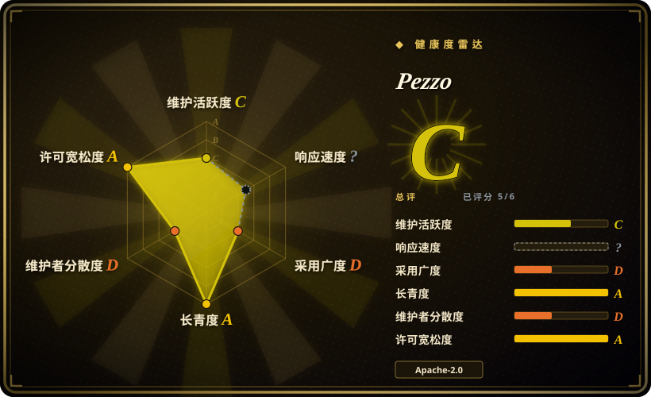
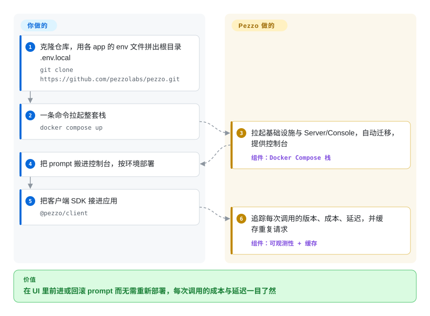

# Pezzo

你的 prompt 以内联字符串躺在代码库里——没人知道线上跑的是哪个版本，改一个字就要重新部署。Pezzo 是一个自托管控制台：prompt 在那里版本化、被应用按环境拉取，每次 LLM 调用花了多少钱、耗时多久也都有迹可循。

## 何时使用

你是某个小型产品团队的开发，团队刚开始发 LLM 功能，而你的 prompt 以内联字符串散落在代码各处——没人知道哪个版本在线、你看不到一次调用花了多少钱或耗时多久，改一个 prompt 就要重新部署。你自托管 Pezzo（Docker Compose：Postgres + ClickHouse + Redis + Supertokens），把 prompt 搬进它的 UI，在那里它们被版本化、可不改代码就编辑，并用 Node 或 Python SDK 给应用埋点。现在每个 LLM 请求都被追踪——prompt 版本、token、成本、延迟、错误——汇在一个可观测性看板里，你可以从 UI 把一个 prompt 向前或回滚，缓存还能削减重复调用的花费。它面向那些想要一个自托管的 prompt + 监控统一控制面、而不愿把 prompt 注册表、追踪工具和成本看板分别拼起来的团队。

## 怎么用起来

Pezzo 是夹在你的应用和 LLM 提供方之间的控制面。服务端（Node/GraphQL 后端）把 prompt 连同版本和按环境的部署记录存进 PostgreSQL；你的应用经 Node 或 Python 客户端拉取部署好的版本，并把每次调用上报回来——prompt 版本、token、成本、延迟、错误——写进 ClickHouse，可观测性看板读的就是它。Redis 负责响应缓存（“省下 90% 成本”的说法来自这里），Supertokens 负责控制台登录。它替你做的：prompt 编写、版本化与按环境发布/回滚、请求追踪、重复调用缓存。要你自己在做的：跑起这套栈（Docker Compose 会把四个服务连同控制台一起拉起，控制台在 `localhost:4200`）、用 SDK 给应用埋点、自备各家 provider 的 API key——外加鉴于项目近乎休眠，安全补丁也得你来接。

<!-- flow-steps:begin (generated from flows/pezzo.json by tools/flow_card.py — do not edit) -->

流程文字版

1. **你**：克隆仓库，用各 app 的 env 文件拼出根目录 .env.local — `git clone https://github.com/pezzolabs/pezzo.git`
2. **你**：一条命令拉起整套栈 — `docker compose up`
3. **Pezzo**：拉起基础设施与 Server/Console，自动迁移，提供控制台 — 组件：`Docker Compose 栈`
4. **你**：把 prompt 搬进控制台，按环境部署
5. **你**：把客户端 SDK 接进应用 — `@pezzo/client`
6. **Pezzo**：追踪每次调用的版本、成本、延迟，并缓存重复请求 — 组件：`可观测性 + 缓存`

**价值**：在 UI 里前进或回滚 prompt 而无需重新部署，每次调用的成本与延迟一目了然

<!-- flow-steps:end -->

## 何时不用

- **项目在休眠到最低维护之间——别把新栈押上去。** 最新 release 停在 v0.9.2（2024-05，已 29 个月）；默认分支从 2025-06 沉寂到 2026-08-21，核心维护者才合并了两个社区修复（PR #355/#357）；`@pezzo/client` npm 包自 0.4.19（2024-04）就没再发过版。这是“偶发打补丁”式维护，不是活跃路线图，要假设最终由你自己接手维护 fork。新部署请选 Langfuse 或 Helicone。[推断：活跃度趋势判断，非官方声明]
- **你想要托管服务。** 截至 2026-09，文档站仍列着托管的 Pezzo Cloud（app.pezzo.ai），但它的存续系在一家仓库近一年几乎沉默的公司上——请把云层当作不保证持续，自托管才是稳妥假设。[未验证：云层的 SLA/公司现状]
- **你需要重量级的 eval / 实验平台。** Pezzo 以 prompt 管理 + 可观测性为中心；严谨的离线 eval、数据集驱动打分和 A/B 实验在为此而生的工具里更强（LangSmith、Langfuse、Helicone）。
- **你不想跑三个数据存储。** 自托管需要 Postgres、ClickHouse 和 Redis——对小团队来说是不轻的基础设施，相比托管替代品。
- **你需要广泛、最新的 SDK/提供方覆盖。** README 的客户端矩阵是 Node、Python 和 LangChain 集成；npm 客户端的最后发布早于仓库沉寂的那一年。在这种活动水平上，预期会有缺口和无人维护的提供方支持。

## 横向对比

| 替代品 | 是否收录 | 我们的评价 | 取舍 |
|---|---|---|---|
| [Langfuse](langfuse.zh.md) | ✅ | 新建开源 LLM 可观测性、prompt 管理和 eval 平台时，选 Langfuse；只有已有 Pezzo 自托管栈且愿意自己接手维护时，才保留 Pezzo。 | 开源的 LLM 可观测性 + prompt 管理 + eval，维护活跃、社区强；大体上是当下 Pezzo 这一生态位更健康的接棒者。 |
| Helicone | 未收录 | 当日志、成本追踪、缓存和代理式接入是主需求时，选 Helicone；只有 Pezzo 的 prompt 版本 UI 已经契合且能接受近乎休眠的现状时，才保留 Pezzo。 | 开源的 LLM 可观测性/代理，聚焦日志、成本和缓存；采用更轻（基于代理），prompt 管理叙事更窄。 |
| LangSmith（LangChain） | 未收录 | 当托管追踪、eval、prompt hub 和 LangChain 集成比自托管 OSS 更重要时，选 LangSmith；只有不能用 SaaS 且能自维护时，才保留 Pezzo。 | 托管的追踪 + eval + prompt hub，深度集成 LangChain；托管且功能丰富，但闭源/SaaS，不能自托管 OSS。 |
| PromptLayer | 未收录 | 当你要托管的 prompt 注册表和请求日志时，选 PromptLayer；只有明确需要自托管 prompt 管理且接受一个可能要自己 fork 接手的休眠代码库时，才保留 Pezzo。 | prompt 注册表 + 请求日志；prompt 管理范围有重叠，托管为先。 |

## 技术栈

- **语言：** TypeScript（主），另有 Node 和 Python 客户端。
- **后端：** 由 Nx 驱动的 Node.js monorepo（`npx nx serve server`，README）；Prisma 管理的 PostgreSQL schema（`prisma migrate deploy`，README）；带 codegen watch 脚本的 GraphQL API（README）；NestJS 风格的服务由工具链推断。[推断]
- **前端：** React Web 控制台（服务在 `localhost:4200`）。
- **数据存储：** PostgreSQL（核心数据）、ClickHouse（请求/遥测量）、Redis（缓存/队列）、Supertokens（控制台登录）——四者都在 README 里被列为栈的依赖。
- **部署：** 一条 `docker compose up` 拉起基础设施 + Server + Console（docs.pezzo.ai/deployment/docker-compose，2026-09）。

## 依赖

- **数据存储（你来跑）：** PostgreSQL + ClickHouse + Redis + Supertokens——由提供的 Docker Compose 一起拉起。
- **运行时：** 自托管路径需要 Node.js 18+ 和 Docker（README 前提条件）。
- **LLM 提供方：** 你自己的提供方/API key；Pezzo 封装并观测这些调用。提供方覆盖跟随 README 的客户端矩阵（Node、Python、LangChain），且 npm 客户端自 2024-04 起未再发布——预期会有缺口。
- **SDK：** `@pezzo/client`（npm）或 Python 客户端，用于采集追踪并拉取已部署的 prompt 版本。

## 运维难度

**中到高。** 第一天的部署是克隆加一条 `docker compose up`，相当可上手，但你运维的是一个有状态的多服务应用：Postgres + ClickHouse + Redis + Supertokens 要备份、升级和监控，外加 API/控制台。ClickHouse 尤其是要在有量时跑好的真基础设施。更大的运维风险是项目的近乎休眠（见健康度）：一个一年只合并几个修复的代码库，安全补丁、依赖升级和 bug 修复都得你自己接，这把“中等”的部署投入变成一个无限期的维护承诺。

## 健康度与可持续性

- **响应速度**：无法计算——近期没有可测量的 issue/PR 流量窗口。
- **维护（2026-09）。** **休眠到最低维护，但没死。** 自 v0.9.2（2024-05，GitHub API）后再无 release；默认分支从 2025-06 沉寂到 2026-08-21，维护者 arielweinberger 合并了两个社区修复（PR #355/#357，GitHub API）；`@pezzo/client` npm 最新包仍是 0.4.19（2024-04，npm registry），文档站与 Pezzo Cloud 链接仍在线。这个模式读起来是一家进入收尾维护阶段的公司，不是活跃开发。[推断]
- **治理 / 背书。** VC 风格的创业项目（pezzolabs / pezzo.ai）。贡献者分布悬殊（arielweinberger 207 commit，第二名 13），路线图等于一家公司的注意力。公司一旦转向或收缩，OSS 仓库和云层会一起停摆。[推断]
- **年龄与 Lindy 判断。** 2023-04 创建（约 3.4 年），但没有任何实质节奏上的“仍活跃”——Lindy 救不了它：年龄只在乘以活跃度时才成立，间歇打补丁的仓库趋向废弃而非耐久。[推断]
- **采用度。** 约 3.3k star / 278 fork / 54 个未决 issue（GitHub API，2026-09-28）反映过真实的早期兴趣；`@pezzo/client` 的 npm 月下载仅 1,879（健康度计分器 2026-09-28）。社区引力已移向维护活跃的替代品（Langfuse、Helicone）。[推断]
- **风险标记。** Apache-2.0（许可干净，未发现 relicense）。主导标记是**废弃风险**（release 停在 29 个月前、分支沉寂一年仅被两个修复打破）与**单一创业公司依赖**——除非准备好 fork 并自己接管，否则两者都指向选一个维护中的替代品。[推断]

## 存疑（未验证）

- [未验证] 约 3.3k star / 278 fork / 54 个未决 issue 与 v0.9.2 release 于 2026-09-28 经 GitHub API 核实；`@pezzo/client` 0.4.19（2024-04）同日经 npm registry 核实。计数对时间敏感。
- [推断] “休眠到最低维护”是从 release/commit/npm 节奏读出的模式（最后 release 2024-05；分支 2025-06→2026-08 沉寂仅两个修复；客户端包冻结在 2024-04）——没有人宣布项目死亡，活动也可能恢复。
- [未验证] Pezzo Cloud 的运营状态与公司健康度：docs.pezzo.ai 仍把 app.pezzo.ai 列为托管方案（2026-09-28 取回），但没有带日期的持续支持声明；按不确定处理。
- [推断] NestJS 风格后端与 React 前端是从 README 命令（Nx、GraphQL codegen、Prisma）和仓库工具链推断的，本轮未完整通读源码布局。
- [未验证] 支持的 LLM 提供方与确切的 SDK/集成覆盖在所查材料中未逐条枚举——若重要请对照仓库/文档核实。
