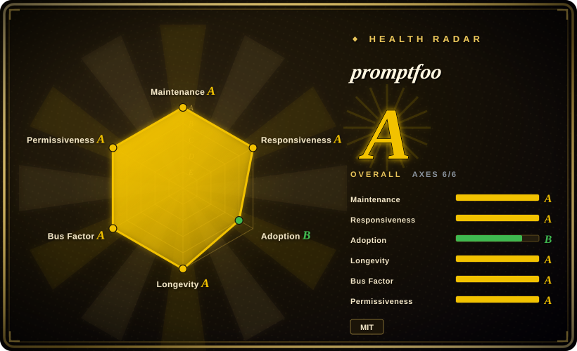
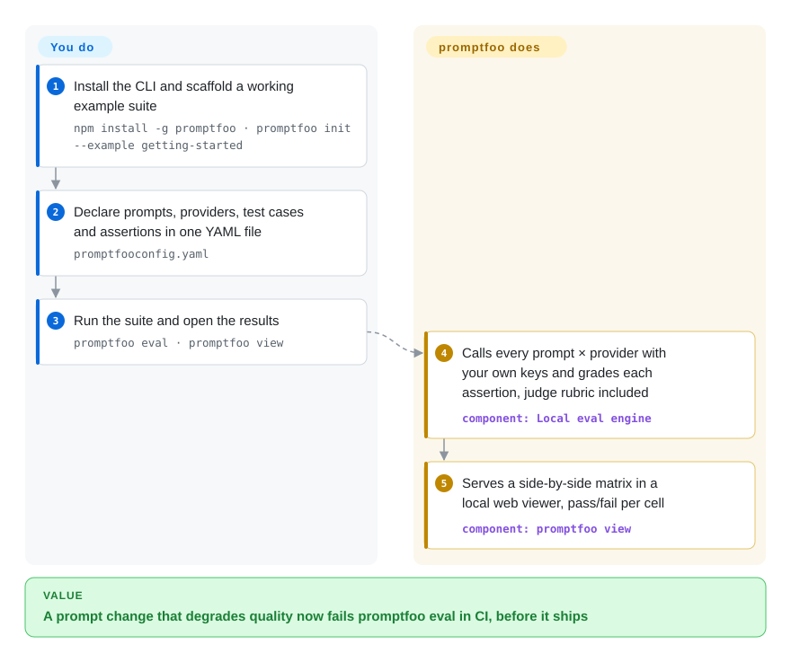

# promptfoo

You tweak a prompt, eyeball a few outputs in a playground, and ship on vibes — until a model update quietly degrades your agent. promptfoo turns that into a test suite: a YAML of prompts × models × assertions that `promptfoo eval` grades on your machine, fails CI on regressions, and can attack your own app with red-team probes before users do.

## When to use

You're an engineer shipping an LLM feature — a support agent, a RAG answer endpoint, a classification prompt — and you're tired of eyeballing outputs in a playground and "looking good enough" to ship. You want a regression suite: a fixed set of inputs, assertions that actually fail the build when a prompt change degrades quality, and a side-by-side view across GPT, Claude, Gemini, and a local Ollama model so you can pick on evidence instead of vibes. promptfoo resolves this by letting you describe the whole eval in a `promptfooconfig.yaml` — prompts, providers, test cases, and assertions (exact match, JSON schema, embedding similarity, or an LLM-as-judge `llm-rubric`) — then running `npx promptfoo eval` locally and `promptfoo view` to inspect a matrix in the browser. Wire the same command into CI and a quality regression fails the PR.

You also reach for it when security review asks "is this agent jailbreakable / will it leak the system prompt / does it do PII the wrong way?" The `redteam` side generates adversarial probes (prompt injection, jailbreaks, harmful-content, PII, and OWASP-LLM-style categories) against your live endpoint and reports which attacks landed — turning ad-hoc pentesting into a repeatable scan you can run before every release. Because evals run on your machine against your own provider keys, your prompts and test data don't have to leave your environment.

## How it works

Under the hood promptfoo is a Node/TypeScript CLI that behaves like a tiny test runner whose "unit under test" is an LLM call. You declare in `promptfooconfig.yaml` which prompts to try (files or templates with variables), which providers to send them to (OpenAI, Anthropic, local Ollama, …), and which test inputs and assertions must pass: deterministic checks (exact match, regex, JSON schema), embedding-similarity thresholds, or a judge LLM that scores the output against a written rubric (`llm-rubric`). The engine fans out the prompts × providers × tests matrix, calls each provider directly with your own API keys, and grades every cell; results land in a local SQLite file, and `promptfoo view` starts a bundled web server that shows the pass/fail matrix side by side. The `redteam` subcommands reuse the same engine to generate adversarial inputs — prompt-injection, jailbreak, PII probes — run them against your target, and compile the landed attacks into a vulnerability report. What promptfoo does for you: the fan-out, the grading, the viewer, the scan reports. What stays yours: curating the prompts, test cases and assertions, supplying provider keys (your eval runs incur real API spend), and wiring `promptfoo eval` into CI so it can be the gate.

<!-- flow-steps:begin (generated from flows/promptfoo.json by tools/flow_card.py — do not edit) -->

Text version of the flow

1. **You**: Install the CLI and scaffold a working example suite — `npm install -g promptfoo · promptfoo init --example getting-started`
2. **You**: Declare prompts, providers, test cases and assertions in one YAML file — `promptfooconfig.yaml`
3. **You**: Run the suite and open the results — `promptfoo eval · promptfoo view`
4. **promptfoo**: Calls every prompt × provider with your own keys and grades each assertion, judge rubric included — component: `Local eval engine`
5. **promptfoo**: Serves a side-by-side matrix in a local web viewer, pass/fail per cell — component: `promptfoo view`

**Value**: A prompt change that degrades quality now fails promptfoo eval in CI, before it ships

<!-- flow-steps:end -->

## When NOT to use

- **You want a fully managed, team-wide eval platform with hosted dashboards, RBAC, and historical trend storage out of the box.** promptfoo is local-first; cloud sharing/team features exist but the SLA-backed, governed platform is the commercial Promptfoo offering (the company was acquired by OpenAI in 2026 — see Health), not the OSS CLI. If you need a turnkey SaaS, weigh LangSmith / Braintrust / Langfuse instead.
- **You're not in a Node toolchain and don't want one.** It's a TypeScript/Node package and as of 0.123.1 the engine constraint is Node `>=22.22.0` (`engines` in package.json — Node 20 support is gone); a `pip install promptfoo` wrapper exists but the engine is Node. If your stack and team are pure-Python and you want native fixtures, [DeepEval](deepeval.md) / Python-native harnesses fit the muscle memory better.
- **You need rigorous academic benchmarking across hundreds of standardized tasks** (MMLU/HELM-style leaderboards, statistical reporting). promptfoo is built for *your app's* test cases, not for running canonical benchmark batteries — use lm-evaluation-harness / HELM for that.
- **You expect the red-team scanner to be a compliance guarantee.** It surfaces *findings*, and attack coverage shifts release-to-release; passing a scan is evidence, not proof of safety. Treat results as a moving signal, not a certification.
- **You want zero config and one magic score.** The value is in writing good assertions and test cases; if nobody curates the eval set, you get a green checkmark that means little.

## Comparison

| Alternative | In index | Our verdict | Tradeoff |
|---|---|---|---|
| [DeepEval](deepeval.md) | ✅ | Choose DeepEval for Python-native pytest-style evals and deeper RAG metrics; choose promptfoo when language-agnostic YAML suites, model matrices, and integrated red-teaming matter more. | Python-native eval framework (pytest-style, metrics like G-Eval/faithfulness); better fit for Python teams and RAG metric depth. promptfoo wins on language-agnostic YAML config, side-by-side model matrix, and integrated red-teaming. |
| [Langfuse](langfuse.md) | ✅ | Choose Langfuse when production tracing, datasets, trend history, and a self-hostable UI are the main platform needs; choose promptfoo for a lighter CLI-first regression/red-team gate in CI. | Tracing/observability + eval platform (self-hostable, with a UI and datasets backend); strong for production monitoring and trend history. promptfoo is lighter, CLI-first, and red-team-oriented rather than an observability backend. |
| LangSmith | not indexed | Choose LangSmith for hosted LangChain-centric evals and observability; choose promptfoo when OSS, local-first execution, and framework-agnostic providers are hard requirements. | Hosted LangChain eval/observability SaaS; deep LangChain integration and managed dashboards, but proprietary and cloud-centric. promptfoo is OSS, local-first, framework-agnostic. |
| Braintrust | not indexed | Choose Braintrust when a commercial experiment platform with hosted scoring, logging, and polished team workflows is worth the managed dependency; choose promptfoo for an open self-run CLI. | Commercial eval/experiment platform with hosted scoring and logging; polished team UX. promptfoo trades the managed platform for an open, self-run CLI. |
| [Garak](garak.md) | ✅ | Choose Garak when the task is dedicated Python red-team scanning only; choose promptfoo when red-team checks must sit beside general eval assertions in one workflow. | Dedicated LLM vulnerability scanner (red-team only, Python). Overlaps promptfoo's `redteam` scope but isn't a general eval/assertion harness. |
| [Giskard](giskard.md) | ✅ | Choose Giskard for broader ML+LLM testing with a Python-centric scan/report model; choose promptfoo when prompt and CI regression workflows are the center. | OSS testing/red-teaming for ML+LLM with a scan-and-report model; broader ML scope, Python-centric. promptfoo is more prompt/CI-workflow focused. |

## Tech stack

- **Language:** TypeScript / Node.js (CLI bins `promptfoo` and `pf`).
- **Core libs (per package.json, v0.123.1, re-checked 2026-09):** `commander` (CLI), `express` + `compression`/`cors` (local web viewer server), `drizzle-orm` + `@libsql/client` (local SQLite eval store), `ajv`/`ajv-formats` (JSON-schema assertions), `@anthropic-ai/sdk` and the `ai` SDK plus many provider clients, `@opentelemetry/*` (tracing), `chokidar`/`execa`/`chalk` (CLI plumbing).
- **Config surface:** declarative `promptfooconfig.yaml` (prompts, providers, tests, assertions, `redteam`); also usable as a library / via CI.
- **Assertion types:** deterministic (equals/contains/regex/JSON-schema), similarity (embeddings), and model-graded (`llm-rubric`, LLM-as-judge).

## Dependencies

- **Runtime:** Node.js `>=22.22.0` (per `engines` of 0.123.1; the old Node-20 allowance was dropped). No database to provision — it uses a local libsql/SQLite file for eval history.
- **Install:** `npm install -g promptfoo`, `brew install promptfoo`, or run zero-install via `npx promptfoo@latest`; a `pip install promptfoo` wrapper also exists (Node still required underneath).
- **External services:** the LLM provider(s) you evaluate against — you supply API keys (OpenAI/Anthropic/Azure/Bedrock/Google/Ollama/etc.); local models via Ollama need their own runtime.
- **Optional:** an embeddings provider for similarity assertions; cloud account only if you opt into hosted sharing/team features.

## Ops difficulty

**Low.** For the core loop there is effectively nothing to operate: install or `npx`, write a YAML, set provider env keys, run `eval` and `view`. State is a local file, the web UI is a bundled Express server you start on demand, and CI usage is just running the same CLI in a job. Difficulty rises to **low-to-medium** only when you self-host sharing for a team, manage many provider credentials/rate limits in CI, or maintain a large red-team configuration — and your eval costs become real provider API spend, which is the main thing to watch rather than infra.

## Health & viability

- **Responsiveness**: Grade A — median first-response time 70.0 hours across 28 qualifying issues/PRs (scorer, 2026-09-28).
- **Maintenance — very active (2026-09).** Releases keep a roughly monthly-minor cadence: 0.122.0 (2026-08-04) → 0.122.2 (2026-08-28) → 0.123.0 (2026-09-10) → 0.123.1 (2026-09-18, GitHub API); the repo was still being pushed the morning of 2026-09-28. Still pre-1.0 versioning, shipping constantly, not coasting. Not archived.
- **Governance & backing — now OpenAI, broad contributor base.** The README states "Promptfoo is now part of OpenAI. Promptfoo remains open source and MIT licensed"; the acquisition was announced 2026-03-09 by the founders (promptfoo.dev blog), with the close subject to customary conditions at that time. The scorer now measures 59 active committers in 12 months with the top author at ~35% of commits (grade A), so day-to-day contribution is not one-person-gated — but ultimate control is a single acquirer's roadmap: momentum and resources go up, while the project's provider-agnosticism depends on OpenAI honoring its published commitment to "support a diverse range of providers and models". [推断：以 README 现措辞判定收购已完成，未见完成公告]
- **Age & Lindy — moderate, but durable for its category.** Created 2023-04, ~3.4 years and continuously active — among the earliest and most-adopted OSS LLM-eval tools; it outlasted the "weekend eval script" wave and now sits inside a very durable parent. [推断]
- **Adoption & ecosystem.** ~25.5k stars / 2,386 forks / 755 open issues (GitHub API, 2026-09-28); the npm package pulls 2,720,941 downloads/month (health scorer 2026-09-28). The acquisition post claims 350k+ developers served and teams at 25%+ of the Fortune 500; the README still says "Powers LLM apps serving 10M+ users" and "Used by OpenAI and Anthropic" — vendor figures, not independently confirmed.
- **Risk flags — open-core + concentration.** Local-first OSS CLI under MIT, with the governed/SLA-backed platform (hosted dashboards, RBAC, trend history) reserved for the commercial tier — the usual open-core line to watch. New concentration risk: an acquired tool's provider-neutral roadmap can drift toward its parent's models; the blog promises continuity and multi-provider support, but that is a forward-looking claim. No relicense history asserted here. [推断]

## Caveats (unverified)

- [未验证] Latest `promptfoo` package 0.123.1, published 2026-09-18 (GitHub releases API, 2026-09-28); `code-scan-action` releases independently (0.2.0, 2026-08-28). Fast cadence — re-verify before pinning.
- [未验证] ~25.5k stars / 2,386 forks as of 2026-09-28 via GitHub API; date-sensitive, indicative only.
- [未验证] Acquisition completion: the 2026-03-09 blog said the deal was "subject to customary closing conditions"; the README's "is now part of OpenAI" wording (retrieved 2026-09-28) implies it closed, but no closing announcement was checked.
- [未验证] Adoption figures — "350k+ developers, 130k monthly actives, 25%+ of Fortune 500" (founders' blog) and "10M+ users / used by OpenAI and Anthropic" (README) — vendor marketing, not independently confirmed.
- [推断] The `pip install promptfoo` path is a thin wrapper over the Node package; the engine and `engines` constraint are Node — confirm against current docs if Python-only deployment matters.
- [推断] Exact red-team attack categories (OWASP-LLM coverage, jailbreak/PII plugins) and the supported provider list shift release-to-release; verify the current docs for a specific attack or provider before relying on it.
- [未验证] License read as MIT from repo metadata (GitHub API, 2026-09-28); comparison rows (DeepEval/Langfuse/LangSmith/Braintrust/Garak/Giskard positioning) are judgment from general knowledge, not benchmarked head-to-head.
