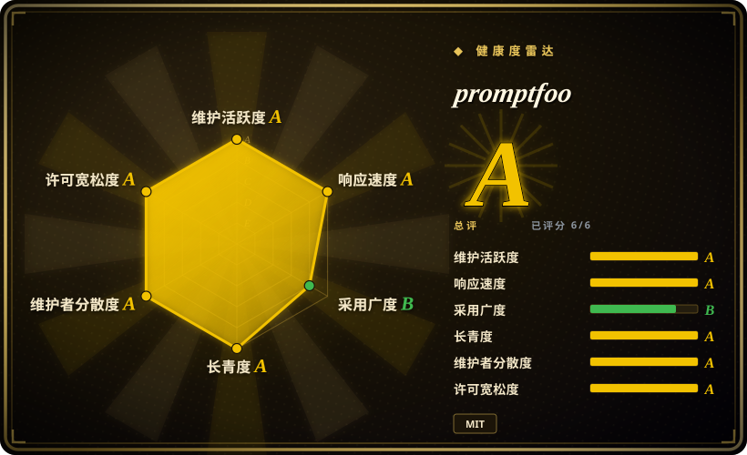
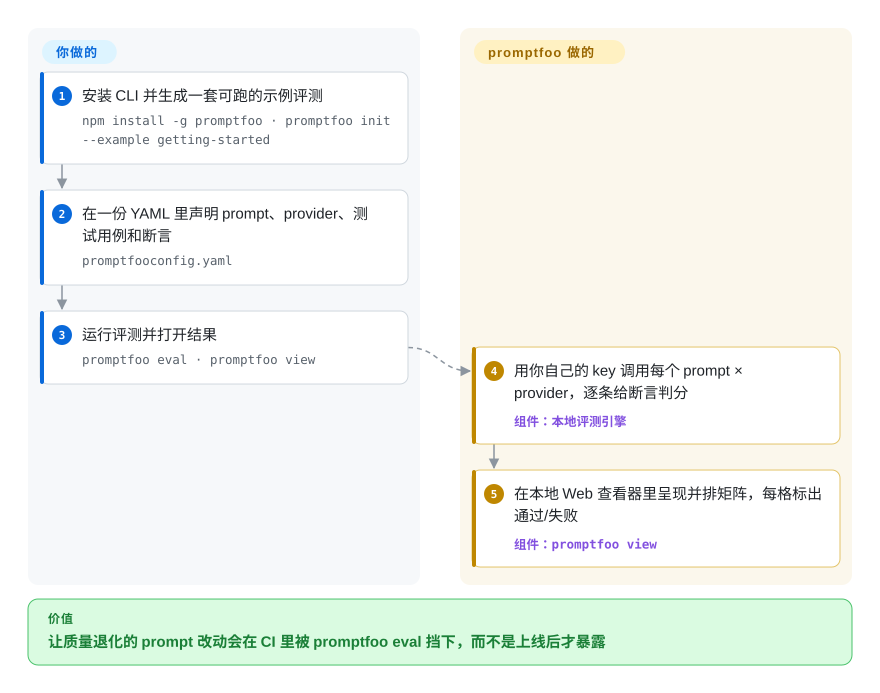

# promptfoo

你改完 prompt，在 playground 里扫几眼输出就凭感觉上线——直到某次模型更新悄悄把你的 agent 拖垮。promptfoo 把这件事变成测试套件：一份 prompt × 模型 × 断言的 YAML，`promptfoo eval` 在你本机判分、让回归在 CI 里失败，还能赶在用户动手前用红队探针攻击你自己的应用。

## 何时使用

你是在做 LLM 功能交付的工程师——一个客服 agent、一个 RAG 回答接口、一个分类 prompt——你已经厌倦了在 playground 里肉眼看输出、觉得“差不多能用”就上线。你想要一套回归测试：固定的一组输入、能在 prompt 改动让质量下降时真正让构建失败的断言，以及一个跨 GPT、Claude、Gemini 和本地 Ollama 模型的并排视图，这样你是凭证据而不是凭感觉选型。promptfoo 用一份 `promptfooconfig.yaml` 解决这个问题：把整套评测——prompt、provider、测试用例、断言（精确匹配、JSON schema、向量相似度，或 LLM 当裁判的 `llm-rubric`）——写进配置，然后本地跑 `npx promptfoo eval`，再用 `promptfoo view` 在浏览器里看结果矩阵。把同一条命令接进 CI，质量回归就会让 PR 失败。

当安全评审来问“这个 agent 会不会被越狱 / 会不会泄露 system prompt / 会不会以错误方式处理 PII”时，你也会用它。`redteam` 这一侧会针对你的线上接口生成对抗性探针（prompt 注入、越狱、有害内容、PII，以及 OWASP-LLM 风格的若干类别），并报告哪些攻击得手——把临时的渗透测试变成每次发版前都能重复跑的扫描。因为评测在你本机、用你自己的 provider key 运行，你的 prompt 和测试数据不必离开你的环境。

## 怎么用起来

拆开看，promptfoo 就是一个「被测对象是一次 LLM 调用」的迷你测试运行器（Node/TypeScript CLI）。你在 `promptfooconfig.yaml` 里声明：试哪些 prompt（文件或带变量的模板）、发给哪些 provider（OpenAI、Anthropic、本地 Ollama 等）、哪些测试输入必须通过哪些断言——确定性检查（精确匹配、正则、JSON schema）、向量相似度阈值，或让一个裁判 LLM 按你写的量规打分（`llm-rubric`）。引擎把 prompt × provider × 测试的矩阵展开，用你自己的 API key 逐个调用并给每格打分；结果存进本地 SQLite 文件，`promptfoo view` 起一个内置 Web 服务，把通过/失败矩阵并排展示。`redteam` 子命令复用同一引擎生成对抗性输入——prompt 注入、越狱、PII 探针——打到你的目标上，再把得手的攻击汇编成漏洞报告。它替你做的：矩阵展开、判分、查看器、扫描报告。留给你做的：维护 prompt、测试用例与断言，自备 provider key（评测会产生真实 API 花费），以及把 `promptfoo eval` 接进 CI 让它当闸门。

<!-- flow-steps:begin (generated from flows/promptfoo.json by tools/flow_card.py — do not edit) -->

流程文字版

1. **你**：安装 CLI 并生成一套可跑的示例评测 — `npm install -g promptfoo · promptfoo init --example getting-started`
2. **你**：在一份 YAML 里声明 prompt、provider、测试用例和断言 — `promptfooconfig.yaml`
3. **你**：运行评测并打开结果 — `promptfoo eval · promptfoo view`
4. **promptfoo**：用你自己的 key 调用每个 prompt × provider，逐条给断言判分 — 组件：`本地评测引擎`
5. **promptfoo**：在本地 Web 查看器里呈现并排矩阵，每格标出通过/失败 — 组件：`promptfoo view`

**价值**：让质量退化的 prompt 改动会在 CI 里被 promptfoo eval 挡下，而不是上线后才暴露

<!-- flow-steps:end -->

## 何时不用

- **你要的是开箱即用、面向团队的托管评测平台**（自带托管看板、RBAC、历史趋势存储）。promptfoo 是 local-first；云端分享/团队功能存在，但有 SLA、带治理的平台是商业版 Promptfoo（公司已于 2026 年被 OpenAI 收购，见健康度），而非开源 CLI。需要交钥匙 SaaS 时，可权衡 LangSmith / Braintrust / Langfuse。
- **你不在 Node 工具链里、也不想引入它。** 它是 TypeScript/Node 包，且自 0.123.1 起引擎约束为 Node `>=22.22.0`（package.json 的 `engines`，Node 20 已被放弃）；虽有 `pip install promptfoo` 包装，但引擎是 Node。如果你的栈和团队纯 Python、想要原生 fixture，[DeepEval](deepeval.zh.md) / Python 原生 harness 更顺手。
- **你要做严谨的学术基准测试**（MMLU/HELM 式排行榜、统计报告，几百个标准任务）。promptfoo 是为*你自己应用的*测试用例而建，不是跑标准基准电池——那种场景用 lm-evaluation-harness / HELM。
- **你指望红队扫描器当合规保证。** 它给出的是*发现项*，且攻击覆盖随版本变化；通过一次扫描是证据，不是安全的证明。把结果当成会变动的信号，而非认证。
- **你想要零配置、一个魔法分数。** 价值在于写出好的断言和测试用例；如果没人维护评测集，你得到的只是一个意义不大的绿勾。

## 横向对比

| 替代品 | 是否收录 | 我们的评价 | 取舍 |
|---|---|---|---|
| [DeepEval](deepeval.zh.md) | ✅ | 当你要 Python 原生、pytest 风格 eval 和更深的 RAG 指标时，选 DeepEval；当语言无关 YAML 套件、模型矩阵和集成红队更重要时，选 promptfoo。 | Python 原生评测框架（pytest 风格，G-Eval/faithfulness 等指标）；更适合 Python 团队和 RAG 指标深度。promptfoo 胜在语言无关的 YAML 配置、并排模型矩阵和集成红队。 |
| [Langfuse](langfuse.zh.md) | ✅ | 当生产追踪、数据集、趋势历史和可自托管 UI 是主要平台需求时，选 Langfuse；当只要更轻的 CLI 优先 CI 回归/红队闸门时，选 promptfoo。 | 追踪/可观测性 + 评测平台（可自托管，带 UI 和数据集后端）；强在生产监控和趋势历史。promptfoo 更轻、CLI 优先、偏红队，而非可观测性后端。 |
| LangSmith | 未收录 | 当你要托管的 LangChain 中心 eval 和可观测性时，选 LangSmith；当开源、local-first 运行和框架无关 provider 是硬要求时，选 promptfoo。 | 托管的 LangChain 评测/可观测性 SaaS;LangChain 集成深、看板托管，但闭源、以云为中心。promptfoo 开源、local-first、框架无关。 |
| Braintrust | 未收录 | 当商业实验平台、托管打分、日志和打磨过的团队流程值得引入托管依赖时，选 Braintrust；当你要开放、自跑的 CLI 时，选 promptfoo。 | 商业评测/实验平台，托管打分与日志；团队 UX 打磨好。promptfoo 用开放、自跑的 CLI 换掉这套托管平台。 |
| [Garak](garak.zh.md) | ✅ | 当任务只是专门的 Python 红队扫描时，选 Garak；当红队检查需要和通用 eval 断言放在同一工作流里时，选 promptfoo。 | 专门的 LLM 漏洞扫描器（只做红队，Python）。与 promptfoo 的 `redteam` 范围重叠，但不是通用评测/断言 harness。 |
| [Giskard](giskard.zh.md) | ✅ | 当你希望测试就是直接调用 agent 函数的 Python 代码（带 LLM 评审检查的场景，加上自动生成的红队扫描）时，选 Giskard；当以 YAML 矩阵驱动的 prompt 和 CI 回归工作流是中心时，选 promptfoo。 | Giskard v3（2026 年重写，2026-08 正式发布）面向 LLM agent，要求 Python ≥ 3.12；它对表格／传统 ML 模型的自动扫描只留在 v2，而 v2 已不再维护。promptfoo 是 Node CLI，不进你的 Python 环境，更聚焦 prompt／CI 工作流。 |

## 技术栈

- **语言：** TypeScript / Node.js（CLI 命令为 `promptfoo` 和 `pf`）。
- **核心库（依 package.json，v0.123.1，2026-09 复核）：** `commander`（CLI）、`express` + `compression`/`cors`（本地 Web 查看器服务）、`drizzle-orm` + `@libsql/client`（本地 SQLite 评测存储）、`ajv`/`ajv-formats`（JSON-schema 断言）、`@anthropic-ai/sdk` 和 `ai` SDK 及众多 provider 客户端、`@opentelemetry/*`（追踪）、`chokidar`/`execa`/`chalk`（CLI 基建）。
- **配置面：** 声明式 `promptfooconfig.yaml`（prompts、providers、tests、assertions、`redteam`）；也可作为库使用或接进 CI。
- **断言类型：** 确定性（equals/contains/regex/JSON-schema）、相似度（embeddings）、模型评分（`llm-rubric`，LLM 当裁判）。

## 依赖

- **运行时：** Node.js `>=22.22.0`（依 0.123.1 的 `engines`，原先允许的 Node 20 已放弃）。无需部署数据库——它用本地 libsql/SQLite 文件存评测历史。
- **安装：** `npm install -g promptfoo`、`brew install promptfoo`，或用 `npx promptfoo@latest` 零安装运行；另有 `pip install promptfoo` 包装（底层仍需 Node）。
- **外部服务：** 你要评测的 LLM provider——你自备 API key（OpenAI/Anthropic/Azure/Bedrock/Google/Ollama 等）；本地模型经 Ollama 需自带运行时。
- **可选：** 相似度断言需要 embeddings provider；只有选用托管分享/团队功能时才需要云账号。

## 运维难度

**低。** 核心循环基本无需运维：安装或 `npx`、写一份 YAML、配好 provider 环境变量、跑 `eval` 和 `view`。状态是一个本地文件，Web UI 是一个按需启动的内置 Express 服务，CI 用法就是在 job 里跑同一条 CLI。难度升到**低到中**仅在于：为团队自托管分享、在 CI 里管理大量 provider 凭据/限流，或维护庞大的红队配置——而你的评测成本会变成真实的 provider API 花费，这才是要盯的，而非基础设施。

## 健康度与可持续性

- **响应速度**：Grade A——中位首次响应时间 70.0 小时，基于 28 个 qualifying issues/PRs（计分器 2026-09-28）。
- **维护——非常活跃（2026-09）。** 发版保持约每月一个 minor 的节奏：0.122.0（2026-08-04）→ 0.122.2（2026-08-28）→ 0.123.0（2026-09-10）→ 0.123.1（2026-09-18，GitHub API）；2026-09-28 当天上午仓库仍在推送。版本号仍在 1.0 之前，但持续发版、并非原地踏步。未归档。
- **治理与背书——现在是 OpenAI 的，但贡献底盘不窄。** README 写着 “Promptfoo is now part of OpenAI. Promptfoo remains open source and MIT licensed”；收购由创始人在 2026-03-09 公告（promptfoo.dev 博客），当时交割仍以惯常先决条件为准。计分器现测得 12 个月内 59 位活跃提交者、头号作者占比约 35%（Grade A），日常贡献并非一人把关——但最终控制仍是单一收购方的路线图：资源与动能变强，而其 provider 中立性取决于 OpenAI 是否兑现「继续支持多样 provider 与模型」的公开承诺。[推断：以 README 现措辞判定收购已完成，未见完成公告]
- **年龄与 Lindy——中等，但在本品类里算耐久。** 创建于 2023-04，约 3.4 年且持续活跃——是较早、采用度较高的开源 LLM 评测工具之一，熬过了「周末写个评测脚本」那一波，如今又背靠一家极难倒下的母公司。[推断]
- **采用与生态。** 约 25.5k star / 2,386 fork / 755 个未决 issue（GitHub API，2026-09-28）；npm 包月下载 2,720,941 次（健康度计分器 2026-09-28）。收购帖宣称服务过 35 万+ 开发者、月活 13 万、财富 500 强中 25%+ 的团队在用；README 仍写着「为服务 1000 万+ 生产用户的 LLM 应用提供支撑」「被 OpenAI 和 Anthropic 使用」——均为厂商口径，未经独立证实。
- **风险标记——open-core + 集中度。** MIT 下 local-first 的开源 CLI，受治理/带 SLA 的平台（托管看板、RBAC、趋势历史）留给商业档——若需求漂向团队治理，要盯这条常见的 open-core 分界线。新增集中度风险：被收购工具的中立路线图可能向母公司的模型倾斜；博客承诺了延续与多 provider 支持，但那是前瞻性表述。此处不断言重新授权历史。[推断]

## 存疑（未验证）

- [未验证] `promptfoo` 包最新 0.123.1，发布于 2026-09-18（GitHub releases API，2026-09-28 核实）；`code-scan-action` 独立发版（0.2.0，2026-08-28）。节奏快，pin 之前请重新核实。
- [未验证] 截至 2026-09-28 经 GitHub API 约 25.5k star / 2,386 fork；对时间敏感，仅供参考。
- [未验证] 收购交割：2026-03-09 博客称交易「以惯常先决条件为准」；README 现在写 “is now part of OpenAI”（2026-09-28 取回），暗示已完成，但本页未查到交割公告。
- [未验证] 采用数字——创始人的博客口径（35 万+ 开发者、月活 13 万、25%+ 财富 500）与 README 口径（「1000 万+ 用户」「被 OpenAI 和 Anthropic 使用」）——均为厂商营销表述，未经独立证实。
- [推断] `pip install promptfoo` 这条路是 Node 包的薄包装；真正的引擎和 `engines` 约束都是 Node——若纯 Python 部署很关键，请对照当前文档确认。
- [推断] 具体红队攻击类别（OWASP-LLM 覆盖、越狱/PII 插件）和支持的 provider 列表随版本变动；依赖某具体攻击或 provider 前请核对当前文档。
- [未验证] 许可证依仓库元数据读作 MIT（GitHub API，2026-09-28）；对比表（DeepEval/Langfuse/LangSmith/Braintrust/Garak 的定位）是基于通用认知的判断，非逐项实测对比；Giskard 一行已对照 Giskard 页和它的 v3 README 核过（2026-10-09），同样没做实测对比。
