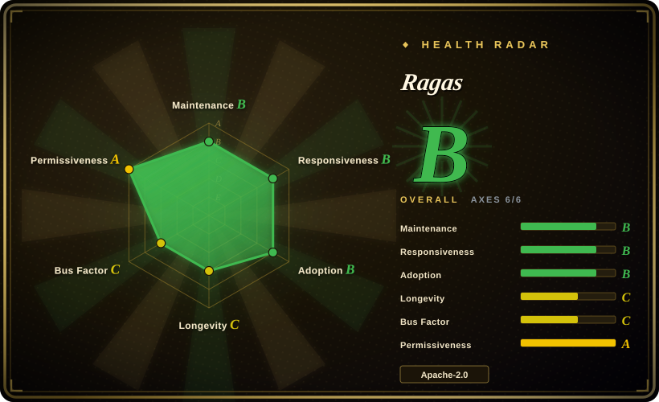
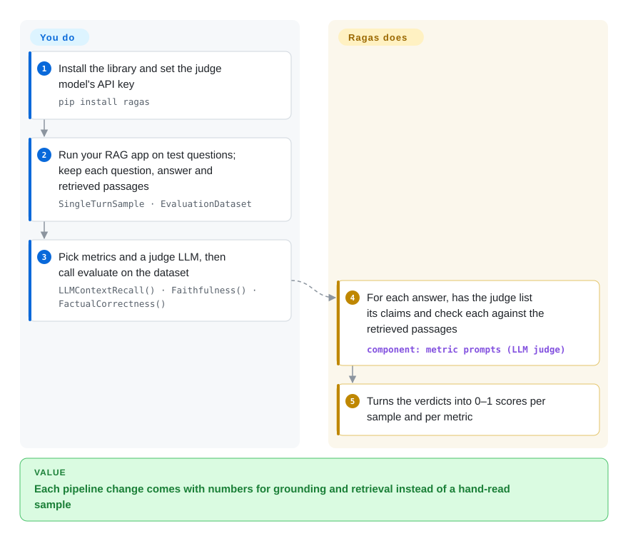

# Ragas

You change the chunk size or the embedding model in your RAG pipeline, try three questions by hand, and still cannot say whether it got better — or whether the bot now writes "Einstein was born on 20 March 1879" when the passage it retrieved says 14 March. Ragas puts numbers on that: a judge LLM breaks each answer into claims and checks them against the retrieved passages, and sibling metrics score whether retrieval found the passages the answer needed.

## When to use

You are a Python developer who built a question-answering bot over your own documents — retrieval plus an LLM (RAG). Every week someone proposes a change: a smaller chunk size, a new embedding model, a reranker, a cheaper generator. Reading twenty answers by hand does not tell you which change helped, and the failure you fear most is not an obvious crash but a fluent answer with a wrong date the source never contained. You need two numbers per change: "did the answer stay inside what was retrieved?" (faithfulness) and "did retrieval bring back what the answer needed?" (context recall/precision).

Ragas is the library built around exactly those RAG-specific metrics. You hand it rows of question, answer and retrieved passages (plus a reference answer when you have one), pick metrics and a judge model, and get a per-row and per-metric score table back — inside a notebook or script, with no server to run. If you have no test questions yet, its `TestsetGenerator` can draft them from your documents. Pick it over [DeepEval](deepeval.md) when RAG scoring is the whole job and you do not want a pytest runner or a vendor dashboard; pick it over [promptfoo](promptfoo.md) when your team works in Python rather than YAML plus a Node CLI.

## How it works

Most Ragas metrics are "LLM-as-judge": another model, which you choose and pay for, reads your data and answers narrow questions about it. **Ragas supplies the questions and the arithmetic; you supply the data and the judge.** Take faithfulness: Ragas asks the judge to list the factual claims in an answer, then asks, claim by claim, whether the retrieved passages support it; the score is supported claims divided by all claims, so 0 to 1. Answer relevancy works the other way round — the judge writes questions the answer would fit, and Ragas compares them with the real question using embeddings (number vectors where similar text lands close together). `evaluate()` runs every metric over every row concurrently and returns a table you can average or inspect row by row. What you still own: collecting the rows from your app, choosing the judge model (a different judge gives different scores), and deciding what score is good enough.

<!-- flow-steps:begin (generated from flows/ragas.json by tools/flow_card.py — do not edit) -->

Text version of the flow

1. **You**: Install the library and set the judge model's API key — `pip install ragas`
2. **You**: Run your RAG app on test questions; keep each question, answer and retrieved passages — `SingleTurnSample · EvaluationDataset`
3. **You**: Pick metrics and a judge LLM, then call evaluate on the dataset — `LLMContextRecall() · Faithfulness() · FactualCorrectness()`
4. **Ragas**: For each answer, has the judge list its claims and check each against the retrieved passages — component: `metric prompts (LLM judge)`
5. **Ragas**: Turns the verdicts into 0–1 scores per sample and per metric

**Value**: Each pipeline change comes with numbers for grounding and retrieval instead of a hand-read sample

<!-- flow-steps:end -->

## When NOT to use

- **You want quality gates that fail a build, or you also test agents and multi-turn chats.** Ragas returns scores; turning them into pass/fail thresholds in CI is your code. Use [DeepEval](deepeval.md), which wraps similar LLM-judged metrics in a pytest runner with thresholds and covers conversations and agent traces.
- **Your team compares prompts × models in config, or wants red-team probes.** Use [promptfoo](promptfoo.md): a YAML matrix graded by one CLI command, plus adversarial testing, without writing Python.
- **You need production traces, dashboards and human labels over live traffic.** Ragas evaluates a dataset you assembled; it does not record what happened in production. Use [Langfuse](langfuse.md) for tracing and annotation — Ragas ships a `tracing` extra that installs the Langfuse and MLflow clients, so the two are complementary.
- **The question is safety (prompt injection, harmful output), not answer quality.** Use [Giskard](giskard.md) or [garak](garak.md); Ragas has no attack generator.
- **Scores must be reproducible, free, or computed without sending data to an API.** Every LLM-judged metric costs several model calls per row and drifts with the judge model and its version. For fixed checks use exact-match or string metrics (Ragas includes BLEU/ROUGE-style non-LLM metrics), or run a local judge model you control.
- **You need a library that is visibly shipping fixes right now.** As of 2026-10-08 nothing has been merged to `main` since 2026-02-24 while about 245 pull requests sit open, after a run of releases every few weeks; the 0.x API has also broken twice (migration guides for 0.1→0.2 and 0.3→0.4). Pin the version, or prefer DeepEval if upstream activity is a hard requirement.

## Comparison

| Alternative | In index | Our verdict | Tradeoff |
|---|---|---|---|
| [DeepEval](deepeval.md) | ✅ | When evals must run as tests with thresholds in CI and cover agents or chats, pick DeepEval; pick Ragas when RAG retrieval and grounding scores over a dataset are all you need. | DeepEval adds a pytest runner and broader metric families, but leans on its vendor's hosted platform for reporting; Ragas is a plain library with deeper RAG-specific metrics and no runner. |
| [promptfoo](promptfoo.md) | ✅ | When the team wants a YAML matrix of prompts and models plus red-teaming from one CLI, pick promptfoo; pick Ragas when evaluation lives in Python next to the RAG code. | promptfoo needs no code and covers adversarial probes; Ragas gives finer retrieval metrics (context precision/recall) but every check is Python. |
| [Giskard](giskard.md) | ✅ | When RAG quality is one part of agent tests that also need safety scans, pick Giskard; pick Ragas for metric-deep RAG scoring. | Giskard scans for attacks and groundedness; Ragas has more RAG metrics and test-set generation but nothing for security. |
| [Langfuse](langfuse.md) | ✅ | Use Langfuse to trace and label production traffic, and Ragas to compute the scores — they combine rather than compete. | Langfuse is a self-hosted service with storage and a UI; Ragas is a library with no persistence of its own. |
| TruLens | not indexed | When you want RAG scoring tied to tracing of a running app in one Python package, consider TruLens; pick Ragas when you want standalone dataset evaluation and test-set generation. | TruLens couples feedback functions to app instrumentation; Ragas keeps evaluation offline and simpler to drop into a script. |

## Tech stack

- **Language:** Python ≥ 3.9, installed from PyPI as `ragas`; Apache-2.0.
- **LLM plumbing:** the `openai` client, `instructor` for structured judge outputs, and `llm_factory` / `embedding_factory` helpers; v0.4.0 added a LiteLLM adapter alongside Instructor for other providers.
- **Core libraries:** `pydantic`, Hugging Face `datasets`, `diskcache` (caches judge calls), `tiktoken`, `typer` + `rich` for the `ragas` CLI (`ragas quickstart`), and `networkx` / `scikit-network` for the knowledge graph behind test-set generation.
- **LangChain is a core dependency** (`langchain`, `langchain-core`, `langchain-community`, `langchain_openai`), even if your app does not use LangChain; LlamaIndex, Haystack, DSPy, Langfuse and MLflow are optional extras.

## Dependencies

- **A judge LLM you can call**, plus an embeddings model for embedding-based metrics such as answer relevancy. The examples use OpenAI (`OPENAI_API_KEY`); other providers go through the factories.
- **Your own evaluation data**: rows of question, answer and retrieved passages, plus reference answers for metrics like context recall — or source documents if you want it to generate a test set.
- **No server, database or GPU** of its own; it runs inside your Python process.
- **Telemetry is on by default**: anonymous usage events are sent unless you set `RAGAS_DO_NOT_TRACK=true`.

## Ops difficulty

**Low to set up, medium to keep trustworthy.** `pip install ragas` and an API key are enough to score a dataset. The ongoing work is elsewhere: judge-model spend grows with rows × metrics (each LLM metric makes several calls per row), scores move when you change or the vendor updates the judge model so you must pin both, and the heavy dependency tree (LangChain, `datasets`) can clash with your app's own pins. Upgrading across 0.x minor versions has meant code changes; read the migration guide before bumping.

## Health & viability

- **Maintenance: Grade B, but quiet.** The scorer applies its mature-library carve-out, yet the last commit on `main` is 2026-02-24 and the last release v0.4.3 (2026-01-13); before that, releases came every few weeks (v0.3.5 in 2025-09 to v0.4.3). As of 2026-10-08 about 245 PRs are open with none merged since February — a pause, not yet an abandonment, but worth re-checking before a long bet. [推断]
- **Responsiveness:** issues still get answers — median first response about 110.6 hours across 23 recent qualifying issues.
- **Governance & backing:** company-backed (VibrantLabs; the repo moved from `explodinggradients/ragas`, which now redirects) with 15 contributors active in the last year, but concentrated: the top contributor holds about 64% of recent commits and the top three about 82%. The README also sells evaluation consulting, so the roadmap follows that business.
- **Adoption:** strong — roughly 998,430 PyPI downloads in the last month and ~16k stars; its metric names (faithfulness, context precision/recall) are widely reused.
- **Age / Lindy:** created 2023-05, about 3.4 years old — young, and the 2026 slowdown weakens the prior further. Apache-2.0 with no relicensing; the risk flags are API churn across 0.x and default-on telemetry.

## Caveats (unverified)

- [推断] Reading the 2026-02-24 → 2026-10-08 gap as a pause rather than an end is a judgment; no maintainer announcement was found in the README or releases either way.
- [推断] The `explodinggradients` → `vibrantlabsai` move is inferred from the GitHub redirect and the "rebranding efforts" PR in v0.4.0's notes, not from a written announcement.
- [推断] That scores shift with the judge model is a general property of LLM-as-judge metrics; it was not measured on Ragas here.
- [未验证] Star, download and open-PR counts are 2026-10-08 snapshots and move quickly.
- [未验证] The TruLens row comes from general knowledge of that project, which has no page in this index; the DeepEval, promptfoo, Giskard and Langfuse rows follow their own pages.
