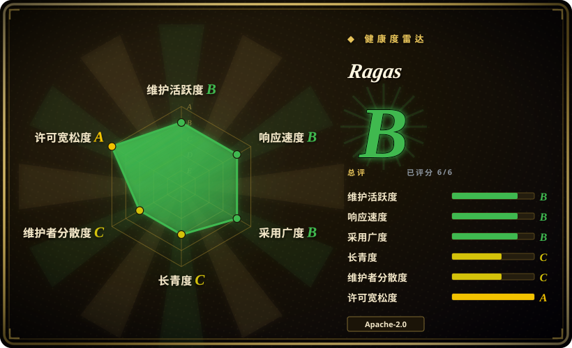
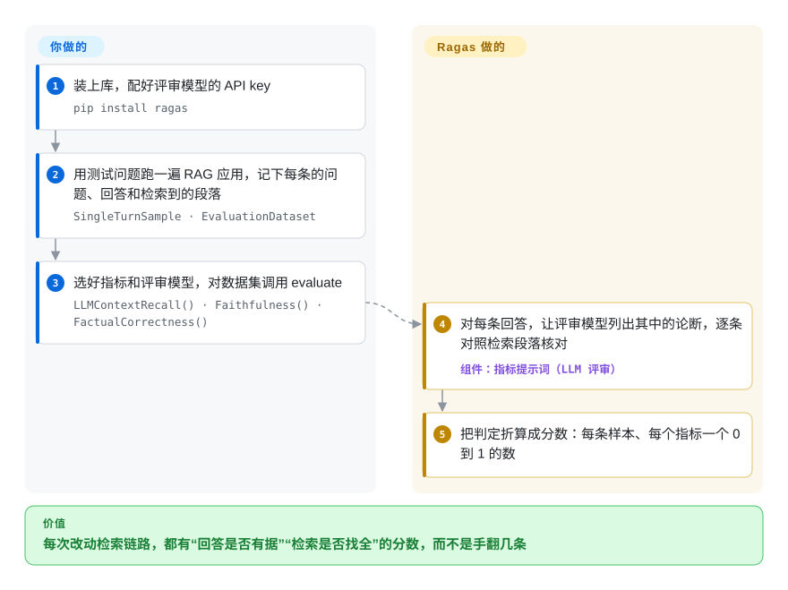

# Ragas

你改了 RAG 链路里的分块大小或向量模型，手动试了三个问题，还是说不清到底变好了没有——更说不清机器人会不会在检索段落写着 3 月 14 日的情况下，回答“爱因斯坦生于 1879 年 3 月 20 日”。Ragas 给这件事打分：让一个评审大模型把每条回答拆成一条条论断，逐条对照检索到的段落核对；配套的指标再给“检索有没有找到回答所需的段落”打分。

## 何时使用

你是 Python 开发者，在自家文档上搭了一个问答机器人——先检索、再让大模型作答（RAG）。每周都有人提改动：分块调小、换向量模型、加重排、换便宜的生成模型。手翻二十条回答判断不了哪个改动有用，而你最怕的不是明显报错，而是一条通顺流畅、却写着原文里根本没有的日期的回答。每次改动你需要两个数：“回答有没有跑出检索内容之外”（忠实度），“检索有没有把回答需要的东西找回来”（上下文召回率 / 精确率）。

Ragas 就是围绕这些 RAG 专属指标做的库。你把一行行“问题、回答、检索段落”（有参考答案就一并带上）交给它，选好指标和评审模型，就能拿回按行、按指标的分数表——在 notebook 或脚本里跑，不用起任何服务。手里还没有测试问题，它的 `TestsetGenerator` 可以从你的文档里起草一批。只需要给 RAG 打分、不想要 pytest 运行器或厂商看板时，选它而不是 [DeepEval](deepeval.zh.md)；团队用 Python 而不是 YAML 加 Node 命令行时，选它而不是 [promptfoo](promptfoo.zh.md)。

## 怎么用起来

Ragas 的多数指标是“大模型当评委”：另一个由你挑选、由你付费的模型读你的数据，回答一些很窄的问题。**问题怎么问、分数怎么算是 Ragas 的事；数据和评审模型由你提供。** 拿忠实度来说：Ragas 先让评审模型列出回答里的事实性论断，再一条条问“检索段落支不支持这一条”；得分等于被支持的论断数除以论断总数，所以落在 0 到 1 之间。回答相关性反过来做——评审模型根据回答反推几个它能回答的问题，Ragas 再用向量嵌入（把文本变成一串数字，意思相近的文本数字也相近）比较这些问题和真实问题有多像。`evaluate()` 把每个指标在每一行上并发跑完，返回一张表，可以求平均，也可以逐行看。仍归你管的事：从应用里收集这些行、选评审模型（换个评委分数就会变）、决定多少分算合格。

<!-- flow-steps:begin (generated from flows/ragas.json by tools/flow_card.py — do not edit) -->

流程文字版

1. **你**：装上库，配好评审模型的 API key — `pip install ragas`
2. **你**：用测试问题跑一遍 RAG 应用，记下每条的问题、回答和检索到的段落 — `SingleTurnSample · EvaluationDataset`
3. **你**：选好指标和评审模型，对数据集调用 evaluate — `LLMContextRecall() · Faithfulness() · FactualCorrectness()`
4. **Ragas**：对每条回答，让评审模型列出其中的论断，逐条对照检索段落核对 — 组件：`指标提示词（LLM 评审）`
5. **Ragas**：把判定折算成分数：每条样本、每个指标一个 0 到 1 的数

**价值**：每次改动检索链路，都有“回答是否有据”“检索是否找全”的分数，而不是手翻几条

<!-- flow-steps:end -->

## 何时不用

- **你要的是能让构建失败的质量闸门，或者还要测智能体和多轮对话。** Ragas 只给分数，把分数变成 CI 里的通过 / 失败阈值得你自己写。改用 [DeepEval](deepeval.zh.md)：它把类似的大模型评审指标包进带阈值的 pytest 运行器，也覆盖对话和智能体轨迹。
- **团队想在配置里比较“提示词 × 模型”，或者要做红队探测。** 改用 [promptfoo](promptfoo.zh.md)：一份 YAML 矩阵、一条命令打分，还带对抗测试，不用写 Python。
- **你需要线上请求的追踪、看板和人工标注。** Ragas 评的是你自己攒的数据集，不记录生产环境发生了什么。追踪和标注用 [Langfuse](langfuse.zh.md)——Ragas 有个 `tracing` 可选依赖会装上 Langfuse 和 MLflow 的客户端，两者是互补关系。
- **要查的是安全（提示词注入、有害输出），不是回答质量。** 用 [Giskard](giskard.zh.md) 或 [garak](garak.zh.md)；Ragas 没有攻击生成器。
- **分数必须可复现、不花钱，或者数据不能发给外部 API。** 每个大模型评审指标在每一行上都要调用好几次模型，分数还会随评审模型及其版本漂移。固定检查请用精确匹配或字符串类指标（Ragas 自带 BLEU / ROUGE 这类不调大模型的指标），或者跑一个你自己掌控的本地评审模型。
- **你需要一个此刻明显还在发修复的库。** 截至 2026-10-08，`main` 自 2026-02-24 之后没有合入任何东西，同时挂着约 245 个未合并的 PR，而在此之前是每隔几周发一版；0.x 的 API 也已经破坏性变更过两次（有 0.1→0.2 和 0.3→0.4 两份迁移指南）。请钉死版本；如果上游活跃度是硬要求，选 DeepEval。

## 横向对比

| 替代品 | 是否收录 | 我们的评价 | 取舍 |
|---|---|---|---|
| [DeepEval](deepeval.zh.md) | ✅ | 评测必须作为带阈值的测试跑在 CI 里、还要覆盖智能体或对话时，选 DeepEval；只需要在数据集上算 RAG 检索和有据程度的分数时，选 Ragas。 | DeepEval 多了 pytest 运行器和更广的指标族，但报告依赖厂商的托管平台；Ragas 是纯库，RAG 专属指标更深，但没有运行器。 |
| [promptfoo](promptfoo.zh.md) | ✅ | 团队想用一条命令跑“提示词 × 模型”的 YAML 矩阵并做红队，选 promptfoo；评测要放在 Python 里、挨着 RAG 代码，选 Ragas。 | promptfoo 不用写代码、还有对抗探测；Ragas 的检索指标（上下文精确率 / 召回率）更细，但每项检查都得写 Python。 |
| [Giskard](giskard.zh.md) | ✅ | RAG 质量只是智能体测试的一部分、还要做安全扫描时，选 Giskard；要指标够深的 RAG 打分，选 Ragas。 | Giskard 扫攻击、也查有据程度；Ragas 的 RAG 指标更多、能生成测试集，但安全方面什么都没有。 |
| [Langfuse](langfuse.zh.md) | ✅ | 用 Langfuse 追踪和标注线上流量，用 Ragas 算分——两者是组合关系，不是二选一。 | Langfuse 是带存储和界面的自托管服务；Ragas 是库，自己不存任何东西。 |
| TruLens | 未收录 | 想在一个 Python 包里把 RAG 打分和运行中应用的追踪绑在一起，可以考虑 TruLens；想要独立的离线数据集评测和测试集生成，选 Ragas。 | TruLens 把反馈函数挂在应用埋点上；Ragas 保持离线评测，往脚本里一放就能用。 |

## 技术栈

- **语言：** Python ≥ 3.9，PyPI 包名 `ragas`；Apache-2.0。
- **大模型接入：** `openai` 客户端、负责让评审模型输出结构化结果的 `instructor`，以及 `llm_factory` / `embedding_factory` 两个工厂函数；v0.4.0 在 Instructor 之外加了 LiteLLM 适配，用来接其他厂商。
- **核心库：** `pydantic`、Hugging Face 的 `datasets`、`diskcache`（缓存评审调用）、`tiktoken`、给 `ragas` 命令行（`ragas quickstart`）用的 `typer` + `rich`，以及测试集生成背后知识图谱用的 `networkx` / `scikit-network`。
- **LangChain 是核心依赖**（`langchain`、`langchain-core`、`langchain-community`、`langchain_openai`），即使你的应用不用 LangChain 也会装上；LlamaIndex、Haystack、DSPy、Langfuse、MLflow 是可选依赖。

## 依赖

- **一个能调用的评审大模型**，以及给回答相关性这类基于向量的指标用的嵌入模型。示例用的是 OpenAI（`OPENAI_API_KEY`）；其他厂商经由工厂函数接入。
- **你自己的评测数据**：一行行问题、回答、检索段落，上下文召回率这类指标还要参考答案——或者提供源文档让它生成测试集。
- **不需要自己的服务、数据库或 GPU**；它就跑在你的 Python 进程里。
- **默认开启遥测**：除非设置 `RAGAS_DO_NOT_TRACK=true`，否则会发送匿名使用事件。

## 运维难度

**上手低，要让分数一直可信则是中等。** `pip install ragas` 加一个 API key 就能给数据集打分。持续的工作在别处：评审模型的花费随“行数 × 指标数”增长（每个大模型指标在每行上要调用好几次）；换评审模型、或厂商更新了模型，分数都会动，所以两者都得钉死版本；依赖树很重（LangChain、`datasets`），可能和你应用自己钉的版本冲突。跨 0.x 的小版本升级都需要改代码，升级前先读迁移指南。

## 健康度与可持续性

- **维护：Grade B，但已经安静下来。** 评分器对它套用了成熟库的豁免规则，可 `main` 上最后一次提交在 2026-02-24，最后一版是 v0.4.3（2026-01-13）；此前是每隔几周发一版（从 2025-09 的 v0.3.5 到 v0.4.3）。截至 2026-10-08，约 245 个 PR 挂着，自 2 月以来一个都没合——这是停顿，还谈不上废弃，但长期押注前值得再查一次。[推断]
- **响应速度：** issue 仍有人回——最近 23 个合格 issue 的首次响应中位数约 110.6 小时。
- **治理与背书：** 有公司在背后（VibrantLabs；仓库从 `explodinggradients/ragas` 迁来，旧地址现在会重定向），过去一年有 15 位活跃贡献者，但很集中：头号贡献者约占近期提交的 64%，前三名约占 82%。README 里还在推销评测咨询服务，路线图跟着这门生意走。
- **采用度：** 很高——最近一个月 PyPI 下载约 998,430 次，约 16k star；它的指标名（忠实度、上下文精确率 / 召回率）被广泛沿用。
- **年龄 / Lindy：** 创建于 2023-05，约 3.4 年——还年轻，2026 年的放缓又让这个先验更弱。Apache-2.0，没有改过许可证；风险点是 0.x 期间的 API 变动和默认开启的遥测。

## 存疑（未验证）

- [推断] 把 2026-02-24 到 2026-10-08 这段空白读作“停顿”而非“终止”是一个判断；README 和发布说明里都没找到维护者的说法。
- [推断] `explodinggradients` → `vibrantlabsai` 的迁移是根据 GitHub 重定向和 v0.4.0 发布说明里那个 “rebranding efforts” PR 推断的，没有找到书面公告。
- [推断] 分数随评审模型变化，是“大模型当评委”类指标的普遍性质；这里没有在 Ragas 上实测。
- [未验证] star 数、下载量、未合并 PR 数都是 2026-10-08 的快照，变化很快。
- [未验证] TruLens 那一行来自对该项目的一般了解，本索引没有它的页面；DeepEval、promptfoo、Giskard、Langfuse 几行依据的是它们各自的页面。
