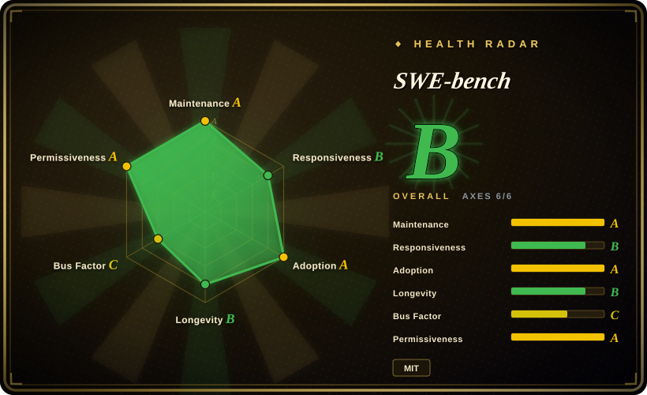
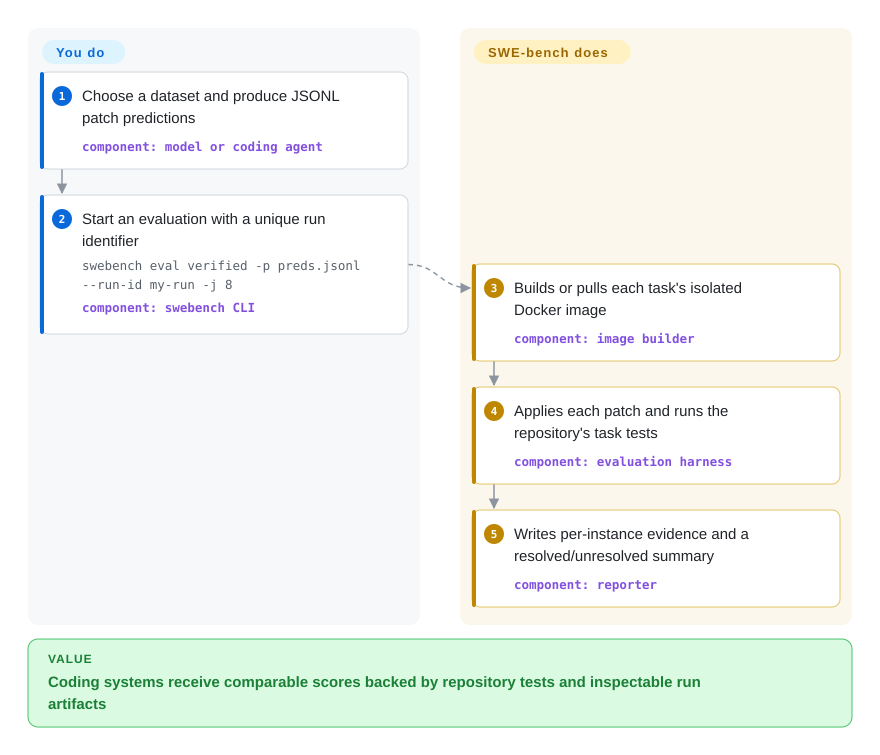

# SWE-bench

A Docker-based benchmark harness that grades model-generated patches against tests for real software issues collected from GitHub.

## When to use

You evaluate a coding model or agent and need evidence that it can repair existing repositories, not merely complete isolated functions or satisfy an app-specific prompt rubric. Choose SWE-bench when the deciding requirement is a standardized corpus of real GitHub issues whose candidate patches are applied and graded by repository tests inside reproducible containers.

This fit is narrower than a general model benchmark and heavier than an application regression suite: SWE-bench measures issue-to-patch software engineering, while lm-evaluation-harness focuses on broad language-model tasks and [promptfoo](promptfoo.md) focuses on tests you author for your own LLM application.

## How it works

You choose a SWE-bench dataset, produce one JSONL prediction per task, and give the harness each generated patch. SWE-bench obtains the task metadata, builds or pulls its Docker image, applies the patch to the target repository state, runs the task's test script, and records whether the required tests pass. You own prediction generation, compute capacity, Docker safety, run identifiers, and interpretation of failures; the harness owns task materialization, isolated execution, log capture, and resolved/unresolved reports. The dataset may come from Hugging Face or a local v5 task repository, but the evaluation itself runs on infrastructure you provide unless you opt into a separate cloud path.

<!-- flow-steps:begin (generated from flows/swe-bench.json by tools/flow_card.py — do not edit) -->

Text version of the flow

1. **You**: Choose a dataset and produce JSONL patch predictions — component: `model or coding agent`
2. **You**: Start an evaluation with a unique run identifier — `swebench eval verified -p preds.jsonl --run-id my-run -j 8` — component: `swebench CLI`
3. **SWE-bench**: Builds or pulls each task's isolated Docker image — component: `image builder`
4. **SWE-bench**: Applies each patch and runs the repository's task tests — component: `evaluation harness`
5. **SWE-bench**: Writes per-instance evidence and a resolved/unresolved summary — component: `reporter`

**Value**: Coding systems receive comparable scores backed by repository tests and inspectable run artifacts

<!-- flow-steps:end -->

## When NOT to use

- **You need broad few-shot model evaluation across knowledge, reasoning, and language tasks.** Choose lm-evaluation-harness instead; SWE-bench spends substantial compute on repository repair and does not replace a general benchmark battery.
- **You need regression tests for your own prompt, RAG pipeline, or production agent behavior.** Choose [promptfoo](promptfoo.md) or [DeepEval](deepeval.md); SWE-bench supplies a public coding corpus rather than assertions tied to your application.
- **You need multi-environment agent evaluation beyond software maintenance.** Choose AgentBench; SWE-bench deliberately centers issue-to-patch work in versioned code repositories.
- **You need terminal tasks that include system administration, data processing, or other shell workflows rather than GitHub issue resolution.** Choose Terminal-Bench; its task boundary is the terminal environment rather than a patch validated against a repository issue.
- **You cannot provide isolated Docker capacity.** Start with a smaller non-container benchmark or use a separately operated cloud evaluation path; upstream recommends x86_64, 120 GB free storage, 16 GB RAM, and 8 CPU cores for local runs, and calls ARM support experimental.
- **You need a leaderboard submission service rather than a local grader.** Use the hosted SWE-bench submission route or the separate `SWE-bench/sb-cli` repository; this repository contains the benchmark harness, while leaderboard acceptance and publication depend on infrastructure outside it.

## Comparison

| Alternative | In index | Our verdict | Tradeoff |
|---|---|---|---|
| [promptfoo](promptfoo.md) | ✅ | Choose SWE-bench to compare coding systems on a shared real-issue corpus; choose promptfoo when the release gate must encode your own prompts, providers, assertions, and red-team cases. | SWE-bench adds standardized repository repair and test-based grading at high container cost; promptfoo is lighter and application-specific but does not provide the same coding benchmark. |
| lm-evaluation-harness | not indexed | Choose SWE-bench when issue-to-patch repository repair is the outcome that matters; choose lm-evaluation-harness when you need broad few-shot evaluation across many conventional language-model tasks. | lm-evaluation-harness offers wider task coverage with lighter examples; SWE-bench provides more realistic software-maintenance environments and much higher execution cost. |
| AgentBench | not indexed | Choose SWE-bench for coding-agent repair quality measured by repository tests; choose AgentBench when the research question spans agents acting across several interactive environments. | AgentBench broadens agent behaviors and environments; SWE-bench narrows scope to obtain concrete patches and executable software tests. |
| Terminal-Bench | not indexed | Choose SWE-bench when tasks must originate from real GitHub issues and end in repository patches; choose Terminal-Bench when success should cover complicated terminal work beyond software issue repair. | Terminal-Bench broadens shell-level task variety; SWE-bench ties evaluation to issue context, code history, and project test suites. |

## Tech stack

- **Language and CLI:** Python 3.10+ with a Typer-based `swebench` command; the package also exposes harness modules.
- **Execution:** Docker containers isolate repository-specific environments and test scripts; Docker Buildx supports local image builds, including the documented ARM path.
- **Data and artifacts:** Hugging Face `datasets` and `huggingface_hub` load or publish datasets and run artifacts; v5 can also consume a local task-repository checkout.
- **Inference:** evaluation accepts existing JSONL patches, while the optional `swebench infer` path delegates prediction generation to mini-SWE-agent and can use model-provider dependencies.
- **Reporting:** each run writes a summary plus per-instance reports, test output, applied patch, evaluation script, and harness log under `logs/evaluation/<run_id>/`.

## Dependencies

- **Required runtime:** Python 3.10+ and the `swebench` package.
- **Required local infrastructure:** a Docker daemon with enough CPU, RAM, and disk for the selected tasks; upstream's full local recommendation is x86_64, 120 GB free storage, 16 GB RAM, and 8 CPU cores.
- **Task data:** dataset metadata from Hugging Face or a local v5 task repository such as `SWE-bench/swe-bench-tasks`; Hugging Face is the v5 source of truth for published dataset parquet files.
- **Core Python dependencies:** `datasets`, `docker`, `GitPython`, `huggingface_hub`, `modal`, `typer`, `rich`, `requests`, and patch/configuration utilities declared in `pyproject.toml`.
- **Optional services:** Modal or the separate AWS-oriented `sb-cli` can move evaluation off the local machine; the public leaderboard and its submission review are hosted outside this repository.

## Ops difficulty

**High.** A single CLI hides substantial benchmark operations: large task and image downloads, untrusted model patches executed in Docker, per-repository dependency builds, CPU and disk pressure, concurrency tuning, cached result identifiers, and cleanup of images and containers. Reusing a `run_id` for a changed prediction can reuse the earlier cached result, so run naming is part of correctness. Cloud paths reduce local capacity needs but add provider credentials, cost, upload, and external-service dependencies.

## Health & viability

- **Maintenance:** Grade A — the scored default-branch commit was 20 days old, with activity in 7 of the preceding 13 weeks; the repository is not archived.
- **Responsiveness:** Grade B — median first-response time was 462.5 hours across 13 qualifying issues in the scoring window.
- **Adoption:** Grade A — PyPI recorded 23,520,396 downloads in the measured month, although the dependency graph found 0 dependent repositories; GitHub reported 5,887 stars on 2026-09-22.
- **Longevity:** Grade B — the repository was 1,084 days old with a 20-day-old commit. That age-plus-activity combination is a moderate Lindy signal for a young benchmark category. [推断]
- **Governance:** Grade C — 23 maintainers were active in the measured 12 months, but the leading contributor accounted for 73.6% and the top three for 81.8% of contributions.
- **Risk / license:** Grade A — GitHub and the repository `LICENSE` identify MIT, and the scorer found no relicense in its 36-month window. Operational reproducibility still depends on externally hosted datasets, images or task repositories, and changing submission infrastructure.

## Caveats (unverified)

- [推断] High operations difficulty is an architectural judgment from Docker isolation, upstream capacity guidance, per-repository builds, caching, and cleanup requirements, not a measured deployment study.
- [推断] The moderate Lindy verdict combines the repository's 2023 creation date with current commits and versioned releases; it is a selection prior, not a prediction of future maintenance.
