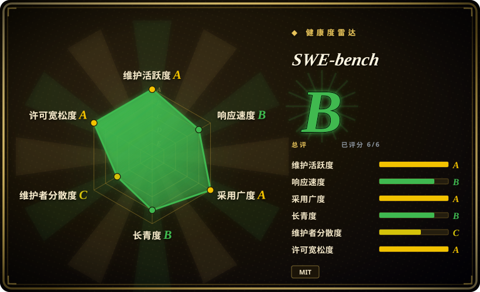
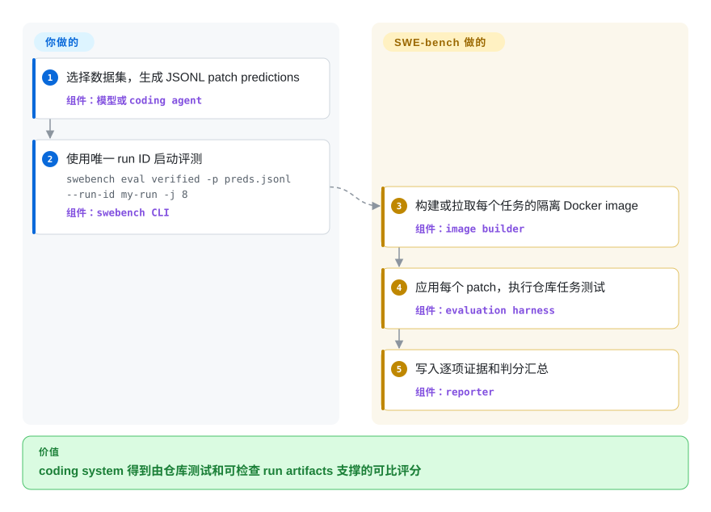

# SWE-bench

一个基于 Docker 的 benchmark harness：把模型生成的 patch 放进真实 GitHub 软件问题对应的仓库环境，再用测试判分。

## 何时使用

你要评估 coding model 或 agent，需要证明它能修复已有仓库，而不只是补全孤立函数或满足某个应用自定义的 prompt rubric。当决定性要求是一套标准化真实 GitHub issue 语料，并且候选 patch 必须在可复现容器中应用、再由仓库测试判分时，选 SWE-bench。

它比通用模型 benchmark 更窄，也比应用回归测试套件更重：SWE-bench 测量从 issue 到 patch 的软件工程能力，lm-evaluation-harness 面向更广的语言模型任务，[promptfoo](promptfoo.zh.md) 则面向你为自家 LLM 应用编写的测试。

## 怎么用起来

你选择一个 SWE-bench 数据集，为每个任务生成一条 JSONL prediction，再把生成的 patch 交给 harness。SWE-bench 获取任务元数据，构建或拉取 Docker image，把 patch 应用到目标仓库状态，执行任务测试脚本，最后记录所要求的测试是否通过。prediction 生成、计算资源、Docker 安全、run ID 和失败解释由你负责；任务实例化、隔离执行、日志采集与 resolved/unresolved 报告由 harness 负责。数据集可以来自 Hugging Face，也可以来自本地 v5 task repository；除非另选云端路径，评测本身仍跑在你提供的基础设施上。

<!-- flow-steps:begin (generated from flows/swe-bench.json by tools/flow_card.py — do not edit) -->

流程文字版

1. **你**：选择数据集，生成 JSONL patch predictions — 组件：`模型或 coding agent`
2. **你**：使用唯一 run ID 启动评测 — `swebench eval verified -p preds.jsonl --run-id my-run -j 8` — 组件：`swebench CLI`
3. **SWE-bench**：构建或拉取每个任务的隔离 Docker image — 组件：`image builder`
4. **SWE-bench**：应用每个 patch，执行仓库任务测试 — 组件：`evaluation harness`
5. **SWE-bench**：写入逐项证据和判分汇总 — 组件：`reporter`

**价值**：coding system 得到由仓库测试和可检查 run artifacts 支撑的可比评分

<!-- flow-steps:end -->

## 何时不用

- **你需要覆盖知识、推理和语言任务的通用 few-shot 模型评测。** 改用 lm-evaluation-harness；SWE-bench 把大量计算花在仓库修复上，不能替代通用 benchmark battery。
- **你需要为自家 prompt、RAG pipeline 或生产 agent 行为做回归测试。** 改用 [promptfoo](promptfoo.zh.md) 或 [DeepEval](deepeval.zh.md)；SWE-bench 提供公共 coding 语料，不提供绑定你应用的 assertions。
- **你需要超出软件维护场景的多环境 agent 评测。** 改用 AgentBench；SWE-bench 刻意聚焦版本化代码仓库里的 issue-to-patch 工作。
- **你需要覆盖系统管理、数据处理等非 GitHub issue 修复的 terminal 任务。** 改用 Terminal-Bench；它以 terminal environment 为任务边界，而不是以仓库 issue 和测试验证 patch 为边界。
- **你无法提供隔离的 Docker 资源。** 先用较小的非容器 benchmark，或使用独立运营的云评测路径；上游建议本地环境使用 x86_64、至少 120 GB 空闲存储、16 GB RAM 和 8 个 CPU core，并把 ARM 支持标为实验性。
- **你需要的是 leaderboard 提交服务，而不是本地 grader。** 使用托管的 SWE-bench 提交路径或独立的 `SWE-bench/sb-cli` 仓库；本仓库包含 benchmark harness，leaderboard 接收与发布依赖仓库外基础设施。

## 横向对比

| 替代品 | 是否收录 | 我们的评价 | 取舍 |
|---|---|---|---|
| [promptfoo](promptfoo.zh.md) | ✅ | 要在共享的真实 issue 语料上比较 coding system 时选 SWE-bench；发布闸门必须编码自家 prompts、providers、assertions 和 red-team cases 时选 promptfoo。 | SWE-bench 以高容器成本换来标准化仓库修复与测试判分；promptfoo 更轻、更贴近应用，但不提供同一种 coding benchmark。 |
| lm-evaluation-harness | 未收录 | 结果必须体现 issue-to-patch 仓库修复能力时选 SWE-bench；需要覆盖大量传统语言模型任务的通用 few-shot 评测时选 lm-evaluation-harness。 | lm-evaluation-harness 用较轻样本换更广任务覆盖；SWE-bench 提供更真实的软件维护环境，也付出高得多的执行成本。 |
| AgentBench | 未收录 | 要用仓库测试衡量 coding-agent 修复质量时选 SWE-bench；研究问题横跨 agent 在多个交互环境中的行动能力时选 AgentBench。 | AgentBench 扩大 agent 行为与环境范围；SWE-bench 缩窄范围，以得到具体 patch 和可执行软件测试。 |
| Terminal-Bench | 未收录 | 任务必须源自真实 GitHub issue 并以仓库 patch 结束时选 SWE-bench；成功标准需要覆盖软件 issue 修复之外的复杂 terminal 工作时选 Terminal-Bench。 | Terminal-Bench 扩大 shell 任务种类；SWE-bench 把评测绑定到 issue 上下文、代码历史和项目测试套件。 |

## 技术栈

- **语言与 CLI：** Python 3.10+，使用基于 Typer 的 `swebench` 命令；package 也暴露 harness modules。
- **执行：** Docker container 隔离不同仓库的环境和测试脚本；Docker Buildx 支持本地构建 image，也用于文档所述的 ARM 路径。
- **数据与产物：** Hugging Face `datasets` 和 `huggingface_hub` 用来加载或发布数据集与 run artifacts；v5 也能读取本地 task-repository checkout。
- **推理：** 评测可以接收已有 JSONL patches；可选的 `swebench infer` 路径把 prediction 生成交给 mini-SWE-agent，并可使用模型 provider dependencies。
- **报告：** 每次 run 都在 `logs/evaluation/<run_id>/` 下写入 summary，以及逐 instance report、测试输出、所应用 patch、评测脚本和 harness log。

## 依赖

- **必需 runtime：** Python 3.10+ 和 `swebench` package。
- **必需本地基础设施：** Docker daemon，以及足以运行所选任务的 CPU、RAM 和磁盘；上游对完整本地运行的建议是 x86_64、120 GB 空闲存储、16 GB RAM 和 8 个 CPU core。
- **任务数据：** 来自 Hugging Face 的 dataset metadata，或 `SWE-bench/swe-bench-tasks` 这类本地 v5 task repository；Hugging Face 是 v5 已发布 dataset parquet 文件的事实源。
- **核心 Python dependencies：** `pyproject.toml` 声明的 `datasets`、`docker`、`GitPython`、`huggingface_hub`、`modal`、`typer`、`rich`、`requests` 和 patch/configuration utilities。
- **可选服务：** Modal 或独立的 AWS-oriented `sb-cli` 可以把评测移出本机；公开 leaderboard 及其提交审核托管在本仓库之外。

## 运维难度

**高。** 一条 CLI 背后仍有大量 benchmark 运维：下载大型任务和 image、在 Docker 中执行不受信的模型 patch、为各仓库构建依赖、处理 CPU 与磁盘压力、调整并发、管理缓存结果标识，以及清理 image 与 container。为改过的 prediction 重用同一个 `run_id` 可能直接复用旧结果，因此 run 命名也是正确性的一部分。云端路径能降低本地资源要求，却会引入 provider credential、费用、上传和外部服务依赖。

## 健康度与可持续性

- **维护：** Grade A——评分所见 default-branch commit 距今 20 天，之前 13 周中有 7 周活跃；仓库未归档。
- **响应速度：** Grade B——评分窗口内 13 个 qualifying issues 的中位首次响应时间为 462.5 小时。
- **采用广度：** Grade A——PyPI 在评分所测月份记录了 23,520,396 次下载，但依赖图找到 0 个 dependent repositories；GitHub 在 2026-09-22 报告 5,887 stars。
- **长青度：** Grade B——仓库已创建 1,084 天，最近一次 commit 距评分 20 天。这个年龄与活跃度组合，对年轻的 benchmark 分类构成中等 Lindy 信号。[推断]
- **治理集中度：** Grade C——评分所测 12 个月内有 23 名活跃 maintainer，但头部一人占贡献的 73.6%，前三人占 81.8%。
- **风险与许可：** Grade A——GitHub 与仓库 `LICENSE` 都标明 MIT，评分器在 36 个月窗口内没有发现 relicense。运维可复现性仍依赖外部托管的数据集、image 或 task repository，以及会变化的提交基础设施。

## 存疑（未验证）

- [推断]“高”运维难度来自 Docker 隔离、上游资源建议、逐仓库构建、缓存和清理要求的架构判断，并非实测部署研究。
- [推断] 中等 Lindy 判断结合了仓库 2023 年创建时间、当前提交和版本发放；它是选型先验，不是对未来维护的预测。
